# A01DL : PKRemote Android用Wifiカメラ撮影画像ダウンローダー

-----

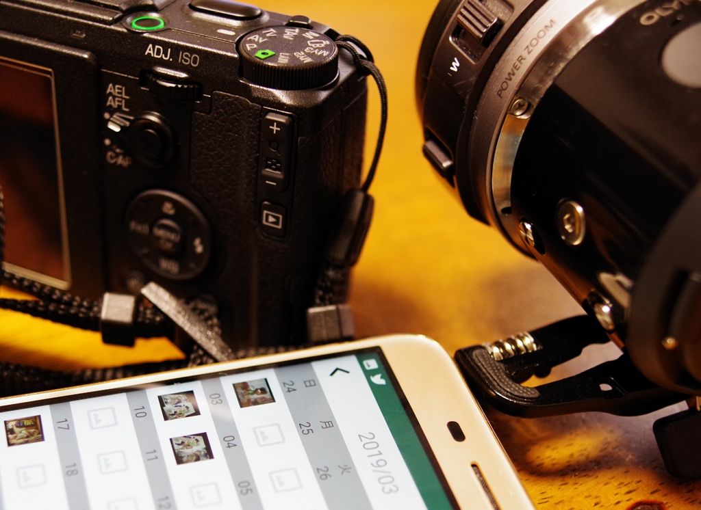

-----

## 概要

A01DLは、(機種によっては少し制約がありますが)いろんなカメラに対応した、Wifi経由で撮影画像を転送するためのAndroidアプリケーションです。

-----

## 機能一覧

* カレンダー表示
* カメラ内画像一覧表示（すべて、撮影日別、カメラ内フォルダ別）
* 画像を複数選択して一括で取得
* 画像を１枚表示して取得（RAWファイル、動画ファイルの取得も可）
* カメラで撮影した画像を自動転送

各社の通信仕様が異なるため、残念ながら全ての機能を全てのカメラで動作させることはできていません。
カレンダー表示はアプリを起動した日になる、、RAWファイルや動画ファイルが取得できない、などの制限がある機種があります。

-----

## サポートするデジタルカメラ

以下に挙げるような、WIFIをサポートするデジタルカメラに対応します。ただし、全機種で動作を確認したわけではありませんので対応していない場合があると思います。ごめんなさい。

* RICOH [GR II](http://www.ricoh-imaging.co.jp/japan/products/gr-2/), [GR III](http://www.ricoh-imaging.co.jp/japan/products/gr-3/)
* RICOH [THETA](https://store.ricoh360.com/)
* [Olympus Air A01](https://olympus-imaging.jp/product/opc/a01/)
* [PENTAX DSLR (K-1, KP, K-70 等)](https://api.ricoh/docs/camera-wireless-sdk-android/)
* SONY製カメラ（レンズスタイルのDSC-QX1シリーズは除く、ILCE-QX1は使用可能です。）
* Canon製カメラ (iNSPiC RECは除く)
* Olympus製カメラ
* Fujifilm製カメラ
* Panasonic製カメラ
* Nikon製カメラ (Wireless Mobile Utility対応機、SnapBridge対応機は、Wifi直接接続をサポートした機種のみ使用可能です)
* [JK Imaging製 KODAK PIXPRO WPZ2](https://kodakpixpro.com/AsiaOceania/jp/cameras/sportcamera/wpz2/)
* [VisionKids HappiCAMU T3](https://www.visionkids.com/product-page/happicamu-t3)
* [myFirst Camera Insta Wi](https://jp.myfirst.tech/products/myfirst-camera-insta-wi)

-----

## インストール

Google Play よりインストールしてください。

* [https://play.google.com/store/apps/details?id=net.osdn.gokigen.pkremote](https://play.google.com/store/apps/details?id=net.osdn.gokigen.pkremote)

-----

## 画面遷移

以下にA01DLの画面遷移を示します。画面下部のナビゲーションボタンで「カレンダー」「画像一覧」「自動転送」「設定」の４画面を切り替えできます。

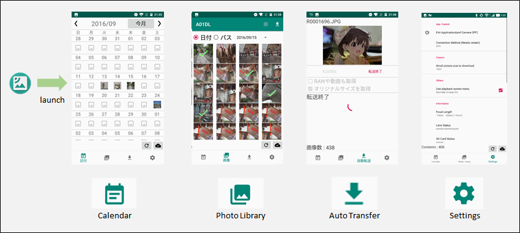

-----

## 画面説明

### アイコン説明

#### カメラとの接続

カメラとの接続状態を示します。カメラとの通信でエラーが発生する、などの不都合があった場合には、試しにこのアイコンをタップして、カメラとの切断・接続を実施してください。

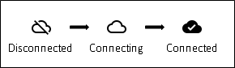

接続が失敗したときに接続失敗のダイアログが表示されることがあります。この場合には、左側の「WIFI設定」を押すと、WIFI設定画面を開きます。右側の「再接続」を押すと、再度接続を試行します。
すでにWIFIでカメラと接続しているときに、接続ができず、このダイアログが出てしまう場合には、右側の「再接続」を押してみてください。

ソフトウェアの不具合で、すでに接続ができているときにもこのダイアログが出ることがあります。その場合には BACKボタンを押してダイアログを消してみてください。

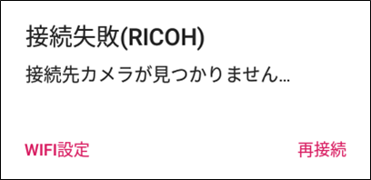

#### カメラ内画像情報の再読み込み

このボタンを押すと、カメラ内画像情報を再読み込みします。何か表示がおかしいということがあった場合は、ためしにこのボタンを押して、カメラ内画像情報の再読み込みを実施してください。

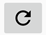

### カレンダー

カレンダーを表示した画面です。 **<** で前の月、**>** で次の月を表示します。 **カメラによっては撮影日付が取得できず、アプリ起動時の日付になってしまう機種、もしくは画像一覧でサムネイル画像を読み込んだ後で撮影した日付が反映される機種があります。ご注意ください。**

カメラ内に画像がある場合は、撮影画像のサムネールを表示します。サムネール部分をタッチすると、選択した日付でフィルタした「画像一覧」を表示します。

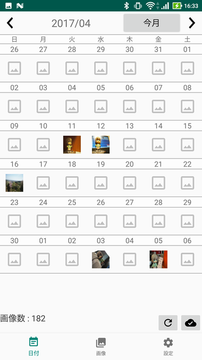

年・月の部分を表示すると、指定した月の表示に切り替えます。

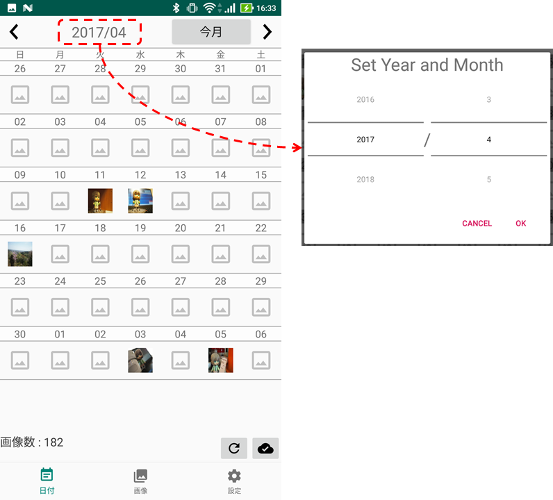

なお、サムネール部分を長押しすると、カレンダーアプリケーションを立ち上げます。（カメラ画像がある日のスケジュール思い返しにご利用ください。）
**カメラの機種によっては、カレンダーアプリケーションに切り替えると、通信が終了するものがあります。ご注意ください。**

### 画像一覧

カメラ内画像の一覧を表示します。

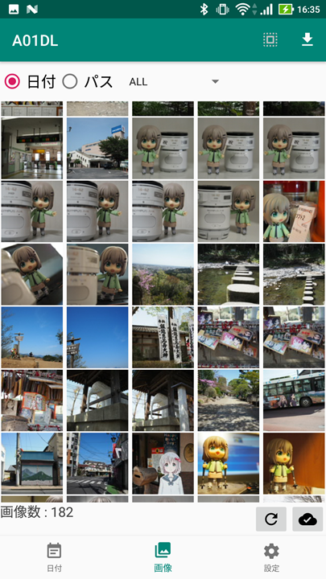

画像一覧画面では、撮影した日付、あるいはカメラ内のフォルダによって一覧表示をフィルタリングすることができます。

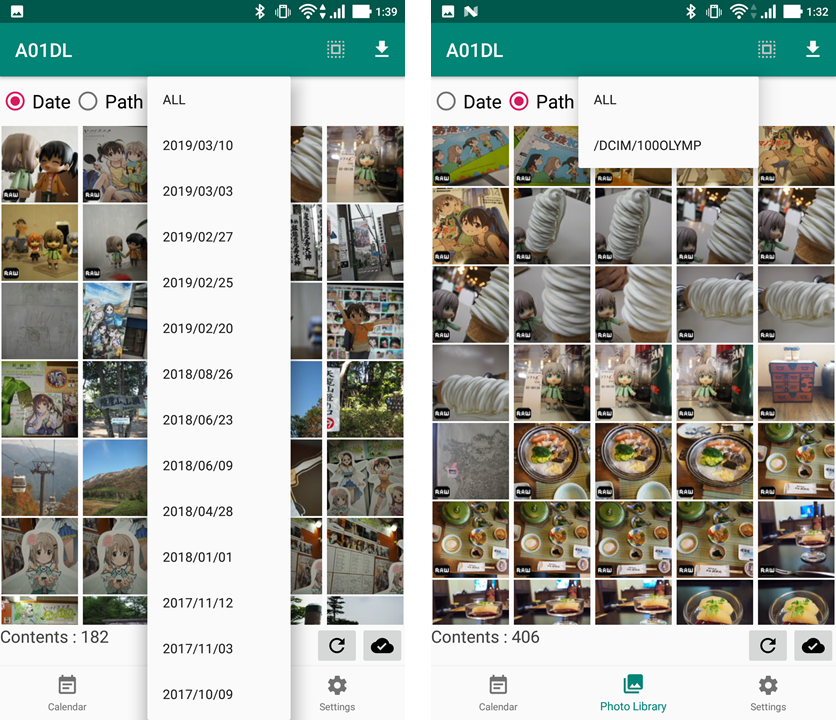

画像をタッチすると「画像詳細」画面を表示します。画像を長押しすると、画像を選択することができます。

メニューアイコンの「全選択・全選択解除」ボタンですべて選択、選択解除ができます。

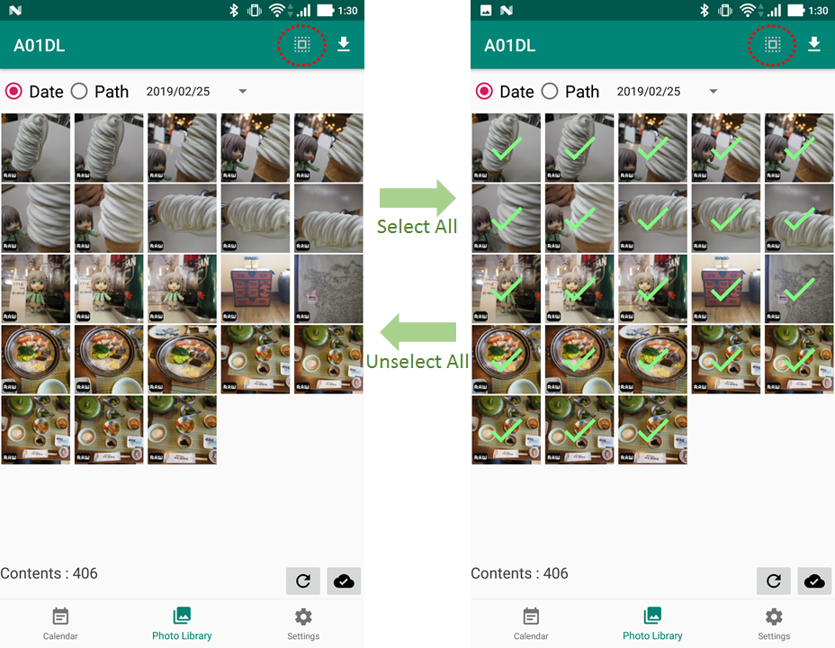

Panasonicのデュアルカードスロット搭載機で、カードが2枚挿入されているときには、左下に一覧表示しているカード名を表示します。
この部分をタッチすることで切り替えが可能です。
切り替え後、うまく画像一覧が表示されない場合があります。その場合には、一覧表示のフィルタを変更して画像表示を更新してみてください。

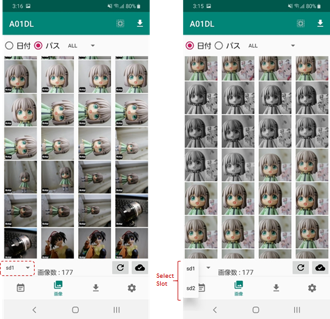

メニューアイコンの「ダウンロード」ボタンを押すと、「オリジナルサイズ」あるいは「スモールサイズ」の画像取得を一括で取得します。

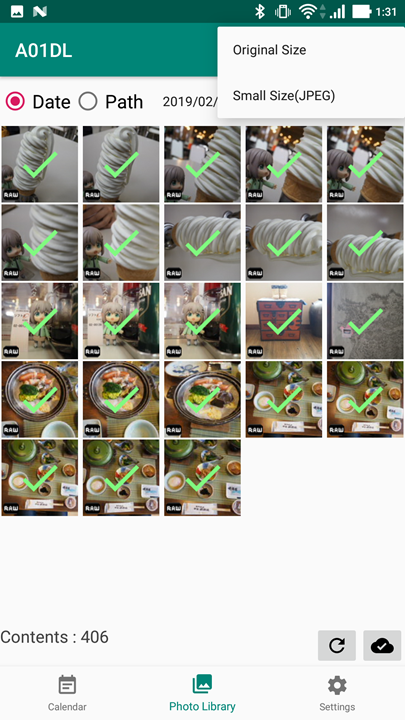

ダウンロード中は途中で停止することができません。ダウンロードが終了するまで、しばらくお待ちください。

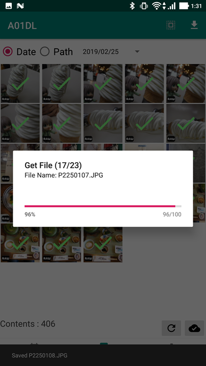

### 画像詳細

選択した画像を表示します。メニューアイコンの「ダウンロード」ボタンを押すと、「オリジナルサイズ」あるいは「スモールサイズ」、「RAW」の選択が可能です。
メニューを選択すると、ダウンロードが始まります。

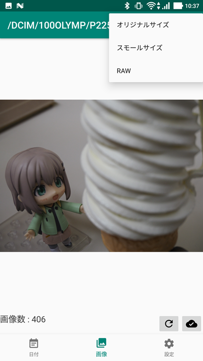

### 自動転送

「転送開始」を押して、アプリケーションを終了したり、他の画面に移動したり、「転送終了」を押したりするまでの間に、接続したカメラで撮影した画像をスマートフォンに自動転送するための画面です。
この機能は現状、RICOH GR/PENTAX機にのみ対応しています。

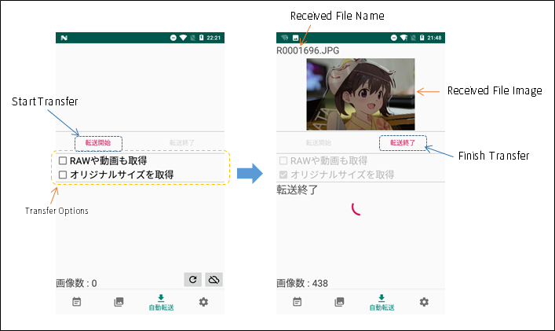

以下の設定が可能です。

* **RAWや動画も取得**
  * チェックを入れると、撮影時にRAW画像や動画を保存していた場合、その画像も合わせて取得します。
* **オリジナルサイズを取得**
  * 通常は、スモールサイズ画像の転送のみを行いますが、チェックを入れると、オリジナルサイズの画像を転送します。

サポートしていない機種の場合、以下のように本画面のボタンが無効となります。

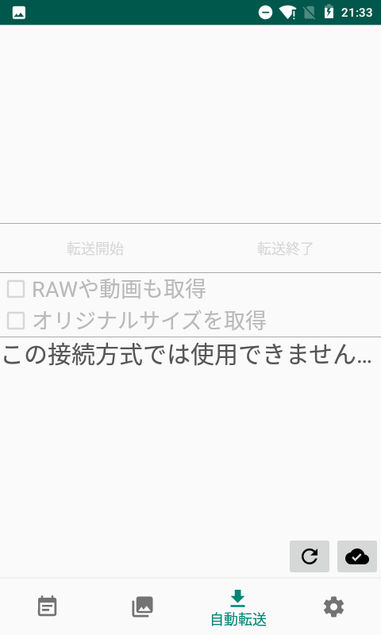

### 設定

設定画面は、カメラの接続方式により若干の設定項目が違います。お使いのカメラに合わせて設定をお願いします。

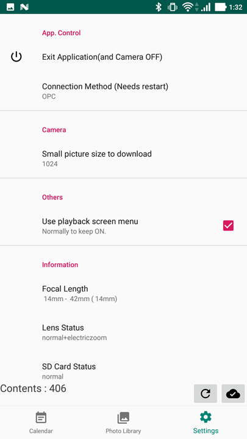

#### Ricoh GR / PENTAX 用設定

* **アプリ終了(と電源OFF)**
  * A01DLを終了するとともに、接続しているカメラの電源をOFFにします。ただし、カメラの電源OFFはリモートでカメラ電源OFFが可能なカメラのみ対応しています。
* **接続方式(変更時 要再起動)**
  * RICOH と設定してください。設定を変更した場合には、アプリケーションを一度終了させてから再度A01DLを起動させてください。
* **WiFi設定**
  * OSのWiFi設定画面を開きます。
* **接続中カメラ画面OFF**
  * GR2専用の設定です。接続中、カメラの画面の表示をOFFにします。
* **カメラに自動接続**
  * A01DLを起動したタイミングで、カメラと接続を行います。通常、本チェックはONのままでご使用ください。
* **サムネイル画像キャッシュ数**
  * カメラから取得するサムネイル画像の最大値を指定した値までで制限します。初期値は120です。デバイスのメモリが少ない場合、この値を減らすことで安定動作することがあります。
* **画像一覧に操作メニューを表示**
  * 画像一覧画面に操作メニューを表示します。一括取得ができなくなりますので、本チェックはONのままでご使用ください。
* **GR2専用コマンドを使用**
  * カメラとの通信・制御に、GR2専用のコマンドを使用します。通信するカメラがRICOH GR2の場合はこのチェックを入れ、PENTAX一眼カメラの場合は、このチェックを外してください。
* **撮影画像一覧取得時のタイムアウト（単位：秒）**
  * カメラ内の画像が多い場合にはカメラから一覧情報の応答が遅くなり、一覧表示ができない場合があります。その場合、ここの数値を大きくしてください。（標準は10秒です。）
* **カメラ画像一覧で取得する最大枚数**
  * カメラ内の画像が多い場合にはカメラから一覧情報の応答が遅くなり、一覧表示ができない場合があります。その場合、カメラ画像をすべて一覧表示できなくなりますが、ここの数値を小さくすることで表示できるようにします。（標準設定は3000です。）
* **A01DL操作説明**
  * [本ページ](https://github.com/MRSa/GokigenOSDN_documents/blob/main/Applications/A01DL/Readme.md)を開きます。
* **プライバシーポリシー**
  * GOKIGENプロジェクトの[プライバシーポリシーページ](https://github.com/MRSa/GokigenOSDN_documents/blob/main/PrivacyPolicy.md)を開きます。
* **デバッグ情報**
  * 問題発生時に、解決の糸口となるデバッグ情報を一覧表示する画面に遷移します。

#### Ricoh Theta (OSC) 用設定

* **アプリ終了**
  * A01DLを終了します。
* **接続方式(変更時 要再起動)**
  * THETA と設定してください。設定を変更した場合には、アプリケーションを一度終了させてから再度A01DLを起動させてください。
* **WiFi設定**
  * OSのWiFi設定画面を開きます。
* **THETA Web API v2.1の使用**
  * カメラとの接続に OSC V2互換の THETA Web API v2.1を使用して接続します。うまく通信ができない場合には設定してください。
* **HTTP送信**
  * この項目を選択すると、ダイアログを表示し、カメラに直接 http 通信で送ることができます。
* **撮影画像一覧取得時のタイムアウト（単位：秒）**
  * カメラ内の画像が多い場合にはカメラから一覧情報の応答が遅くなり、一覧表示ができない場合があります。その場合、ここの数値を大きくしてください。（標準は10秒です。）
* **カメラに自動接続**
  * A01DLを起動したタイミングで、カメラと接続を行います。通常、本チェックはONのままでご使用ください。
* **サムネイル画像キャッシュ数**
  * カメラから取得するサムネイル画像の最大値を指定した値までで制限します。初期値は120です。デバイスのメモリが少ない場合、この値を減らすことで安定動作することがあります。
* **A01DL操作説明**
  * [本ページ](https://github.com/MRSa/GokigenOSDN_documents/blob/main/Applications/A01DL/Readme.md)を開きます。
* **プライバシーポリシー**
  * GOKIGENプロジェクトの[プライバシーポリシーページ](https://github.com/MRSa/GokigenOSDN_documents/blob/main/PrivacyPolicy.md)を開きます。
* **デバッグ情報**
  * 問題発生時に、解決の糸口となるデバッグ情報を一覧表示する画面に遷移します。

#### OPC (Olympus Air) 用設定

* **アプリ終了(と電源OFF)**
  * A01DLを終了するとともに、接続しているカメラの電源をOFFにします。
* **接続方式(変更時 要再起動)**
  * OPC と設定してください。設定を変更した場合には、アプリケーションを一度終了させてから再度A01DLを起動させてください。
* **WiFi設定**
  * OSのWiFi設定画面を開きます。
* **スモール画像サイズ(横幅)**
  * 「スモールサイズ」を指定して画像を取得するときのサイズを指定します。
* **画像一覧に操作メニューを表示**
  * 画像一覧画面に操作メニューを表示します。一括取得ができなくなりますので、本チェックはONのままでご使用ください。
* **焦点距離**
  * Olympus Air A01に接続しているレンズの焦点距離を示します。
* **レンズ状態**
  * Olympus Air A01に接続しているレンズの状態を示します。
* **SDカード状態**
  * Olympus Air A01のSDカードの状態を示します。
* **カメラバージョン**
  * Olympus Air A01のファームウェアバージョンを示します。
* **Camera kitバージョン**
  * Olympus Air の Camera kitバージョンを示します。
* **カメラに自動接続**
  * A01DLを起動したタイミングで、カメラと接続を行います。通常、本チェックはONのままでご使用ください。
* **サムネイル画像キャッシュ数**
  * カメラから取得するサムネイル画像の最大値を指定した値までで制限します。初期値は120です。デバイスのメモリが少ない場合、この値を減らすことで安定動作することがあります。
* **ライブビュー画質**
  * A01DLでは、カメラのライブビュー機能は使用していませんので、設定を消さずに残しているだけです。何も変更せずにご使用ください。
* **A01DL操作説明**
  * [本ページ](https://github.com/MRSa/GokigenOSDN_documents/blob/main/Applications/A01DL/Readme.md)を開きます。
* **プライバシーポリシー**
  * GOKIGENプロジェクトの[プライバシーポリシーページ](https://github.com/MRSa/GokigenOSDN_documents/blob/main/PrivacyPolicy.md)を開きます。
* **デバッグ情報**
  * 問題発生時に、解決の糸口となるデバッグ情報を一覧表示する画面に遷移します。

#### Olympus (OM-D/PEN)用設定

* **アプリ終了**
  * A01DLを終了するとともに、接続しているカメラの電源をOFFにします。
* **接続方式(変更時 要再起動)**
  * Olympus と設定してください。設定を変更した場合には、アプリケーションを一度終了させてから再度A01DLを起動させてください。
* **WiFi設定**
  * OSのWiFi設定画面を開きます。
* **スモール画像サイズ(横幅)**
  * 「スモールサイズ」を指定して画像を取得するときのサイズを指定します。
* **表示画像はスモール画像を使用**
  * 一覧画像をタップして、画面に画像を一枚表示するモードとなったときの画像をスモールサイズの画像を使う場合にチェックを入れてください。表示までに少し時間がかかります。チェックを入れないままだと、一覧で表示している粗い画像（サムネイル画像）を表示します。表示までのタイムラグは短いです。
* **カメラに自動接続**
  * A01DLを起動したタイミングで、カメラと接続を行います。通常、本チェックはONのままでご使用ください。
* **サムネイル画像キャッシュ数**
  * カメラから取得するサムネイル画像の最大値を指定した値までで制限します。初期値は120です。デバイスのメモリが少ない場合、この値を減らすことで安定動作することがあります。
* **A01DL操作説明**
  * [本ページ](https://github.com/MRSa/GokigenOSDN_documents/blob/main/Applications/A01DL/Readme.md)を開きます。
* **プライバシーポリシー**
  * GOKIGENプロジェクトの[プライバシーポリシーページ](https://github.com/MRSa/GokigenOSDN_documents/blob/main/PrivacyPolicy.md)を開きます。
* **デバッグ情報**
  * 問題発生時に、解決の糸口となるデバッグ情報を一覧表示する画面に遷移します。

#### KODAK PIXPRO用設定

* **アプリ終了**
  * A01DLを終了します。
* **接続方式(変更時 要再起動**
  * PIXPRO と設定してください。設定を変更した場合には、アプリケーションを一度終了させてから再度A01DLを起動させてください。
* **WiFi設定**
  * OSのWiFi設定画面を開きます。
* **カメラIPアドレス**
  * カメラ側のIPアドレスを設定します。通常は変更不要です。(初期値は 172.16.0.254 です)
* **カメラ制御ポート番号**
  * カメラ側の接続先TCPポート番号を設定します。通常は変更不要です。(初期値は 9175 です)
* **撮影画像一覧取得時のタイムアウト（単位：秒）**
  * カメラ内の画像が多い場合にはカメラから一覧情報の応答が遅くなり、一覧表示ができない場合があります。その場合、ここの数値を大きくしてください。通常は変更不要です。（初期値は30です）
* **カメラに自動接続**
  * A01DLを起動したタイミングで、カメラと接続を行います。通常、本チェックはONのままでご使用ください。
* **サムネイル画像キャッシュ数**
  * KODAK PIXPRO機は、画像一覧画面に表示する画像のサイズが大きく、メモリが少ない端末だとメモリ不足が発生して画像がすべて表示できなくなることがあります。そういった現象が発生した場合は、ここの数値を減らしてください。（初期値は120です)
* **A01DL操作説明**
  * [本ページ](https://github.com/MRSa/GokigenOSDN_documents/blob/main/Applications/A01DL/Readme.md)を開きます。
* **プライバシーポリシー**
  * GOKIGENプロジェクトの[プライバシーポリシーページ](https://github.com/MRSa/GokigenOSDN_documents/blob/main/PrivacyPolicy.md)を開きます。
* **デバッグ情報**
  * 問題発生時に、解決の糸口となるデバッグ情報を一覧表示する画面に遷移します。

#### FUJI X 用設定

* **アプリ終了**
  * A01DLを終了します。
* **接続方式(変更時 要再起動)**
  * FUJI X Series と設定してください。設定を変更した場合には、アプリケーションを一度終了させてから再度A01DLを起動させてください。
* **WiFi設定**
  * OSのWiFi設定画面を開きます。
* **カメラに自動接続**
  * A01DLを起動したタイミングで、カメラと接続を行います。通常、本チェックはONのままでご使用ください。
* **サムネイル画像キャッシュ数**
  * カメラから取得するサムネイル画像の最大値を指定した値までで制限します。初期値は120です。デバイスのメモリが少ない場合、この値を減らすことで安定動作することがあります。
* **コマンド間隔(default: 50)**
  * コマンドをカメラに送信する間隔を調整します。通常は、本設定を変更する必要はありません。
* **Special Thanks to**
  * FUJI X対応のときに参考にさせていただいたサイトへのリンクです。（リンク先には C++で FUJI Xシリーズカメラに接続するコードがあります。）
* **A01DL操作説明**
  * [本ページ](https://github.com/MRSa/GokigenOSDN_documents/blob/main/Applications/A01DL/Readme.md)を開きます。
* **プライバシーポリシー**
  * GOKIGENプロジェクトの[プライバシーポリシーページ](https://github.com/MRSa/GokigenOSDN_documents/blob/main/PrivacyPolicy.md)を開きます。
* **デバッグ情報**
  * 問題発生時に、解決の糸口となるデバッグ情報を一覧表示する画面に遷移します。

#### Panasonic用設定

* **アプリ終了**
  * A01DLを終了します。
* **接続方式(変更時 要再起動)**
  * Panasonic と設定してください。設定を変更した場合には、アプリケーションを一度終了させてから再度A01DLを起動させてください。
* **WiFi設定**
  * OSのWiFi設定画面を開きます。
* **カメラに自動接続**
  * A01DLを起動したタイミングで、カメラと接続を行います。通常、本チェックはONのままでご使用ください。
* **サムネイル画像キャッシュ数**
  * カメラから取得するサムネイル画像の最大値を指定した値までで制限します。初期値は120です。デバイスのメモリが少ない場合、この値を減らすことで安定動作することがあります。
* **A01DL操作説明**
  * [本ページ](https://github.com/MRSa/GokigenOSDN_documents/blob/main/Applications/A01DL/Readme.md)を開きます。
* **プライバシーポリシー**
  * GOKIGENプロジェクトの[プライバシーポリシーページ](https://github.com/MRSa/GokigenOSDN_documents/blob/main/PrivacyPolicy.md)を開きます。
* **デバッグ情報**
  * 問題発生時に、解決の糸口となるデバッグ情報を一覧表示する画面に遷移します。

#### SONY用設定

* **アプリ終了**
  * A01DLを終了します。
* **接続方式(変更時 要再起動)**
  * SONYと設定してください。設定を変更した場合には、アプリケーションを一度終了させてから再度A01DLを起動させてください。
* **WiFi設定**
  * OSのWiFi設定画面を開きます。
* **カメラAPI一覧**
  * 接続中のSONY製カメラが受け付けるコマンドの一覧を表示できます。また、このコマンドを単独で送信することもできます。
* **スマートフォン転送モードを使う**
  * PlayMemories Camera Appに対応していない最近のカメラで、カメラのメニュー内に「スマートフォン転送」モードがある場合、このモードでカメラを起動させてください。 DLNA方式で画像取得を行います。スマートフォン転送モードを使用する場合は、カメラ上で「スマートフォンから選ぶ」に設定をお願いします。
* **スモールサイズはVGA**
  * 画像取得時に「スモールサイズ」と選択した時に取得する画像の大きさを VGA（640x480）にします。
* **カメラに自動接続**
  * A01DLを起動したタイミングで、カメラと接続を行います。通常、本チェックはONのままでご使用ください。
* **サムネイル画像キャッシュ数**
  * カメラから取得するサムネイル画像の最大値を指定した値までで制限します。初期値は120です。デバイスのメモリが少ない場合、この値を減らすことで安定動作することがあります。
* **A01DL操作説明**
  * [本ページ](https://github.com/MRSa/GokigenOSDN_documents/blob/main/Applications/A01DL/Readme.md)を開きます。
* **プライバシーポリシー**
  * GOKIGENプロジェクトの[プライバシーポリシーページ](https://github.com/MRSa/GokigenOSDN_documents/blob/main/PrivacyPolicy.md)を開きます。
* **デバッグ情報**
  * 問題発生時に、解決の糸口となるデバッグ情報を一覧表示する画面に遷移します。

#### Canon用設定

* **アプリ終了**
  * A01DLを終了します。
* **接続方式(変更時 要再起動)**
  * Canon と設定してください。設定を変更した場合には、アプリケーションを一度終了させてから再度A01DLを起動させてください。
* **WiFi設定**
  * OSのWiFi設定画面を開きます。
* **表示画像はスモール画像を使用**
  * 一覧画像をタップして、画面に画像を一枚表示するモードとなったときの画像をスモールサイズの画像を使う場合にチェックを入れてください。表示までに少し時間がかかります。チェックを入れないままだと、一覧で表示している粗い画像（サムネイル画像）を表示します。表示までのタイムラグは短いです。
* **RAW拡張子**
  * カメラのRAW拡張子を設定してもらうための項目ですが、現状は未使用です。すみません。
* **応答受信待ち時間(単位:ms)**
  * カメラからの受信応答待ち時間を設定します。カメラとの通信がうまくいかないと思った場合、この数値を大きくしてください。標準は **20** (ms)です。
* **カメラIPアドレス**
  * カメラ側のIPアドレスを設定します。初期値は 192.168.0.1で通常、変更は不要です。Power Shot ZOOM の場合には、アドレスを確認して設定してください。
* **スモール画像取得シーケンス**
  * 初期値はTYPE0です。うまくスモール画像が取得できない場合にはほかのタイプに変更してお試しください。IXY 210の場合には、TYPE1でスモール画像が取得可能になります。
* **接続シーケンス**
  * 初期値はTYPE0です。変更は特に必要ありません。
* **カメラに自動接続**
  * A01DLを起動したタイミングで、カメラと接続を行います。通常、本チェックはONのままでご使用ください。
* **サムネイル画像キャッシュ数**
  * カメラから取得するサムネイル画像の最大値を指定した値までで制限します。初期値は120です。デバイスのメモリが少ない場合、この値を減らすことで安定動作することがあります。
* **A01DL操作説明**
  * [本ページ](https://github.com/MRSa/GokigenOSDN_documents/blob/main/Applications/A01DL/Readme.md)を開きます。
* **プライバシーポリシー**
  * GOKIGENプロジェクトの[プライバシーポリシーページ](https://github.com/MRSa/GokigenOSDN_documents/blob/main/PrivacyPolicy.md)を開きます。
* **デバッグ情報**
  * 問題発生時に、解決の糸口となるデバッグ情報を一覧表示する画面に遷移します。

#### Nikon用設定

* **アプリ終了**
  * A01DLを終了します。
* **接続方式(変更時 要再起動)**
  * Nikon と設定してください。設定を変更した場合には、アプリケーションを一度終了させてから再度A01DLを起動させてください。
* **WiFi設定**
  * OSのWiFi設定画面を開きます。
* **表示画像はスモール画像を使用**
  * 一覧画像をタップして、画面に画像を一枚表示するモードとなったときの画像をスモールサイズの画像を使う場合にチェックを入れてください。表示までに少し時間がかかります。チェックを入れないままだと、一覧で表示している粗い画像（サムネイル画像）を表示します。表示までのタイムラグは短いです。
* **カメラIPアドレス**
  * カメラのIPアドレスを設定します。（通常は、192.168.1.1 のままでお使いください。）
* **応答受信待ち時間(単位:ms)**
  * カメラからの受信応答待ち時間を設定します。カメラとの通信がうまくいかないと思った場合、この数値を大きくしてください。標準は **50** (ms)です。
* **カメラIPアドレスを自動設定**
  * カメラのIPアドレスを自動的に設定します。通常は、ONのまま（チェックを入れたまま）でお使いください。
* **カメラに自動接続**
  * A01DLを起動したタイミングで、カメラと接続を行います。通常、本チェックはONのままでご使用ください。
* **サムネイル画像キャッシュ数**
  * カメラから取得するサムネイル画像の最大値を指定した値までで制限します。初期値は120です。デバイスのメモリが少ない場合、この値を減らすことで安定動作することがあります。
* **A01DL操作説明**
  * [本ページ](https://github.com/MRSa/GokigenOSDN_documents/blob/main/Applications/A01DL/Readme.md)を開きます。
* **プライバシーポリシー**
  * GOKIGENプロジェクトの[プライバシーポリシーページ](https://github.com/MRSa/GokigenOSDN_documents/blob/main/PrivacyPolicy.md)を開きます。
* **デバッグ情報**
  * 問題発生時に、解決の糸口となるデバッグ情報を一覧表示する画面に遷移します。

#### [VisionKids](https://www.visionkids.com/product-page/happicamu-t3)/[myFirst](https://jp.myfirst.tech/products/myfirst-camera-insta-wi)用設定

VisionKids と myFirst は、同じ設定となります。

* **アプリ終了**
  * A01DLを終了します。
* **接続方式(変更時 要再起動)**
  * [VisionKids](https://www.visionkids.com/product-page/happicamu-t3)と設定してください。設定を変更した場合には、アプリケーションを一度終了させてから再度A01DLを起動させてください。
* **WiFi設定**
  * OSのWiFi設定画面を開きます。
* **カメラIPアドレスを自動設定**
  * カメラのIPアドレスを自動的に設定します。通常は、ONのまま（チェックを入れたまま）でお使いください。
* **カメラIPアドレス**
  * カメラのIPアドレスを設定します。カメラIPアドレスを自動設定がうまく機能しない場合はOFFにして、VisionKids機の場合は、192.168.4.100 のままでお使いください。myFirst機の場合は、この値を 192.168.1.1 に変更してご使用ください。
* **カメラアクセス用設定(User)**
  * カメラにアクセスするユーザを設定します。（通常は、ftp のままでお使いください。）
* **カメラアクセス用設定(Pass)**
  * カメラにアクセスするパスを設定します。（通常は、ftp のままでお使いください。）
* **撮影画像一覧取得時のタイムアウト（単位：秒）**
  * 通常変更は不要です。（標準は30秒です。）
* **カメラに自動接続**
  * A01DLを起動したタイミングで、カメラと接続を行います。通常、本チェックはONのままでご使用ください。
* **サムネイル画像キャッシュ数**
  * カメラから取得するサムネイル画像の最大値を指定した値までで制限します。初期値は120です。デバイスのメモリが少ない場合、この値を減らすことで安定動作することがあります。
* **A01DL操作説明**
  * [本ページ](https://github.com/MRSa/GokigenOSDN_documents/blob/main/Applications/A01DL/Readme.md)を開きます。
* **プライバシーポリシー**
  * GOKIGENプロジェクトの[プライバシーポリシーページ](https://github.com/MRSa/GokigenOSDN_documents/blob/main/PrivacyPolicy.md)を開きます。
* **デバッグ情報**
  * 問題発生時に、解決の糸口となるデバッグ情報を一覧表示する画面に遷移します。

-----

## その他

### トラブルシュート

### 注意事項（仕様、制約事項）

* PENTAX一眼レフ機, RICOH GR III, FUJIFILM 機では、カメラ本体の仕様により、カレンダーの日付分類ができません。すみません。代わりに「パス」でのフィルタをご利用ください。
* Panasonic機では、カレンダーの日付分類ができていません。すみません。
* SONYのレンズスタイルカメラについて、QX1以外の QXシリーズには(特殊コマンドに鍵がかかっているため)未対応です。すみません。
* 画像の自動転送機能は、RICOH/PENTAX機にのみ対応しています。

#### Power Shot ZOOM のIPアドレス設定

Canon Power Shot ZOOMのIPアドレスは、以下を参照して確認し、その値を設定してください。（IPアドレスの確認は、WIFI接続中にしかできないと思います。）

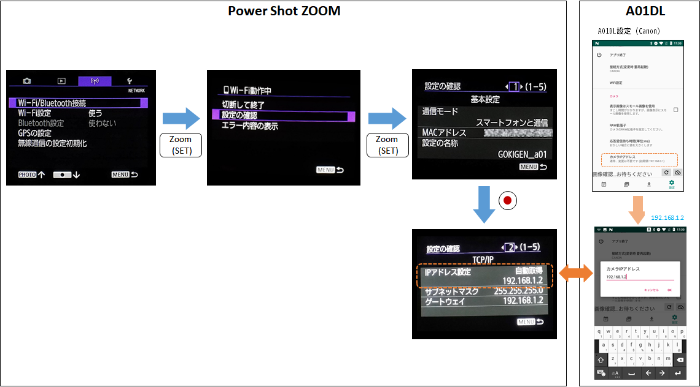

### 動作確認機種

A01DLの動作確認は、以下の8社26機種にて行いました。

* Nikon D610 + WU-1b
* Nikon 1 J3 + WU-1b
* Nikon D5600
* Canon EOS M6
* Canon IXY 210
* Canon Power Shot ZOOM
* Fujifilm X-A3
* Fujifilm X-T100
* Fujifilm XF10
* Panasonic DMC-GX7MK2
* Panasonic DC-G9
* Panasonic DC-S1
* Olympus Air A01
* Olympus E-PL8
* Olympus TG-6
* Sony DSC-HX-90V
* Sony DSC-RX0
* Sony ILCE-QX1
* Sony ILCE-7M2
* Ricoh Theta S
* Ricoh Theta V
* Ricoh GR II
* Ricoh GR III
* Ricoh GR IIIx
* PENTAX K-70
* JK Imaging KODAK PIXPRO WPZ2
* [VisionKids HappiCAMU T3](https://www.visionkids.com/product-page/happicamu-t3)
* [myFirst Camera Insta Wi](https://jp.myfirst.tech/products/myfirst-camera-insta-wi)

### 変更履歴

* 1.0.5 : 初版投稿。
* 1.5.0 : Olympus機に対応。
* 1.6.0 : Nikon機(Wireless mobile Utility対応機)に対応し、主要カメラメーカ７社(Nikon, Canon, Sony, Fujifilm, Olympus, Ricoh, Panasonic)のWifi対応カメラからの画像ダウンロードに対応した。
* 1.6.2 : SONY および Fujifilm機の接続性を改善（したつもり）
* 1.7.0 : Ricoh Thetaと接続、ダウンロード可能にした
* 1.7.3 : 一部のPanasonic機（DC-G9）で使用できるよう修正。OLYMPUSでのRAWファイルの扱いもその他のメーカーと同じように変更。
* 1.8.0 : JK Imaging KODAK PIXPRO WPZ2と接続、ダウンロード可能にした
* 1.8.1 : Canon Power Shot ZOOM と Ricoh Theta Vと接続、ダウンロード可能にした
* 1.8.5 : [VisionKids HappiCAMU T3](https://www.visionkids.com/product-page/happicamu-t3) と接続、ダウンロード可能にした
* 1.8.6 : [myFirst Camera Insta Wi](https://jp.myfirst.tech/products/myfirst-camera-insta-wi) と接続、ダウンロード可能にした

### permissionについて

次のパーミッションを指定し使用しています。

* android.permission.ACCESS_NETWORK_STATE
  * カメラとのWIFI接続を行うため
* android.permission.ACCESS_WIFI_STATE
  * カメラとのWIFI接続を行うため
* android.permission.INTERNET
  * カメラとのWIFI接続を行うため
* android.permission.WRITE_EXTERNAL_STORAGE
  * 画像をAndoroid端末本体にダウンロードするため
* android.permission.VIBRATE
  * 一部の画面タッチ（ボタンアイコンクリック）にバイブレーションでフィードバックするため

### ソースコード

* [https://github.com/MRSa/PKRemote.git](https://github.com/MRSa/PKRemote.git)

以上
