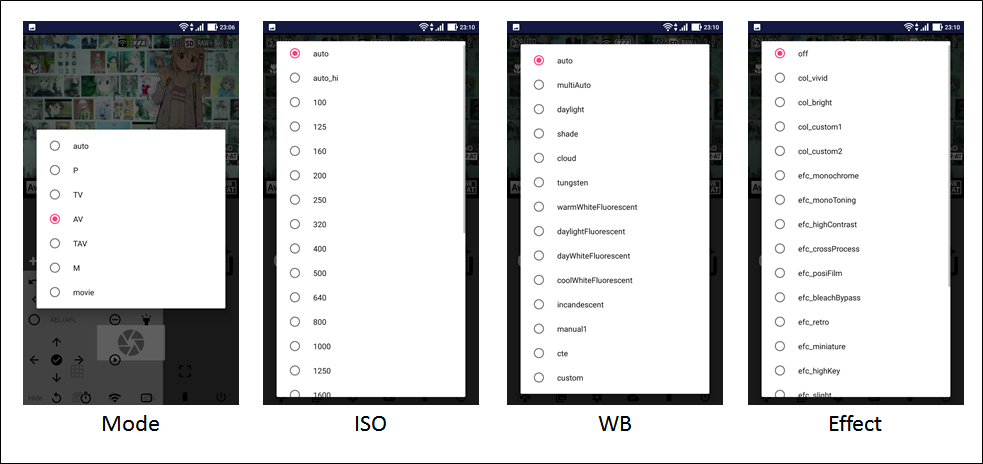

# A01GR2 : RICOH GR シリーズ / PENTAX / FUJI X / OPC用撮影・参照アプリケーション

--------------------------------

--------------------------------

## 概要

A01GR2は、[A01d](../A01d/Readme.md)から派生した、リコー製デジタルカメラ GR II, GR III, PENTAXブランドの一眼レフ、FUJIFILM製 デジタルカメラ および OPC (Olympus Air A01)に対応したAndroid用の遠隔操作アプリケーションです。
本家（リコー社製）[GR Remote(リンク)](http://www.ricoh-imaging.co.jp/japan/products/gr_remote/index.html) とは異なり、Androidのネイティブアプリケーションとして動作します。

またカメラ本体の仕様によって、制約事項があります。
後述の PENTAX DSLR機で使用する場合の設定 および RICOH GRIII機で使用する場合の設定 を参照し、設定変更をお願いします。

A01GR2は、Androidアプリに対応した chromebook でも動作します。ウィンドウ最大化など、スクリーンサイズの変更も可能です。
ただし、ネットワークの設定変更(ネームサーバの設定変更)が必要のようです。後述の Chromebookで使用する場合のWIFI設定 を参照し、設定変更をお願いします。

--------------------------------

## 機能一覧

* タッチフォーカス
* ライブビュー表示
* 撮影モードの切り替え
* グリッドの表示/非表示
* 画像の撮影
* 設定値の変更（F値、シャッタースピード、ISO、ホワイトバランス、エフェクト、測光モード）
* カメラ内画像の一覧表示
* カメラ内画像の転送（RAW, 動画も可能）
* カメラ画面と同じ画面を表示（ディスプレイミラーモード）（RICOH GR2のみ）
* カメラボタンの遠隔操作 (RICOH GR2のみ)

--------------------------------

## サポートするデジタルカメラ

* [RICOH GR II](http://www.ricoh-imaging.co.jp/japan/products/gr-2/)
* [Olympus Air A01](https://olympus-imaging.jp/product/opc/a01/)
* [PENTAX DSLR (K-1, KP, K-70 等、制約あり)](https://api.ricoh/docs/camera-wireless-sdk-android/)
* [RICOH GR III(操作に制約あり)](http://www.ricoh-imaging.co.jp/japan/products/gr-3/)
* [FUJIFILM Xシリーズカメラ(制約あり)](https://fujifilm-x.com/ja-jp/products/cameras/)

### 動作確認機種

A01GR2は、アプリの作成中に以下の機種で動作を確認しています。 (順不同)

* [Olympus Air A01](https://olympus-imaging.jp/product/opc/a01/)
* [PENTAX K-70](http://www.ricoh-imaging.co.jp/japan/products/k-70/)
* [RICOH GR II](http://www.ricoh-imaging.co.jp/japan/products/gr-2/)
* [RICOH GR III](http://www.ricoh-imaging.co.jp/japan/products/gr-3/)
* [FUJIFILM XF10](https://fujifilm-x.com/ja-jp/products/cameras/xf10/)
* [FUJIFILM X-T100](https://fujifilm-x.com/ja-jp/products/cameras/x-t100/)
* [FUJIFILM X-A3](http://fujifilm-dsc.com/ja/manual/x-a3/)

--------------------------------

## インストール

Google Play よりインストールしてください。

* [https://play.google.com/store/apps/details?id=net.osdn.gokigen.gr2control](https://play.google.com/store/apps/details?id=net.osdn.gokigen.gr2control)

--------------------------------

## 基本操作

A01GR2の典型的な利用方法は以下です。

1. カメラと端末をWIFI接続してください。
2. A01GR2を起動します。 「接続モード」ボタンを押して、カメラと接続をお願いします。
   * Settingsで「カメラに自動接続」にチェックを入れていると、アプリ起動時にカメラへ自動接続します。
   * アプリを起動し、接続失敗ダイアログが出た場合には、「WIFI設定」を選び、カメラとの接続を確認したのち、「再試行」を選んでください。
3. カメラとの接続ができたらカメラ画像が表示されます。
   * 画像内をタッチし、フォーカスを合わせ、シャッターボタンを押してください。撮影ができます。
   * キーパッドや設定値について、設定変更が可能です。
4. 画像一覧ボタンを押して、撮影画像の一覧を表示します。
   * 画像をタッチし、画像詳細を表示します。
   * 画像を長押しすると複数選択して、一括転送します。
5. 画像を端末に転送します。
   * メニューから転送する画像するタイプを選んで転送します。

--------------------------------

## 画面遷移

以下にA01GR2の画面遷移を示します。画面遷移では横画面で示していますが、端末の傾きに合わせて縦横表示を切り替えます。
ただし、FUJI X機は、カメラと接続中に縦横表示を切り替えると回線切断されてしまい、カメラがの電源が切れますのでご注意ください。

--------------------------------

## 画面説明

### Live View

カメラのライブビュー画像を表示する画面です。撮影設定値やピント位置、撮影がこの画面でできます。
ライブビュー画像をタッチしてピントを合わせ、シャッターボタンを押して撮影する、が基本的な使い方になります。

画面が横画面のときには、画面上部に設定値を変更するコントロールパネルを表示します。コントロールパネル右端の「Hide」を押すと表示を消すことができます。
コントロールパネルを再度表示させたい場合には、「Show」を押してください。

設定値の変更は、当該設定部分をタッチすると選択肢が出ますので、希望の設定値を選んでください。

RICOH GR2を使用している場合には、カメラのボタンを代用するキーパネル(GR2 Key Panel)を表示し、操作することができます。
画面左下のゲームコントローラアイコンを押すと表示できます。パネル表示を消す場合には、「Hide」を押します。

FUJI X 機の場合、シャッタースピード/絞り/露出補正は、1段づつしか変更できないため、キーパネル(FUJI Key Panel)を表示し操作してください。

#### GR2 Key Panel

GR2 key Panel とカメラ(GR2)のボタンとの対応を示します。ボタンを押すと、その操作をバイブレーションでフィードバックします。 
**カメラ本体の仕様により、本パネルは GR2でのみ動作します。ご了承ください。** また、半透明のパネルとなっているため、パネル表示中でもパネル下のボタンを押すことが可能です。

#### FUJI Key Panel

FUJIFILM機の仕様では、シャッタースピードや絞り値、露出補正は直接値を設定できず、１段づつしか上下させることができません。
そのため、本キーパネルにてシャッタースピードや絞り値、露出補正を変更することができます。 **-側が暗くなる設定、+側が明るくなる設定です。**
ほかにも、フラッシュモードやセルフタイマーの設定を変更できます。
また、半透明のパネルとなっており、パネル表示中でもパネル下のボタンを押すことが可能です。

#### FUJI メッセージ送信ダイアログ

FUJIFILM機の通信仕様は非公開であり、基本操作は動作確認を行い実装していますが、解析しきれていないコマンド、操作が予想されます。
そのため、その探索が行えるように、A01d からメッセージ送信ダイアログを移植しています。A01GR2非対応のコマンド送信などにご使用ください。
スペシャルコマンドボタンを押すとダイアログを表示します。

送信コマンドの内容は FujiXcommands に記載予定です。
なお、本ダイアログでのメッセージ送信後のA01GR2の動作保証はできませんので、ご注意ください。

#### アイコン説明

Live View画面で表示している、その他のアイコンについて説明します。

##### 接続モード

カメラとの接続状態を示します。ライブビュー画像が更新されないなどの不都合があった場合には、試しにこのアイコンをタップして、カメラとの切断・接続を実施してください。

##### バッテリ状態

接続しているカメラのバッテリ残量を示します。

##### 合焦表示（兼フォーカスアンロック）

このアイコンをタッチすることで、フォーカスをアンロックすることができます。また、GR2 を使用中の場合、合焦したことをこのアイコンで示します。

#### 測光モード(AEモード)表示

測光モードをアイコンで示します。 **FUJI機では、現在の測光モード状態および設定の変更方法が見つかっていないため、アイコンは変化しません。ご了承ください。**

##### グリッド表示 ON/OFF

ライブビュー画像にグリッド（補助線）を表示する・表示しないを切り替えます。

##### その他のボタン

* **Power Off** : カメラの電源を切り、アプリケーションを終了します。実行する前に、本当に実行してよいか、確認のダイアログを表示します。
* **Picture List** : カメラ画像一覧を表示します。
* **Settings**    : 設定画面を表示します。
* **Picture Effect** : エフェクト (アートフィルター)を設定します。 **（FUJIFILM機の場合は、フィルムシミュレーションの設定が可能です。）**
* **Show GR2 Key Panel** : GR2 key Panel  を表示します。（FUJIFILM機の場合は FUJI Key Panel を表示します。）

### Picture List

カメラ内の画像を一覧表示する画面です。画像をタッチすると、撮影画像表示画面に遷移します。画像にRAW画像がある場合には左下に「RAW」マーク、動画の場合には「カメラ」アイコンを表示します。

### Picture

画像を１枚だけ表示する画面です。この画面から、画像ファイルをスマートフォンへ取得することができます。
左スワイプ、右スワイプで、前画像・後画像に表示を変更することができます。画像を取得する場合は、右上のアイコンを押してください。
取得したファイルは、 スマートフォンの **DCIM/aira01a** フォルダの下に 「(カメラ内ファイル名) _YYYYMMDD-hhmmss.(拡張子)」（1.2.0までは「YYYYMMDD-hhmmss_(カメラ内ファイル名) .(拡張子)」）という名前でダウンロードします。
ただし、YYYYMMDD-hhmmss は、ダウンロードした年月日-時分秒 になります。なお、拡張子はそれぞれのファイル形式に合わせたものになります。
ダウンロードしたJPEGファイルや動画ファイルは、イメージライブラリに登録しますので、ギャラリー等で参照可能になります。

### Settings

A01GR2の設定を変更することができます。接続するカメラタイプごとの設定は、もう１段深い階層で設定します。

#### Generic Settings

##### アプリ制御

* **接続方式(再起動が必要)**
  * A01GR2とカメラとの接続方式を指定します。**設定変更後は、A01GR2を再起動してください。** 
    * **Ricoh GR Series / PENTAX DSLR** : GR II / GR III / PENTAXの一眼レフに接続するときの設定です。
    * **OPC (Olympus Air)** : Olympus Air 機に接続するときの設定です
    * **Fujifilm X** : FUJIFILM X機に接続するときの設定です。

* **WiFi設定**
  * ここを押すと、AndroidのWiFi設定画面に遷移します。カメラとの接続がうまくいかない場合にお使いください。

#### カメラ設定

* **RICOH GR / PENTAX用設定**
  * ここを押すと、RICOH GR / PENTAXカメラ用の個別設定画面に遷移します。
* **Fujifilm X用設定**
  * ここを押すと、FUJIFILM Xカメラ用の個別設定画面に遷移します。
* **Olympus Air用設定**
  * ここを押すと、Olympus Air用の個別設定画面に遷移します。
* **ライブビュー画像も同時に撮影**
  * チェックを入れると、シャッターボタンを押したタイミングでライブビュー画像を保存します。カメラ画像を転送せずに撮影した（粗い）画像を仮保存したい場合にご使用ください。

##### 起動時設定

* **カメラに自動接続**
  * チェックを入れると、A01GR2起動時に、カメラに自動で接続を行います。通常、チェックを入れたままお使いください。

##### その他

* **画像保存後に共有する**
  * チェックを入れると、カメラから画像を転送した後、他アプリにその情報を伝える（共有する）ことができます。
  * 共有を行うと、いったんアプリを終了しますので、カメラの種類によっては接続が切断されたり電源が切れたりすることもありますのでご注意ください。
* **画像一覧画面にコマンドメニューを表示**
  * チェックを入れると、画像一覧画面にコマンドメニュー（全選択や一括ダウンロードなど）を表示します。通常、チェックを入れたままお使いください。

##### GOKIGEN Project

* **操作説明**
  * ここを押すと、本ページ([A01GR2](https://github.com/MRSa/GokigenOSDN_documents/blob/main/Applications/A01GR2/Readme.md))を表示します。
* **プライバシーポリシー**
  * ここを押すと、[GOKIGENプロジェクト](https://osdn.net/projects/gokigen/)の[プライバシーポリシー](https://github.com/MRSa/GokigenOSDN_documents/blob/main/PrivacyPolicy.md)ページを開きます。

* **デバッグ情報**
  * ここを押すと、A01GR2のデバッグ情報(logcat)を表示します。通常、参照する必要はありません。

#### RICOH/PENTAX Settings

##### アプリ制御

* **アプリ終了(RICOH)**
  * カメラの電源を切り、アプリケーションを終了します。実行する前に、本当に実行してよいか、確認のダイアログを表示します。PENTAX一眼機の場合には、電源OFFになりませんのでご注意ください。

##### 起動時設定

* **ディスプレイミラーモード**
  * **GR2専用の設定** です。チェックを入れると、カメラと端末で同じ画面表示を行います。
* **接続時にカメラのLCDをオフにする**
  * **GR2専用の設定** です。チェックを入れると、カメラと端末が接続できたとき、カメラの画面表示をOFFにします。

##### その他

* **GR2専用コマンドの使用**
  * RICOH GR2と接続する場合にチェックを入れてください。
* **AF動作後に撮影(GR3/PENTAX)**
  * **GR3/PENTAX一眼用の設定**です。シャッターボタンを押すと、AFを駆動させた後に撮影を行います。通常は、本チェックは入れない状態でご使用ください。
* **撮影画像一覧取得時のタイムアウト（単位：秒）**
  * 画像一覧を取得するときに端末側で待つ最長の時間を単位は秒で設定します。PENTAX一眼の場合、撮影画像がたくさんあると一覧取得までに時間がかかるので、長い時間（90秒とか）を設定してください。

#### FUJIFILM Settings

##### アプリ制御

* **アプリ終了 (FUJI)**
  * カメラの電源を切り、アプリケーションを終了します。実行する前に、本当に実行してよいか、確認のダイアログを表示します。

##### カメラ設定

* **LVをカメラでも表示**
  * お試し機能です。チェックを入れると、ライブビューの画像をカメラと端末の両方で表示します。FUJIFILMカメラ機の持つバグをついているように思いますので常用は厳しいと思います。ご了承ください。
* **フォーカス点数 [X,Y] (default:7,7)**
  * フォーカスエリアの選択を設定します。期待した箇所でうまくフォーカスを合わせることができない場合、カメラの仕様に沿って設定してください。（例えば、X-T100 や XF10 の場合は **13,7** を設定します。）
* **コマンド間隔(default: 500)**
  * カメラ状態の確認間隔をms単位で設定します。初期値は 500ms です。通常は変更する必要はありません。
* **LV画像受信待ち間隔(default: 80)**
  * ライブビューの画像取得間隔を指定します。デフォルトでは 80ms に指定しています。値を大きくすると安定しますが画像表示に遅延が発生します。値を小さくすると画像の表示遅延は減りますが、ちらつきが発生する可能性が増します。

##### その他

* **Special Thanks to**
  * FUJIFILM機の対応を行うために参考にしたサイトへジャンプします。

#### OPC Settings

##### アプリ制御

* **アプリ終了 (OPC)**
  * カメラの電源を切り、アプリケーションを終了します。実行する前に、本当に実行してよいか、確認のダイアログを表示します。

##### カメラ設定

* **シャッター音**
  * シャッター音量を変更します。
* **RAW撮影**
  * チェックを入れると、RAWファイルを撮影するときにチェックを入れます。

##### ライブビュー設定

* **ライブビュー品質**
  * ライブビュー画像の画質を選択します。VGA程度をお勧めします。

##### カメラ情報

* **レンズ焦点距離**
  * 参照専用で変更できません。画面を開いた時の現在カメラに装着されているレンズの焦点距離を表示します。未接続、不明の場合には 0mm を応答します。
* **レンズ状態**
  * 参照専用で変更できません。画面を開いた時のレンズの状態を表示します。
* **SDカード状態**
  * 参照専用で変更できません。画面を開いた時のSDカード状態を表示します。
* **Camera Version**
  * 参照専用で変更できません。カメラのファームウェアバージョンを表示します。
* **Camera kit Version**
  * 参照専用で変更できません。A01GR2で使用している Olympus Camera Kitのバージョンを表示します。

--------------------------------

## トラブルシュート

### ライブビューの反応が悪い場合

周囲のネットワーク状態によっては、ライブビューの反応が悪い場合があります。
また、それ以外にも、BluetoothをONにしているとWIFIの電波と干渉する場合があるようです。（通信に使用するチャンネルのせいなのかどうなのか、よくわかりませんが。。）
もし、いつもより反応が悪いと感じる場合には、BluetoothをOFFにして改善するかお試しください。

### カメラとWIFI接続できない場合

端末によっては、通常の操作だけではカメラに接続できないことがあるようです。つながるときはつながりまずが、つながらない場合には全然つながらなくご迷惑をおかけします。
現状、「こうすれば大丈夫！」という操作は見つかっていませんが、ネットワークの接続を維持するようにするとカメラと接続できることがありますので、お試しください。

一度アプリを終了して再度起動する」も意外と有効です。お試しください。
ネットワーク設定をいったん消して作り直す、というやり方、というやり方もありますので、お試しください。

### Chromebookで使用する場合のWIFI設定

A01GR2は、Androidアプリに対応した chromebook でも動作しますが、一部の設定変更が必要なようです。
具体的には、「ネットワーク」→「ネームサーバ」で、 **『カスタム ネーム サーバ』** に設定を変更してください。

[ChromebookのWifi設定変更](images/GR2Control_chromebook-wifi-setting.png)

### PENTAX DSLR機で使用する場合の設定

A01GR2は、カメラ側の仕様により制約を受けますが、PENTAX一眼カメラでの遠隔操作（撮影および画像転送）が可能となっています。
PENTAX一眼カメラで使用する場合には、設定画面の **『GR2専用コマンドの使用』** のチェックを外してご使用下さい。

なお、PENTAXのデジタル一眼カメラの制御を行う場合、動作させるための制約条件（カメラ側の仕様）があるようです。
大きなところでは、ドライブモードをシングル（１枚撮影）に変更しないと動作しないようです。
これは機器（カメラ）自体の制約のため、回避できません。ご了承ください。

### RICOH GRIII機で使用する場合の設定

A01GR2は、カメラ側の仕様により制約を受けますが、1.2.1よりRICOH GR IIIでの遠隔操作（撮影および画像転送）が可能となっています。

ただ、内部仕様はRICOH GR II よりもPENTAX一眼機の方に近くなっているようです。
RICOH GR IIIで使用する場合には、設定画面の **『GR2専用コマンドの使用』** および **『AF動作後に撮影』** のチェックを外してご使用下さい。

仕様相違の詳細が把握できれば、順次仕様を追加していければと考えている状況です。ご了承ください。

--------------------------------

## その他

### 注意事項（仕様、制約事項）

* OPC (Olympus Air) に対応する機能は、既存アプリ（[AirA01a](../AirA01a/Readme.md) および [AirA01b](../AirA01b/Readme.md)）と比較すると不足部分があります。ご了承ください。
* 「画像を共有」を実行して本アプリに戻ってくると、カメラとの接続が切れることがあります。その場合申し訳ありませんが、ライブビュー画面で再接続をお願いします。

### FUJI Xシリーズカメラ対応における参考サイト

Fuji Xシリーズカメラ対応においては、以下のサイトの情報に大変お世話になりました。この場にてお礼を申し上げます。ありがとうございます。

* [https://github.com/hkr/fuji-cam-wifi-tool](https://github.com/hkr/fuji-cam-wifi-tool)

### 変更履歴

* 1.3.1 : GR II と PENTAX機, GR IIIを自動で区別し、コマンドを使い分けるようにする。プレファレンスの設定を整理する。
* 1.3.0 : FUJI Xシリーズの遠隔制御に対応する。
* 1.2.1 : GR III のライブビュー表示対応、ダウンロードファイル名を「取得日時_ファイル名.拡張子」から「ファイル名_取得日時.拡張子」に変更する。
* 1.2.0 : 画像の一括ダウンロード機能を追加する。
* 1.1.1 : GR IIのFn1, Fn3ボタン長押しを受け付けるようにする。PENTAX DSLR遠隔制御の対応（動作確認）。画像転送速度の（気持ち）向上。
* 1.1.0 : GR II向けの機能強化、OPC向け「お気に入り設定」機能追加、PENTAX DSLR遠隔制御対応の準備（未評価）
* 1.0.2 : Android8以降に対応
* 1.0.1 : 初版投稿。

### permissionについて

次のパーミッションを指定し使用しています。

* android.permission.ACCESS_NETWORK_STATE
  * カメラとのWIFI接続を行うため
* android.permission.ACCESS_WIFI_STATE
  * カメラとのWIFI接続を行うため
* android.permission.INTERNET
  * カメラとのWIFI接続を行うため
* android.permission.WRITE_EXTERNAL_STORAGE
  * 画像をAndoroid端末本体にダウンロードするため
* android.permission.VIBRATE
  * 一部の画面タッチ（ボタンアイコンクリック）にバイブレーションでフィードバックするため

### ソースコード

* [https://github.com/MRSa/Gr2Control.git](https://github.com/MRSa/Gr2Control.git)

以上
