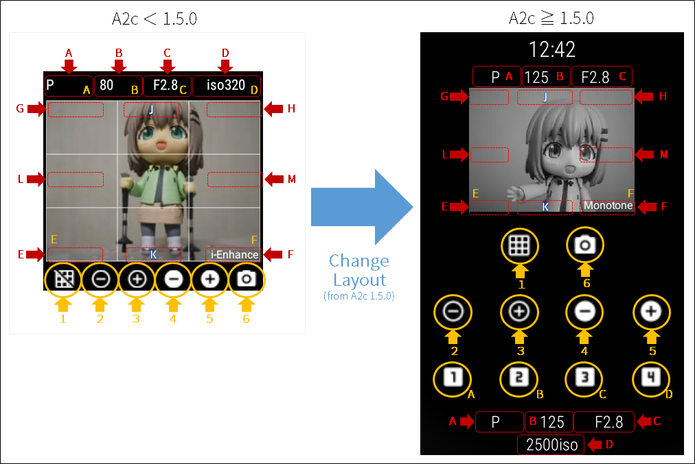

# A01c : OlympusAir / RICOH THETA用撮影アプリケーション、Wear OS で撮影するぞ版

--------------------------------------------------------

## 概要

A01c は、 [Olympus Camera Kit](https://opc.olympus-imaging.com/sdkdocs)を使用した OLYMPUS AIR / RICOH THETA用の WearOS (A(ndroid Wear) スタンドアロン撮影アプリケーションです。カメラとはWi-Fi経由で接続します。
[オープンプラットフォームカメラ OLYMPUS AIR A01](https://olympus-imaging.jp/product/opc/a01/) および [RICOH THETAシリーズ](https://theta360.com/ja/)に対応しています。

Wear OS のWi-Fi接続可能なスマートウォッチで動作し、 [SONY SmartWatch3 SWR50](http://www.sonymobile.co.jp/product/smartproducts/swr50/) といったスクウェアタイプ、[LG G Watch R](https://store.google.com/product/lg_g_watch_r) のようなラウンドタイプ、どちらでも動作します。

バージョン 1.4.0 からは、RICOH THETAシリーズの撮影にも対応しました。(THETAシリーズの操作説明は、ページの後方にありますので参照ください。)
バージョン 1.5.0 では、Wear OS 3.0以降のスマートウォッチに対応するとともに、画面レイアウトを大幅に見直して操作性を向上させました。

--------------------------------------------------------

## インストール

通常のアプリケーションと同様に、Google Playから A01cをインストールしてください。（以下のリンクからたどれます。）

* [https://play.google.com/store/apps/details?id=jp.sfjp.gokigen.a01c](https://play.google.com/store/apps/details?id=jp.sfjp.gokigen.a01c)

--------------------------------------------------------

## ご利用の前に

本アプリケーションは、スマートウォッチ(Wear OS機)とOlypus Airや Ricoh THETAとのWi-Fi接続されていることを前提に動作します。とにかくデジタルカメラとスマートウォッチを無線で接続している状態にしてください。
Olympus Air や THETAの電源を入れたのち、時計側で 設定 > Wi-Fi を開いて接続の確認をお願いします。なお、時計側で優先接続する設定となっていれば、5～10秒待つと、カメラの電源が青から緑に変わりWi-Fiの接続が完了するようです。(THETAの場合は Wifiマークが点滅から点灯に代わります。)
なお、スマートフォンとBluetoothで接続している状態では、Wi-Fi接続が継続できない機種もあるようですのでご注意ください。その場合には、ご使用の前にスマートフォンとペア設定を切る、またはスマートフォン側のBluetoothをOFFにしておいた方が良いかもしれません。

スマートウォッチの動作確認は、エミュレータ以外、主に以下の機種で行っています。

* [Google Pixel Watch](https://store.google.com/product/google_pixel_watch?hl=ja)
* [Mobvoi TicWatch E3](https://www.mobvoi.com/jp/pages/ticwatche3)

--------------------------------------------------------

## A01cの起動から撮影、終了まで

A01cのアイコンを押してアプリを起動すると、初期画面が表示されたのち、すでにデジタルカメラとの接続が終わっている場合にはカメラのライブビュー画像が表示されます。
画面がライブビュー画像ではなく、「高尾山のムササビ像（OPCモード時）」または「鎌倉大仏像（THETAモード時）」表示の場合は、画面下部のボタンのどれかを押すと、AndroidのWi-Fi設定画面に切り替えますので、デジタルカメラとの接続を行ってください。
Wi-Fi設定画面を抜けると、A01cに戻ります。**A01cに戻ってきた後は、画面真ん中（画像が表示されているエリア）をタッチしてみてください。** カメラに再接続を行います。

カメラとうまく接続できた場合は、ライブビュー画面になります。

ライブビュー画面で、画像が表示されているエリアをタッチすると、タッチしたところに四角形を表示し、その場所にピントを合わせます。ピントが合った場合には緑色でピントが合った場所を示します。ピントが合わなかった場合は、黄色でしばらく表示したのち四角形が消えます。

ピントが合った後は、右下の「カメラ」アイコン部分をタッチすると、画像を撮影します。撮影すると、バイブレーションと「撮影」表示でお知らせします。

動画モードのときは、画面上部中央に「●REC表示」を行い、動画撮影中を示します。右下の「カメラ」アイコン部分をタッチすると、撮影を終了します。

A01cを右スワイプなどで終了させると、A01cの終了とともにカメラの電源を切ります。（RICOH THETAはカメラの電源を切ることができません。ご了承ください。）

--------------------------------------------------------

## Olympus Air(OPC)モード と THETAモードの切り替え

Olympus Airに接続するときと、THETAに接続するときとで、あらかじめ接続モードを合わせる必要があります。Olympus Airに接続するときには、OPCモード、THETAに接続するときにはTHETAモードに変更してください。
現在の接続モードはA01cの起動直後に表示する画像で判断することができます。OPCモード時は高尾山のムササビ像、THETAモード時は鎌倉大仏像です。
**A01cの起動直後、カメラと接続する前に、**ボタンDを長押しすることで、モード切替を行うかどうかの確認を求めるダイアログを表示します。接続モードを切り替える場合には、「OK」を押してください。

--------------------------------------------------------

## 操作説明(OLYMPUS AIR)

A01cは、12個のボタンと12個の表示エリアを持ちます。バージョン1.5.0から、操作性向上のためレイアウトを見直しました。
（ボタンサイズを大きくした代わりに、画面スクロールが必要となりましたのでご注意ください。）

以下にA01cの画面レイアウトを示します。
（※注※ 本ページのスクリーンショットの中には、古いレイアウトの画像も一部残っていますが、ボタンや表示エリアの対応は以下の記号を参照してください。）

ボタンは、撮影モードにより動作する機能が切り替わります。また、クリックと長押しで機能が変わります。（撮影モードは、ボタンAのクリックによって切り替わります。）

### ボタン操作一覧

※ エリアE と エリアF は、ライブビュー画面のAF駆動範囲外の領域です。文字が表示されている場所とは若干違いますので、ご注意ください。

### ボタンクリック時の機能

|**撮影モード**|**ボタン１**|**ボタン２**|**ボタン３**|**ボタン４**|**ボタン５**|**ボタン６**|**エリアA**|**エリアB**|**エリアC**|**エリアD**|**エリアE**|**エリアF**|
|--|--|--|--|--|--|--|--|--|--|--|--|--|
|**iAuto**|グリッド表示/非表示|ズームアウト(パワーズームレンズ装着時)|ズームイン(パワーズームレンズ装着時)|デジタルズームアウト|デジタルズームイン|シャッター(撮影)|Pへ切替|お気に入り設定（読込/保存）|AEロック/解除|-|ライブビュー拡大(5倍)|シャッター(撮影)|
|**P**|グリッド表示/非表示|仕上がり・ピクチャーモード(-)|仕上がり・ピクチャーモード(+)|露出補正(-)|露出補正(+)|シャッター(撮影)|Aへ切替|お気に入り設定（読込/保存）|AEロック/解除|-|ライブビュー拡大(7倍)|シャッター(撮影)|
|**A**|グリッド表示/非表示|絞り値(-)|絞り値(+)|露出補正(-)|露出補正(+)|シャッター(撮影)|Sへ切替|お気に入り設定（読込/保存）|AEロック/解除|-|ライブビュー拡大(7倍)|シャッター(撮影)|
|**S**|グリッド表示/非表示|シャッター速度(-)|シャッター速度(+)|露出補正(-)|露出補正(+)|シャッター(撮影)|Mへ切替|お気に入り設定（読込/保存）|AEロック/解除|-|ライブビュー拡大(7倍)|シャッター(撮影)|
|**M**|グリッド表示/非表示|シャッター速度(-)|シャッター速度(+)|絞り値(-)|絞り値(+)|シャッター(撮影)|ARTへ切替|お気に入り設定（読込/保存）|AEロック/解除|-|ライブビュー拡大(14倍)|シャッター(撮影)|
|**ART**|グリッド表示/非表示|アートフィルター(-)|アートフィルター(+)|露出補正(-)|露出補正(+)|シャッター(撮影)|Movieへ切替|お気に入り設定（読込/保存）|AEロック/解除|-|ライブビュー拡大(10倍)|シャッター(撮影)|
|**Movie**|グリッド表示/非表示|仕上がり・ピクチャーモード(-)|仕上がり・ピクチャーモード(+)|露出補正(-)|露出補正(+)|動画の撮影開始/終了|iAutoへ切替|お気に入り設定（読込/保存）|AEロック/解除|-|動画の撮影開始/終了|動画の撮影開始/終了|

### ボタン長押し時の機能

|**撮影モード**|**ボタン１**|**ボタン２**|**ボタン３**|**ボタン４**|**ボタン５**|**ボタン６**|**エリアA**|**エリアB**|**エリアC**|**エリアD**|
|--|--|--|--|--|--|--|--|--|--|--|
|**iAuto**|デジタル水準器 表示/非表示|ズームアウト1.5倍 (パワーズームレンズ装着時)|ズームイン1.5倍(パワーズームレンズ装着時)|デジタルズーム リセット|デジタルズーム|タイマー撮影(5秒)|Movieへ切替|お気に入り設定（読込/保存）|測光モード切替|-|
|**P**|デジタル水準器 表示/非表示|ホワイトバランス(-)|ホワイトバランス(+)|ISO設定(-)|ISO設定(+)|露出ブラケット(5枚)|iAuotへ切替|お気に入り設定（読込/保存）|測光モード切替|-|
|**A**|デジタル水準器 表示/非表示|ホワイトバランス(-)|ホワイトバランス(+)|ISO設定(-)|ISO設定(+)|絞りブラケット(5枚)|Pへ切替|お気に入り設定（読込/保存）|測光モード切替|-|
|**S**|デジタル水準器 表示/非表示|ホワイトバランス(-)|ホワイトバランス(+)|ISO設定(-)|ISO設定(+)|シャッターブラケット(5枚)|Aへ切替|お気に入り設定（読込/保存）|測光モード切替|-|
|**M**|デジタル水準器 表示/非表示|ホワイトバランス(-)|ホワイトバランス(+)|ISO設定(-)|ISO設定(+)|ホワイトバランスブラケット|Sへ切替|お気に入り設定（読込/保存）|測光モード切替|-|
|**ART**|デジタル水準器 表示/非表示|ホワイトバランス(-)|ホワイトバランス(+)|ISO設定(-)|ISO設定(+)|アートフィルターブラケット|Mへ切替|お気に入り設定（読込/保存）|測光モード切替|-|
|**Movie**|デジタル水準器 表示/非表示|ホワイトバランス(-)|ホワイトバランス(+)|露出補正(-)|露出補正(+)|動画の撮影開始/終了|ARTへ切替|お気に入り設定（読込/保存）|測光モード切替|-|

### 表示エリアについて

|**撮影モード**|**エリアA**|**エリアB**|**エリアC**|**エリアD**|**エリアE**|**エリアF**|**エリアG**|**エリアH**|**エリアJ**|**エリアK**|
|--|--|--|--|--|--|--|--|--|--|--|
|**iAuto**|iAuto|シャッター速度|絞り値|ISO感度|-|-|ホワイトバランス|警告表示|-|AE-LOCK|
|**P**|P|シャッター速度|絞り値|ISO感度|露出補正値|仕上がり・ピクチャーモード|ホワイトバランス|警告表示|測光モード|AE-LOCK|
|**A**|A|シャッター速度|絞り値|ISO感度|露出補正値|-|ホワイトバランス|警告表示|測光モード|AE-LOCK|
|**S**|S|シャッター速度|絞り値|ISO感度|露出補正値|-|ホワイトバランス|警告表示|測光モード|AE-LOCK|
|**M**|M|シャッター速度|絞り値|ISO感度|(露出補正値)|-|ホワイトバランス|警告表示|測光モード|AE-LOCK|
|**ART**|ART|シャッター速度|絞り値|ISO感度|露出補正値|アートフィルター|ホワイトバランス|警告表示|測光モード|AE-LOCK|
|**Movie**|Movie|(シャッター速度)|(絞り値)|(ISO感度)|露出補正値|仕上がり・ピクチャーモード|ホワイトバランス|警告表示|録画中表示|-|

### 表示内容について

モード類の説明は、OPCのOlympus Camera Kitのサイトから該当する説明を引用させていただきました。ありがとうございます。

#### 撮影モード

* **iAuto**
  * iAutoモード : カメラが撮影シーンを判定し自動的に適切な設定にする露出モードです
* **P**
  * プログラム(P)モード : 被写体の明るさに応じて、最適な絞り値とシャッター速度をカメラが自動的に設定する露出モードです
* **A**
  * 絞り優先(A)モード : 絞り値を設定するとカメラが適正なシャッター速度を自動的に設定する露出モードです
* **S**
  * シャッター速度優先(S)モード : シャッター速度を設定するとカメラが適正な絞り値を自動的に設定する露出モードです
* **M**
  * マニュアル(M)モード : 絞り値とシャッター速度を自分で設定する露出モードです
* **ART**
  * アートフィルターモード : おしゃれで個性的な写真が簡単に撮れる、オリンパスならではのフィルター処理を実現するモードです
* **Movie**
  * 動画モード : 動画を撮影するモードです

#### ISO感度

ISOの感度を表示します。小文字のiso と表示されているときは、ISO-Aでカメラが自動設定したISO感度で、大文字のISOのときは、個別設定したISO感度です。

#### 測光モード

* **表示なし**
  * デジタルESP測光 : 画面を324分割測光し、撮影シーンや顔などを考慮し最適な露出値を演算します。
* **Ctr-Weighted**
  * 中央重点平均測光 : 画面の中央部に重点を置いて、画面全域を平均測光します。
* **Spot**
  * スポット測光 : 狭い範囲（画面の約2％）の明るさを測光するときに使います。測光した箇所が適正な明るさになります。(デフォルトの)測光ポイントは画面中央です。

#### ホワイトバランス

* **表示なし**
  * オートホワイトバランスで、一般的なほとんどの撮影シーン（画面内に 白に近い色が存在する撮影シーン）に最適です。
* **Daylight**
  * 晴天の日に屋外で撮るとき、夕焼けを赤く撮るとき、花火を撮るときに最適なプリセットホワイトバランス設定です。色温度は5300Kです。
* **Shade**
  * 晴天の日に屋外の日陰で撮るときに最適なプリセットホワイトバランス設定です。色温度は7500Kです。
* **Cloudy**
  * 曇天の日に屋外で撮るときに最適なプリセットホワイトバランス設定です。色温度は6000Kです。
* **Tungsten Light**
  * 電球に照らされている被写体を撮るときに最適なプリセットホワイトバランス設定です。色温度は3000Kです。
* **Fluorescent Light**
  * 蛍光灯に照らされている被写体を撮るときに最適なプリセットホワイトバランス設定です。色温度は4000Kです。
* **Underwater**
  * 水中で撮るときに最適なプリセットホワイトバランス設定です。色温度は5500Kです。
* **Custom WB**
  * カスタムホワイトバランス設定です。デフォルトの色温度は5400Kです。

#### 仕上がり・ピクチャーモード

以下が選択可能です。設定は P モードのときにボタンがあり変更が可能ですが、設定した内容は、M, A, S モードでも有効になります。

* **i-Enhance**
  * i-Finishで、撮影シーンに合った印象的な仕上がりになります。
* **Vivid**
  * Vivid で、色鮮やかに仕上げます。
* **Natural**
  * NATURAL で、自然な色合いに仕上げます。
* **Muted**
  * FLAT で、素材性を重視した仕上がりになります。
* **Portrait**
  * Portrait で、肌色をきれいに仕上げます。
* **Monotone**
  * モノトーンで、モノクロ調に仕上げます。
* **e-Portrait**
  * eポートレートで、肌をなめらかに整えます。
* **Color Creator**
  * カラークリエーターの色相と彩度が適用されます。
* **Pop Art**
  * アートフィルターのポップアートが適用されます。
* **Soft Focus**
  * アートフィルターのファンタジックフォーカスが適用されます。
* **Pale&Light Color**
  * アートフィルターのデイドリームが適用されます。
* **Light Tone**
  * アートフィルターのライトトーンが適用されます。
* **Grainy File**
  * アートフィルターのラフモノクロームが適用されます。
* **Pin Hole**
  * アートフィルターのトイフォトが適用されます。
* **Diorama**
  * アートフィルターのジオラマが適用されます。
* **Cross Process**
  * アートフィルターのクロスプロセスが適用されます。
* **Gentle Sepia**
  * アートフィルターのジェントルセピアが適用されます。
* **Dramatic Tone**
  * アートフィルターのドラマチックトーンが適用されます。
* **Key Line**
  * アートフィルターのリーニュ　クレールが適用されます。
* **Watercolor**
  * アートフィルターのウォーターカラーが適用されます。
* **Vintage**
  * アートフィルターのヴィンテージが適用されます。
* **Partcolor**
  * アートフィルターのパートカラーが適用されます。

#### アートフィルター

* **Pop Art**
  * ポップアート : 色をカラフルで印象的に強調し、まさにポップ・アート感覚な作風に仕上げます。
* **Soft Focus**
  * ファンタジックフォーカス : 柔らかいトーンの中で空気感を表現。美しく幻想的な作風に仕上げます。
* **Pale&Light Color**
  * デイドリーム : 優しい光につつまれた心地よい浮遊感を表現。記憶の中の風景を写すような作風に仕上げます。
* **Light Tone**
  * ライトトーン : シャドー部もハイライト部も柔らかく描写。上質で落ち着いた作風に仕上げます。
* **Grainy File**
  * ラフモノクローム : モノクロ写真ならではの力強さ、荒々しさを表現。テーマをより強調した作風に仕上げます。
* **Pin Hole**
  * トイフォト : トイカメラで撮ったように周辺光量をあえて落として、独特な色合いの作風に仕上げます。
* **Diorama**
  * ジオラマ : ピントの急激な変化により距離感を惑わせ、さらに発色とコントラストを強調することで、あたかもミニチュアの世界のような雰囲気を表現します。
* **Cross Process**
  * クロスプロセス : 不安定で非現実的な雰囲気を表現します。シアンを強調した仕上がりになります。
* **Gentle Sepia**
  * ジェントルセピア : 全体的に柔らかい描写で、落ち着いた雰囲気の中にもシャドー部が引き締まった、しっとりとした上品な作風に仕上げます。
* **Dramatic Tone**
  * ドラマチックトーン : ドラマチックな階調表現で、局所的なコントラスト変化から作り出される現実ではありえないような明暗によって実際の空間をフィクションのような作風に仕上げます。
* **Key Line**
  * リーニュ　クレール : エッジラインを強調し、イラストテイストを写真に付加します。
* **Watercolor**
  * ウォーターカラー : 暗部を大胆に削除し、白いキャンパスに淡く明るい色彩をなじませ、さらにやわらかい輪郭線を載せて、　ほんわりとした明るい雰囲気の世界を表現します。
* **Vintage**
  * ヴィンテージ : ヴィンテージフィルムプリントの変色や退色など、日常のひとコマをノスタルジックなヴィンテージ調に表現します。プリントの経年変化のような変色効果でビンテージ調の作風に仕上げます。
* **Partcolor**
  * パートカラー : 強調したい色を抽出し、それ以外はモノトーンに抑えることで、被写体を印象的に表現します。選択色を中心とした自然なグラデーションで色を残し、被写体を際立たせます。
* **ART BKT**
  * アートフィルターブラケット : アートフィルター ブラケット撮影を行います。

#### デジタル水準器

A01c 1.1.0から、デジタル水準器機能を搭載しました。 **ボタン１** （一番左下のボタン、グリッド表示のON/OFFを切り替えるボタンです）を長押しすることで、ON/OFFを切り替えることができます。グリッド表示のON/OFFとボタンは兼用していますが、それぞれ独立して設定することができます。
ライブビュー画像の右端に表示されている線が垂直線、中心から伸びている線が水平線です。カメラが水平に近くなるとバイブレーションでお知らせします。

#### タイマー撮影

撮影モードが **iAuto** のときにシャッターボタンを長押しすると、5秒待った後に撮影を行います。 5秒待つ間は、画面上に撮影までの時間をカウントダウンでお知らせします。

#### ブラケット撮影

撮影モードが **P** , **A** , **S** , **M** , **ART** のときにシャッターボタンを長押しすると、ブラケッティング撮影という、すこしずつ撮影条件を変化させて複数枚撮影する動作を行います。
画面上にブラケッティング動作中および撮影枚数（何枚撮影する中の何枚目か）を表示しお知らせします。

撮影モードにより、動作する内容が異なります。

* **P** : **露出ブラケット**
  * 露出を変化させます。現在の露出設定値から、２段階下げた(-2/3)値から撮影を開始し、最終的には２段階あげた(+2/3)値まで、合計５枚撮影します。
* **A** : **絞りブラケット**
  * 絞り値を変化させます。現在の絞り設定値から、2つ開放よりの値から合計５枚撮影します。
* **S** : **シャッターブラケット**
  * シャッター速度を変化させます。現在のシャッター速度設定値から、2つ遅い値から合計５枚撮影します。
* **M** : **ホワイトバランスブラケット**
  * ホワイトバランスを変化して撮影します。
* **ART** : **アートフィルターブラケット**
  * すべてのアートフィルターで撮影します。撮影枚数がかなり多いのでご注意ください。

### お気に入り撮影設定の保存と読み込み

A01c 1.2.3 から、お気に入り撮影設定（最大５種類）の保存と読み込みができるようになりました。
AREA B を押すと「お気に入り設定」の選択表示を行いますので、撮影モードやシャッタースピード、絞り値など、お気に入りの撮影条件を設定した状態で１～５のどれかに保存し、
その撮影条件が必要になった時に「読込」でカメラに撮影条件を反映させてください。（撮影条件の設定には、すこし時間がかかります。ごめんなさい。）

### ライブビュー画面の拡大

A01c 1.3.0 から、ライブビュー画面左下のAF範囲外の領域をタッチすると、ライブビュー画面の拡大ができるようになりました。
タッチするとライブビュー中心部の表示領域を拡大し、もう一度タッチすると元に戻ります。

なお、撮影モードにより拡大倍率が異なります。

* **P** : **5倍**
* **A** : **7倍**
* **S** : **7倍**
* **M** : **14倍**
* **ART** : **10倍**

### アプリ起動時：撮影モード等の設定 ([OA.Central](http://app.olympus-imaging.com/oacentral/ja/)の使用) ==

A01cの撮影モードは、起動時はカメラの初期設定を利用します。設定変更は [OA.Central(http://app.olympus-imaging.com/oacentral/ja/) で設定をお願いします。

#### OA.Centralの起動

OA.Centralを起動し、カメラに接続した後、設定画面を開いてください。

#### 一般撮影設定

一般撮影設定では、写真画質モード、スリープ時間、操作音を設定できます。

#### スタンドアロン撮影設定

スタンドアロン撮影設定では、撮影モード（iAuto, P, Movie）、アスペクト比、撮影時にRAW画像の保存有無を設定できます。
撮影モードを **P** に設定したときには、ピクチャーモード、ホワイトバランス、ISO感度が追加で設定可能です。

### 接続について

Wi-Fi接続の設定を通常通り行ってください。なお、OLYMPUS AIR A01のWi-Fiパスワードは、裏蓋を開けたところに記載がありますので、この値を設定してください。

--------------------------------------------------------

## 操作説明(RICOH THETAシリーズ)

A01cは、画面下部に６つのボタン、画面上部に４つ、ライブビュー内に5つの表示エリアがあります。画面上部にある4つの表示エリアは、ボタンを兼ねています。つまり、A01cには、10個のボタンと9個の表示エリアがあります。

ボタンは、撮影モード(imageモード / videoモード)により動作する機能が切り替わります。また、クリックと長押しで機能が変わります。
（撮影モードは、表示エリアAをタッチすることで切り替わります。）

### ボタン操作一覧

### imageモード時のボタン操作

|**操作**|**ボタン１**|**ボタン２**|**ボタン３**|**ボタン４**|**ボタン５**|**ボタン６**|**エリアA**|**エリアB**|**エリアC**|**エリアD**|
|--|--|--|--|--|--|--|--|--|--|--|
|**クリック**|グリッド表示/非表示|ホワイトバランス(-)|ホワイトバランス(+)|露出補正(-)|露出補正(+)|シャッター(撮影)|videoへ切替|撮影プログラム変更|フィルター変更|-|
|**長押し**|-|シャッター速度(-)|シャッター速度(+)|ISO設定(-)|ISO設定(+)|インターバル撮影(開始・終了)|videoへ切替|撮影プログラム変更|フィルター変更|-|

### videoモード時のボタン操作

|**操作**|**ボタン１**|**ボタン２**|**ボタン３**|**ボタン４**|**ボタン５**|**ボタン６**|**エリアA**|**エリアB**|**エリアC**|**エリアD**|
|--|--|--|--|--|--|--|--|--|--|--|
|**クリック**|グリッド表示/非表示|ホワイトバランス(-)|ホワイトバランス(+)|露出補正(-)|露出補正(+)|動画撮影(開始・終了)|imageへ切替|撮影プログラム変更|フィルター変更|ISO設定|
|**長押し**|-|シャッター速度(-)|シャッター速度(+)|露出補正(-)|露出補正(+)|動画撮影(開始・終了)|imageへ切替|撮影プログラム変更|フィルター変更|ISO設定|

### 表示内容について

#### 撮影モード

THETAには imageモード(静止画撮影モード)と videoモード(動画撮影モード)があります。現在のモードは、エリアAに表示します。
エリアAをクリックすることで、imageモードとvideoモードが切り替わります。

#### 撮影・インターバル撮影

シャッターボタンを押すと、撮影します。撮影には少し時間がかかりますので、画像保存が終了するまでしばらくお待ちください。撮影・保存が完了すると、バイブレーションと画面表示でお知らせします。
imageモードでシャッターボタンを長押しすると、インターバル撮影モードとなります。インターバル撮影時には画面上部に "INTERVAL" と表示し、インターバル撮影動作中であることを示します。もう一度シャッターボタンを長押しすると、インターバルモードが終了します。
videoモードでシャッターボタンを押すと、動画記録を開始します。動画記録を開始すると画面上部に "●REC" と表示し、動画記録中であることを示します。もう一度シャッターボタンを押すと、動画記録を終了します。

#### 露出制御プログラム

エリアBにを表示します。露出制御プログラムは、以下が設定可能で、標準は Normalです。エリアBを押すと Normal > Shutter > ISO > Aperture > Manual の順に切り替わります。
なお、Apertureは THETA Zのみ設定可能です。サポートしていない機種では、ISOモードのままとなりますのでご注意ください。

* Normal   : プログラムAE
* Shutter  : シャッター速度優先AE
* ISO      : ISO感度優先AE
* Manual   : マニュアル露出
* Aperture : 絞り優先AE (THETA Zのみ)

#### フィルター

imageモードのとき、エリアCを押すことでフィルターを設定することができます。 DR Comp > Noise Reduction > hdr > Hh hdr の順に切り替わります。
なお、Hh hdr は、 THETA Z, Vのみ設定可能です。サポートしていない機種では、hdrモードのままとなりますので、ご注意ください。
また、フィルターを設定したときには、自動的に露出制御プログラムが Normal(プログラムAE)に設定されますのでご注意ください。
フィルター設定は以下の種類があります。フィルター設定時は、画面左上部に設定を表示します。 DR Comp > Noise Reduction > hdr > Hh hdr の順に切り替わります。

* DR Comp : DR補正
* Noise Reduction : ノイズ提言
* hdr : HDR
* Hh hdr : Handheld HDR (THETA Z, Vのみ対応)

#### 露出補正

ボタン4とボタン5で、露出を -2.0 ～ +2.0の間で 0.3 単位で上下させることができます。現在の設定は、画面左下に表示します。

#### ホワイトバランス

ボタン２とボタン３で、ホワイトバランスの変更ができます。現在の設定は、画面右上に表示します。オート設定時には、設定情報を表示しません。

* daylight : 屋外
* shade    : 日陰
* cloudy-daylight : 曇天
* incandescent : 白熱灯1
* _warmWhiteFluorescent : 白熱灯1
* _dayLightFluorescent : 昼光色蛍光灯
* _dayWhiteFluorescent : 昼白色蛍光灯
* fluorescent : 白色蛍光灯
* _bulbFluorescent : 電球色蛍光灯
* _colorTemperature : 色温度
* _underwater : 水中

#### ISO設定

露出制御プログラムが ISO感度優先AE、もしくはマニュアル露出の場合に設定可能です。imageモードとvideoモードで設定変更のボタンが違いますのでご注意ください。

#### シャッター速度

露出制御プログラムがシャッター速度優先AE、もしくはマニュアル露出の場合に設定可能です。 1/25000 ～ 60s の設定が可能です。ただし、カメラによっては設定ができ速度がありますので、ご注意ください。

--------------------------------------------------------

## その他

### 注意事項（制約事項）

A01cは撮影に特化しています。プレビュー画像も表示しません。撮影画像の参照は、お手数ですが他アプリをご利用ください。

### ボタンタッチしたのに反応しない場合

A01cは、画面サイズの制約から、ボタンや操作エリアをかなり小さく設定しています。そのため、操作の仕方やタップエリアのずれにより反応しない場合があります。
特に、円形型のスマートウォッチの場合、円の内部の正方形エリアを有効化して利用しているため、タッチの位置がシビアになっています。すみません。

もし操作ができない、などがありましたら、お手数ですが「開発者向けオプション」で『タップを表示』を有効に切り替えて、タッチ位置の確認をお願いします。

### permissionについて

A01c は、次のパーミッションを指定し使用しています。

* android.permission.ACCESS_NETWORK_STATE
* android.permission.ACCESS_WIFI_STATE
* android.permission.CHANGE_WIFI_STATE
* android.permission.CHANGE_NETWORK_STATE
* android.permission.WRITE_SETTINGS
* android.permission.WAKE_LOCK
* android.permission.VIBRATE
* android.permission.INTERNET

### ソースコード

A01c は、オープンソースです。以下からソースコードを参照することができます。ご利用はご自由にどうぞ。

* [https://github.com/MRSa/A01c.git](https://github.com/MRSa/A01c.git)

### 動作確認機種

A01c は、以下のカメラとの接続で動作確認を行っています。

* Olympus Air A01
* RICOH THETA S
* RICOH THETA V

以上
