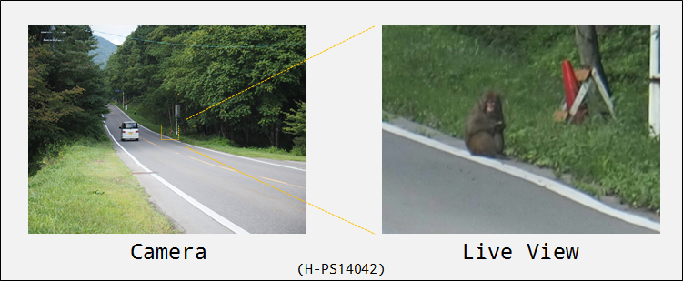

# A01d : OlympusAir用撮影アプリケーション、OlympusAirを望遠鏡として使ってみたら

--------------------------------

## 概要

A01dは、ライブビュー拡大表示機能を利用した望遠鏡アプリケーションです。 Olympus Camera Kitを使用したオープンプラットフォームカメラ OLYMPUS AIR A01 に対応しています。
最近の版では、SONY, RICOH/PENTAX, FUJIFILX X, PANASONIC, KODAX PIXPRO, Canon, NIKONといった、各メーカーのWIFI接続カメラの制御に対応しました。ただし、撮影の制御は、OLYMPUS AIR と比較し操作の制約がありますのでご了承ください。
Olympus Airでは、ライブビューの拡大機能を使うことで、カメラで撮影するときのサイズから最大14倍のサイズで表示させることができます。画像は粗くなるとはいえ、**その場で見る** だけであれば、遠くの様子を観察することができます。
1.8.0 から、タイムシフトと呼べる、画像の内部に溜め、表示を少し遅らせて表示させる機能を搭載しました。これにより、数秒前の撮影時動作を確認する、ということができるようになりました。

a01dは、画面中央部をライブビューの拡大を行い、遠くの様子を観察するためのアプリです。撮影機能も持っていますが、基本的には「遠くのモノを見る」ためのアプリケーションです。使用できる機能は絞っています。
最近は、搭載している機能を絞っているがゆえに、多メーカー（Sony, Ricoh, Fuji）のカメラ制御を実験する性質をもっています。
以下に、A01d が持つ機能の概要を示します。

--------------------------------

* Olympus Air、接続したカメラでの画像撮影
  * ライブビューでスマートフォンの画面に表示している画像の同時保存
* ライブビュー画面の拡大、デジタルズーム有効化
* ライブビュー画面にグリッド（補助線）表示・非表示
* マニュアルフォーカス切り替え
* Olympus Airの全プロパティ値の確認・設定 (設定可能な値のみ)
* ズームイン・ズームアウト (電動ズーム機能搭載レンズの場合のみ)
* お気に入り撮影条件の記憶と呼び出し
* カメラとの無線接続（切断・接続）
* Bluetooth Smart経由でのカメラ電源ON (Android Ver.4.4(KitKat)以上で有効)
* SONY Camera Remote API に対応したカメラの制御 (1.1.0 以降)
* RICOH GR IIの制御(1.2.0 以降)
* RICOH GR IIIの制御(1.3.0 以降)
* PENTAX一眼レフの制御(1.3.0 以降)
* FUJI Xシリーズミラーレスカメラの制御(1.3.0 以降)
* Panasonic製カメラの制御(1.4.0 以降)
* RICOH THETAシリーズカメラ(THETA S以降)の制御(1.5.0 以降)
* OLYMPUS PEN(たぶん OM-Dも含む)シリーズカメラの制御(1.5.0 以降)
* Canon製カメラの制御(1.6.0 以降)
* Nikon製カメラの制御(1.7.0 以降)
* ライブビュー画像の遅延表示に対応(1.8.0 以降)
* JK Imaging製 KODAK PIXPRO WPZ2カメラの制御(1.9.0 以降)

--------------------------------

## インストール

通常のアプリケーションと同様に、Google Playから A01dをインストールしてください。（以下のリンクからたどれます。）

* [https://play.google.com/store/apps/details?id=net.osdn.gokigen.a01d](https://play.google.com/store/apps/details?id=net.osdn.gokigen.a01d)

--------------------------------

## 基本操作

a01dを起動し、カメラと接続するとライブビューの画面が表示されていますので、**Live view Magnification Button** を押して、表示しているライブビューの倍率を変更してお楽しみください。
表示倍率は、ボタンを押すごとに 1倍 → 5倍 → 7倍 → 10倍 → 14倍 → 1倍 → 5倍 → ... と切り替わります。
一応、シャッターボタンがありますので、撮影することもできます。

--------------------------------

## ご利用の前に

a01dとカメラとは、事前にWIFI接続していることを前提としています。
もし、ほかのWiFiに接続していた場合には、接続エラーが発生しますので、下記のように一度WiFi設定画面を開き、カメラに接続するよう設定変更をお願いします。
a01d 1.5.0からは、設定画面に「WIFI設定」メニューがあり、そこからWIFI設定画面を開くことが可能となっています。

なお、左下の **雲** マークは、カメラとの接続状態を示します。

* **Disconnected**
  * カメラと切断した状態です。この状態でボタンを押すと、接続中状態になります。
* **Connecting**
  * カメラに接続中の状態です。接続が成功すると、CONNECTEDに遷移します。接続に失敗するとエラー表示しますので、お手数ですが、WiFi設定画面で設定を見直してください。
* **Connected**
  * カメラと接続した状態で、a01dの通常状態です。この状態でボタンを押すと、切断状態になります。'

### 接続方式について

a01dは、事前にカメラの種類に合わせて、接続方式を変更する必要があります。また、接続方式を変更したあと、一度a01dを終了させて再起動させてください。

* **OPC (Olympus Air)**
  * Olympus Air A01などの OPCカメラに接続する場合に指定してください。
* **Olympus Pen/OM-D**
  * OLYMPUS PEN や OM-Dシリーズなど、Olympus製カメラに接続する場合に指定してください。
* **Sony**
  * SONY Camera Remote APIをサポートするカメラに接続する場合に指定してください。
* **Ricoh GR Series / PENTAX**
  * リコー製 GR II/GR III/ PENTAXブランドの一眼レフカメラに接続する場合に指定してください。
* **Ricoh THETA Series**
  * リコー製 THETAシリーズ(S以降のOSC/Open Spherical Camera API対応)カメラに接続する場合に指定してください。
* **Fuji X Series**
  * Fujifilm製 Xシリーズのカメラに接続する場合に指定してください。
* **Panasonic**
  * Panasonic製カメラに接続する場合に指定してください。
* **KODAK PIXPRO WPZ2**
  * JK Imaging製 KODAK PIXPRO WPZ2に接続する場合に指定してください。
* **Canon**
  * Canon製カメラに接続する場合に指定してください。
* **NIKON**
  * Nikon製カメラに接続する場合に指定してください。

--------------------------------

## 画面遷移

a01dを起動すると、接続方式で指定したカメラにWiFi接続を行います。接続完了後、ライブビューの表示がリアルタイムで更新するようになります。

--------------------------------

## メイン画面について

SONY Camera Remote API対応カメラ、Ricoh GR IIの場合には、すこし操作に制約があります。

### Live view screen

カメラ画像をリアルタイムに表示します。（オートフォーカスを設定している場合）画面をタッチするとその場所にピントを合わせようとします。緑色の枠が表示されると合焦した状態、黄色はピント合わせ失敗、赤色はピント合わせができない領域にタッチされたことを示します。

### Connect Button

カメラとの接続・切断を行うボタンです。通常、接続状態になっているときには押す必要はありませんが、切断状態のままとなっている場合に押してカメラと接続を行ってください。カメラの機種によっては、カメラ側の無線を再度設定する必要があります。

### Camera Connection Status

カメラとの接続状態を文字で表示します。通常は「接続済」と表示します。

### Grid ON/OFF Button

ライブビュー画面のグリッド表示を行うかどうかを切り替えるボタンです。１回タッチするとグリッド表示を行い、もう一度タッチすると、グリッド表示を行わなくなります。

### Favorite Properties Button

ボタンを押すと、お気に入りプロパティ設定ダイアログを表示します。詳細は後述する お気に入りプロパティ設定 保存・呼び出しについて を参照してください。
（FUJI X シリーズの場合は、カメラのステータス一覧ダイアログを表示します。）

### Camera Properties Button

ボタンを押すと、接続方式がOlympus Airの場合には画面をカメラプロパティ一覧表示画面に切り替えます。詳細は後述する カメラプロパティの一覧確認・変更について を参照してください。
その他の接続方式（OLYMPUS, Sony, RICOH, Theta, Fuji X, Panasonic, Canon）の場合には、カメラに対してコマンドを送信するためのダイアログを表示します。

### a01d Settings Button

ボタンを押すと、画面をa01d 設定画面に切り替えます。詳細は後述する a01d 設定画面について を参照してください。

### MF/AF Change Button

ボタンを押すと、ピント合わせをマニュアルフォーカスにするか、オートフォーカスにするかを切り替えます。

### Live view Magnification Button

ボタンを押すと、ライブビューを 1倍 → 5倍 → 7倍 → 10倍 → 14倍 → 1倍 → 5倍 → ... と表示倍率を切り替えます。
なお、ライブビューの拡大場所は、画面の中心部分です。

### Shutter Button

ボタンを押すと、画像を撮影します。カメラでの撮影と同時に、表示しているライブビューの画像も同時に保存します。ライブビューの画像を保存しないようにすることもできます。 詳細は、後述する ライブビュー画像も同時に撮影 を確認ください。

### Zoom in / Zoom out ボタン

電動ズームレンズ装着時のみ表示されます。ボタンを押すと、ズームイン、ズームアウトします。

--------------------------------

## お気に入りプロパティ設定 保存・呼び出しについて

Favorite Properties ボタンをタッチすると、「お気に入り設定」ダイアログを表示します。「設定反映」タブで以前保存した設定の一覧を表示し、タッチすると、その設定を呼び出します。
「設定保存」タブでは、現在の設定を保存します。以前の設定項目の保存ボタンを押すと、上書きします。一番下の項目にラベルを記入して保存すると、新しい項目として保存します。
お気に入り設定は、約200個保存できます。

--------------------------------

## カメラプロパティの一覧確認・変更について

OLYMPUS AIR A01の持つカメラプロパティを一覧表示する画面です。一番左に表示しているアイコンで、編集不可、編集可能、編集中の状況を示します。

編集可能なカメラプロパティをタッチすると、カメラプロパティの選択肢が表示されます。現在の設定値を (*) で示します。カメラプロパティ画面で編集した値は、すぐにカメラに反映させるのではなく、本画面から抜けるときに一括でカメラに設定を行います。 編集中の値を画面オープン時の状態に戻すには右上のボタンを押してください。

なお、カメラプロパティの編集可否条件や意味の詳細は、[Olympus Camera Kit カメラプロパティリスト](https://opc.olympus-imaging.com/sdkdocs/data/PropertyList/property_list.html) を参照してください。

--------------------------------

## ライブビューの遅延表示(タイムシフト)について

a01d 1.8.0 から、ライブビューの遅延表示が可能となりました。
この機能は、カメラと接続したあと、画像を表示するのではなく、いったん画像を内部にため込み、指定枚数をため込み終わったら画像の表示を行うものです。
自分の所作などをすぐにチェックするために、少し（数秒～数十秒）遅れた画像が見たい、でも、画像を保存するまでもない、というとき（そんなこと、あるのか？）にご使用いただけたら、と思います。

機能を有効にすると、画面下部にスライダーが表示されます。スライダーが一番左にある場合は、一番遅延が少なく、スライダーが一番右にある時には一番古い画像を表示します。

なお、機能を有効にしたときは、内部に画像がいっぱいたまるまで、画面表示が行われませんのでご了承ください。どれくらいたまっているかは、画面内に表示している " BUFFER : 250 / 500 " という表示で確認できます。
（左側の数字が現在内部に溜めている枚数、右側の数字が内部に溜める最大の枚数です。）

--------------------------------

## a01d の設定について

a01dの設定は、カメラ種別の区別がない概要設定画面と、接続する機種別のカメラ特有の設定を行う詳細画面があります。ご使用の環境に合わせて設定の調整をお願いします。

### アプリ制御

#### アプリ終了

この設定を選択すると、確認の表示を行います。

**OK** を押すとアプリ（a01d）を終了し、カメラの電源をOFFにします。
カメラの電源OFFは、通信仕様等の制約により SonyやNikon, Canon等の機種では実行できないものもあります。ご了承ください。

#### 接続方式

カメラとの接続方式を設定します。 設定を変更した場合には、一度アプリ（a01d）を終了して、再度立ち上げてください。

#### WIFI設定

ここをタッチすると、WIFIの設定画面を開きます。

### カメラ設定

現在のカメラ設定を表示、設定することができます。ただし、a01dは見るためのアプリのため、通常、設定の変更は不要です。

#### ライブビュー画像を撮影する

チェックを入れると、シャッターボタンを押したタイミングで表示しているライブビュー画像を保存します。
ライブビュー画像は、/DCIM/aira01a の下に YYYYMMDD_hhmmss.jpg (年月日_時分秒.jpg ) という名前で保存します。

#### カメラのシャッターを使用しない

チェックを入れると、シャッターボタンを押したタイミングでも、カメラ（リモート）側で撮影を行わないようになります。
「ライブビュー画像を撮影する」のチェックOFFで、かつ、「カメラのシャッターを使用しない」のチェックがONになっているときには、シャッターボタンを表示しなくなります。

#### ライブビュー画像の表示を遅延

チェックを入れると、ライブビュー画像の表示をいったん内部にためて表示することができるようになります。a01dを再起動した後で有効になります。

#### ライブビュー画像の遅延最大数

ライブビュー画像をいったん内部にため込む枚数を指定します。初期値は500で、a01dを再起動した後で有効になります。
カメラのライブビュー画像サイズによって、ため込むことができる最大の枚数は変わります。
上限のチェックを行っていないため、非常に大きな値を設定してしまうと、使用できるメモリの最大量を超えてしまい、a01dがクラッシュすると思いますのでご注意ください。

本チェックは、タイムシフト機能を使用するだけ、など、ライブビューを参照するだけの使い方をする場合にご使用いただけたら、と思います。

### 起動時設定

a01dの起動時に行う処理を変更することができますが、通常、設定の変更は不要です。

#### カメラに自動接続

本項目にチェックを入れておくと、アプリ（a01d）起動時にカメラへWIFI接続を行います。
通常は、本チェックをつけたままでご使用ください。

### 詳細設定

#### OPC (Olympus Air)

ここをタッチすると、OPC (Olympus Air)用の設定画面を開きます。
設定の詳細は、後述の「機種別の詳細設定（OPC (Olympus Air)）」を参照してください。

#### Olympus PEN/OM-D

Olympus PEN/OM-D用の設定画面を開きます。
設定の詳細は、後述の「機種別の詳細設定（Olympus PEN/OM-D）」を参照してください。

#### PENTAX/Ricoh GR Series

PENTAX/Ricoh GR Series用の設定画面を開きます。
設定の詳細は、後述の「機種別の詳細設定（PENTAX/Ricoh GR Series）」を参照してください。

#### Ricoh Theta

Ricoh Theta用の設定画面を開きます。
設定の詳細は、後述の「機種別の詳細設定（Ricoh Theta）」を参照してください。

#### Fujifilm X Series

Fujifilm X Series用の設定画面を開きます。
設定の詳細は、後述の「機種別の詳細設定（Fujifilm X Series）」を参照してください。

#### Panasonic

Panasonic用の設定画面を開きます。
設定の詳細は、後述の「機種別の詳細設定（Panasonic）」を参照してください。

#### KODAK PIXPRO WPZ2

KODAK PIXPRO WPZ2用の設定画面を開きます。
設定の詳細は、後述の「機種別の詳細設定（KODAK PIXPRO WPZ2）」を参照してください。

#### Sony

Sony用の設定画面を開きます。
設定の詳細は、後述の「機種別の詳細設定（Sony）」を参照してください。

#### Canon

Canon用の設定画面を開きます。
設定の詳細は、後述の「機種別の詳細設定（Canon）」を参照してください。

#### Nikon

Nokon用の設定画面を開きます。
設定の詳細は、後述の「機種別の詳細設定（Nikon）」を参照してください。

### GOKIGEN Project

#### 操作説明

[本ページ](https://github.com/MRSa/GokigenOSDN_documents/blob/main/Applications/A01d/Readme.md)を開きます。

#### プライバシーポリシー

[GOKIGENプロジェクト](https://osdn.net/projects/gokigen/)の[プライバシーポリシー](https://github.com/MRSa/GokigenOSDN_documents/blob/main/PrivacyPolicy.md)ページを開きます。

#### デバッグ情報

a01dのデバッグ用情報（logcat）を表示します。単なるデバッグ用情報ですので、この画面の内容は見る必要はありません。

--------------------------------

## 機種別の詳細設定

機種別の設定項目です。

### OPC (Olympus Air)

#### アプリ制御

##### アプリ終了(とカメラOFF)

この設定を選択すると、確認の表示を行います。

**OK** を押すとアプリ（a01d）を終了し、カメラの電源をOFFにします。

#### カメラ設定

##### 撮影モード

カメラ（OLYMPUS AIR）の撮影モード設定です

* P ... プログラム撮影モードです
* iAuto ... iAuto 撮影モードです
* A ... 絞り優先撮影モードです
* S ... シャッター速度優先撮影モードです
* M ... マニュアル撮影モードです
* Movie ... 動画撮影モードです

##### シャッター音

カメラ（OLYMPUS AIR）のシャッター音の設定です。

* OFF ... 撮影時、シャッター音を鳴らしません
* 1 ... シャッター音を 1 （最小）に設定します
* 2 ... シャッター音を 2 に設定します
* 3 ... シャッター音を 3 に設定します
* 4 ... シャッター音を 4 に設定します
* 5 ... シャッター音を 5 （最大）に設定します

##### RAW撮影

チェックを入れると、カメラ（OLYMPUS AIR）で撮影するとき、RAWで撮影します。

#### ライブビュー設定

ライブビューの表示設定を行います。

##### ライブビュー品質

ライブビューに表示する解像度を設定します。以下の設定が可能です。 **標準は QVGA なので、解像度を高くすることをお勧めします。** ただし、解像度が高いほど、反応が遅くなりますので、SVGAあたりが良いかもしれません。

* QVGA (320x240) 
* VGA (640x480)
* SVGA (800x600)
* XGA (1024x768)
* QUAD VGA (1280x960)

##### ライブビュー拡大倍率

アプリ（a01d）起動時のライブビュー拡大倍率を設定します。本項目は、「Live view magnification Button」でも設定変更が可能です。

* 1.0 ... 1倍の設定です。表示を拡大しません。
* 5.0 ... ライブビューの中心を5倍に拡大して表示します。
* 7.0 ... ライブビューの中心を7倍に拡大して表示します。
* 10.0 ... ライブビューの中心を10倍に拡大して表示します。
* 14.0 ... ライブビューの中心を14倍に拡大して表示します。

##### デジタルズーム倍率

撮影するデジタルズームの倍率を設定します。通常は 1.0 のままで利用ください。

* 1.0 ... 1倍の設定です。表示を拡大しません。
* 1.5 ... 1.5倍の表示設定です。
* 2.0 ... 2.0倍の表示設定です。
* 2.5 ... 2.5倍の表示設定です。
* MAX ... デジタルズーム最大の設定です。（通常は 3.0倍です。）

##### パワーズーム装着時の位置

カメラ（OLYMPUS AIR）にパワーズームレンズを装着しているとき、アプリ（a01d）がカメラに接続したタイミングで設定する焦点距離を設定します。

* 広角端 (0.0) ... 焦点距離を広角端に設定します。
* 1/4 (0.25) ... 焦点距離を広角よりの位置に設定します。
* 中間位置 (0.5) ... 焦点距離をズームレンズの中間位置に設定します。
* 3/4 (0.75) ... 焦点距離を望遠よりの位置に設定します。
* 望遠端 (1.0) ... 焦点距離を望遠端に設定します。

##### カメラ情報

カメラ（OLYMPUS AIR）と接続している時に、カメラの情報を表示します。

##### 焦点距離

カメラに接続しているレンズの焦点距離を表示します。

* ズームレンズの場合は、「14mm - 42mm (24mm)」のように、ズーム範囲と現在の焦点距離を表示します。
* オールドレンズなど、焦点距離が不明な場合には「0mm」と表示します。

##### レンズ状態

レンズの状態を示します。通常は normal と表示します。
パワーレンズの場合、electriczoom も表示します。

##### SDカード状態

SDカードの状態を表示します。通常は normal と表示します。

##### Camera Version

カメラ（OLYMPUS AIR）のバージョンを表示します。

##### Camera kit Version

a01dが使用している、OLYMPUS CAMERA KIT のバージョンを表示します。

#### 起動時設定

##### BLEでカメラ電源ON

本項目にチェックを入れておくと、アプリ（a01d）起動時に次項目（「OLYMPUS AIR設定」）に登録されているカメラ（OLYMPUS AIR）の電源をONを行います。

##### OLYMPUS AIR設定

Olympus AIRのBluetooth デバイス名とパスコードを登録する画面を表示します。複数台の登録が可能です。

### Olympus PEN/OM-D

#### アプリ制御

##### アプリ終了(とカメラOFF)

この設定を選択すると、確認の表示を行います。

**OK** を押すとアプリ（a01d）を終了し、カメラの電源をOFFにします。

##### メッセージ送信

選択すると、カメラにコマンドを送るメッセージ送信ダイアログを表示します。
詳細は、後述の「コマンド送信ダイアログ」を参照してください。

### PENTAX/Ricoh GR Series

#### アプリ制御

##### アプリ終了(とカメラOFF)

この設定を選択すると、確認の表示を行います。

**OK** を押すとアプリ（a01d）を終了し、カメラの電源をOFFにします。

##### メッセージ送信

選択すると、カメラにコマンドを送るメッセージ送信ダイアログを表示します。
詳細は、後述の「コマンド送信ダイアログ」を参照してください。

#### 起動時設定

##### PENTAX一眼カメラの制御

a01d 1.8.0から、カメラと接続時に自動判定してチェック状態を更新するようになりましたので、設定不要です。
PENTAX一眼カメラ、RICOH GR3 の場合にチェックを入れ、RICOH GR2の場合にはチェックを外してください。

##### ディスプレイミラーモード

このチェックは GR2のみに有効です。ライブビュー画像として、カメラのLCD画面とスマホ画面と同じ画像を表示する場合にチェックを入れます。

##### 接続中はカメラ画面OFF(GR2専用)

このチェックは GR2のみに有効です。ライブビュー画像をスマホ画面に表示しているときにカメラのLCD画面に画像を表示させない場合にチェックを入れます。

##### ディスプレイモード

本設定はGR IIでのみしか機能しません。カメラと接続したタイミングで、 **Disp.**ボタンを連続して押す回数を指定します。基本は０のままで構いません。

### Ricoh Theta

#### アプリ制御

##### アプリ終了

この設定を選択すると、確認の表示を行います。

**OK** を押すとアプリ（a01d）を終了します。カメラの電源はOFFになりませんのでご注意ください。

##### メッセージ送信

選択すると、カメラにコマンドを送るメッセージ送信ダイアログを表示します。
詳細は、後述の「コマンド送信ダイアログ」を参照してください。

#### カメラ設定

##### THETA Web API v2.1の使用

チェックを入れると、カメラ（THETA）との通信に Web API v2.1 (Open Spherical Camera API V2仕様)を使用します。基本時にはそのままで（変更なしで）お使いください。

### Fujifilm X Series

#### アプリ制御

##### アプリ終了

この設定を選択すると、確認の表示を行います。

**OK** を押すとアプリ（a01d）を終了します。カメラの電源はOFFになりませんのでご注意ください。

##### メッセージ送信

選択すると、カメラにコマンドを送るメッセージ送信ダイアログを表示します。
詳細は、後述の「コマンド送信ダイアログ」を参照してください。

#### カメラ設定

##### LVをカメラでも表示

お試し実装です。チェックを入れると、画像をスマートフォンのライブビューとカメラの画面と両方に表示します。お試しで実装している機能ため、カメラ側のボタン・画面に触らない方が良いと思います。（接続が切れる、カメラの制御ができない、などの事態が発生します） ご注意ください。

##### フォーカス点数(default:7,7)

縦・横のフォーカス点数の最大値をカンマ区切りで設定してください。（**適切な設定値は、使用カメラの機種により異なることが予想されます。**）

##### LV画像受信待ち間隔(default: 80)

ライブビュー画像の受信間隔を指定します。デフォルトの設定値は **80** です。ライブビューの画像がうまく動かない時に調整するパラメータですが、基本的にはそのままで（変更なしで）お使いください。
数字を大きくすると、画像のちらつきが減りますが、表示の遅延が増える可能性があります。

##### コマンド間隔(default: 500)

接続方式が Fuji Xシリーズのときに表示します。デフォルトの設定値は **500** です。
カメラ状態を一定周期で確認していますが、その周期を調整します。基本的にはそのままで（変更なしで）お使いください。

##### 画像転送用の接続シーケンス

テスト用です。チェックは入れないでください。チェックを入れると、画像転送の接続シーケンスを実行します。

#### Other

##### Special Thanks to

Fujifilm Xシリーズのプロトコル解析を行っているサイトへジャンプします。

### Panasonic

#### アプリ制御

##### アプリ終了

この設定を選択すると、確認の表示を行います。

**OK** を押すとアプリ（a01d）を終了します。カメラの電源はOFFになりませんのでご注意ください。

##### メッセージ送信

選択すると、カメラにコマンドを送るメッセージ送信ダイアログを表示します。
詳細は、後述の「コマンド送信ダイアログ」を参照してください。

### KODAK PIXPRO WPZ2

#### アプリ制御

##### アプリ終了

この設定を選択すると、確認の表示を行います。

**OK** を押すとアプリ（a01d）を終了します。カメラの電源はOFFになりませんのでご注意ください。

#### カメラ設定

##### フラッシュモード

カメラ接続時に設定するフラッシュモードを指定します。
初期値は **OFF** で、**ON**、**OFF**、**AUTO** が指定できます。

#### 起動時設定

##### カメラIPアドレス

初期値は **172.16.0.254** です。 カメラのIPアドレス指定します。通常、変更は不要です。

##### カメラ制御ポート番号

初期値は **9175** です。 カメラと通信するコマンドのTCPポート番号を指定します。通常、変更は不要です。

##### カメラライブビューポート番号
初期値は **9176** です。 カメラから取得するライブビュー画像のTCPポート番号を指定します。通常、変更は不要です。

### Sony

#### アプリ制御

##### アプリ終了

この設定を選択すると、確認の表示を行います。

**OK** を押すとアプリ（a01d）を終了します。カメラの電源はOFFになりませんのでご注意ください。

##### カメラAPI一覧

選択すると、カメラが持っているAPIの一覧を表示します。
詳細は、後述の「コマンド送信ダイアログ」を参照してください。

### Canon

#### アプリ制御

##### アプリ終了

この設定を選択すると、確認の表示を行います。

**OK** を押すとアプリ（a01d）を終了します。カメラの電源はOFFになりませんのでご注意ください。

##### メッセージ送信

選択すると、カメラにコマンドを送るメッセージ送信ダイアログを表示します。
詳細は、後述の「コマンド送信ダイアログ」を参照してください。

#### カメラ設定

##### ズーム最大倍率

デフォルトの設定値は **0** です。 IXYシリーズなど、接続先のカメラが電動ズームできる場合に、その最大ズーム倍率を設定設定してください。

##### ズームステップ

デフォルトの設定値は **25** です。ズームを何段階で動作させるかを設定します。

##### フォーカス点数(default: 6000, 4000)

縦・横のフォーカス点数の最大値をカンマ区切りで設定してください。デフォルトの設定値は **6000,4000** です。
（**適切な設定値は、使用カメラの機種により異なることが予想されます。**）

##### LV画像受信待ち間隔(default: 25)

ライブビューの受信待ちの間隔をms単位で指定します。デフォルトは 25(ms)です。

##### カメラIPアドレス

カメラ側のIPアドレスを指定することができます。初期値は 192.168.0.1 です。通常は変更する必要はありませんが、もし接続ができない場合にはカメラ側の設定を確認して、カメラ側のIPアドレスが違った場合（現状は Power Shot ZOOM で確認しています）、設定を変更してください。
(Canon製カメラの場合は、SSDPによるIPアドレス取得をするのが正解のようですが、対応できていません。すみません。)

##### 接続シーケンス

カメラとの接続シーケンスを設定します。初期値は TYPE0 です。 通常は変更する必要はありませんが、Power Shot ZOOM の場合には TYPE1 に変更する必要があります。

### Nikon

#### アプリ制御

##### アプリ終了

この設定を選択すると、確認の表示を行います。

**OK** を押すとアプリ（a01d）を終了します。カメラの電源はOFFになりませんのでご注意ください。

##### メッセージ送信

選択すると、カメラにコマンドを送るメッセージ送信ダイアログを表示します。
詳細は、後述の「コマンド送信ダイアログ」を参照してください。

#### カメラ設定

##### フォーカス点数(6000,4000)

縦・横のフォーカス点数の最大値をカンマ区切りで設定してください。デフォルトの設定値は **6000,4000** です。
（**適切な設定値は、使用カメラの機種により異なることが予想されます。**）

##### フォーカスロック未対応機

Nikon 1 J3など、フォーカスロック未対応機を制御する場合にはチェックを入れてください。
フォーカスロック未対応機で、フォーカスロックを実行するとコマンド発行後にライブビューが止まりますので、必ず本項目にチェックを入れてください。

## カメラ状態表示ダイアログ(Fujifilm Xシリーズ)

Fuji Xシリーズ用のカメラの場合、状態表示のダイアログを表示することができます。カメラの状態確認にご使用ください。
インタフェース仕様が非公開のため、すべての情報は明らかになっていませんので、ご了承ください。
詳細は FujiXcommands にまとめたいと思いますので、もしよかったら参照をお願いします。

## コマンド送信ダイアログ

a01dでは、各機種それぞれ、個別のコマンドを送信するダイアログを用意しています。
カメラの通信仕様などを確認するのにご使用ください。

### HTTPメッセージ送信ダイアログ(OLYMPUS, THETA用)

### HTTPメッセージ送信ダイアログ(RICOH/PENTAX用)

### HTTPメッセージ送信ダイアログ(Panasonic用)

### PTP/IP通信のコマンド送信ダイアログ(Nikon/Canon用)

接続モードが Canon もしくは Nikon のときに表示するコマンド送信ダイアログです。コマンドのIDとメッセージ長、メッセージボディを入力し「送信」してください。

### FUJIFILM X用コマンド送信ダイアログ

Fuji Xシリーズカメラにコマンドを送信するためのダイアログです。 詳細は  FujiXcommands  を確認ください。

### カメラAPI一覧(SONY Camera Remote API)

接続方式が SONY のときに表示する、コマンド送信ダイアログです。

タッチすると、カメラがサポートするコマンドの一覧を表示します。

一覧に表示されているコマンドをタッチすると、コマンド送信画面を表示します。
メソッド（選択式）、パラメータ、バージョンを入力して OK を押すと、コマンドをカメラに送ることができます。
コマンドの詳細に関しては、SONYのCamera Remote APIの資料を参照してください。

* [https://developer.sony.com/develop/cameras/](https://developer.sony.com/develop/cameras/)

#### パラメータ指定方法(SONY)

パラメータは以下を参考にして設定をお願いします。

* カンマで区切ってパラメータを指定する。（array）
* key & value 形式で指定する場合は、keyとvalue を **:** で区切る
* 型は string
* $T は true, $F は false を示す。(boolean型)
* #xxxx で、integer型数値、#xx.xx (小数点あり) で double型数値を示す。

--------------------------------

## その他

### 注意事項（制約事項）

* **本アプリでは、カメラ内の画像は参照できません。**  かわりに [PKRemote A01DL] をご利用ください。 ご了承ください。
* Sony Camera Remote API対応カメラ、PENTAX一眼、FUJI Xシリーズカメラ、PIXPROの場合は、アプリ終了時に電源をOFFにすることはできません。カメラの電源は個別にOFFにしてください。
* **Fuji Xシリーズの制御に関しては、まだかなり実験的な実装となっています。** 撮影程度は問題ありませんが、コマンドの発行内容によってはカメラが暴走し、バッテリを抜いて停止させなければならないなどの不都合が発生する可能性もありますので、あらかじめご了承ください。

### Bluetooth Smart 経由でのカメラ電源ONについて(OPC)

a01dは、1.0.4 から、OPC(Olympus Air)のBluetooth Smartを使用した遠隔電源オンに対応しました。
設定画面で「BLEでカメラ電源ON」にチェックを入れ、「OLYMPUS AIR設定」にカメラのデバイス名称とパスコードを設定してください。
（次回のa01dを起動したタイミングから、Bluetooth Smartでカメラを探し、一番最初に見つけたものを電源ONにしてから、WIFI接続シーケンスに移ります。）

カメラは複数台登録できます。

最初に発見したカメラの電源をオンにしますので、複数台のカメラを登録していた場合はどれが起動するか不定です。ご注意ください。
なお、端末（Android）のBluetoothがOFFになっている場合は、以下のメッセージを表示した後、WIFI接続のシーケンスに移ります。

また、Bluetooth Smartのパスコードが間違っていた場合、以下のメッセージを表示した後、WIFI接続のシーケンスに移ります。（パスコードの再設定をお願いします。）

### PIXPRO WPZ2 の回線切断について

KODAK PIXPRO WPZ2で、すこし操作をしなかった後で撮影などの操作をしようとしたとき、コマンドが受け付けられなかったというダイアログが出ることがあります。
この場合、ダイアログ右側の **「再試行」** を押して、再度カメラとの接続を実施した後に再度操作をお願いします。

### Canon製 Power Shot ZOOM の操作について（設定変更が必要です）

CanonのPower Shot ZOOMは、Canonの詳細設定で、「カメラIPアドレス」と「接続シーケンス」の設定変更が必要です。ご注意ください。

* カメラIPアドレス : Power Shot Zoom を WIFI接続した後に表示される IPアドレス（192.168.1.2）に設定を変更してください。詳細は下図を参照してください。
* 接続シーケンス :  接続シーケンスは TYPE0 から **TYPE1** に変更してください。

### FUJIFILX Xシリーズカメラ対応について

Fuji Xシリーズカメラ対応においては、以下のサイトに大変お世話になりました。この場にてお礼を申し上げます。ありがとうございます。

* [https://github.com/hkr/fuji-cam-wifi-tool](https://github.com/hkr/fuji-cam-wifi-tool)

### 動作確認機種

a01dの動作は、(一部設定を変更してあげる必要はありますが)いちおう以下の8社27機種で実施しました。

* Nikon D610 + WU-1b
* Nikon 1 J3 + WU-1b
* Nikon D5600
* Canon EOS M6
* Canon IXY 210
* Canon Power Shot ZOOM
* Fujifilm X-A3
* Fujifilm X-T100
* Fujifilm XF10
* Panasonic DMC-GX7MK2
* Panasonic DC-G9
* Panasonic DC-S1
* Olympus Air A01
* Olympus E-PL8
* Sony DSC-HX-90V
* Sony DSC-RX0
* Sony DSC-QX10
* Sony ILCE-QX1
* Sony ILCE-7M2
* Ricoh Theta S
* Ricoh Theta V
* Ricoh GR II
* Ricoh GR III
* Ricoh GR IIIx
* PENTAX K-70
* PENTAX KP
* JK Imaging KODAK PIXPRO WPZ2

### 変更履歴

* 1.0.1 : 初版リリース。
* 1.0.4 : Bluetooth経由でのカメラ電源ON機能を実装。
* 1.1.0 : ズームイン、ズームアウトのボタンを追加する。接続方式に SONY を追加し、SONYカメラの制御をできるようにする。
* 1.2.0 : 接続方式に RICOH GR II を追加し、リコー製デジタルカメラ GR II の制御をできるようにする。
* 1.3.1 : 接続方式の RICOH GR II を GR III や PENTAX一眼カメラもサポートするよう動作範囲を拡大、さらに接続方式にFUJI Xシリーズを追加し、FUJI Xシリーズカメラの制御にも対応する。
* 1.4.0 : Panasonic製カメラの撮影制御に対応。
* 1.5.0 : Olympus PEN、RICOH THETAシリーズカメラの撮影制御に対応。
* 1.6.0 : Canon製カメラの撮影制御に対応。
* 1.7.0 : Nikon製カメラの撮影制御に対応。
* 1.8.0 : ライブビュー画像の遅延表示機能を追加。
* 1.8.1 : 一部Panasonic製カメラで動作できなかった不具合を修正。
* 1.9.0 : JK Imaging製 KODAK PIXPRO WPZ2の撮影制御に対応。
* 1.9.4 : Ricoh Theta V、Canon Power Shot ZOOMの撮影制御に対応。
* 1.9.6 : Thetaでのライブビュー画像保存形式をequirectangular形式に変更。PIXPRO WPZ2の撮影制御の鑑定性を向上。Panasonicのライブビュー画像表示の不具合を修正。

### permissionについて

A01d は、次のパーミッションを指定し使用しています。

* android.permission.ACCESS_NETWORK_STATE
  * カメラと無線LAN接続をするため
* android.permission.ACCESS_WIFI_STATE
  * カメラと無線LAN接続をするため
* android.permission.INTERNET
  * カメラと無線LAN接続をするため
* android.permission.WRITE_EXTERNAL_STORAGE
  * カメラから転送された画像を外部ストレージに書き込みするため
* android.permission.BLUETOOTH
  * Bluetooth Smartを使用して、カメラの電源オンを行うため
* android.permission.BLUETOOTH_ADMIN
  * Bluetooth Smartを使用して、カメラの電源オンを行うため
* android.permission.ACCESS_COARSE_LOCATION
  * （位置情報のパーミッションですが）Bluetooth Smartを使用して、カメラの電源オンを行うため

### ソースコード

A01d は、オープンソースです。以下からソースコードを参照することができます。ご利用はご自由にどうぞ。

* [https://github.com/MRSa/A01d.git](https://github.com/MRSa/A01d.git)

### ライセンスについて

A01d は、OlympusCameraKit を使用してOLYMPUS AIR A01と通信を行います。そのため、以下の「SDKダウンロード許諾契約書」の条件に従います。

* [EULA_OlympusCameraKit_ForDevelopers_jp.pdf](https://github.com/MRSa/gokigen/blob/5ec908fdbe16c4de9e37fe90d70edc9352b6f948/osdn-svn/Documentations/miscellaneous/EULA_OlympusCameraKit_ForDevelopers_jp.pdf)

以上
