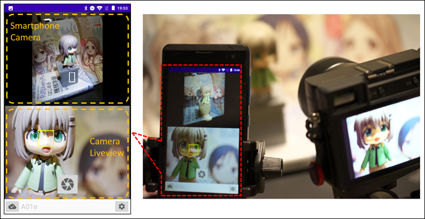
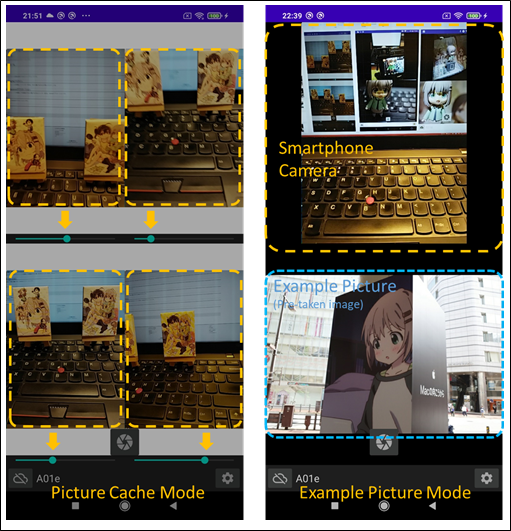
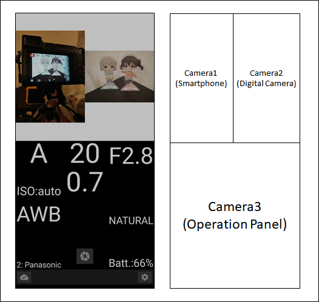
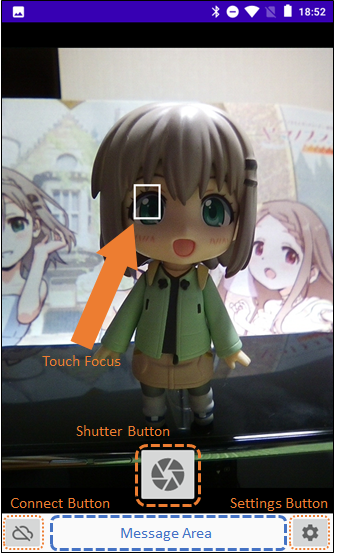
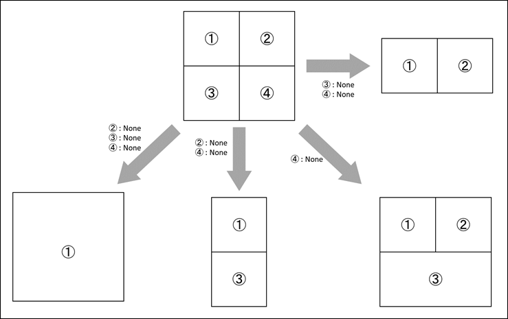
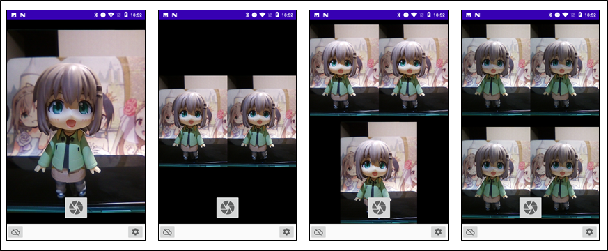
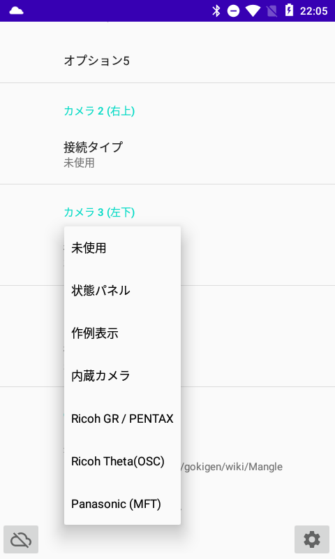
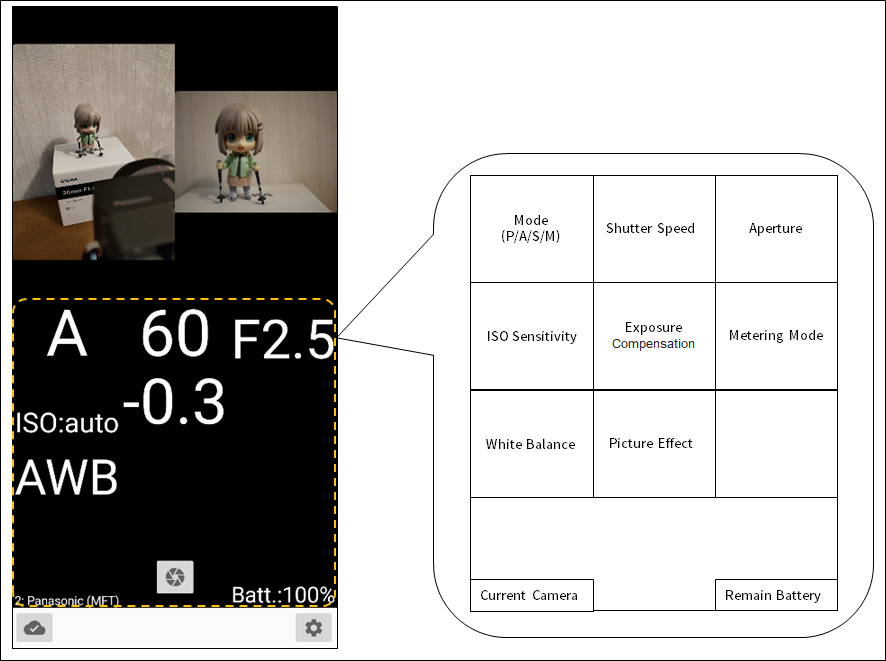
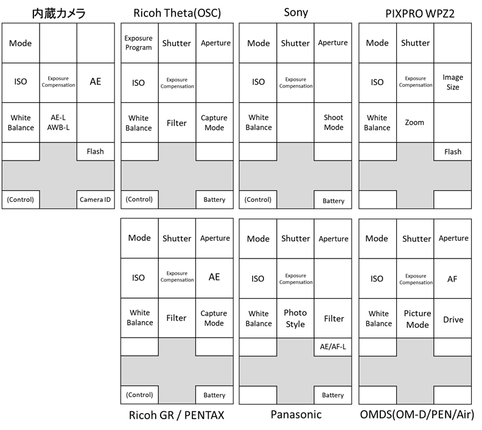
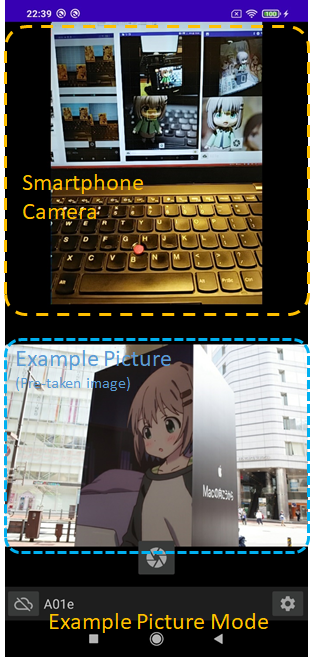

# A01e : マルチ画面でWifiカメラ同時撮影アプリケーション

## 概要

A01eは、いろいろなカメラで同時撮影を実行することを目指したAndroid用の撮影アプリケーションです。最大８台までのカメラを同時操作が可能です。
また、スマホ内にあるイメージを画面表示し、その画像を参考に撮影することができる「作例表示」モードも持っています。作例と同じアングルで撮影したい場合には便利に活用できるモードかと思います。

使い方的には、２つのライブビュー同時表示をしつつ、画面下部に操作パネルを表示して設定を調整して撮影する、という使い方がおすすめです。

------------

## 機能一覧

* 画像の撮影(内蔵カメラ、Wifi経由で接続したデジタルカメラ)
  * WiFi接続でサポートするデジタルカメラは、「RICOH GRシリーズ」「PENTAX一眼カメラ」「RICOH THETAシリーズ」「Panasonic」「Sony」「JK Imaging KODAK PIXPRO WPZ2」「Olympus」です。
* 操作パネルによる接続中カメラの状態表示、設定変更操作
* プレビュー画像の撮影
* セルフタイマーシャッター（シャッターを押した後、一定時間撮影を保留する）
* ライブビュー画面に撮影補助線（グリッド）を表示する
* ライブビュー画像を一時的に記憶し、画面表示を遅らせる
* 端末内にある画像を「作例」として表示する

------------

## インストール

以下リンクのGoogle Play よりインストールしてください。

* [https://play.google.com/store/apps/details?id=jp.osdn.gokigen.mangle](https://play.google.com/store/apps/details?id=jp.osdn.gokigen.mangle)

------------

## 操作の説明

起動すると、カメラ画像（もしくは作例表示）を行います。Wifiカメラと接続する場合は、左下の接続ボタンを押してください。カメラと接続できると画像表示がはじまります。
画像をタッチすると、その場所にフォーカスを合わせます。シャッターボタンを押して画像を保存してください。
シャッターは、画面上のシャッターボタンだけでなく、ボリューム上ボタン、ハードボタン、リモートシャッターボタン（有線、無線）も使用可能です。

* **Touch Focus** : フォーカスを合わせるよう指定したところを示します。
* **Shutter Button** : カメラ画像を表示します。
* **Connect Button** : Wifiカメラと接続を行います。
* **Settings Button** : 設定項目を表示します。
* **Message Area** : 画像をキャッシュしたり、セルフタイマーのカウントダウン秒数など、通知が必要なメッセージを表示する領域です。

------------

### 画面表示について

接続タイプが「**未使用** (None)」の指定によって、以下のように画面表示数を変更することができます。
同時撮影および作例の表示に合わせて設定をお願いします。

------------

### 接続タイプの選択肢

接続タイプは、以下から選択可能です。お好みで設定してください。ただし、現状は、「内蔵カメラ」以外の同種の接続タイプを複数設定しても、適切に表示できない場合がありますので、ご了承ください。

* **未使用**
  * 使用しない場合に設定します。画面表示しません。

* **操作パネル**
  * 接続中のカメラ状態を表示・操作するためのパネルを表示します。

* **作成表示**
  * 撮影時に参考となる画像を表示するためのパネルを表示します。

* **内蔵カメラ**
  * スマートフォン内蔵カメラのライブビュー画像用パネルを表示します。

* **Ricoh GR / PENTAX**
  * リコー社製デジタルカメラ、GR2、GR3 および PENTAX一眼レフのライブビュー画像用パネルを表示します。

* **Ricoh Theta (OSC)**
  * リコー社製THETAシリーズのライブビュー画像を表示するパネルを表示します。

* **Panasonic**
  * パナソニック製カメラのライブビュー画像用パネルを表示します。

* **Sony**
  * ソニー製カメラのライブビュー画像用パネルを表示します。

* **PIXPRO WPZ2**
  * JK Imaging KODAK PIXPRO WPZ2用のライブビュー画像用パネルを表示します。

* **OMDS(OM-D/PEN/Air)**
  * OMDS(Olympus)社製のカメラ(OM-D / PEN / Air A01)画像表示用パネルを表示します。

------------

### 操作パネルについて

操作パネルは、画像を表示しているカメラの状態を表示するパネルです。状態部分をタッチすると、設定変更ができる項目についてはダイアログを表示し、設定値を選択することで、値を変更することができます。
複数のカメラと接続して画像を表示しているときには、右下のカメラ名を表示している箇所を長押しすることで、状態表示するカメラを変更することができます。
また、同時に２つ操作パネルを表示することができ、画像２つ×操作パネル２つで、複数台のカメラの状態を同時表示、設定変更させることができます。

操作パネルの表示内容は、カメラ種別によって微妙に異なります。

------------

### 作例表示について

A01eには、スマートフォン内に入っている画像を表示する「作例表示」というモードがあります。
作例表示をする場合は、設定で「接続タイプ」を **作例表示** に設定したのち、A01eを立ち上げなおしたあと、「作例表示」の画面で長押しをしてください。
画像選択のメニューが表示されますので、表示させたい画像を選択すると表示されます。一度設定すると、画像を消さない限りはA01eを起動しなおしても表示します。

上記は表示例ですが、この機能はスマートフォン内に入っている画像を参考に、同じアングルで撮影したいといった場合にご利用いただくことを想定しています。

------------

## カメラの設定項目について

------------

### アプリ制御

#### アプリ終了

アプリケーションを終了させます。

#### WIFI設定

端末のWIFI設定画面を開きます。

------------

### カメラ設定

#### セルフタイマー秒数

シャッターを押した後、一定の時間が経過した後で撮影します。

* 切 : この機能を無効にします。
* 3秒
* 7秒
* 10秒
* 15秒

#### グリッド表示

ONに設定すると撮影補助線を表示します。

#### ライブビュー画像を撮影する

スイッチを入れると、表示しているライブビュー画像を保存することができます。

#### カメラのシャッターを使用しない

**スイッチを入れると、シャッターボタンを押しても画像撮影しなくなります。** ライブビュー画像だけを保存したい、もしくはただ単に遅延した画像を参照したい、という用途で使用する場合にご使用ください。

#### ライブビュー画像の表示を遅延

**スイッチを入れると、ライブビュー画像を一度メモリ内に溜めてから表示するようになります。** 画像下部に表示されるスライダーによって、表示のタイミングを変えることができます。
本機能の有効/無効は、一度アプリを終了してから起動することで切り替わります。

#### ライブビュー画像の遅延最大数

「ライブビュー画像の表示を遅延」でメモリ内に溜める画像の枚数を指定します。初期値は500です。
本機能の有効/無効は、一度アプリを終了してから起動することで切り替わります。
一時的な画像を記憶しておくためにA01eがメモリを消費しますので、内蔵メモリが小さいスマートフォンをご使用の場合には、小さい値に変更することも考慮してください。

### 内蔵カメラ設定

#### 内蔵カメラを1つだけ使用する

現状は、スイッチを入れて利用してください。（内蔵カメラの複数利用はできません。）
ちなみに、カメラ１～カメラ８をすべて「内蔵カメラ」に設定して、「ライブビュー画像の表示を遅延」のスイッチを入れ、
スライダーをそれぞれ動かすと、内蔵カメラの画像を異なるタイミングで再生することができます。
（動きの確認をする場合に利用できるかもしれませんので、もしよければお試しください。）

------------

### カメラ１～８ 設定

カメラ画像の設定を行います。詳細は後述する「**接続タイプ別のカメラ設定について**」を参照してください。
本機能の有効/向こうは、一度アプリを終了してから起動することで切り替わります。
カメラ１～８の場所は、以下です。

* カメラ１（左上）
* カメラ２（右上）
* カメラ３（左中上）
* カメラ４（右中上）
* カメラ５（左中下）
* カメラ６（右中下）
* カメラ７（左下）
* カメラ８（右下）

------------

### GOKIGEN Project

#### 操作説明

[Mangle 操作説明のページ（本ページ）](https://github.com/MRSa/GokigenOSDN_documents/blob/main/Applications/A01e/Readme.md)をブラウザで開きます。

#### プライバシーポリシー

GOKIGEN プロジェクトの[PrivacyPolicy プライバシーポリシー]ページを開きます。

[GOKIGENプロジェクト](https://osdn.net/projects/gokigen/)の[プライバシーポリシー](https://github.com/MRSa/GokigenOSDN_documents/blob/main/PrivacyPolicy.md)ページを開きます。

#### デバッグ情報

デバッグ情報(LogCat)のページを開きます。

------------

### 接続タイプ別のカメラ設定について

カメラの「**接続タイプ**」を指定すると、さらに設定項目を追加で表示することがあります。
以下に接続タイプ別の設定項目を示します。

-----------

#### 未使用

接続タイプが「**未使用**」の場合には、設定項目はありません。

-----------

#### 作例表示

接続タイプが「**作例表示**」の場合には、設定項目はありません。

-----------

#### 状態パネル

接続タイプが「**状態パネル**」の場合には、設定項目はありません。

-----------

#### 内蔵カメラ

##### 接続シーケンス

どの内蔵カメラを使用するか設定します。

* **TYPE0** : 背面カメラを使用します
* **TYPE1** : 表面カメラを使用します

##### オプション1

ライブビュー画像（プレビュー画像）の解像度を内蔵カメラに指示します。（何も設定しない場合は、'''VGA''' (480x640)と等価なふるまいとなります。）
ただし、'''この設定通りに動作するわけではないようです。''' 実際の設定値がプレビュー画像の解像度になっていませんのでご了承ください。
動作しない場合は、未設定（設定をクリア）してご使用ください。

* **8K** :  7680 x 4320 を指定します
* **6K** :  6016 x 3384 を指定します
* **4K** :  2160 x 4096 を指定します
* **WQHD** : 1440 x 2560 を指定します
* **2K** :  1080 x 2048 を指定します
* **FHD** : 1080 x 1920 を指定します
* **SXGA** : 1024 x 1280 を指定します
* **XGA** :  768 x 1024 を指定します
* **SVGA** : 600 x 800 を指定します
* **VGA** :  480 x 640 を指定します

##### オプション2

現状、未使用です。

##### オプション3

現状、未使用です。

##### オプション4

現状、未使用です。

##### オプション5

現状、未使用です。

-----------

#### Ricoh GR / PENTAX

##### 接続シーケンス

現状、未使用です。

##### オプション1

現状、未使用です。

##### オプション2

現状、未使用です。

##### オプション3

現状、未使用です。

##### オプション4

現状、未使用です。

##### オプション5

現状、未使用です。

-----------

#### Ricoh Theta(OSC)

##### 接続シーケンス

現状、未使用です。

##### オプション1

現状、未使用です。

##### オプション2

現状、未使用です。

##### オプション3

現状、未使用です。

##### オプション4

現状、未使用です。

##### オプション5

現状、未使用です。

-----------

#### Panasonic

##### 接続シーケンス

現状、未使用です。

##### オプション1

現状、未使用です。

##### オプション2

現状、未使用です。

##### オプション3

現状、未使用です。

##### オプション4

現状、未使用です。

##### オプション5

現状、未使用です。

-----------

#### Sony

##### 接続シーケンス

現状、未使用です。

##### オプション1

現状、未使用です。

##### オプション2

現状、未使用です。

##### オプション3

現状、未使用です。

##### オプション4

現状、未使用です。

##### オプション5

現状、未使用です。

-----------

#### PIXPRO WPZ2

##### 接続シーケンス

現状、未使用です。

##### オプション1

現状、未使用です。

##### オプション2

現状、未使用です。

##### オプション3

現状、未使用です。

##### オプション4

現状、未使用です。

##### オプション5

現状、未使用です。

-----------

#### OMDS(OM-D/PEN/Air)

##### 接続シーケンス

現状、未使用です。

##### オプション1

現状、未使用です。

##### オプション2

現状、未使用です。

##### オプション3

現状、未使用です。

##### オプション4

現状、未使用です。

##### オプション5

現状、未使用です。

------------

## その他

### 注意事項（仕様、制約事項）

#### 制約事項

* 同種複数カメラの同時制御（撮影）は、Panasonic機とSonyのRX0で動作確認を行っています。そのほかの機種では動作しません。すみません。
* 同様に、内蔵カメラを複数使用できるようになっていません。すみません。

#### 動作確認

本アプリは、以下の機種で動作確認を行っています。ただし、デバイスが持つ固有の制約や動作の都合からすべての機能がすべての組み合わせで動作するわけではないことをご承知おきください。

##### スマートフォン/タブレット

* g06 (Android 6.0)
* g06+ (Android 7.0)
* Lenovo TAB 4 8 Plus (Android 8.1)
* Lenovo TAB M7 (Android 9)
* Xiaomi Redmi 9T (Android 10)
* OPPO Reno5 A (Android 11 / Android 13)
* Google Pixel 3a (Android 12)
* Google Pixel 7 (Android 14)

##### デジタルカメラ

* Pentax K-70
* Ricoh GR II / III / IIIx
* Ricoh Theta V / S
* Panasonic DMC-GX7MK2
* Panasonic DC-G9
* Panasonic DC-S1
* Sony ILCE-7M2
* Sony ILCE-QX1
* Sony DSC-HX90V
* Sony DSC-RX0
* JK imaging KODAK PIXPRO WPZ2
* Olympus Air A01
* Olympus PEN E-PL8
* Olympus TG-6
* Olympus E-M5 Mark III

------------

### permissionについて

本アプリは、次のパーミッションを指定し使用しています。

* android.permission.CAMERA
  * 内蔵カメラで撮影を実施するため
* android.permission.VIBRATE
  * アプリの状態を振動で伝えるため
* android.permission.WRITE_EXTERNAL_STORAGE
  * カメラの画像を保存するため
* android.permission.READ_EXTERNAL_STORAGE
  * スマートフォン内の画像を読みだして表示するため
* android.permission.INTERNET
  * WIFI経由でデジタルカメラと通信を行うため
* android.permission.ACCESS_NETWORK_STATE
  * デジタルカメラとWIFI接続を行うため
* android.permission.ACCESS_WIFI_STATE
  * デジタルカメラとWIFI接続を行うため
* android.permission.CHANGE_WIFI_MULTICAST_STATE
  * デジタルカメラ(PIXPRO WPZ2)とWIFI接続を行うため

------------

### 変更履歴

* 1.0.0 : 初版作成
* 1.0.1 : 一部不具合修正、グリッド表示機能の追加
* 1.1.0 : 状態パネル表示の追加、一部不具合の修正
* 1.2.0 : 状態パネルを操作パネルに更新、一部不具合の修正。
* 1.3.0 : SONY製カメラの制御を追加。
* 1.4.0 : KODAK PIXPRO WPZ2の制御を追加。
* 1.5.0 : OMDS(Olympus)製カメラの制御を追加。
* 1.5.1 : Panasonic製カメラの同種同時使用をできるようにした。
* 1.5.2 : SONY製カメラの同種同時使用をできるようにした。
* 1.6.0 : 同時撮影可能なカメラの台数を８台に拡張しました。
* 1.6.4 : 使用する Android SDKを更新しました。
* 1.6.5 : Android 13機以降で、起動しない不具合を改修しました。

以上
