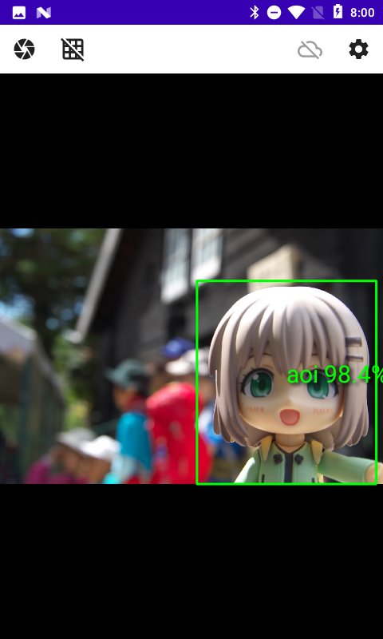
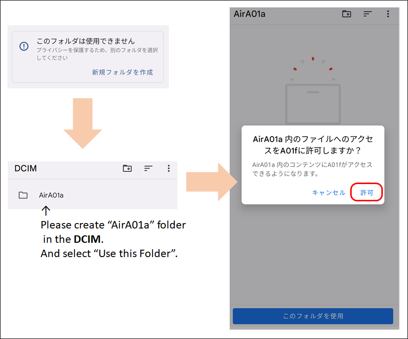
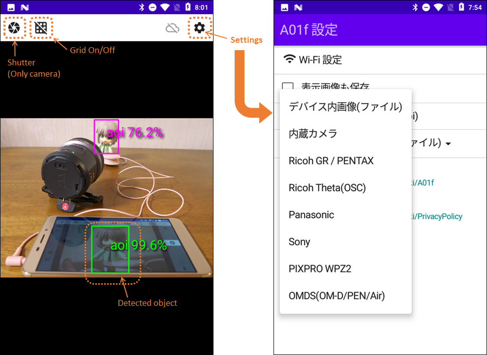
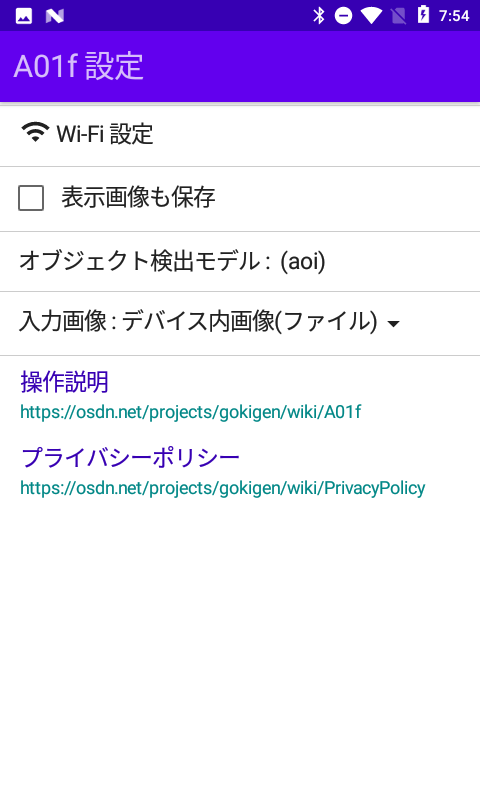
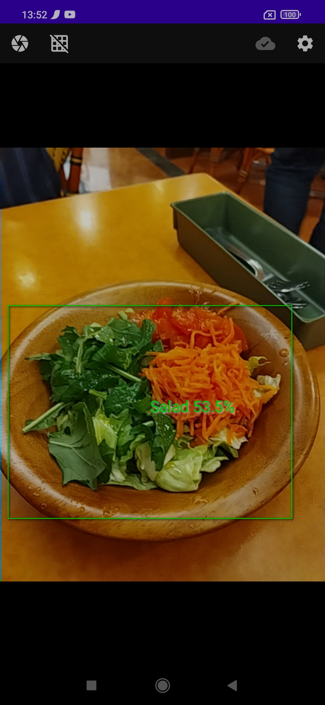
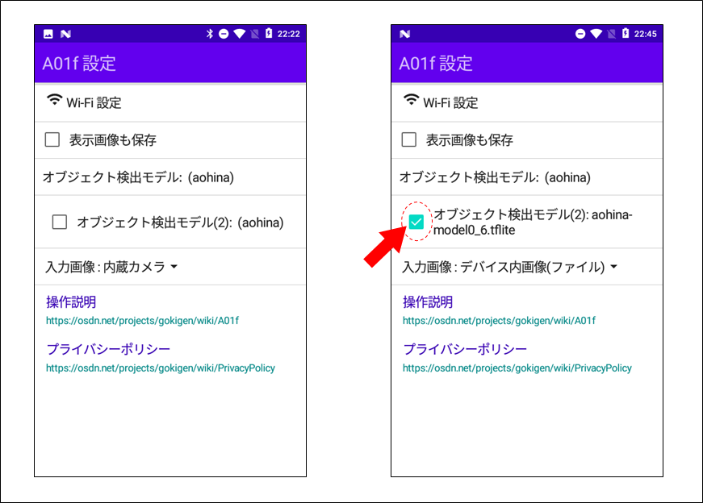

# A01f : オブジェクト検出アプリケーション

## 概要

A01f は、Android用の [TensorFlow Lite](https://www.tensorflow.org/lite)を使ったオブジェクト検出アプリケーションです。入力した画像から、最大１０個のオブジェクトを検出することができます。
オブジェクト検出をするための画像は、標準はデバイス内蔵のカメラですが、設定により、デバイス内画像、WiFiで接続するデジカメ(ソニー、パナソニック、リコー/ペンタックス、OMDS/オリンパス, PIXPRO)に変更することができます。
また、オブジェクト検出モデルは、デバイス内のファイルを選択して設定が可能ですので、 [TensorFlow Lite Model Maker](https://www.tensorflow.org/lite/guide/model_maker)を使用して作成した独自のオブジェクト検出モデルファイルをお試しいただけます。

標準のオブジェクト検出モデルは「[ねんどろいど 雪村あおい](https://www.goodsmile.info/ja/product/4709/%E3%81%AD%E3%82%93%E3%81%A9%E3%82%8D%E3%81%84%E3%81%A9+%E9%9B%AA%E6%9D%91%E3%81%82%E3%81%8A%E3%81%84.html)」と「[ねんどろいど 倉上ひなた](https://www.goodsmile.info/ja/product/6903/%E3%81%AD%E3%82%93%E3%81%A9%E3%82%8D%E3%81%84%E3%81%A9+%E5%80%89%E4%B8%8A%E3%81%B2%E3%81%AA%E3%81%9F.html)」「[ねんどろいど 青羽ここな](https://www.goodsmile.info/ja/product/13000/%E3%81%AD%E3%82%93%E3%81%A9%E3%82%8D%E3%81%84%E3%81%A9+%E9%9D%92%E7%BE%BD%E3%81%93%E3%81%93%E3%81%AA.html)」を採用しています。

---------

## 機能一覧

* 表示中画像のオブジェクトを検出 (同時に最大10個まで)
* [TensorFlow Lite](https://www.tensorflow.org/lite) の Object Detection モデルファイルの読み込み (デバイス内にある [TensorFlow Lite Model Maker](https://www.tensorflow.org/lite/guide/model_maker) を使用して作成したオブジェクト検出モデルファイルの読み込みが可能)
* いろいろな方法による画像の入力： 内蔵カメラ（内蔵）、デバイス内画像（ファイル）、Wi-Fi経由で接続したデジタルカメラ（リコー GRシリーズ/PENTAX一眼レフ、リコーTHETA、パナソニック、ソニー、PIXPRO WPZ2、OMDS/Olympus(OM-D, PEN, Air, TG-6)）

---------

## インストール

以下リンクのGoogle Play よりインストールしてください。

* [https://play.google.com/store/apps/details?id=net.osdn.gokigen.objectdetection.a01f](https://play.google.com/store/apps/details?id=net.osdn.gokigen.objectdetection.a01f)

初回起動時には、権限の許可を求めるダイアログが表示されますので、どうか許可を与えてください。

ディレクトリ選択（「このフォルダは使用できません」）が表示される場合は、**/DCIM/ の下に AirA01a というディレクトリを作成し、「このフォルダを使用」を選択してください。**
このフォルダは、カメラ画像を撮影した場合、保管するフォルダとして利用します。

---------

## 説明

A01fを起動したあと、カメラを検出したい対象に向けてください。（デバイス内画像(ファイル)を入力にしている場合は、画面を長押しし、画像ファイルを選択してください。）
オブジェクトを検出すると、枠で囲み、そのレベルを表示します。オブジェクトは同時に10個まで検出できるはずです。
入力にカメラ画像を使用している場合は、左上のシャッターボタンを押したタイミングで撮影することができます。
シャッターボタン右隣のボタンは、グリッド表示のON/OFF 切替ボタンです。

---------

### 「A01f 設定」について

アプリケーションの設定画面です。**設定画面で設定を変更した場合は、A01fを一度完全に終了させてから改めて起動しなおしてください。**

#### Wi-Fi 設定

本項目にタッチすると、AndroidのWi-Fi設定画面を開きます。A01fとデジカメと接続する場合にご使用ください。

#### 表示画像も保存

本項目にチェックを入れると、シャッターボタンを押したときにWi-Fiで接続したカメラで撮影するタイミングで、デバイスで表示している画像も保存します。
保存場所は、デバイス内の /DCIM/AirA01a です。 このディレクトリがない場合には保存できませんので、あらかじめ作成して使用可能にしておいてください。

#### オブジェクト検出モデル

標準のオブジェクト検出モデルは、[ねんどろいど 雪村あおい](https://www.goodsmile.info/ja/product/4709/%E3%81%AD%E3%82%93%E3%81%A9%E3%82%8D%E3%81%84%E3%81%A9+%E9%9B%AA%E6%9D%91%E3%81%82%E3%81%8A%E3%81%84.html)を検出するモデルです。
本項目にタッチすると、デバイス内にある[TensorFlow Lite](https://www.tensorflow.org/lite)のオブジェクト検出モデルファイルを選択して設定することができます。

オブジェクト検出モデルファイルは、 [TensorFlow Lite Model Maker](https://www.tensorflow.org/lite/guide/model_maker) を使用して作成することができます。
以下に [Object Detection with TensorFlow Lite Model Maker](https://colab.research.google.com/github/tensorflow/tensorflow/blob/master/tensorflow/lite/g3doc/tutorials/model_maker_object_detection.ipynb)のページで作成したモデルを使ってオブジェクト検出を行った例を示します。

0.8.0 から、オブジェクト検出モデルを２つ同時に使用して検出できるようになりました。オブジェクト検出モデルの精度や認識速度の違いなどを確認するのにご使用いただければと思います。
オブジェクト検出モデルを２つ同時に使用する場合は、２つめの検出モデルの左にあるチェックを入れてご使用ください。

2つめのオブジェクト検出モデルを使用した場合、枠が点線になります。ただし、ラベル表示は適当ですので、、、表示が重なってしまうかもしれません。すみません。

#### 入力画像

A01fに入力する画像をどこからにするか選択します。

* デバイス内画像(ファイル)
  * デバイス内の画像を選択してオブジェクトの検出をします。画像を選択するには画面を長押しし、デバイス内の画像を選択してください。
* 内蔵カメラ
  * 初期設定です。デバイスのカメラを入力画像とする場合に選択します。
* Ricoh GR / PENTAX
  * Wifi経由で[リコー製のカメラ(GRシリーズ/PENTAX)](https://www.ricoh-imaging.co.jp/japan/products/)と接続し、入力画像とする場合に選択します。
* Ricoh Theta(OSC)
  * Wifi経由で[THETA](https://theta360.com/)と接続し、入力画像とする場合に選択します。
* Panasonic
  * Wifi経由で[パナソニック製カメラ](https://panasonic.jp/dc/)と接続し、入力画像とする場合に選択します。
* Sony
  * Wifi経由でソニー製カメラ（[コンパクトタイプ](https://www.sony.jp/cyber-shot/lineup/)、[一眼タイプ](https://www.sony.jp/ichigan/lineup/)）と接続し、入力画像とする場合に選択します。
* PIXPRO WPZ2
  * Wifi経由で[PIXPRO WPZ2](https://kodakpixpro.com/AsiaOceania/jp/cameras/sportcamera/wpz2/)と接続し、入力画像とする場合に選択します。
* OMDS(OM-D/PEN/Air)
  * Wifi経由で[Olympus/OMDS製カメラ](https://www.olympus-imaging.jp/product/)と接続し、入力画像とする場合に選択します。

#### 操作説明

[A01f 操作説明のページ（本ページ）](https://github.com/MRSa/GokigenOSDN_documents/blob/main/Applications/A01f/Readme.md)をブラウザで開きます。

#### プライバシーポリシー

GOKIGEN プロジェクトの[プライバシーポリシー](https://github.com/MRSa/GokigenOSDN_documents/blob/main/PrivacyPolicy.md)ページを開きます。

---------

## その他

### 注意事項（仕様、制約事項など）

* デバイス内の画像サイズが大きい場合には、ファイルを読み込むことができず、そのまま終了することがありますのでご注意ください。
* 現状、内蔵カメラの変更（インカメラの使用）はできません。
* 画像撮影では、オブジェクト検出結果を記録しません。オブジェクト検出結果を保存する場合は、画面スクリーンショット機能をお使いください。
* デバイス内画像の時には、シャッターボタンを押しても動作しません。
* １度オブジェクト検出モデルを選択すると、元の検出モデルに戻す方法は提供していません。
  * [このオブジェクト検出ファイル](https://github.com/MRSa/GokigenOSDN_documents/blob/main/images/attachments/A01f_aoi-model0_1.tflite) をデバイス内に転送して A01fに読み込ませてください。

### permissionについて

本アプリは、次のパーミッションを指定し使用しています。

* android.permission.CAMERA
  * 内蔵カメラで撮影を実施するため
* android.permission.VIBRATE
  * アプリの状態を振動で伝えるため
* android.permission.WRITE_EXTERNAL_STORAGE
  * カメラの画像を保存するため
* android.permission.READ_EXTERNAL_STORAGE
  * スマートフォン内の画像を読みだして表示するため
* android.permission.INTERNET
  * WIFI経由でデジタルカメラと通信を行うため
* android.permission.ACCESS_NETWORK_STATE
  * デジタルカメラとWIFI接続を行うため
* android.permission.ACCESS_WIFI_STATE
  * デジタルカメラとWIFI接続を行うため
* android.permission.CHANGE_WIFI_MULTICAST_STATE
  * デジタルカメラ([PIXPRO WPZ2](https://kodakpixpro.com/AsiaOceania/jp/cameras/sportcamera/wpz2/))とWIFI接続を行うため 

### オブジェクト検出モデルファイルの作成について

A01f内蔵のオブジェクト検出モデルファイルは、[TensorFlow Lite Model Maker](https://www.tensorflow.org/lite/guide/model_maker)を使用して作成しました。
詳細は、作成に使用した [Pythonファイル](https://github.com/MRSa/GokigenOSDN_documents/blob/main/images/attachments/A01f_make-model.py)を参照してください。

オブジェクト検出モデルファイルを作成し利用する手順の概要を以下に示します。

1. 画像を準備する （画像の要件は [AutoML Vision Object Detection トレーニング データの準備](https://cloud.google.com/vision/automl/object-detection/docs/prepare)を参照してください。）
2. [LabelImg(アノテーションツール)](https://github.com/tzutalin/labelImg)を使って、画像ファイル内オブジェクトのアノテーション（枠で囲う作業）を行う
3. [TensorFlow Lite Model Maker](https://www.tensorflow.org/lite/guide/model_maker) を使用してオブジェクト検出モデルファイル（model.tflite）を作る
4. 作成したオブジェクト検出モデルファイルをデバイスに転送し、A01f に読み込ませる

### 参考リンク

* [TensorFlow Lite Model Maker](https://www.tensorflow.org/lite/guide/model_maker)
* [TFLite Model Maker](https://github.com/tensorflow/examples/tree/master/tensorflow_examples/lite/model_maker)
* [Object Detection with TensorFlow Lite Model Maker](https://www.tensorflow.org/lite/tutorials/model_maker_object_detection)
* [tflite_model_maker.object_detector.DataLoader](https://www.tensorflow.org/lite/api_docs/python/tflite_model_maker/object_detector/DataLoader)
* [tflite_model_maker.object_detector.ObjectDetector](https://www.tensorflow.org/lite/api_docs/python/tflite_model_maker/object_detector/ObjectDetector)
* [LabelImg(アノテーションツール)](https://github.com/tzutalin/labelImg)
* [TensorFlow Lite Model Makerを使ったオブジェクト検出モデルファイル生成用Pythonファイル](https://github.com/MRSa/GokigenOSDN_documents/blob/main/images/attachments/A01f_make-model.py)
  * A01fで使用した、Pascal VOC形式のアノテーションデータを読み込んでオブジェクト検出モデルファイルを作るスクリプトです。(スクリプトの使用には、データのあるパス名の設定変更(フルパス指定)が必要です)
* [TensorFlow Lite Model を使った、Pascal VOC形式のアノテーションファイル生成用Pythonファイル](https://github.com/MRSa/GokigenOSDN_documents/blob/main/images/attachments/A01f_makeAnnotation.py)

### Tensor Flow Lite Model File

(自分が)検出遅延、検出精度などの違いを理解するため、いくつかオブジェクト検出ファイルを作成しています。

#### aoi

* [EfficientDet-Lite0 の aoi](https://osdn.net/projects/gokigen/wiki/A01f/attach/aoi-model0_1.tflite)
* [EfficientDet-Lite1 の aoi](https://osdn.net/projects/gokigen/wiki/A01f/attach/aoi-model1.tflite)
* [EfficientDet-Lite2 の aoi](https://osdn.net/projects/gokigen/wiki/A01f/attach/aoi-model2.tflite)

#### aohina

* [EfficientDet-Lite0 の aohina(その11)](https://osdn.net/projects/gokigen/downloads/77470/aohina-model0_11.tflite/)
* [EfficientDet-Lite0 の aohina(その8)](https://osdn.net/projects/gokigen/downloads/77370/aohina-model0_8.tflite/)
* [EfficientDet-Lite1 の aohina(その8)](https://osdn.net/projects/gokigen/downloads/77370/aohina-model1_8.tflite/)
* [EfficientDet-Lite2 の aohina(その8)](https://osdn.net/projects/gokigen/downloads/77370/aohina-model2_8.tflite/)
* [EfficientDet-Lite3 の aohina(その8)](https://osdn.net/projects/gokigen/downloads/77370/aohina-model3_8.tflite/)
* [EfficientDet-Lite4 の aohina(その8)](https://osdn.net/projects/gokigen/downloads/77370/aohina-model4_8.tflite/)

#### arukuma

* [EfficientDet-Lite0 の arukuma](https://osdn.net/projects/gokigen/downloads/71569/arukuma-model0.tflite)
* [EfficientDet-Lite0 の arukuma(その２)](https://osdn.net/projects/gokigen/downloads/71569/arukuma-model0_1.tflite)
* [EfficientDet-Lite1 の arukuma](https://osdn.net/projects/gokigen/downloads/71569/arukuma-model1.tflite)
* [EfficientDet-Lite2 の arukuma](https://osdn.net/projects/gokigen/downloads/71569/arukuma-model2.tflite)
* [EfficientDet-Lite3 の arukuma](https://osdn.net/projects/gokigen/downloads/71569/arukuma-model3.tflite)

#### fujimiraaru

* [EfficientDet-Lite0 の fujimiraaru(その２)](https://osdn.net/projects/gokigen/downloads/77354/fujimiraaru0-2.tflite)

#### a01fアプリ搭載TFLITEモデル

* [EfficientDet-Lite0 の aoi(0.5.0)](https://osdn.net/projects/gokigen/wiki/A01f/attach/aoi-model0_1.tflite)
* [EfficientDet-Lite0 の aohina(その5, 0.7.0～)](https://osdn.net/projects/gokigen/downloads/77070/aohina-model0-5.tflite/)

#### 試行錯誤TFLITEモデル

* [EfficientDet-Lite0 の aoi(初版)](https://osdn.net/projects/gokigen/wiki/A01f/attach/aoi-model0.tflite)
* [EfficientDet-Lite0 の aohina](https://osdn.net/projects/gokigen/wiki/A01f/attach/aohina-model0.tflite)
* [EfficientDet-Lite0 の aohina(その1)](https://osdn.net/projects/gokigen/wiki/A01f/attach/aohina-model0_1.tflite)
* [EfficientDet-Lite0 の aohina(その2)](https://osdn.net/projects/gokigen/wiki/A01f/attach/aohina-model0_xx2.tflite)
* [EfficientDet-Lite0 の aohina(その3)](https://osdn.net/projects/gokigen/wiki/A01f/attach/aohina-model0_2.tflite)
* [EfficientDet-Lite0 の aohina(その4)](https://osdn.net/projects/gokigen/wiki/A01f/attach/aohina-model0-4.tflite)
* [EfficientDet-Lite0 の aohina(その6)](https://osdn.net/projects/gokigen/downloads/77248/aohina-model0_6.tflite/)
* [EfficientDet-Lite0 の aohina(その7)](https://osdn.net/projects/gokigen/downloads/77348/aohina-model0_7.tflite/)
* [EfficientDet-Lite0 の aohina(その8、Epoch10-1)](https://osdn.net/projects/gokigen/wiki/A01f/attach/aohina0-epoch10_1.tflite)
* [EfficientDet-Lite0 の aohina(その9)](https://osdn.net/projects/gokigen/wiki/A01f/attach/aohina-model0_9.tflite)
* [EfficientDet-Lite0 の aohina(その9、Epoch110)](https://osdn.net/projects/gokigen/wiki/A01f/attach/aohina0-9_epoch110.tflite)
* [EfficientDet-Lite0 の aohina(その9、Epoch240)](https://osdn.net/projects/gokigen/wiki/A01f/attach/aohina0-9_epoch240.tflite)
* [EfficientDet-Lite0 の aohina(その10、Epoch120)](https://osdn.net/projects/gokigen/wiki/A01f/attach/aohina0-10_epoch120.tflite)
* [EfficientDet-Lite0 の aohina(その10、Epoch230)](https://osdn.net/projects/gokigen/wiki/A01f/attach/aohina0-10_epoch230.tflite)
* [EfficientDet-Lite1 の aohina](https://osdn.net/projects/gokigen/wiki/A01f/attach/aohina-model1.tflite)
* [EfficientDet-Lite0 の fujimiraaru(その１)](https://osdn.net/projects/gokigen/wiki/A01f/attach/fujimiraaru0-1.tflite)

### Image Files with annotation

* [ねんどろいど 雪村あおい (Pascal VOC形式, 約2,500枚)](https://osdn.net/projects/gokigen/downloads/77021/aoi-annotations_20220318.tar.gz)
* [ねんどろいど 倉上ひなた (Pascal VOC形式, 約4,700枚)](https://osdn.net/projects/gokigen/downloads/77043/hinata-annotations_20220320.zip)
* [ねんどろいど 雪村あおい と 倉上ひなた (Pascal VOC形式, 約12,000枚)](https://osdn.net/projects/gokigen/downloads/77070/aohina-annotations_20220329.tar.gz)
* [ねんどろいど 雪村あおい と 倉上ひなた (Pascal VOC形式, 約20,000枚)](https://osdn.net/projects/gokigen/downloads/77370/aohina-annotations_20220531.tar.gz)
* [ねんどろいど 雪村あおい と 倉上ひなた (Pascal VOC形式, 約25,000枚)](https://osdn.net/projects/gokigen/downloads/77470/aohina-annotations_20220618.tar.gz)
* [アルクマ ミニフィギュア (Pascal VOC形式, 約2,500枚)](https://osdn.net/projects/gokigen/downloads/71569/arukuma-annotation.tar.gz)
* [ふじちゃん、ミラたん、アルクマ ぬいぐるみとミニフィギュア (Pascal VOC形式, 約6,000枚)](https://osdn.net/projects/gokigen/downloads/77354/fujimiraaru-20220528.tar.gz)

### 変更履歴

* 0.5.0 : 初版作成
* 0.7.0 : OMDS機のライブビュー安定化、ズームイン・アウト制御を可能にする。
* 0.8.0 : オブジェクト検出モデルを２つ同時に使用できるようにする。
* 0.8.3 : Android 14機で起動ができなかった不具合を修正する。

以上
