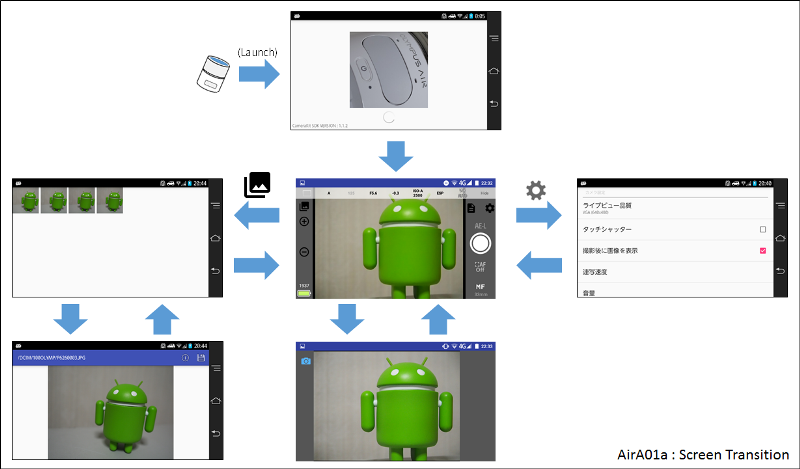

# AirA01a : OlympusAir用撮影・参照Androidアプリケーション (ポートレート版)

------------------------------------------------

------------------------------------------------

## 概要

AirA01a は、 [Olympus Camera Kit](https://opc.olympus-imaging.com/sdkdocs/)のサンプルアプリ([撮影サンプルアプリ](https://opc.olympus-imaging.com/sdkdocs/data/SampleAppGuide/capture_sample_android.html) および [オープンプラットフォームカメラ OLYMPUS AIR A01](https://opc.olympus-imaging.com/sdkdocs/data/SampleAppGuide/viewer_sample_android.html)を改造したAndroidアプリケーションです。

[オープンプラットフォームカメラ OLYMPUS AIR A01](https://olympus-imaging.jp/product/opc/a01/) に対応しています。

撮影サンプルアプリにビューアーサンプルアプリを結合し、一部メッセージの日本語化に加え、次の機能を追加しています。

* 電動ズームレンズ装着時のズームイン・ズームアウト操作
* AE Lock / AE Lock解除
* 顔検出AF
* マニュアルフォーカス切替え (静止画撮影時のみ)
* 静止画連続撮影（いわゆるブラケッティング撮影）
* 補助線の表示（5種類)
* 制御パネルの非表示/表示
* 現在の焦点距離表示
* 測光モードの設定・変更
* 露出範囲外/温度上昇の警告表示
* 各種カメラ機能設定（カメラ効果音、RAWモード、撮影画像サイズ、連射速度、圧縮率、アートフィルター種別、電球色残しホワイトバランス）
* お気に入りカメラ設定（保存・展開）
* 撮影画像の一覧表示 (撮影日、もしくはカメラ内格納パスでフィルタリングも可)
* JPEG画像, 動画, RAWファイルのダウンロード (一括ダウンロードも可)
* 撮影情報（撮影日時、焦点距離、シャッタースピード、絞り値、ISO感度）の表示(静止画のみ)
* 電源OFFと同時にアプリ終了
* デジタル水準器の表示
* ライブビューの拡大表示
* 撮影時にライブビューの画像も同時に保存
* Bluetooth Smart経由でのカメラ電源ON (Android Ver.4.4(KitKat)以上で有効)
* イヤホン端子に挿すリモートスイッチを接続してシャッター操作
* 音量＋ボタン、シャッターボタンによるシャッター操作
* セルフタイマー (3秒、7秒、10秒、15秒、30秒)
* カメラ内画像の削除

------------------------------------------------

## インストール

Android バージョン4.0 以上に対応しています。 アプリケーションのapkファイルをインストールしてください。（Google Play で配布しています。）

* [https://play.google.com/store/apps/details?id=jp.osdn.gokigen.aira01a&hl=ja](https://play.google.com/store/apps/details?id=jp.osdn.gokigen.aira01a&hl=ja)

------------------------------------------------

## 操作説明

基本操作および機能は、Android版Olympus Camera Kitの [撮影サンプルアプリ](https://opc.olympus-imaging.com/sdkdocs/data/SampleAppGuide/capture_sample_android.html) および [ビューアーサンプルアプリ](https://opc.olympus-imaging.com/sdkdocs/data/SampleAppGuide/viewer_sample_android.html) と同じです。
起動直後はカメラ接続画面を経由して撮影画面を表示します。 画面左上にあるボタンで撮影画像一覧画面へ切り替えます。画面右上にある歯車ボタンで設定画面へ切り替えます。

### カメラ接続画面

AirA01aを起動すると、カメラ接続画面を表示します。

カメラとの無線LAN接続が確立して撮影の準備が整うと自動的に撮影画面に切り替わります。

なお、左下に表示している **Camerakit  SDK VERSION X.X.X** の部分をタッチすると、ネットワーク設定画面に切り替えます。カメラとのネットワーク接続ができていない場合にお試しください。

#### カメラ接続失敗時

カメラの電源がONになっていない場合やすでにスマートフォンが他のWiFiネットワークに接続していてた場合、「接続失敗」のダイアログを表示します。「WiFi設定」もしくは「RETRY」のメニューを表示します。

* **WIFI設定**
  * ここをタッチするとネットワーク設定画面を表示します。カメラのネットワークを選び、接続してください。
* **RETRY**
  * ここをタッチすると、カメラとの接続を再試行します。WIFI設定でネットワークに接続した後、ここをタッチしてください。

### 撮影画面

撮影画面です。リアルタイムでカメラの画像が表示されています。右中央の丸いボタンがシャッターボタンです。このボタンを押すことで撮影ができます。

操作方法は、[撮影サンプルアプリ](https://opc.olympus-imaging.com/sdkdocs/data/SampleAppGuide/capture_sample_android.html) とほぼおなじですが、サンプルアプリから幾つか機能拡張しています。

* **連撮設定**
  * シャッターボタンを押したときの処理を設定します。(ドライブモード) この部分をタッチすると以下の選択肢を表示しますので、選択してください。
    * **Single** : シャッターボタンを押したときに１枚撮影します。
    * **Sequential** : シャッターボタンを押している間撮影します。連写の速度は設定画面の「連写速度」で設定可能です。
* **撮影モード**
  * カメラの撮影モードを設定します。この部分をタッチすると以下の選択肢を表示しますので、選択してください。
    * **iAuto** : 撮影シーンを判定し自動的に適切な設定にする露出モードです。(iAuto)
    * **P** : 被写体の明るさに応じて、最適な絞り値とシャッター速度をカメラが自動的に設定する露出モードです。(プログラムモード)
    * **A** : 絞り値を設定するとカメラが適正なシャッター速度を自動的に設定する露出モードです。(絞り優先モード)
    * **S** : シャッター速度を設定するとカメラが適正な絞り値を自動的に設定する露出モードです。(シャッター速度優先モード)
    * **M** : 絞り値とシャッター速度を自分で設定する露出モードです。(マニュアルモード)
    * **ART** : おしゃれで個性的な写真が簡単に撮れる、オリンパスならではのフィルター処理を実現するモード、だそうです。(アートフィルターモード)
    * **Movie** : 動画を撮影するモードです。(動画モード)
* **シャッター速度**
  * カメラのシャッター速度を設定します。撮影モードでシャッター速度を設定できる場合、この部分をタッチすると選択肢を表示しますので、選択してください。
* **絞り値**
  * カメラの絞り値を設定します。撮影モードで絞り値を設定できる場合、この部分をタッチすると選択肢を表示しますので、選択してください。
* **露出補正**
  * カメラの露出を補正する値を設定します。撮影モードで露出補正が設定できる場合、この部分をタッチすると選択肢を表示しますので、選択してください。
* **ISO設定**
  * カメラのISO感度を設定します。撮影モードでISO感度が設定できる場合、この部分をタッチすると選択肢を表示しますので、選択してください。
* **測光モード設定**
  * 測光モードを設定します。 この部分をタッチすると以下の選択肢を表示しますので、選択してください。
    * **ESP** : 測光モードを 324分割デジタルESP測光 に設定します。
    * **Ctr-Weighted** : 測光モードを 中央部重点平均測光 に設定します。
    * **Spot** : 測光モードを スポット測光 に設定します。
* **ホワイトバランス**
  * ホワイトバランスを設定します。 この部分をタッチすると以下の選択肢を表示しますので、選択してください。
    * **WB Auto** : オートホワイトバランス。一般的なほとんどの撮影シーン（画面内に 白に近い色が存在する撮影シーン）に最適です。
    * **Daylight** : 晴天の日に屋外で撮るとき、夕焼けを赤く撮るとき、花火を撮るときに最適なプリセットホワイトバランス設定です。色温度は5300Kです。
    * **Shade** : 晴天の日に屋外の日陰で撮るときに最適なプリセットホワイトバランス設定です。色温度は7500Kです。
    * **Cloudy** : 曇天の日に屋外で撮るときに最適なプリセットホワイトバランス設定です。色温度は6000Kです。
    * **Tungsten Light** : 電球に照らされている被写体を撮るときに最適なプリセットホワイトバランス設定です。色温度は3000Kです。
    * **Fluorescent Light** : 蛍光灯に照らされている被写体を撮るときに最適なプリセットホワイトバランス設定です。色温度は4000Kです。
    * **Underwater** : 水中で撮るときに最適なプリセットホワイトバランス設定です。色温度は5500Kです。
    * **Custom WB** : カスタムホワイトバランスです。設定画面の「カスタムホワイトバランス色温度」で設定した色温度の設定となります。
* **撮影画像一覧へ切替え**
  * 撮影画像一覧画面を表示します。押したあとは、画面が切り替わるまでそのままでしばらくお待ち下さい。
* **ズームイン・ズームアウト**
  * 電動ズームレンズを装着している時のみ、ズームイン・ズームアウトボタンを表示します。（M.ZUIKO DIGITAL ED 12-50mm F3.5-6.3 EZ の場合には電動ズーム状態のときのみ表示されます。）
* **情報表示エリア**
  * 露出警告、温度上昇警告やブラケット撮影時撮影枚数を表示するエリアです。
* **撮影可能枚数**
  * おおよその撮影可能枚数（micro SDカードの残量）を示します。カードに書き込み中のときは、BUSY 表示となります。
* **カメラバッテリ状態表示**
  * カメラのバッテリ残量を示します。
* **設定画面へ切替え**
  * タッチすると、設定画面へ遷移します。
* **お気に入り設定（展開・記録）**
  * タッチすると、お気に入り設定ダイアログを表示します。
* **AE-LOCK/LOCK解除**
  * タッチすると、AE-LOCKが行われます。点灯している場合は、AE-LOCK状態です。もう一度タッチするとAE-LOCK状態を解除します。
* **シャッター**
  * タッチすると、撮影を行います。
* **AFフォーカス設定OFF**
  * タッチシャッターモードではないときに表示します。タッチすると、オートフォーカスのフォーカスマークが消えます。
* **ライブビュー拡大表示**
  * タッチすると、ライブビューの表示を拡大します。もう一度押すと元に戻ります。（だんだん倍率を大きくするモードもあります。）ライブビューの拡大率は、設定画面で設定可能です。
* **セルフタイマー機能ON/OFF**
  * セルフタイマーの有効/無効状態を示します。セルフタイマー有効時には、シャッターボタンの操作が設定のセルフタイマー秒数の時間を待った後に実行します。セルフタイマーのカウントダウン中にキャンセルしたい場合は、セルフタイマー機能のON/OFFを切り替えてください。
* **マニュアルフォーカス・オートフォーカス切替え**。
  * タッチすると、マニュアルフォーカスとオートフォーカスを切り替えます。 点灯している場合にはマニュアルフォーカスになります。
* **レンズ焦点距離表示**
  * レンズの現在の焦点距離を表示します。

#### 制御パネルの非表示

バージョン1.3.0からは、"Hide" と書いているところをタッチすると、シャッタースピード等を表示している制御パネルを非表示にすることができるようになりました。
制御パネルが非表示の時に、Show と書いているところをタッチすると、制御パネルが表示されます。

#### ライブビュー拡大表示

バージョン1.6.0から、ライブビューの拡大表示ボタンを搭載しました。ライブビューの拡大ボタンを押すと、 **画面の中心** を拡大します。拡大倍率は、**画面左下**に表示します。

拡大倍率は、設定画面の「ライブビュー拡大倍率」で設定します。

#### お気に入り設定

バージョン1.4.0から、「お気に入り設定」機能を搭載しました。「お気に入り設定」機能は、カメラの設定（撮影条件）を一括で記憶し、必要なときにその設定を反映させる機能です。  
あらかじめお気に入りの撮影条件をカメラに設定した後、お気に入り設定に名前をつけて保存し、その撮影条件が必要となったときに呼び出して利用することを想定しています。  
記憶するお気に入り設定の情報は、カメラ（Olympus Air）の設定条件のみで、AirA01a側の設定条件（ブラケッティング撮影など）は記憶しません。  
お気に入り設定は、上書きして保存することも可能です。  
（お気に入り設定は最大96個まで設定可能ですが、一度追加したお気に入り設定は削除できませんのでご注意ください。なるべくお気に入り設定数を増やさず、上書き保存で更新していくことをおすすめします。）

なお、「自動保存データ」は、撮影画面から撮影画像一覧画面へ切り替えた時、アプリケーションを終了させた時などにaira01aが自動的に保存しているデータです。自動保存データに上書き保存することはできませんので、ご了承ください。

お気に入り設定ダイアログを開くと、登録済のお気に入り設定一覧を表示します。その中から設定を反映したいお気に入り設定を選択すると、そのお気に入り設定を反映することができます。  
お気に入り設定への登録は、設定保存をタッチして、ダイアログを保存一覧へ切替え、登録または上書きしたいお気に入り設定の「保存」ボタンを押します。設定名称を入力することも忘れずにお願いします。

#### 撮影補助線の表示

バージョン1.3.0からは、撮影の画面で補助線を表示することができるようになりました。
補助線パターンは5種類、線の色が黒と白、合計10種類の中から選べます。
お好みの補助線を設定画面で設定してください。

#### 電動ズームレンズ装着時の表示

電動ズームレンズ装着時には、右側にズームイン・ズームアウトを行うボタンを表示します。

### 撮影結果確認画面

設定画面の **撮影後に画像を表示** にチェックを入れると、静止画を１枚撮影したあとで、撮影結果確認画面を表示します。

画面のどこかをタッチすると、撮影画面に戻ります。プレビュー画像部分をタッチしても構いません。

### 設定画面

#### 電源オフ

* カメラ電源オフとアプリ終了
  * タッチすると、カメラの電源がオフになり、その後 AirA01aも終了します。

#### カメラ設定

* ライブビュー品質
  * ライブビューで表示する画像サイズを指定します。 サイズが小さいほうが表示が粗いですが、機敏に反応します。
* タッチシャッター
  * チェックを入れると、ライブビュー画面でタッチシャッターが有効となります。
* 撮影後に画像を表示
  * チェックを入れると、静止画を１枚撮影したあとで、撮影結果確認画面を表示します。 ムービー撮影および連写モード時、ブラケッティング撮影時は結果表示しません。
* 連写速度
  * 連写モード時の撮影速度を設定します。
* 音量
  * カメラから合焦音、シャッター音の音量を設定します。
* 静止画サイズ
  * 撮影する静止画のサイズを設定します。
* 静止画の圧縮率
  * 撮影する静止画の圧縮率を設定します。
* RAW撮影
  * チェックを入れると、撮影時にRAWファイルでの記録も行います。

#### 機能設定

* ライブビュー拡大倍率
  * ライブビューの拡大ボタンを押したときの、拡大倍率を指定します。
    * **段階切替(STEP)** : ライブビューの拡大倍率を押すごとに「5倍」「7倍」「10倍」「14倍」「通常表示(1.0倍)」と切り替えます。
    * **5.0** : ライブビューの拡大倍率を５倍に切り替えます。もう一度押すと通常表示に戻ります。
    * **7.0** : ライブビューの拡大倍率を７倍に切り替えます。もう一度押すと通常表示に戻ります。
    * **10.0** : ライブビューの拡大倍率を10倍に切り替えます。もう一度押すと通常表示に戻ります。
    * **14.0** : ライブビューの拡大倍率を14倍に切り替えます。もう一度押すと通常表示に戻ります。
* ライブビュー画像を保存
  * チェックを入れると、シャッターボタンを押したタイミングでライブビュー画像をスマートフォン内部に保存します。
* デジタル水準器
  * チェックを入れると、デジタル水準器の表示を行います。
* 撮影補助線
  * 撮影の画面で表示する補助線を指定します。 補助線パターンは5種類、線の色が黒と白、合計10種類の中から選べます。
* オートブラケッティング設定
  * 本項目では、オートブラケッティング撮影をする設定を行います。オートブラケッティング設定とは、指定した項目の選択肢をずらして連続的に静止画を撮影するモードです。（オートブラケッティング撮影は、１枚撮影モード時のみ有効です。） ただし、カメラのモード設定によっては、有効にならない設定があります。ご注意ください。 （例： シャッター優先モード(S)時に、絞りブラケッティングは無効です） また、ブラケッティング撮影時でも、通常撮影と同様、１枚づつフォーカスの設定動作を行いますので、ピントの迷いが生じて撮影ができない場合があります。こういう不都合を避けるために、**ブラケッティング撮影時には、フォーカスを合わせた後にマニュアルフォーカスモードに設定してから撮影することをおすすめします。**
    * **なし** : オートブラケッティングの撮影を行いません。
    * **露出補正** : 現在の露出補正設定を中心として、オートブラケッティング撮影枚数だけ設定を変更しながら連続で撮影します。
    * **絞り** : 現在の絞り値設定を中心として、オートブラケッティング撮影枚数だけ設定を変更しながら撮影します。
    * **ISO** : 現在のISO値設定を中心として、オートブラケッティング撮影枚数だけ設定を変更しながら撮影します。
    * **シャッター** : 現在のシャッタースピード設定を中心として、オートブラケッティング撮影枚数だけ設定を変更しながら撮影します。
    * **ホワイトバランス** : ホワイトバランスの設定を変更しながら撮影します。
    * **仕上がり・ピクチャーモード** : 仕上がり・ピクチャーモードの設定を変更しながら撮影します。
* オートブラケッティング撮影枚数
  * オートブラケッティング撮影を行う枚数を指定します。3枚、5枚、7枚、9枚の設定が可能です。ただし、**仕上がり・ピクチャーモード** および **ホワイトバランス** は、このオートブラケッティング撮影枚数の設定によらず全ての選択肢で撮影を行います。
* セルフタイマー秒数
  * セルフタイマー機能が有効の時の、タイマー秒数を設定します。3秒、7秒、10秒、15秒、30秒 の設定が可能です。

#### AF設定

* 顔優先AF
  * 顔優先AF機能を有効にするか設定します。
* フルタイムAF
  * チェックを入れると、フルタイムAF機能を有効にします。

#### ホワイトバランス設定

* カスタムホワイトバランス色温度
  * カスタム ホワイトバランスを選択肢たときの色温度を設定します。
* WBオート 電球色残し
  * チェックを入れると、ホワイトバランスのオート時、電球色を残す設定を有効にします。

#### 仕上がり・アートフィルター設定

* 仕上がり・ピクチャーモード
  * 仕上がり・ピクチャーモードの設定を行います。以下の設定が可能です。
    * FLAT
    * NATURAL
    * モノトーン
    * Portrait
    * i-Finish
    * Vivid
    * eポートレート
    * カラークリエーター
    * ポップアート
    * ファンタジックフォーカス
    * デイドリーム
    * ライトトーン
    * ラフモノクローム
    * トイフォト
    * ジオラマ
    * クロスプロセス
    * ジェントルセピア
    * ドラマチックトーン
    * リーニュクレール
    * ウォーターカラー
    * ヴィンテージ
    * パートカラー
* アートフィルター
  * アートフィルターモードの設定を行います。以下の設定が可能です。 **本設定は、カメラのモード設定が Art の時のみ有効となります。ご注意ください。**
    * ポップアート
    * ファンタジックフォーカス
    * デイドリーム
    * ライトトーン
    * ラフモノクローム
    * トイフォト
    * ジオラマ
    * クロスプロセス
    * ジェントルセピア
    * ドラマチックトーン
    * リーニュクレール
    * ウォーターカラー
    * ヴィンテージ
    * パートカラー

#### モノトーン設定

* モノクロフィルター効果
  * 仕上がり・ピクチャーモードでモノトーンを設定した時のフィルター効果設定を行います。
    * 通常
    * 黄
    * オレンジ
    * 赤
    * 緑
* 調色効果
  * 仕上がり・ピクチャーモードでモノトーンを設定した時の調色効果設定を行います。
    * 白黒
    * セピア
    * 青味
    * 紫味
    * 緑味

#### カラークリエーター用設定

* カラークリエーター用 色相
  * 仕上がり・ピクチャーモードでカラークリエーターを設定した時の色相設定を行います。
* カラークリエーター用 彩度
  * 仕上がり・ピクチャーモードでカラークリエーターを設定した時の彩度設定を行います。

#### パートカラー設定

* パートカラー用 色相
  * 仕上がり・ピクチャーモードでパートカラーを設定した時の色相設定を行います。

#### BLUETOOTH SMART設定

* BluetoothでカメラON
  * この項目にチェックを入れておくと、AirA01aを起動したとき、BluetoothがONだった場合には Bluetooth Smartでカメラの電源をONにします。
* OLYMPUS AIR設定
  * Bluetooth Smart設定でON にするカメラの名称とパスコードを指定します。複数のOLYMPUS AIRを登録することが可能です。

#### 情報

以下はカメラの情報を表示しているだけのため、参照専用です。設定変更はできません。

* レンズ焦点距離
  * レンズの焦点距離を表示します。レンズ未装着、あるいはマイクロフォーサーズレンズでない場合には 0mm と表示します。
* レンズ状態
  * レンズの状態を表示します。
* 記録メディア状態
  * 記録メディア（Micro SDカード）の状態を表示します。
* カメラバージョン
  * Olympus Air A01 のファームウェアバージョンを表示します。
* 開発キットバージョン
  * Olympus Camera Kit のバージョンを表示します。

#### GOKIGEN PROJECT

* AirA01a操作説明
  * [AirA01a 操作説明のページ（本ページ）](https://github.com/MRSa/GokigenOSDN_documents/blob/main/Applications/AirA01a/Readme.md)をブラウザで開きます。
* プライバシーポリシー
  * [GOKIGENプロジェクト](https://osdn.net/projects/gokigen/)の[プライバシーポリシー](https://github.com/MRSa/GokigenOSDN_documents/blob/main/PrivacyPolicy.md)ページを開きます。

### 撮影画像一覧画面

撮影画像一覧画面の操作は、 [ビューアーサンプルアプリ](https://opc.olympus-imaging.com/sdkdocs/data/SampleAppGuide/viewer_sample_android.html) に準じます。  
RAWファイルが存在する場合は、左下に「RAW」マークを表示します。（RAWファイルが存在する場合はRAWファイルのダウンロードも可能です。）  
一画面に表示されない数の撮影画像がある場合には、上下スクロールが有効になります。大きく表示したい画像をタッチすると、選択した画像の撮影画像画面へ移動します。  
バージョン1.8.0からは、「撮影日」または「画像格納パス」で一覧をフィルタすることができるようになり、また、選択した画像をまとめて取得できるようになりました。  
バージョン1.9.0からは、選択した画像をまとめて削除できるようになりました。

ラジオボタンでフィルタの種別を選択し、その隣を押して、フィルタしたい日付、あるいはパスを選択してください。

画像を長押しすると、チェック状態になります。チェックを入れた画像を一括で取得、削除することができます。  
ボタンを押した後、取得したい画像のサイズを選択してから「Download」ボタンを押してください。（削除する場合には「Delete」ボタンを押してください。）  
このとき「RAWも取得」にチェックを入れてから「Download」ボタンを押すと、RAWファイルがある画像については、JPEGファイルとともにRAWファイルを取得します。  
削除を選択した場合には、削除するかどうか確認するダイアログを表示しますので、右下の「画像の削除」を押して削除してください。なお、SDKの制約によってJPEGファイルとRAWファイルを選択して削除することはできません。ご了承ください。  
画像の選択チェックを外したいときは、再度長押しをするか、もしくはリロードボタンを押して再読み込みをしてください。

### 撮影画像画面

------------------------------------------------

 *撮影画像画面*

------------------------------------------------

 *撮影情報ダウンロード中*

------------------------------------------------

 *撮影情報の表示*

------------------------------------------------

 *撮影画像ダウンロードサイズ選択*

------------------------------------------------

 *画像ダウンロード中*

------------------------------------------------

 *撮影画像のダウンロード(動画)*

------------------------------------------------

 *動画ダウンロード中*

------------------------------------------------

## その他

### カメラとの接続について、Tips

Olympus Air との接続は、まず最初にOlympus Airの電源を入れ、スマートフォンとWiFi接続されている状態で、アプリケーション（aira01a）を起動することをおすすめします。  
最初の画面で右下に **WIFI準備中(OS待ち)** と表示されているときは、aira01a 自体は何もしておらず、OS側からカメラとのWIFI接続が完了した通知を待っている状態です。  
（別のWIFIとつながっており、カメラとの接続ができていない場合も、左下の表示がこの状態、あるいは無表示で接続失敗のエラーが繰り返し表示されます。）  
そのため、**画面右下にWIFI準備中(OS待ち) と表示されているままで、いつまでたってもカメラと接続されない場合には、OS側のWIFI接続を見直すことをおすすめします。**

#### Bluetooth Smart 経由でのカメラ電源ONについて

AirA01aは、1.7.0から、Bluetooth Smartを使用した遠隔電源オンに対応しました。  
設定画面で「BluetoothでカメラON」にチェックを入れ、「OLYMPUS AIR設定」にカメラのデバイス名称とパスコードを設定してください。  
（次回のAirA01aを起動したタイミングから、Bluetooth Smartでカメラを探し、一番最初に見つけたものを電源ONにしてから、WIFI接続シーケンスに移ります。）

最初に発見したカメラの電源をオンにしますので、複数台のカメラがあった場合はどれが起動するか不定です。ご注意ください。
なお、端末（Android）のBluetoothがOFFになっている場合は、以下のメッセージを表示した後、WIFI接続のシーケンスに移ります。

また、Bluetooth Smartのパスコードが間違っていた場合、以下のメッセージを表示した後、WIFI接続のシーケンスに移ります。（パスコードの再設定をお願いします。）

### Android 6.0 以降における注意事項（ファイルの書き込み許可）

Android 6.0以降では、外部ストレージに書き込みをするためにはアプリケーションの設定で特別な許可が必要となります。
もし、許可を与えていない場合には、撮影画像画面で情報が表示されない、画像がカメラからAndroidへ転送できないという問題が発生しますので、ご注意ください。

そのような場合には、AirA01aのアプリ情報から、許可設定の変更をお願いします。

### 参考: Olympus AIRのTips集

サイトが消えそうなので、、、消える前に引用元リンクと共にメモしておきます。

#### OLYMPUS AIR A01 で、Wi-Fi と Bluetooth のネットワーク設定を購入時の状態 (初期設定) に戻す方法

OLYMPUS Q&A（よくあるお問い合わせ） :  [https://digital-faq.olympus.co.jp/faq/public/app/servlet/relatedqa?QID=005885](https://digital-faq.olympus.co.jp/faq/public/app/servlet/relatedqa?QID=005885)

1. 電源オフの状態で、microSD カードを AIR A01 本体から取り外します。
2. レンズ取り外しレバーを最後まで引いたまま、シャッターボタンを最後まで押し込みながら、電源ボタン 電源ボタンを一度短く押します。
3. LED ランプが青で短く点灯し、すぐに電源がオフになります。
4. 再度電源をオンにすると、ネットワーク設定が購入時の状態に戻ります。

#### 電源ボタン横にある LED の色や点滅の意味について

OLYMPUS Q&A（よくあるお問い合わせ） : [https://digital-faq.olympus.co.jp/faq/public/app/servlet/relatedqa?QID=005859](https://digital-faq.olympus.co.jp/faq/public/app/servlet/relatedqa?QID=005859)

* **青** :  点灯：通常の状態 (Wi-Fi 未接続)、 点滅 ： カードへ記録中 または ムービー撮影中、 間欠点灯 ： 電池残量警告
* **緑** :  点灯 ： 通常の状態 (Wi-Fi 接続中)、 点滅 ： カード記録中 または ムービー撮影中、 間欠点灯 ： 電池残量警告、 ゆっくり点滅 ： スリープモード (省電力状態)
* **橙** :  点灯 ： 電池残量なし または 充電中 (充電完了すると消灯)、 点滅 ： カード読み取り中 (パソコン接続時)、 点滅 ＋ 警告音 ： エラー (※)

#### LED ランプがオレンジで点滅、警告音が鳴って撮影ができないときの理由

OLYMPUS Q&A（よくあるお問い合わせ） : [https://digital-faq.olympus.co.jp/faq/public/app/servlet/qadoc?QID=005861](https://digital-faq.olympus.co.jp/faq/public/app/servlet/qadoc?QID=005861)

* **microSD カードが入っていない** : カードを入れるか、正しくカードがセットされているか確認してください。
* **microSD カードに問題がある** : 別のカードで撮影できるか確認をしてください。
* **カードの残り撮影可能枚数が 0 になっている (カードフル)** : カードを交換するか、不要な画像を消去してください。
* **レンズに異常がある** : A01 本体の電源をオフにして、レンズを装着しなおしてください。 また、お持ちであれば他のレンズで撮影できるか確認してください。
* **カメラの内部温度が上昇している** : 警告後、自動的に電源が切れます。カメラの内部温度が下がって撮影可能になるまでしばらくお待ちください。

#### Olympus AIRの再起動方法

* 操作マニュアル : [https://cs2.olympus-imaging.jp/jp/support/dlc/archive/man_a01.pdf](https://cs2.olympus-imaging.jp/jp/support/dlc/archive/man_a01.pdf)

LEDランプが点灯していても操作できないときは、電源ボタンを長押し（約8秒）してください。OLYMPUS AIRが再起動します。

#### 公式Androidアプリケーションのダウンロード

すでに **Google Play アプリ** では取得ができなくなっているようです。公開されていた時のリンクは、以下でした。
~~以下のリンクを直接開く （検索やブラウザからでは見つからなくなっている様子。 OA.Centralを検索してダウンロード＆インストールし、他のアプリはOA.Central内のAPPタブからインストールするのがよさそうです...。）~~

* **OA.Central** : [https://play.google.com/store/apps/details?id=jp.olympusimaging.oacentral](https://play.google.com/store/apps/details?id=jp.olympusimaging.oacentral)  （[https://www.google.com/?q=play.google.com/store/apps/details?id=jp.olympusimaging.oacentral](https://www.google.com/?q=play.google.com/store/apps/details?id=jp.olympusimaging.oacentral)）
* **OA.Viewer** : [https://play.google.com/store/apps/details?id=jp.olympusimaging.oaviewer](https://play.google.com/store/apps/details?id=jp.olympusimaging.oaviewer)
* **OA.Genius** : [https://play.google.com/store/apps/details?id=jp.olympusimaging.oagenius](https://play.google.com/store/apps/details?id=jp.olympusimaging.oagenius)
* **OA.ArtFilter** : [https://play.google.com/store/apps/details?id=jp.olympusimaging.oaartfilter](https://play.google.com/store/apps/details?id=jp.olympusimaging.oaartfilter)
* **OA.PhotoStory** : [https://play.google.com/store/apps/details?id=jp.olympusimaging.oaphotostory](https://play.google.com/store/apps/details?id=jp.olympusimaging.oaphotostory)
* **OA.Clips** : [https://play.google.com/store/apps/details?id=jp.olympusimaging.oaclips](https://play.google.com/store/apps/details?id=jp.olympusimaging.oaclips)
* **OA.ColorCreator** : [https://play.google.com/store/apps/details?id=jp.olympusimaging.oacolorcreator](https://play.google.com/store/apps/details?id=jp.olympusimaging.oacolorcreator)
* **OA.ModeDial** : [https://play.google.com/store/apps/details?id=jp.olympusimaging.oamodedial](https://play.google.com/store/apps/details?id=jp.olympusimaging.oamodedial)

### permissionについて

AirA01a は、次のパーミッションを指定し使用しています。

* **android.permission.ACCESS_NETWORK_STATE**
  * カメラと無線LAN接続をするため
* **android.permission.ACCESS_WIFI_STATE**
  * カメラと無線LAN接続をするため
* **android.permission.INTERNET**
  * カメラと無線LAN接続をするため
* **android.permission.WRITE_EXTERNAL_STORAGE**
  * カメラから転送された画像を外部ストレージに書き込みするため
* **android.permission.BLUETOOTH**
  * Bluetooth Smartを使用して、カメラの電源オンを行うため
* **android.permission.BLUETOOTH_ADMIN**
  * Bluetooth Smartを使用して、カメラの電源オンを行うため
* **android.permission.ACCESS_COARSE_LOCATION**
  * （位置情報のパーミッションですが）Bluetooth Smartを使用して、カメラの電源オンを行うため

### ソースコード

AirA01a のソースコードは、以下のリポジトリから取得可能です。随時更新していきます。

* [https://github.com/MRSa/AirA01a.git](https://github.com/MRSa/AirA01a.git)

### OlympusCameraKitについて

AirA01a は、OlympusCameraKit を使用してOLYMPUS AIR A01と通信を行います。そのため、以下の「SDKダウンロード許諾契約書」の条件に従います。

* [EULA_OlympusCameraKit_ForDevelopers_jp.pdf](https://github.com/MRSa/gokigen/blob/5ec908fdbe16c4de9e37fe90d70edc9352b6f948/osdn-svn/Documentations/miscellaneous/EULA_OlympusCameraKit_ForDevelopers_jp.pdf)

以上
