# AirA01b : AirA01b OlympusAir用撮影・参照Androidアプリケーション、スマホカメラと併用、ランドスケープ版

-----

## 概要

AirA01b は、[Olympus Camera Kit](https://opc.olympus-imaging.com/sdkdocs/) を使用したOLYMPUS AIR用のAndroidアプリケーションです。 [オープンプラットフォームカメラ OLYMPUS AIR A01](https://olympus-imaging.jp/product/opc/a01/) に対応しています。
AirA01aとの違いは、スマートフォンのカメラと同時に撮影が可能となっていることと、縦画面レイアウトにしたところが大きく異なります。なるべく撮影のサクサク感をより高められるように努力しています。

---------

AirA01b が持つ機能の概要を示します。

* Olympus Airの撮影（スマートフォンカメラでの同時撮影も可能）
  * お気に入り撮影条件の記憶と呼び出し
  * フォーカスの調整時の輪郭強調 (いわゆるフォーカスピーキング)
  * インターバル撮影、露出ブラケット撮影
  * ライブビューの拡大表示
* Olympus Air内画像の閲覧、スマートフォンへダウンロード
  * 撮影日付別、カメラ内のフォルダ別での一覧表示フィルタリング
  * 複数の画像を選択して一括でダウンロード
  * 複数の画像を選択して一括して削除
  * Olympus Airの全プロパティ値の確認・設定 (設定可能な値のみ)
  * Bluetooth Smart経由によるOlympus Airの電源ON
  * スマートフォン内の画像を加工
    * 上下結合、左右結合、ピクチャーインピクチャー

---------

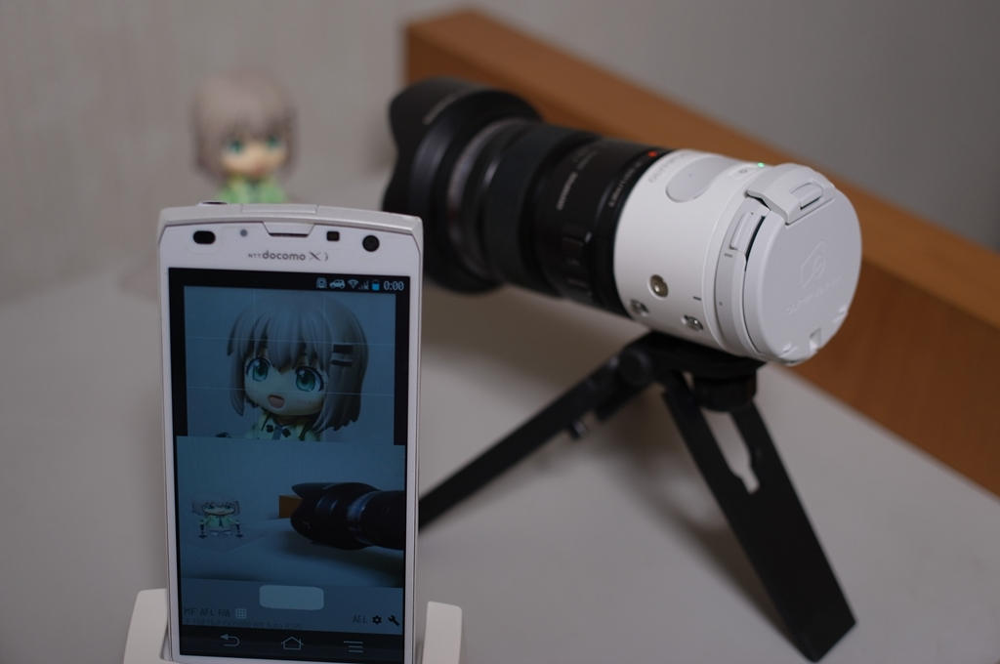

## インストール

Android バージョン4.0 以上に対応しています。 アプリケーションのapkファイルをインストールしてください。（Google Play で配布しています。）

* [https://play.google.com/store/apps/details?id=jp.osdn.gokigen.aira01b](https://play.google.com/store/apps/details?id=jp.osdn.gokigen.aira01b)

## 画面遷移

AirA01bの画面遷移を以下に示します。AirA01b を起動すると、Olympus AirにWiFi接続を行います。接続終了後、撮影画面に移行します。
画面下部のボタンを押すことで、設定画面に遷移します。画像の加工や参照の画面に移動する場合は、一度、設定画面を経由する必要があります。

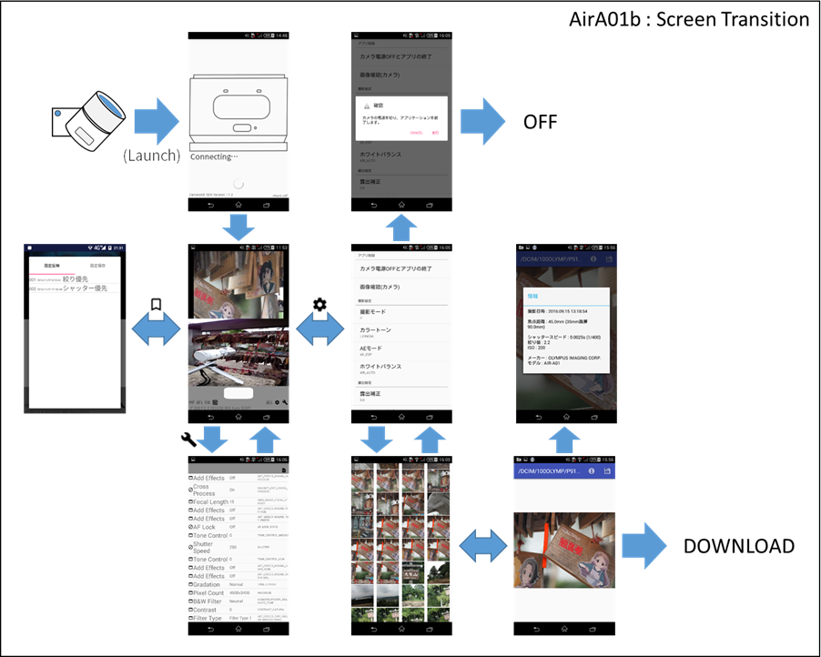

## 操作説明

### 表示モードについて

AirA01bは、３つの表示モードを持っています。設定画面の画面下部の表示にて切り替えます。

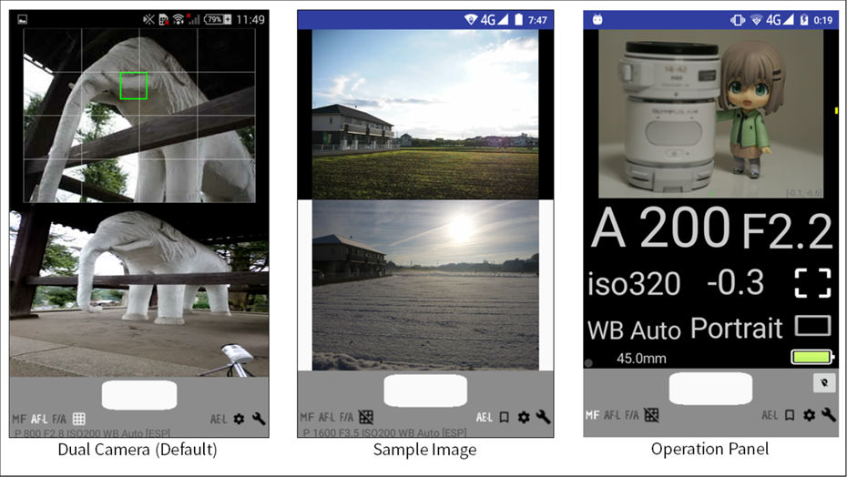

* **デュアルカメラモード** (デフォルト)
  * Olympus Air と スマートフォンのカメラを同時に撮影するモードです。初期設定はこのモードです。
* **作例表示モード**
  * スマートフォン内にある画像を画面下部に表示するモードです。同じ場所を同じアングルで撮影したいとき（たとえば季節が違うとか）にご利用ください。
* **操作パネルモード**
  * 画面下部にOlympus Airの設定状態を表示・操作するモードです。値をタッチし左右に動かして選択することで、設定値の変更が容易にできます。

### 撮影画面

以下にデュアルカメラモードのときの撮影画面の全体を示します。作例表示モードや操作パネルモードのときは、画面下部の「スマートフォンカメラ撮影画面」部分がそれぞれ切り替わります。

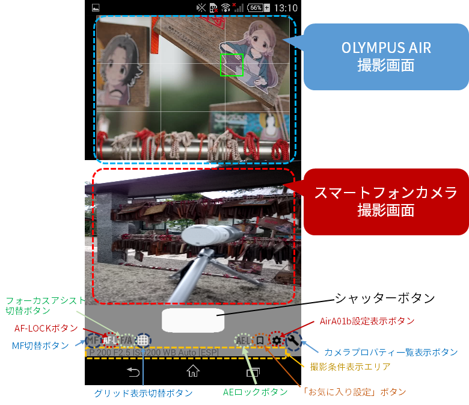

#### OLYMPUS AIR 撮影画面

OLYMPUS AIRのカメラの撮影プレビュー表示です。この領域内をタッチするとそのタッチした位置にフォーカスを合わせます。
緑枠がフォーカスが設定された位置、赤枠はフォーカス設定不可のエリア、黄枠はフォーカス合わせ失敗の状態を示します。

#### スマートフォンカメラ 撮影画面(デュアルカメラモード時)

デュアルカメラモードのときは、スマートフォンカメラの撮影プレビュー表示を行います。
残念ながらプレビュー自体は、すこし横に引き伸ばされてしまっていますが、撮影結果は通常通りの結果となりますのでご安心ください。
この領域内をタッチすると、自動でフォーカスを合わせます。（フォーカス位置の指定はできません。ご了承ください。）

#### スマートフォン内画像表示(作例表示モード時)

作例表示モードのときは、画面下部に指定したスマートフォン内の画像を表示します。ピンチイン・ピンチアウトで表示の拡大縮小が可能です。
スマートフォン内の画像を表示するので、表示する画像はOlympus Airで撮影した画像でなくても表示可能です。
表示する画像は、AirA01b設定画面の「作例の選択」で設定してください。

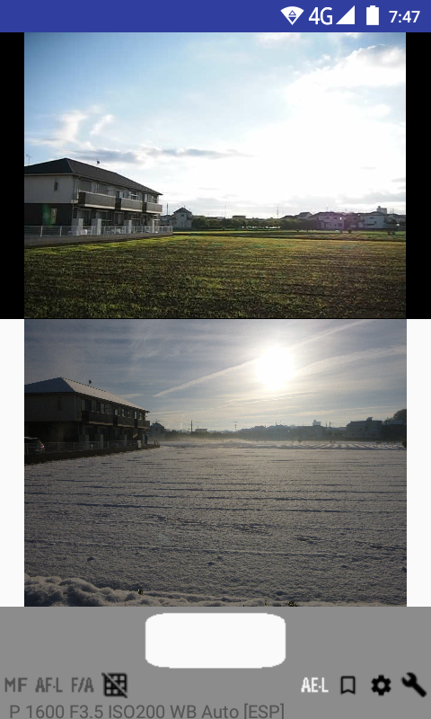

#### 操作パネル表示(操作パネルモード時)

Olympus Airの撮影設定が表示されます。表示されている値をタッチしてそのまま左右に動かして離すと、値を変更できます。

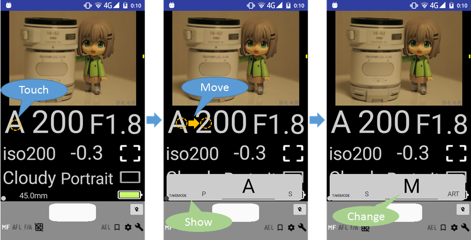

操作パネルの表示内容は以下を参照してください。

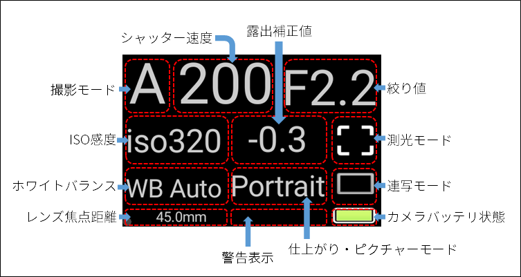

電動ズームレンズを装着しているときには、レンズ焦点距離部分のところをタッチしたままスライドすると、ズームアウト・ズームインの操作が可能です。

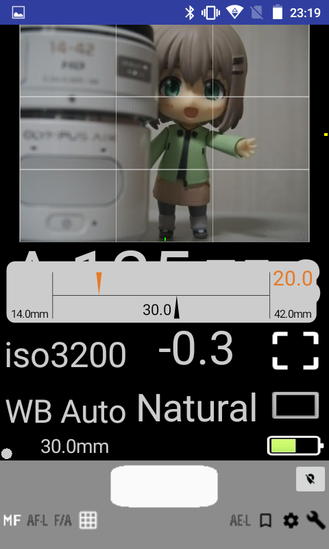

#### シャッターボタン

シャッターボタンは撮影を指示するボタンです。
デュアルカメラモードの場合、OLYMPUS AIR撮影画面とスマートフォンカメラ撮影画面の画像を同時に撮影します。
ただし、AirA01b設定画面で「内蔵カメラで撮影をしない」にチェックが入っている場合は、スマートフォンカメラでの撮影を行いません。また、作例表示モード、操作パネルモードのときも、スマートフォンカメラの撮影は行いません。

カメラの撮影モードが動画撮影の場合、あるいはドライブモードが連続撮影モードになっている場合は、シャッターボタンを押すと撮影/録画を開始し、もう１回押すと終了します。
この場合、画面中央上部に撮影中表示を行います。（連続撮影モードは緑色で「撮影中」、動画撮影モードは赤色で「●REC」の表示）

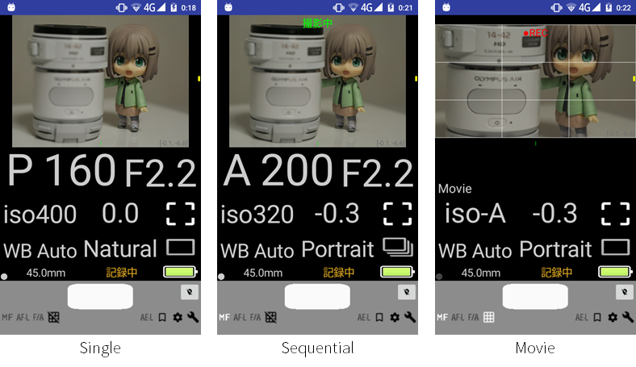

#### MF切替ボタン

タッチするとオートフォーカス/マニュアルフォーカスを切り替えます。

#### AF LOCKボタン

オートフォーカスが成功すると、点灯します。タッチするとフォーカスをアンロックして消灯します。

#### フォーカスアシスト切替ボタン

タッチすると、フォーカスアシストモードに切替え点灯します。もう一度タッチすると消灯し、フォーカスアシストモードを解除します。

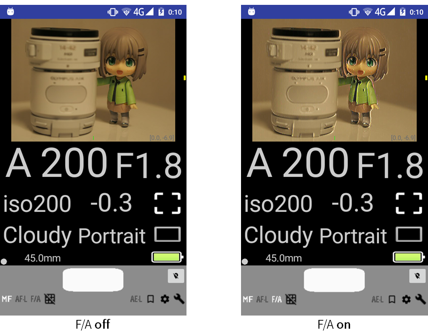

#### グリッド表示切替ボタン

タッチすると点灯し、グリッド表示を行います。もう一度タッチすると消灯し、グリッド表示が解除されます。

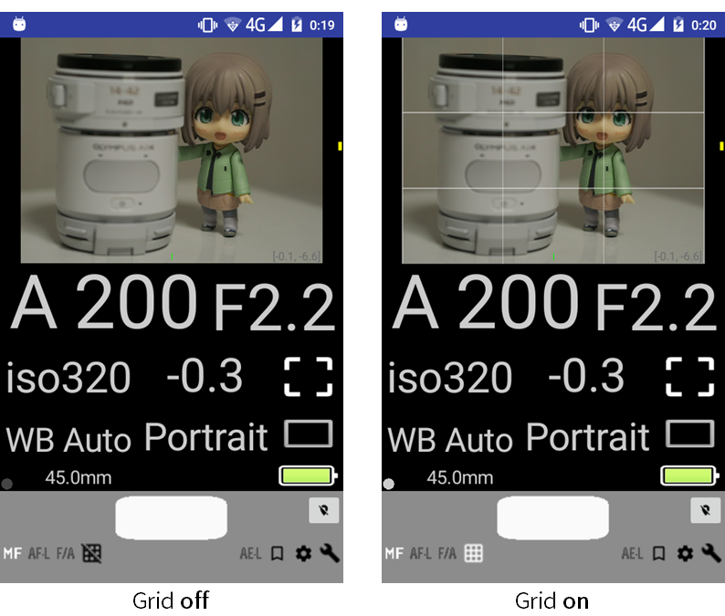

#### タイマーボタン

タッチすると点灯し、インターバル撮影ができるようになります。もう一度タッチすると消灯し、インターバル撮影モードが解除されます。
インターバル撮影モードの詳細は、設定画面でカスタマイズが可能です。

#### AEロックボタン

タッチすると点灯し、AEをロックします。もう一度タッチすると消灯し、AEがアンロックされます。

#### 「お気に入り設定」ボタン

タッチすると、「お気に入り設定」ダイアログを表示します。「設定反映」タブで以前保存した設定の一覧を表示し、タッチすると、その設定を呼び出します。
「設定保存」タブでは、現在の設定を保存します。以前の設定項目の保存ボタンを押すと、上書きします。一番下の項目にラベルを記入して保存すると、新しい項目として保存します。
お気に入り設定は、約200個保存できます。

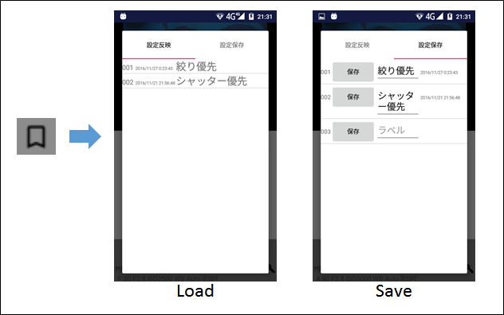

#### AirA01b 設定表示ボタン

タッチすると、画面をAirA01b設定画面に切替えます。詳細は後述する AirA01b 設定画面 を参照してください。

#### カメラプロパティ一覧表示ボタン

タッチすると、画面をカメラプロパティ一覧表示画面に切り替えます。詳細は後述する カメラプロパティ一覧画面 を参照してください。

#### GPS記録切替ボタン

シャッターボタンの右に表示されているボタンです。スマートフォンでGPS機能が使用可能な場合に表示されます。位置情報を取得し画像撮影時に位置情報を記録するようになります。位置情報が取得できたときには、画面左上にその位置情報を表示します。
位置情報の記録を解除する場合には、もう一度ボタンをタッチして、GPS OFF状態にしてください。

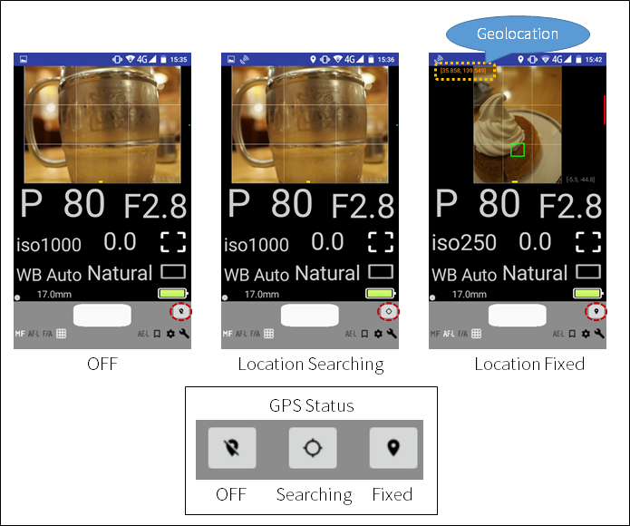

#### 撮影条件表示エリア

ここには、撮影条件（撮影モード、シャッター速度、絞り値、ホワイトバランス、測光モード、露出警告）を表示します。
ただし、画面下部の表示が操作パネルモードのときは（表示がかぶるので）何も表示しません。

### AirA01b設定画面

カメラの設定を行う画面です。

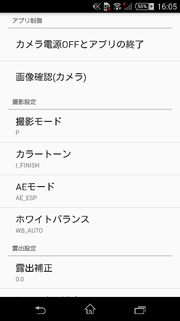

#### アプリ制御

##### カメラ電源OFFとアプリの終了

この項目を選択すると、OLYMPUS AIR A01の電源をオフにするのとともに、アプリ（AirA01b）も終了します。動作する前に、確認のダイアログを表示します。

##### 画像確認(カメラ)

この項目を選択すると、カメラ内撮影画像一覧画面に切り替わります。

##### 画像の加工

この項目を選択すると、画像の加工画面に切り替わります。

#### 撮影設定

##### 撮影モード

撮影モードの設定を行います。以下の設定が可能です。

* **iAuto**
  * iAutoモード : カメラが撮影シーンを判定し自動的に適切な設定にする露出モードです
* **P**
  * プログラム(P)モード : 被写体の明るさに応じて、最適な絞り値とシャッター速度をカメラが自動的に設定する露出モードです
* **A**
  * 絞り優先(A)モード : 絞り値を設定するとカメラが適正なシャッター速度を自動的に設定する露出モードです
* **S**
  * シャッター速度優先(S)モード : シャッター速度を設定するとカメラが適正な絞り値を自動的に設定する露出モードです
* **M**
  * マニュアル(M)モード : 絞り値とシャッター速度を自分で設定する露出モードです
* **ART**
  * アートフィルターモード : おしゃれで個性的な写真が簡単に撮れる、オリンパスならではのフィルター処理を実現するモードです
* **Movie**
  * 動画モード : 動画を撮影するモードです

==== カラートーン ====
仕上がり・ピクチャーモードの設定を行います。以下の設定が可能です。

* **i-Enhance**
  * i-Finishで、撮影シーンに合った印象的な仕上がりになります。
* **Vivid**
  * Vivid で、色鮮やかに仕上げます。
* **Natural**
  * NATURAL で、自然な色合いに仕上げます。
* **Muted**
  * FLAT で、素材性を重視した仕上がりになります。
* **Portrait**
  * Portrait で、肌色をきれいに仕上げます。
* **Monotone**
  * モノトーンで、モノクロ調に仕上げます。
* **e-Portrait**
  * eポートレートで、肌をなめらかに整えます。
* **Color Creator**
  * カラークリエーターの色相と彩度が適用されます。
* **Pop Art**
  * アートフィルターのポップアートが適用されます。
* **Soft Focus**
  * アートフィルターのファンタジックフォーカスが適用されます。
* **Pale&Light Color**
  * アートフィルターのデイドリームが適用されます。
* **Light Tone**
  * アートフィルターのライトトーンが適用されます。
* **Grainy File**
  * アートフィルターのラフモノクロームが適用されます。
* **Pin Hole**
  * アートフィルターのトイフォトが適用されます。
* **Diorama**
  * アートフィルターのジオラマが適用されます。
* **Cross Process**
  * アートフィルターのクロスプロセスが適用されます。
* **Gentle Sepia**
  * アートフィルターのジェントルセピアが適用されます。
* **Dramatic Tone**
  * アートフィルターのドラマチックトーンが適用されます。
* **Key Line**
  * アートフィルターのリーニュ　クレールが適用されます。
* **Watercolor**
  * アートフィルターのウォーターカラーが適用されます。
* **Vintage**
  * アートフィルターのヴィンテージが適用されます。
* **Partcolor**
  * アートフィルターのパートカラーが適用されます。

##### AEモード

測光モードの設定を行います。以下の設定が可能です。

* **ESP**
  * デジタルESP測光 : 画面を324分割測光し、撮影シーンや顔などを考慮し最適な露出値を演算します。
* **Ctr-Weighted**
  * 中央重点平均測光 : 画面の中央部に重点を置いて、画面全域を平均測光します。
* **Spot**
  * スポット測光 : 狭い範囲（画面の約2％）の明るさを測光するときに使います。測光した箇所が適正な明るさになります。(デフォルトの)測光ポイントは画面中央です。

##### ホワイトバランス

ホワイトバランスの設定を行います。以下の設定が可能です。

* **Auto WB**
  * オートホワイトバランスで、一般的なほとんどの撮影シーン（画面内に 白に近い色が存在する撮影シーン）に最適です。
* **Daylight**
  * 晴天の日に屋外で撮るとき、夕焼けを赤く撮るとき、花火を撮るときに最適なプリセットホワイトバランス設定です。色温度は5300Kです。
* **Shade**
  * 晴天の日に屋外の日陰で撮るときに最適なプリセットホワイトバランス設定です。色温度は7500Kです。
* **Cloudy**
  * 曇天の日に屋外で撮るときに最適なプリセットホワイトバランス設定です。色温度は6000Kです。
* **Tungsten Light**
  * 電球に照らされている被写体を撮るときに最適なプリセットホワイトバランス設定です。色温度は3000Kです。
* **Fluorescent Light**
  * 蛍光灯に照らされている被写体を撮るときに最適なプリセットホワイトバランス設定です。色温度は4000Kです。
* **Underwater**
  * 水中で撮るときに最適なプリセットホワイトバランス設定です。色温度は5500Kです。
* **Custom WB**
  * カスタムホワイトバランス設定です。デフォルトの色温度は5400Kです。

#### 露出設定

##### 露出補正

露出補正を行います。

##### シャッター速度

OLYMPUS AIR A01のシャッター速度を設定します。撮影モードが S または M のときに設定が可能です。

##### 露出

OLYMPUS AIR A01の絞り値を設定します。撮影モードが A または M のときに設定が可能です。

##### ISO感度

ISO感度を設定します。

#### ライブビュー設定

##### ライブビュー品質

OLYMPUS AIR A01から送られてくるライブビュー画像の解像度を設定します。

##### フォーカスグリッドタイプ

フォーカスグリッドモードで表示するグリッドの形式を設定します。

##### フォーカスアシストタイプ

フォーカスアシストを有効にしたときの表示タイプを設定します。

##### デジタル水準器

チェックを入れるとデジタル水準器の表示を行います。

##### ライブビューを同時保存

チェックを入れると、シャッターボタンを押したタイミングでライブビューの画像を保存します。

##### ライブビュー拡大倍率

撮影画面にある、ライブビュー拡大ボタンを押したときに拡大する倍率を選択します。
以下の選択肢があります。

* 段階切替 (STEP)
* 5.0
* 7.0
* 10.0
* 14.0

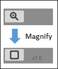

#### カメラ

##### シャッター音

OLYMPUS AIR A01での撮影時に出すシャッター音の音量を設定します。

##### RAW記録

この項目にチェックが入っていると、OLYMPUS AIR A01で撮影するときに、RAWファイルでの記録を行います。

#### 内蔵カメラ

##### Camera ID

通常は 0 でご使用ください。 1に変更すると、（たぶん）インカメラが有効になります。

##### 画像の回転

通常は変更する必要はありません。もし、画像が適切に表示されない場合には、変更を試してください。

##### 内蔵カメラで撮影をしない

スマートフォン内蔵のカメラとOLYMPUS AIR A01のカメラの同時撮影をしない場合にチェックをいれてください。
チェックが入っていると、OLYMPUS AIR A01だけでカメラ撮影します。

#### 画面下部の表示内容

##### 画面下部の表示

画面下部の表示内容を選択します。デフォルトは、「スマートフォンのカメラ」となっています。
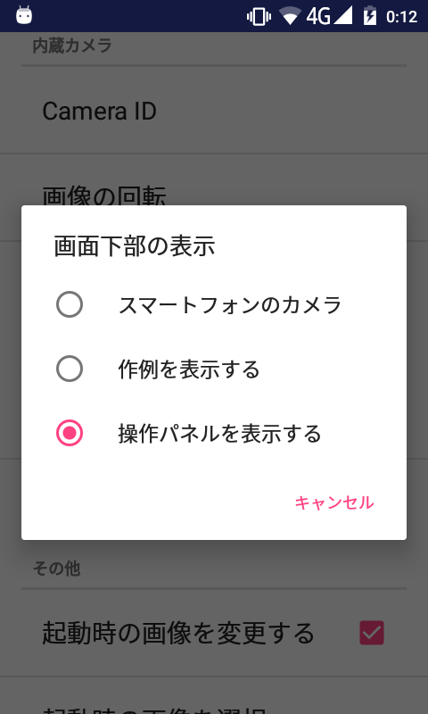

##### 操作パネルのフリック感度

操作パネルのフリック操作の感度を設定します。

##### 作例の選択

「画面下部の表示」が「作例を表示する」となっているときに表示する画像を選択します。

#### インターバル撮影

##### インターバル撮影をする

チェックを入れると、インターバル撮影を行います。
以下の設定の撮影タイプ、撮影枚数、撮影間隔で撮影します。また、このチェックは、OLYMPUS AIR 撮影画面上にあるタイマーボタンと連動しています。

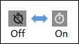

##### 撮影タイプ

インターバル撮影時の撮影タイプを選択します。以下の選択が可能です。

* 撮影条件一定
* 露出ブラケット
* 絞りブラケット
* ISOブラケット
* シャッターブラケット
* ホワイトバランスBKT
* カラートーンBKT

##### 撮影枚数

1枚〜71枚 の設定が可能です。

##### 撮影間隔(秒)

0秒〜180秒の設定が可能です。

#### 起動時設定

##### BluetoothでカメラON

起動時BluetoothでカメラをONにします。

##### カメラBluetooth設定

Olympus AirのBluetooth設定を登録します。複数台の登録が可能です。

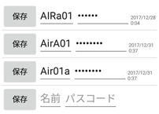

#### その他

##### 画像保存後に共有呼出

チェックを入れると、Olympus Air から画像ファイル(Jpegファイルのみです)をダウンロードした時、
もしくは画像の加工で加工した画像を保存したとき、共有機能を呼び出します。

##### 起動時の画像を変更する

チェックを入れると、AirA01b起動時に表示する画像をほかの画像に差し替えます。
差し替える画像は「起動時の画像を選択」で選択してください。

##### 起動時の画像を選択

ここをタッチして、起動時の画像を選択してください。

##### 画像一覧でメニューを表示

画像一覧にメニューボタンを表示します。

#### カメラ情報

##### 焦点距離

OLYMPUS AIR A01 に装着されているレンズの焦点距離です。オールドレンズを使っている場合は、0mmと表示します。

##### レンズ状態

現在のレンズ状態を示します。通常は normal です。

##### SDカード状態

SDカードの状態を示します。 通常は normal です。

##### Camera Version

オープンプラットフォームカメラ(Olympus Air)のバージョンを示します。

##### Camera kit Version

AirA01bが使用している [Olympus Camera Kit](https://opc.olympus-imaging.com/tools/sdk/) のバージョンを示します。

##### OpenCV Version

AirA01bが使用している [OpenCV](https://opencv.org/) のバージョンを示します。

#### GOKIGEN PROJECT

本プロジェクトサイトへのリンクです。AirA01bがカメラと接続状態のときには直接開けませんのでご了承ください。

##### AirA01b 操作説明

[AirA01b 操作説明のページ（本ページ）](https://github.com/MRSa/GokigenOSDN_documents/blob/main/Applications/AirA01b/Readme.md)をブラウザで開きます。

##### プライバシーポリシー

[GOKIGENプロジェクト](https://osdn.net/projects/gokigen/)の[プライバシーポリシー](https://github.com/MRSa/GokigenOSDN_documents/blob/main/PrivacyPolicy.md)ページを開きます。

### カメラプロパティ一覧画面

OLYMPUS AIR A01の持つカメラプロパティを一覧表示する画面です。

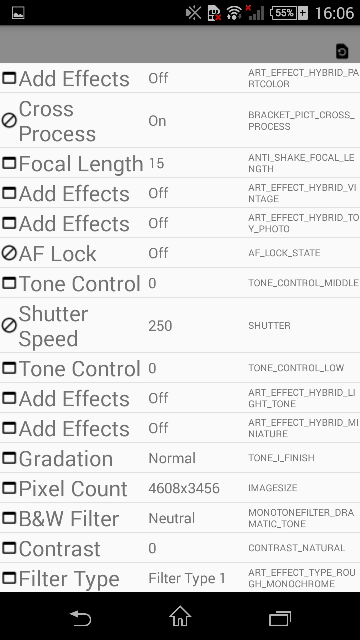

一番左に表示しているアイコンで、編集不可、編集可能、編集中の状況を示します。

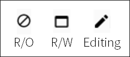

編集可能なカメラプロパティをタッチすると、カメラプロパティの選択肢が表示されます。現在の設定値を (*) で示します。 

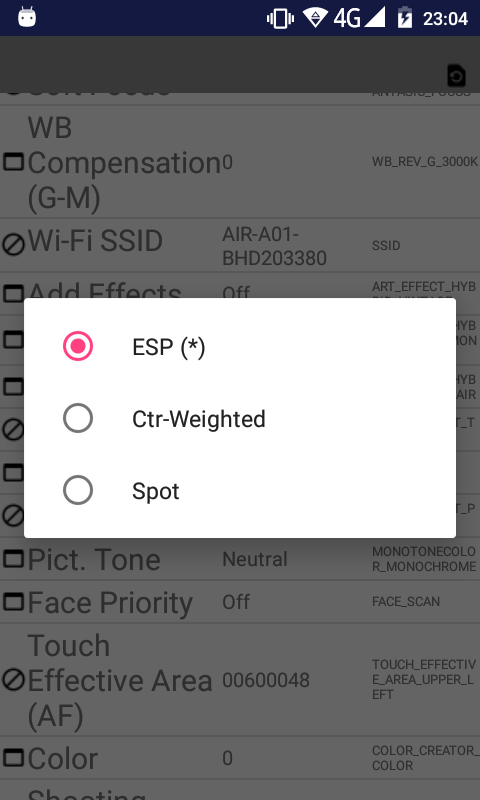

カメラプロパティ画面で編集した値は、すぐにカメラに反映させるのではなく、本画面から抜けるときに一括でカメラに設定を行います。
編集中の値を画面オープン時の状態に戻すには右上のボタンを押してください。

なお、カメラプロパティの編集可否条件や意味の詳細は、[Olympus Camera Kit カメラプロパティリスト](https://opc.olympus-imaging.com/sdkdocs/data/PropertyList/property_list.html) を参照してください。

### カメラ内撮影画像一覧画面

OLYMPUS AIR A01 のカメラ内にある、撮影画像の一覧画面です。
設定画面の「画像確認(カメラ)」を選択すると、本画面を表示します。
画像を長押しすると選択ができ、まとめてダウンロードや削除を実施することができます。

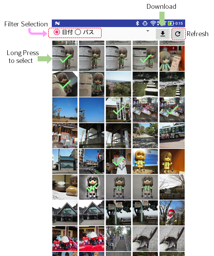

画面上部のラジオボタンで撮影日付別、カメラ内のフォルダ別を選び、その隣のエリアで、アイテムを選ぶと、
画像の一覧をフィルタリングして表示することができます。

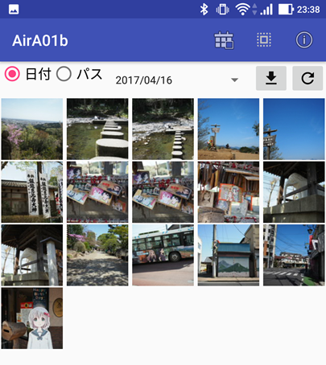

なお、設定画面で、「画像一覧でメニューを表示」にチェックを入れるとメニューアイコンを表示します。
それらのアイコンは、左から以下の機能を持っています。

* スマートフォンの時刻をカメラに設定します。
* 画像を全選択・全選択解除を行います。
* Olympus Camera Kitのバージョンを表示します。

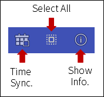

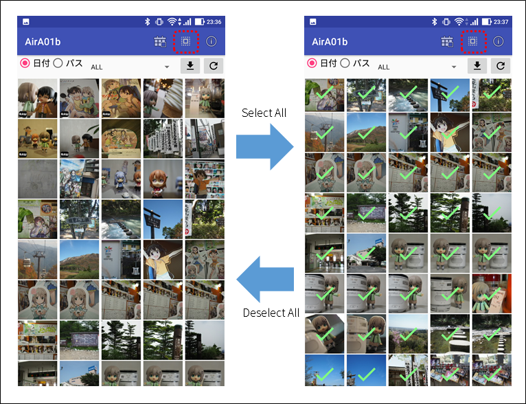

画像をタッチすると、カメラ撮影画像になります。

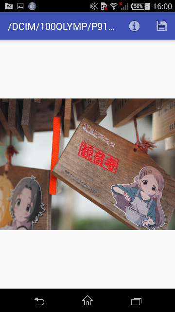

画像は、ピンチアウトで拡大することが可能です。

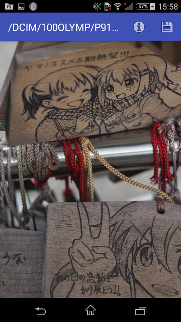

「i」を押すと、撮影情報を表示します。

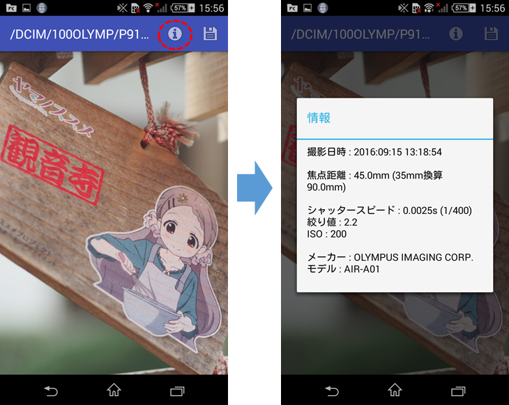

フロッピーディスクアイコンを押すと、カメラ画像をスマートフォンに取得することができます。もちろん、RAWファイル、動画ファイルも取得できます。

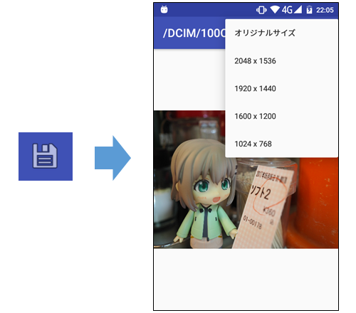

### 画像の削除

画像の削除機能を使用するためには、設定画面で「画像一覧でメニューを表示」にチェックを入れ、削除したい画像を長押しした後で、メニューの「画像の削除」を選ぶことで削除ができるようになります。
なお、画像の削除は、**SDKの制約から、同じ名前のJPEGファイルとRAWファイルをまとめて削除します**のでご注意ください。

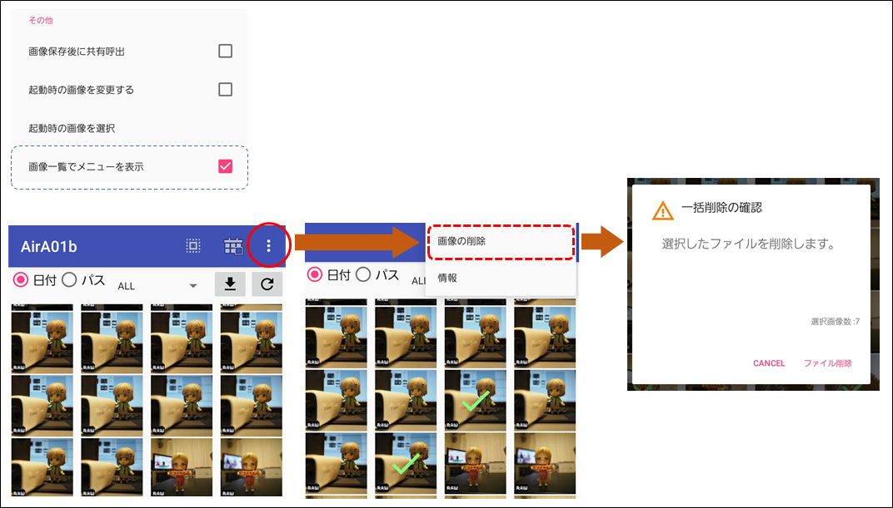

### 画像の加工画面

画像の加工画面では、スマートフォン内にある２つの画像を選択し、結合することができます。左右結合、上下結合、はめ込み合成の３種類が可能です。
２つある「画像を選択...」ボタンで画像を選び、右上のボタンで加工メニューを選択します。

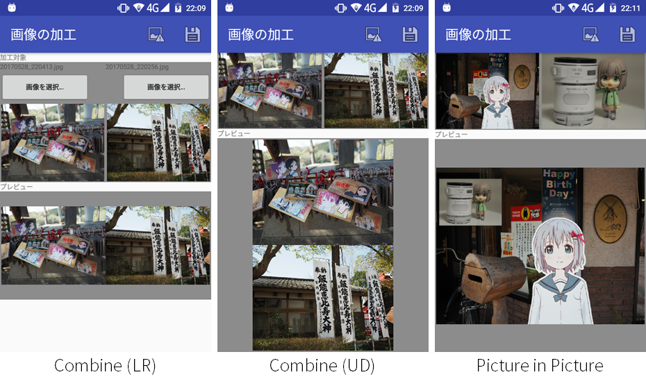

## 変更履歴

* 1.2.0 : 「お気に入り設定」と「作例表示モード」を搭載しました。
* 1.4.0 : スマートフォン内の画像について合成ができるようになりました。
* 1.5.0 : デジタル水準器の搭載、およびGPSの位置情報を記録できるようになりました。
* 1.6.0 : 動画撮影モードおよび連撮モードを有効にしました。また、画面下部の表示に「操作パネル」を追加しました。
* 1.6.1 : 操作パネルモードに、「電動ズームの動作」「ARTモードでアートフィルターの切り替え」の機能を追加しました。
* 1.7.0 : 起動時、カメラに接続失敗したときに、WIFI設定画面を開けるようにしました。またインターバル撮影/ブラケット撮影機能を搭載しました。
* 1.10.0 : 撮影画像一覧画面で、撮影日付またはカメラ内画像格納フォルダでフィルタができるようになりました。また、撮影画像一覧画面で複数の画像を選択し、一括ダウンロードができるようになりました。
* 1.11.0 : ライブビュー画像の遅延表示ができるようになりました。
* 1.12.4 : 撮影画像一覧画面で、画像を複数選択し、一括削除ができるようになりました。
* 1.12.5 : SDKを最新に更新しました。

## その他

### OpenCVの使用について

AirA01bは、 [OpenCV](https://opencv.org/)[(ライセンス)](https://github.com/opencv/opencv/blob/4.4.0/LICENSE)を使用して、Focus Assist(F/A)の機能を実現しています。ありがとうございます。

### Android 6.0 以降における注意事項（カメラの撮影、ファイルの書き込み許可）

Android 6.0以降では、カメラの撮影や外部ストレージに書き込みをするためにはアプリケーションの設定で特別な許可が必要となります。
もし、許可を与えていない場合には、スマホ内蔵カメラの画像が表示されない、撮影画像画面で情報が表示されない、画像がカメラから
Androidへ転送できないといった問題が発生しますので、ご注意ください。

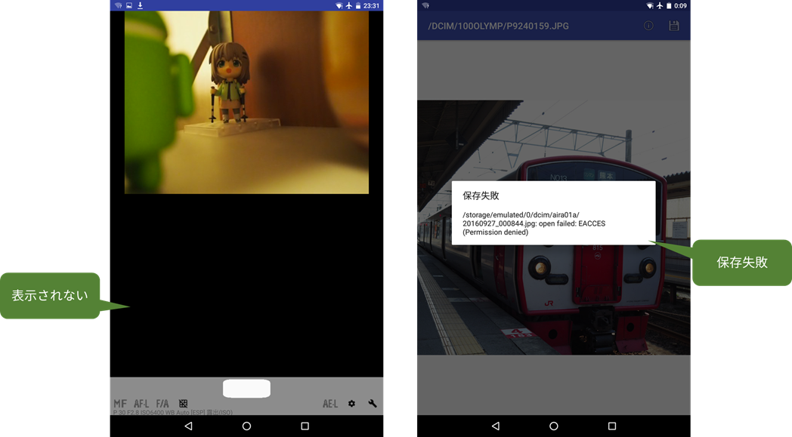

このような場合には、AirA01bのアプリ情報から、許可設定の変更をお願いします。 （「設定」→「アプリ」→「アプリ情報」→「アプリの権限」）

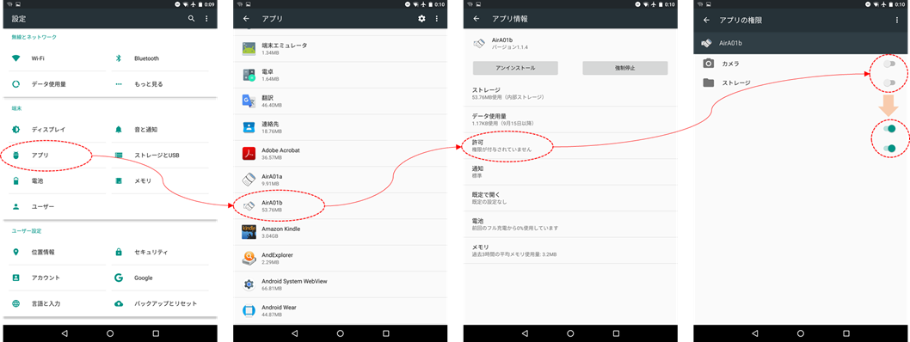

### permissionについて

AirA01b は、次のパーミッションを指定し使用しています。

* android.permission.ACCESS_FINE_LOCATION
  * 位置情報を撮影画像に記録するため
* android.permission.ACCESS_NETWORK_STATE
  * カメラ(Olympus Air)と無線LAN接続をするため
* android.permission.ACCESS_WIFI_STATE
  * カメラ(Olympus Air)と無線LAN接続をするため
* android.permission.INTERNET
  * カメラ(Olympus Air)と無線LAN接続をするため
* android.permission.VIBRATE
  * 一部の操作時に、バイブレーションでフィードバックを伝えるため
* android.permission.WRITE_EXTERNAL_STORAGE
  * カメラ(Olympus Air)から転送された画像を外部ストレージに書き込みするため
* android.permission.CAMERA
  * スマートフォンのカメラで撮影するため
* android.permission.BLUETOOTH
  * カメラ(Olympus Air)の電源をBLE経由で電源を入れるため
* android.permission.BLUETOOTH_ADMIN
  * カメラ(Olympus Air)の電源をBLE経由で電源を入れるため
* android.permission.ACCESS_COARSE_LOCATION
  * 位置情報を撮影画像に記録するため

### ソースコード

AirA01b のソースコードは、以下のGitリポジトリから取得可能です。随時更新していきます。

* [https://github.com/MRSa/AirA01b.git](https://github.com/MRSa/AirA01b.git)

### OlympusCameraKitについて

AirA01b は、OlympusCameraKit を使用してOLYMPUS AIR A01と通信を行います。そのため、以下の「SDKダウンロード許諾契約書」の条件に従います。

* [EULA_OlympusCameraKit_ForDevelopers_jp.pdf](https://github.com/MRSa/gokigen/blob/5ec908fdbe16c4de9e37fe90d70edc9352b6f948/osdn-svn/Documentations/miscellaneous/EULA_OlympusCameraKit_ForDevelopers_jp.pdf)

以上
