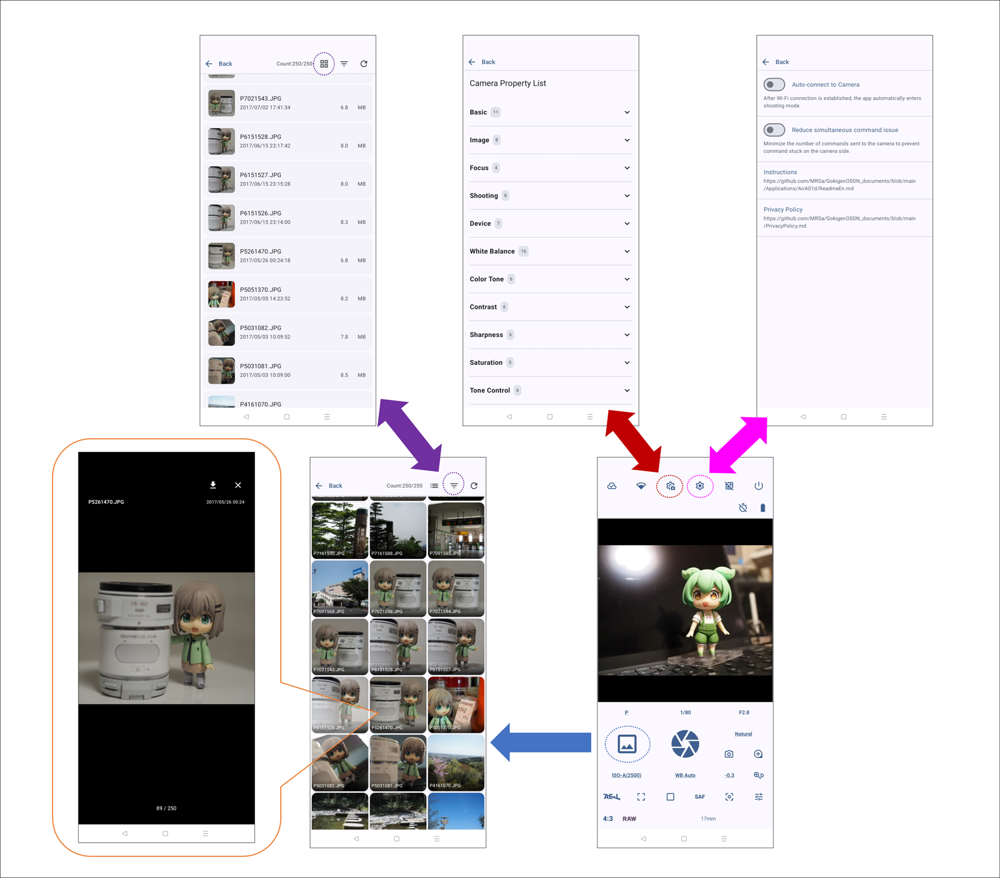
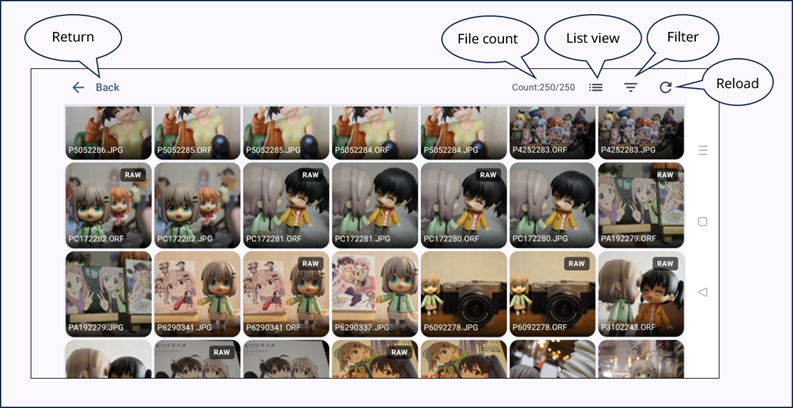
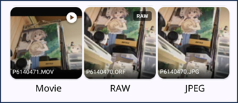
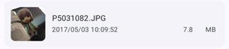
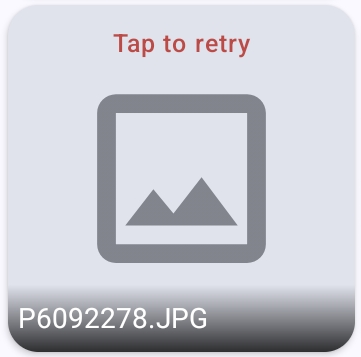
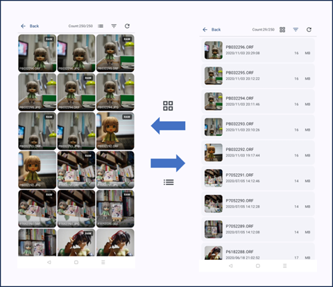
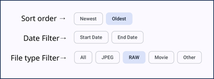
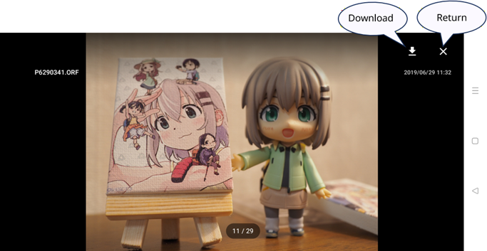
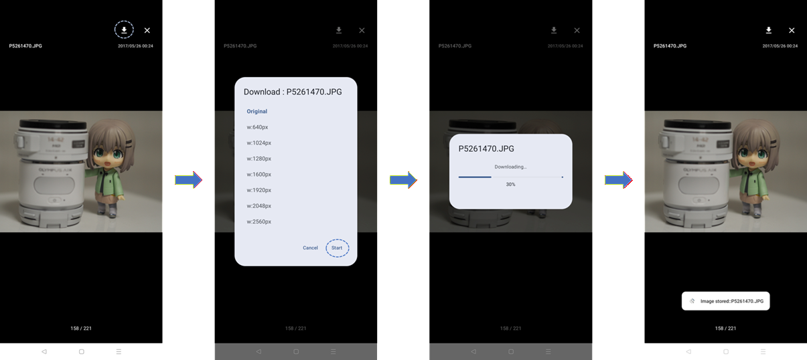

# AirA01d: Android Application for OLYMPUS AIR A01

-----

## Table of Contents

- [AirA01d: Android Application for OLYMPUS AIR A01](#aira01d-android-application-for-olympus-air-a01)
  - [Table of Contents](#table-of-contents)
  - [Overview](#overview)
  - [Supported Cameras](#supported-cameras)
  - [Installation](#installation)
  - [Screen Transitions](#screen-transitions)
  - [Basic Operations](#basic-operations)
    - [Connecting to the Camera](#connecting-to-the-camera)
    - [Taking Photos](#taking-photos)
    - [Changing Settings](#changing-settings)
    - [Exiting the App](#exiting-the-app)
  - [Shooting Screen](#shooting-screen)
    - [Screen Image](#screen-image)
    - [Camera Connection Button](#camera-connection-button)
    - [Wi-Fi Settings Button](#wi-fi-settings-button)
    - [Camera Property Settings Button](#camera-property-settings-button)
    - [App Settings Button](#app-settings-button)
    - [Grid Display/Hide Button](#grid-displayhide-button)
    - [Power OFF Button](#power-off-button)
    - [Camera Status Display Area](#camera-status-display-area)
    - [Self-Timer](#self-timer)
    - [Camera Battery Status Display](#camera-battery-status-display)
    - [Live View Display](#live-view-display)
    - [Shooting Mode Button](#shooting-mode-button)
    - [Shutter Speed Button](#shutter-speed-button)
    - [Aperture Value Button](#aperture-value-button)
    - [Capture Result Display Button](#capture-result-display-button)
    - [Shutter Button](#shutter-button)
    - [Exposure Compensation Button](#exposure-compensation-button)
    - [Mirrored Display Toggle Button](#mirrored-display-toggle-button)
    - [Live View Zoom Button](#live-view-zoom-button)
    - [ISO Sensitivity Button](#iso-sensitivity-button)
    - [White Balance Button](#white-balance-button)
    - [Picture Mode Button](#picture-mode-button)
    - [AE Lock/Unlock Button](#ae-lockunlock-button)
    - [Metering Mode Button](#metering-mode-button)
    - [Drive Mode Button](#drive-mode-button)
    - [Focus Mode (AF/MF) Button](#focus-mode-afmf-button)
    - [AF Unlock / Center Focus Button](#af-unlock--center-focus-button)
    - [Image Tuning Button (Currently Unused)](#image-tuning-button-currently-unused)
    - [Digital Zoom Button](#digital-zoom-button)
    - [Aspect Ratio Button](#aspect-ratio-button)
    - [RAW Shooting ON/OFF Button](#raw-shooting-onoff-button)
    - [Lens Distance Display Area / Power Zoom Control](#lens-distance-display-area--power-zoom-control)
  - [Captured Images List Screen](#captured-images-list-screen)
    - [Back Button](#back-button)
    - [File Count Display](#file-count-display)
    - [Grid/List View Toggle Button](#gridlist-view-toggle-button)
    - [List Filter Button](#list-filter-button)
    - [Reload Button](#reload-button)
  - [Image Display](#image-display)
  - [Camera Property Settings Screen](#camera-property-settings-screen)
  - [App Settings Screen](#app-settings-screen)
    - [Auto Connect to Camera](#auto-connect-to-camera)
    - [Reduce Simultaneous Command Count](#reduce-simultaneous-command-count)
    - [Operation Guide](#operation-guide)
    - [Privacy Policy](#privacy-policy)
  - [Others](#others)
    - [Notes](#notes)
      - [Unstable Connection?](#unstable-connection)
    - [About Permissions](#about-permissions)
    - [Change Log](#change-log)
    - [Source Code](#source-code)

-----

## Overview

AirA01d is an Android application for the [Open Platform Camera OLYMPUS AIR A01](https://www.olympus-global.com/en/news/2015a/nr150205opce.html). It allows you to connect to and operate the camera (OLYMPUS AIR) from your smartphone.

Unlike [AirA01a](https://play.google.com/store/apps/details?id=jp.osdn.gokigen.aira01a&hl=en) or [AirA01b](https://play.google.com/store/apps/details?id=jp.osdn.gokigen.aira01b&hl=en), this app was created by referring to the communication specifications without using the [Olympus Camera Kit](https://web.archive.org/web/20210204200324/https://dl-support.olympus-imaging.com/opc/files/en/OlympusCameraKit_EN.zip "Olympus Camera Kit"). Consequently, it supports shooting in the **Genius Shooting Mode**, which is not supported by the Olympus Camera Kit.

-----

## Supported Cameras

- [OLYMPUS AIR A01 (Olympus Press Release)](https://www.olympus-global.com/en/news/2015a/nr150205opce.html)
- [AIR A01 Support Topics](https://learnandsupport.getolympus.com/support/air-a01)
- [AIR A01 Instruction Manual](https://learnandsupport.getolympus.com/sites/default/files/media/files/2018/03/AIR_A01_MANUAL.pdf)
  - [Sales of "OLYMPUS AIR A01" ended on March 31, 2018.](https://digital-faq.jp.omsystem.com/faq/public/app/servlet/relatedqa?QID=005796)

-----

## Installation

Available for installation via [Google Play](https://play.google.com/store/apps/details?id=jp.osdn.gokigen.aira01d).
(Also available on [GitHub Releases](https://github.com/MRSa/AirA01d/releases).)

- [https://play.google.com/store/apps/details?id=jp.osdn.gokigen.aira01d](https://play.google.com/store/apps/details?id=jp.osdn.gokigen.aira01d)
- [https://github.com/MRSa/AirA01d/releases](https://github.com/MRSa/AirA01d/releases)

-----

## Screen Transitions

The following shows the screen transitions of AirA01d.

Upon launch, the Shooting Screen is displayed. From the Shooting Screen, you can navigate to the Captured Images List Screen, Camera Property Settings Screen, and App Settings Screen.
Note that navigation to any screen other than the App Settings Screen is only possible when connected to the camera.

The Captured Images List Screen allows toggling between grid view and list view.
Additionally, touching an image will display it in a larger size, from which you can retrieve the image.

## Basic Operations

### Connecting to the Camera

When the app starts, it attempts to connect to the camera via Wi-Fi (this attempt can be disabled using the switch in the App Settings Screen).
If connection is successful, the camera is set to shooting mode and the camera image is displayed.

If the connection fails, a failure dialog is displayed, allowing you to either open the "Wi-Fi Settings" screen or retry the connection.
If the camera is not yet connected via Wi-Fi, please use this opportunity to open the Wi-Fi settings, select the camera's Wi-Fi, and connect.

The camera connection icon changes depending on the connection status with the camera.

When the app is receiving images from the camera, the Wi-Fi settings icon will animate.
Please judge whether data is being sent from the camera based on the state of the Wi-Fi connection icon.

Once the app and camera are connected, use the buttons on the screen to operate the camera.

### Taking Photos

Touching the live view area will set the focus at the touched position when in Auto Focus mode.

Pressing the shutter button records an image. You can also trigger the shutter by pressing the Volume Up button, so you can use a Bluetooth remote shutter button to take photos.

In live view, you can toggle grid display and mirrored (left-right inverted) display. In landscape orientation, you can show or hide shooting values by swiping up or down.

### Changing Settings

Pressing a button on the screen will query the camera for available options for that setting and display them in a list.
Selecting an option from the list sends the corresponding command to the camera to change the setting.
(Depending on the shooting mode, some options may be limited or buttons may not respond if no options are available.)

### Exiting the App

To turn off the camera power and exit the app, use the Power OFF button.
Pressing the Power OFF button will display a confirmation dialog asking if you want to exit; press OK to terminate the app.
The camera's power is turned OFF at the moment the app exits.

-----

## Shooting Screen

### Screen Image

The layout of buttons varies slightly between portrait and landscape orientations.

- **① : Camera Connection**
- **② : Wi-Fi Settings**
- **③ : Camera Property Settings**
- **④ : App Settings**
- **⑤ : Grid Display/Hide**
- **⑥ : Power OFF**
- **⑦ : Camera Status Display**
- **⑧ : Self-Timer**
- **⑨ : Camera Battery Status Display**
- **⑩ : Live View Display**
- **a : Shooting Mode**
- **b : Shutter Speed**
- **c : Aperture Value**
- **d : Capture Result Display**
- **e : Shutter**
- **f : Exposure Compensation**
- **g : Mirrored Display Toggle**
- **h : Live View Zoom**
- **k : ISO Sensitivity**
- **m : White Balance**
- **n : Picture Mode**
- **p : AE Lock/Unlock**
- **q : Metering Mode**
- **r : Drive Mode**
- **s : Focus Mode (AF/MF)**
- **t : AF Unlock / Center Focus**
- **u : (Currently Unused)**
- **v : Digital Zoom**
- **w : Aspect Ratio**
- **x : RAW Shooting ON/OFF**
- **y : Lens Distance Display / Power Zoom Control**

### Camera Connection Button

Button to establish a connection with the camera. The icon changes based on the connection status.

### Wi-Fi Settings Button

Pressing this button opens the Android Wi-Fi settings screen. Also, while connected and displaying live view, it animates to indicate that images are being received.

### Camera Property Settings Button

Opens the "Camera Property Settings" screen where you can change internal camera settings (described later).

### App Settings Button

Opens the "App Settings" screen (described later).

### Grid Display/Hide Button

Toggles whether a grid is displayed over the live view screen.

### Power OFF Button

Turns off the camera power and exits the app. Pressing this button displays a confirmation dialog; select "OK" to exit.

### Camera Status Display Area

Area that shows the current operating state of the camera:

- **Exposure Error**: Warns if the image is too dark or too bright.
- **Recording**: Displays when an image is being recorded to the microSD card after pressing the shutter button.
- **Shooting**: Indicates that shooting is in progress (e.g., continuous drive mode or motion capture).

### Self-Timer

Configures the self-timer. Each press cycles through "Off", "3 sec", "5 sec", and "10 sec".
Pressing this button during a countdown will cancel it.

### Camera Battery Status Display

Indicates camera battery level in three stages (Full, Medium, None).

### Live View Display

Displays the image from the camera.

### Shooting Mode Button

Sets the shooting mode. The following settings are available:

- **iAuto**
  - iAuto Mode: An exposure mode where the camera automatically determines the scene and applies appropriate settings.
- **P**
  - Program (P) Mode: An exposure mode where the camera automatically sets the optimal aperture and shutter speed based on subject brightness.
- **A**
  - Aperture Priority (A) Mode: An exposure mode where you set the aperture, and the camera automatically determines the appropriate shutter speed.
- **S**
  - Shutter Priority (S) Mode: An exposure mode where you set the shutter speed, and the camera automatically determines the appropriate aperture.
- **M**
  - Manual (M) Mode: An exposure mode where you manually set both aperture and shutter speed.
- **ART**
  - Art Filter Mode: A unique Olympus mode that allows for easy creation of stylish and individual photos using various filter processes.
- **movie**
  - Movie Mode: Mode for recording videos.
- **Genius**
  - Genius Shooting Mode: A mode where the camera automatically recognizes the optimal framing, color, brightness, and effects for the subject, generating 6 photos (7 if RAW is ON) in a single shot.

### Shutter Speed Button

Displays the current shutter speed.

### Aperture Value Button

Displays the current aperture value.

### Capture Result Display Button

When shooting preview mode is ON, it displays the most recently taken image. Touching it navigates to the Captured Images List Screen.
Long-pressing will re-fetch the latest image and display it on the button.
**Please avoid long-pressing this button if no photo has been taken yet**, as it may cause communication congestion on the camera side.

### Shutter Button

Pressing this button starts capturing an image.

### Exposure Compensation Button

Displays the exposure compensation value.

### Mirrored Display Toggle Button

Toggles between a normal image and a left-right mirrored image. Useful for selfies, etc.

### Live View Zoom Button

Cycles the zoom magnification of the center of the live view: "5x" → "7x" → "10x" → "14x" → "1x (Cancel Zoom)" → "5x" ...

### ISO Sensitivity Button

Displays the current ISO sensitivity.

### White Balance Button

Sets the white balance. The following settings are available:

- **Auto WB**
  - Auto White Balance: Optimal for most general shooting scenes (where colors close to white exist in the scene).
- **Daylight**
  - Preset WB optimal for outdoor shooting on sunny days, red sunsets, or fireworks. Color temperature is 5300K.
- **Shade**
  - Preset WB optimal for shooting in the shade outdoors on sunny days. Color temperature is 7500K.
- **Cloudy**
  - Preset WB optimal for outdoor shooting on cloudy days. Color temperature is 6000K.
- **Tungsten Light**
  - Preset WB optimal for subjects lit by incandescent bulbs. Color temperature is 3000K.
- **Fluorescent Light**
  - Preset WB optimal for subjects lit by fluorescent lamps. Color temperature is 4000K.
- **Underwater**
  - Preset WB optimal for shooting underwater. Color temperature is 5500K.
- **Custom WB**
  - Custom White Balance setting. Default color temperature is 5400K.

### Picture Mode Button

Sets the finish/picture mode. The following are available, though some may be restricted depending on the shooting mode:

- **i-Enhance**: i-Finish provides an impressive result suited to the scene.
- **Vivid**: Vivid produces bright and vivid colors.
- **Natural**: NATURAL produces natural color tones.
- **Muted**: FLAT emphasizes the raw materials of the image.
- **Portrait**: Portrait finishes skin tones beautifully.
- **Monotone**: Finishes in a monochrome style.
- **e-Portrait**: e-Portrait smooths and refines skin.
- **Color Creator**: Applies Color Creator hue and saturation.
- **Pop Art**: Applies Pop Art art filter.
- **Soft Focus**: Applies Fantastic Focus art filter.
- **Pale&Light Color**: Applies Daydream art filter.
- **Light Tone**: Applies Light Tone art filter.
- **Grainy File**: Applies Rough Monochrome art filter.
- **Pin Hole**: Applies Toy Photo art filter.
- **Diorama**: Applies Diorama art filter.
- **Cross Process**: Applies Cross Process art filter.
- **Gentle Sepia**: Applies Gentle Sepia art filter.
- **Dramatic Tone**: Applies Dramatic Tone art filter.
- **Key Line**: Applies Ligne Clair art filter.
- **Watercolor**: Applies Watercolor art filter.
- **Vintage**: Applies Vintage art filter.
- **Partcolor**: Applies Partcolor art filter.

### AE Lock/Unlock Button

Fixes (locks) the current exposure. Press again to unlock.

### Metering Mode Button

Sets the metering mode:

- **ESP**
  - Digital ESP Metering: Divides the screen into 324 areas for metering, calculating optimal exposure by considering the scene and faces.
- **Ctr-Weighted**
  - Center-Weighted Average Metering: Performs average metering across the entire screen but gives more weight to the center area.
- **Spot**
  - Spot Metering: Used for measuring brightness in a narrow area (approx. 2% of the screen). The measured spot will be set to optimal brightness. The default spot is at the center of the screen.

### Drive Mode Button

Toggles between single shot and continuous shooting.

### Focus Mode (AF/MF) Button

Choose between Automatic Focus (AF) or Manual Focus (MF).

### AF Unlock / Center Focus Button

Unlocks the auto focus lock, or performs a center focus on the middle of the screen.

### Image Tuning Button (Currently Unused)

Currently unused. I plan to implement image customization here.

### Digital Zoom Button

Changes digital zoom from 100% (disabled) up to 300%. The icon changes when digital zoom is active.

### Aspect Ratio Button

Sets the aspect ratio of the captured image. Default is 4:3.
The following ratios are available:

- **4:3**
- **3:2**
- **16:9**
- **3:4**
- **1:1**

### RAW Shooting ON/OFF Button

Toggles RAW shooting ON or OFF.

### Lens Distance Display Area / Power Zoom Control

Displays the focal length of the lens. Also allows zoom operation if a power zoom compatible lens is attached.
Zoom control uses "step zoom" with 10 levels.

-----

## Captured Images List Screen

Displays a list of images stored in the camera.

In grid view, video files and RAW files are marked with an icon in the top-right corner.

In list view, it displays the image thumbnail, filename, shooting date/time, and file size.

Sometimes thumbnails may fail to be retrieved in the list screen. In such cases, touch the failed image or scroll out of view and back to trigger a re-fetch.

### Back Button

Returns to the Shooting Screen.

### File Count Display

Displays the number of files: "Currently listed file count / Total files in camera".

### Grid/List View Toggle Button

Toggles between grid and list views for the image list. The default is grid view.

### List Filter Button

Toggles the display of the list filter settings panel.

The list filter settings panel allows:

- Sort order: Newest first / Oldest first
- Start date and End date for display
- File type (All, JPEG, RAW, Video, Others)

### Reload Button

Re-fetches the image list information (generally not necessary to use).

## Image Display

Touching an image in the list screen displays it full-screen. Swipe left or right to move between images.

Pressing "×" at the top-right returns to the list view. Pressing the adjacent download button allows you to download the image.

Pressing the download button displays a dialog to select the image size (selectable only for JPEG files).
Press the "Start" button at the bottom-right to begin downloading.

Downloaded images are saved in **/DCIM/AirA01d/** with the filename format: **original_filename_YYYYMMDDHHmmss.extension** (e.g., if PB032295.JPG is retrieved, it becomes PB032295_20260618221010.JPG).

-----

## Camera Property Settings Screen

This screen allows you to reference and change internal camera settings (Camera Properties).

Pressing the "Details..." button displays available options if they can be changed. The currently set value is displayed in bold.
If a property cannot be changed, only the current value is shown.

Camera properties are categorized as follows:

- **Basic Settings**
  - Shooting Mode
  - Movie Recording Mode
  - Metering Method
  - ISO Sensitivity
  - Exposure Compensation Value
  - Drive Mode
  - Aspect Ratio
  - Aperture Value
  - Shutter Speed
  - Continuous Shooting Speed
  - AE Lock
- **Focus**
  - Focus Mode (Still)
  - AF Lock
  - Full-time AF
  - Focus Mode (Movie)
- **Quality/Image**
  - Picture Mode
  - Art Filter Type
  - White Balance
  - Still Image Size
  - RAW Setting
  - Image Compression Ratio
  - Movie Quality Mode
  - Clip Recording Time
- **Camera Device**
  - Battery Level
  - Volume Level
  - Location Tagging
  - Storage Destination
  - Shooting Confirmation Image
  - Wi-Fi SSID
  - Wi-Fi Channel
- **Shooting Assistance**
  - Face Detection
  - IS Focal Length
  - Lens VR Priority
  - Movie Image Stabilization
  - Touch AE Range (Top-Left Coordinates)
  - Touch AF Range (Bottom-Right Coordinates)
  - Touch AF Range (Top-Left Coordinates)
  - Touch AE Range (Bottom-Right Coordinates)
- **White Balance**
  - Custom WB Color Temperature
  - Auto WB Incandescent Shift
  - WB Correction Auto (A-B)
  - WB Correction Daylight (A-B)
  - WB Correction Shade (A-B)
  - WB Correction Cloudy (A-B)
  - WB Correction Tungsten (A-B)
  - WB Correction Fluorescent (A-B)
  - WB Correction Underwater (A-B)
  - WB Correction Auto (G-M)
  - WB Correction Daylight (G-M)
  - WB Correction Shade (G-M)
  - WB Correction Cloudy (G-M)
  - WB Correction Tungsten (G-M)
  - WB Correction Fluorescent (G-M)
  - WB Correction Underwater (G-M)
- **Picture Mode**
  - Color Creator Hue
  - Color Creator Saturation
  - Tone Control (Low)
  - Tone Control (Middle)
  - Tone Control (High)
- **Finish (Contrast)**
  - Contrast (i-Finish)
  - Contrast (Vivid)
  - Contrast (Natural)
  - Contrast (Flat)
  - Contrast (Portrait)
  - Contrast (Monochrome)
- **Finish (Sharpness)**
  - Sharpness (i-Finish)
  - Sharpness (Vivid)
  - Sharpness (Natural)
  - Sharpness (Flat)
  - Sharpness (Soft)
  - Sharpness (Monochrome)
- **Finish (Saturation)**
  - Saturation (i-Finish)
  - Saturation (Vivid)
  - Saturation (Natural)
  - Saturation (Flat)
  - Saturation (Soft)
- **Finish (Gradation)**
  - Gradation (i-Finish)
  - Gradation (Vivid)
  - Gradation (Natural)
  - Gradation (Flat)
  - Gradation (Soft)
  - Gradation (Monochrome)
- **Finish (Monochrome)**
  - Monochrome Filter (Monochrome)
  - Monochrome Filter (Rough Monochrome)
  - Monochrome Filter (Dramatic Tone)
  - Color Effect (Monochrome)
  - Color Effect (Rough Monochrome)
  - Color Effect (Dramatic Tone)
- **Art Filter**
  - Art Filter (Popart)
  - Art Filter (DayDream)
  - Art Filter (Rough Monochrome)
  - Art Filter (Toy Photo)
  - Art Filter (Miniature)
  - Art Filter (Cross Process)
  - Art Filter (Dramatic Tone)
  - Art Filter (Ligne Clair)
  - Art Filter (Pastel)
  - Art Filter (Vintage)
  - Art Filter (Partcolor)
  - Partcolor Hue
- **Art Filter Bracket**
  - Bracket (Partcolor)
  - Bracket (Dramatic Tone)
  - Bracket (Cross Process)
  - Bracket (Ligne Clair)
  - Bracket (Gentle Sepia)
  - Bracket (Pastel)
  - Bracket (Popart)
  - Bracket (Fantastic Focus)
  - Bracket (Toy Photo)
  - Bracket (Miniature)
  - Bracket (Vintage)
  - Bracket (Daydream)
  - Bracket (Light Tone)
  - Bracket (Rough Monochrome)
- **Art Effect**
  - Art Effect (Popart)
  - Art Effect (Fantastic Focus)
  - Art Effect (Daydream)
  - Art Effect (Light Tone)
  - Art Effect (Rough Monochrome)
  - Art Effect (Toy Photo)
  - Art Effect (Miniature)
  - Art Effect (Cross Process)
  - Art Effect (Gentle Sepia)
  - Art Effect (Dramatic Tone)
  - Art Effect (Ligne Clair)
  - Art Effect (Pastel)
  - Art Effect (Vintage)
  - Art Effect (Partcolor)

For more details on camera properties, please refer to [AIR A01 Camera Properties](https://github.com/MRSa/GokigenOSDN_documents/blob/main/Applications/AirA01b/opc-camera_properties.md).

-----

## App Settings Screen

The App Settings screen is used to configure the behavior of the application. The following operations are available. Clicking "Back" returns you to the original screen (Shooting Screen).

### Auto Connect to Camera

A switch that is ON by default. When ON, if a Wi-Fi connection is confirmed after launching the app, it will automatically connect to the camera and transition to shooting state.
If turned OFF, automatic connection will not occur. Please use the "Camera Connection" button manually.

### Reduce Simultaneous Command Count

A switch that is OFF by default. The goal is to minimize commands sent to the camera to prevent command congestion on the camera side.
However, it may not be very effective; consider it a minor precaution.

### Operation Guide

Displays [this page](https://github.com/MRSa/GokigenOSDN_documents/blob/main/Applications/AirA01d/ReadmeEn.md).

### Privacy Policy

Displays the GOKIGEN project's [Privacy Policy](https://github.com/MRSa/GokigenOSDN_documents/blob/main/PrivacyPolicy.md).

-----

## Others

### Notes

#### Unstable Connection?

It appears that performing button operations in rapid succession may cause the camera's processing to jam, leading to unstable behavior thereafter. It is recommended to refrain from operating while the camera is busy.
(As a mitigation, the "Reduce Simultaneous Command Count" switch is provided in App Settings, but it is not perfect. Thank you for your understanding.)

### About Permissions

AirA01d specifies and uses the following permissions. The app will request these permissions upon launch; please grant them.

- android.permission.ACCESS_NETWORK_STATE
  - To establish wireless LAN connection with camera (Olympus Air)
- android.permission.ACCESS_WIFI_STATE
  - To establish wireless LAN connection with camera (Olympus Air)
- andorid.permission.ACCESS_LOCAL_NETWORK
  - To establish wireless LAN connection with camera (Olympus Air)
- android.permission.INTERNET
  - To establish wireless LAN connection with camera (Olympus Air)
- android.permission.VIBRATE
  - To provide haptic feedback during button operations

### Change Log

- 1.5.0 : Added captured image list screen and image retrieval functionality from the camera.
- 1.1.0 : Added digital zoom, and reference/setting functionality for camera properties.
- 1.0.0 : Initial version created.

### Source Code

The source code for AirA01d can be obtained from the following Git repository:

- [https://github.com/MRSa/AirA01d.git](https://github.com/MRSa/AirA01d.git)

End of document
