# AirA01d : OLYMPUS AIR A01用のAndroidアプリケーション

-----

## 目次

- [AirA01d : OLYMPUS AIR A01用のAndroidアプリケーション](#aira01d--olympus-air-a01用のandroidアプリケーション)
  - [目次](#目次)
  - [概要](#概要)
  - [対応カメラ](#対応カメラ)
  - [インストール](#インストール)
  - [基本操作](#基本操作)
    - [カメラとの接続](#カメラとの接続)
    - [撮影](#撮影)
    - [設定値の変更](#設定値の変更)
    - [アプリ終了](#アプリ終了)
  - [撮影画面](#撮影画面)
    - [画面イメージ](#画面イメージ)
    - [カメラ接続ボタン](#カメラ接続ボタン)
    - [Wi-Fi設定ボタン](#wi-fi設定ボタン)
    - [カメラプロパティ設定ボタン](#カメラプロパティ設定ボタン)
    - [アプリ設定ボタン](#アプリ設定ボタン)
    - [グリッド表示/非表示ボタン](#グリッド表示非表示ボタン)
    - [電源OFFボタン](#電源offボタン)
    - [カメラ状態表示エリア](#カメラ状態表示エリア)
    - [セルフタイマー](#セルフタイマー)
    - [カメラバッテリー状態表示](#カメラバッテリー状態表示)
    - [ライブビュー表示](#ライブビュー表示)
    - [撮影モードボタン](#撮影モードボタン)
    - [シャッタースピードボタン](#シャッタースピードボタン)
    - [絞り値ボタン](#絞り値ボタン)
    - [撮影結果表示ボタン(現状未使用)](#撮影結果表示ボタン現状未使用)
    - [シャッターボタン](#シャッターボタン)
    - [露出補正ボタン](#露出補正ボタン)
    - [鏡像表示切替ボタン](#鏡像表示切替ボタン)
    - [ライブビュー拡大ボタン](#ライブビュー拡大ボタン)
    - [ISO感度ボタン](#iso感度ボタン)
    - [ホワイトバランスボタン](#ホワイトバランスボタン)
    - [ピクチャーモードボタン](#ピクチャーモードボタン)
    - [AEロック/アンロックボタン](#aeロックアンロックボタン)
    - [測光モードボタン](#測光モードボタン)
    - [ドライブモードボタン](#ドライブモードボタン)
    - [フォーカスモード(AF/MF)ボタン](#フォーカスモードafmfボタン)
    - [AFアンロック・センターフォーカスボタン](#afアンロックセンターフォーカスボタン)
    - [画像チューニングボタン(現状未使用)](#画像チューニングボタン現状未使用)
    - [デジタルズームボタン](#デジタルズームボタン)
    - [アスペクト比ボタン](#アスペクト比ボタン)
    - [RAW撮影ON/OFFボタン](#raw撮影onoffボタン)
    - [レンズ距離表示エリア/電動ズーム制御](#レンズ距離表示エリア電動ズーム制御)
  - [カラプロパティ設定画面](#カラプロパティ設定画面)
  - [アプリ設定画面](#アプリ設定画面)
    - [カメラに自動接続](#カメラに自動接続)
    - [操作説明](#操作説明)
    - [プライバシーポリシー](#プライバシーポリシー)
  - [その他](#その他)
    - [注意事項](#注意事項)
      - [接続不安定？](#接続不安定)
    - [permissionについて](#permissionについて)
    - [変更履歴](#変更履歴)
    - [ソースコード](#ソースコード)

-----

## 概要

AirA01dは、[オープンプラットフォームカメラ OLYMPUS AIR A01](https://www.olympus.co.jp/jp/news/2015a/nr150205opcj.html)用のAndroidアプリケーションです。スマートフォンからカメラ（OLYMPUS AIR）に接続し、撮影することができます。
[AirA01a](https://play.google.com/store/apps/details?id=jp.osdn.gokigen.aira01a) や [AirA01b](https://play.google.com/store/apps/details?id=jp.osdn.gokigen.aira01b) とは異なり、 [Olympus Camera Kit](https://web.archive.org/web/20210204200324/https://dl-support.olympus-imaging.com/opc/files/en/OlympusCameraKit_EN.zip "Olympus Camera Kit") を使用せず、通信仕様書を参照して作成しています。そのため、[Olympus Camera Kit](https://web.archive.org/web/20210204200324/https://dl-support.olympus-imaging.com/opc/files/en/OlympusCameraKit_EN.zip "Olympus Camera Kit") でサポートしていない **Genius 撮影モード** での撮影ができます。

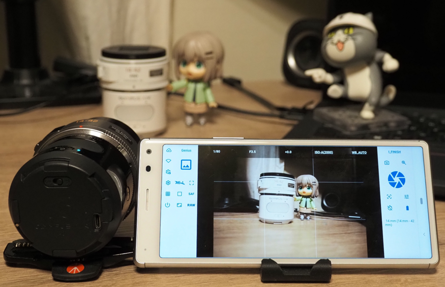

-----

## 対応カメラ

- [OLYMPUS AIR AIR A01(オリンパス プレスリリース)](https://www.olympus.co.jp/jp/news/2015a/nr150205opcj.html)
  - [主な仕様(オリンパス プレスリリース)](https://www.olympus.co.jp/jp/news/2015a/nr150205opcspj.html)
  - [主な仕様(OMSYSTEMサイト)](https://jp.omsystem.com/cms/record/dslr/a01/spec.pdf)
  - [製品外観(OMSYSTEMサイト)](https://jp.omsystem.com/cms/record/dslr/a01/design.pdf)
  - [「OLYMPUS AIR A01」 は 2018年 3月 31日をもって販売を終了いたしました。](https://digital-faq.jp.omsystem.com/faq/public/app/servlet/relatedqa?QID=005796)

-----

## インストール

[Google Play](https://play.google.com/store/apps/details?id=jp.osdn.gokigen.aira01d) よりインストール可能です。
（[GitHub Release](https://github.com/MRSa/AirA01d/releases)にも置いています。）

- [https://play.google.com/store/apps/details?id=jp.osdn.gokigen.aira01d](https://play.google.com/store/apps/details?id=jp.osdn.gokigen.aira01d)
- [https://github.com/MRSa/AirA01d/releases](https://github.com/MRSa/AirA01d/releases)

-----

## 基本操作

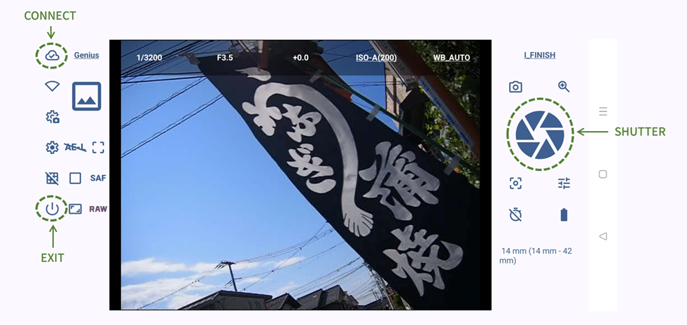

### カメラとの接続

アプリを起動すると、Wi-Fi経由でカメラの接続を試行します。（アプリ設定で、この試行を無効にできます。）
接続が成功すると、カメラを撮影モードに設定し、カメラ画像を表示します。

接続に失敗した場合は、接続失敗のダイアログを表示し、「Wi-Fi設定」画面を開くか、接続を再試行するか選択することができます。
カメラとWi-Fi接続を行っていない場合は、このタイミングでWi-Fi設定画面を開き、カメラのWi-Fi選択し、接続してください。

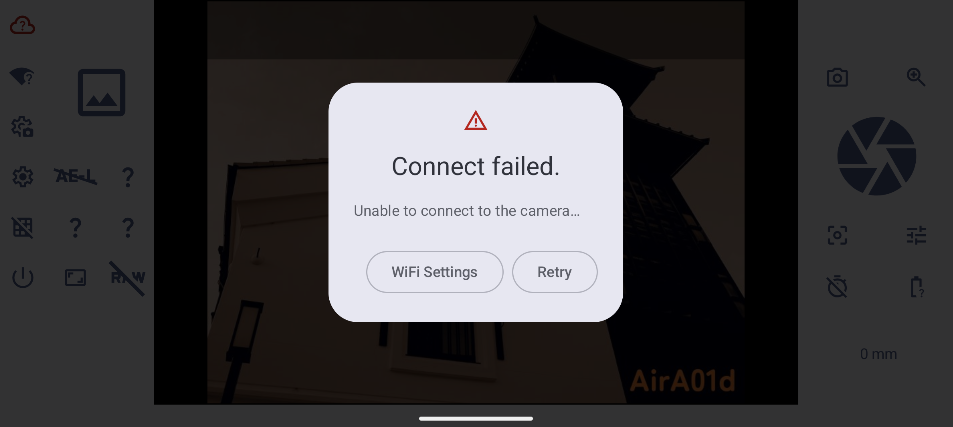

カメラ接続アイコンは、カメラとの接続状態によって表示が変わります。

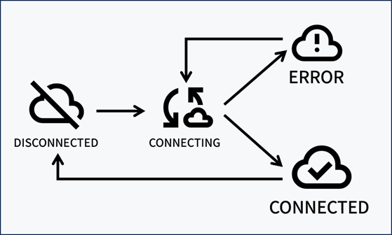

Wi-Fi設定アイコンは、アプリがカメラ画像を受信しているときは、アニメーション表示を行います。
カメラからデータが送られてきているかどうかは、Wi-Fi接続アイコンの状態で判断してください。

アプリとカメラが接続された後、画面上のボタンを押してカメラに対し操作を行ってください。

### 撮影

ライブビュー表示部分にタッチすると、オートフォーカスモードの場合は、タッチした位置にピントを合わせます。

シャッターボタンを押すと、画像が記録できます。また、音量ボタン上を押すことでも、シャッターボタンの動作をさせることができますので、Bluethoothのリモートシャッターボタンを使用しても、シャッターを動作させることができます。

ライブビューでは、グリッド表示や、鏡像（左右反転）表示、ランドスケープ（横）画面ではスワイプアップダウンで撮影値の表示・非表示を変えることができます。

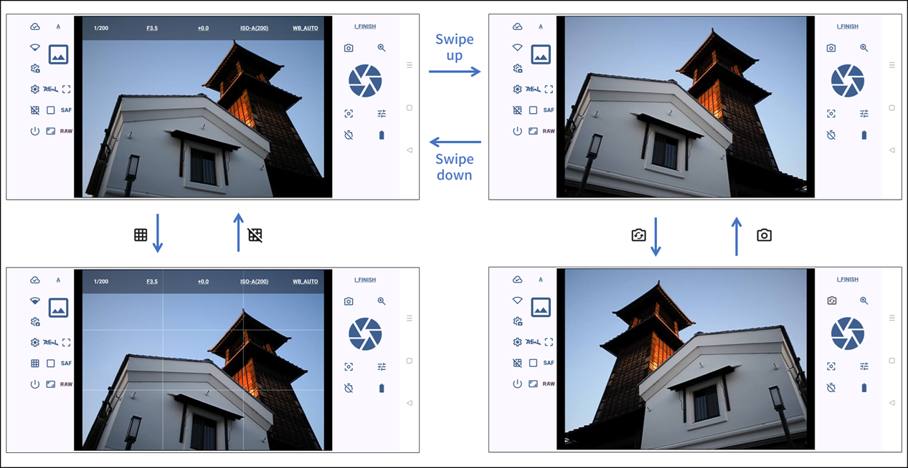

### 設定値の変更

画面にあるボタンを押すと、そのボタンについて設定可能な選択肢をカメラに問い合わせ、その選択肢を一覧表示します。
その中から選択肢を選ぶと、カメラにそのコマンドが送られ、設定値を変更します。
（撮影モードにより選択肢が限定される場合、あるいは選択肢がない場合にはボタンが反応しないこともあります。）

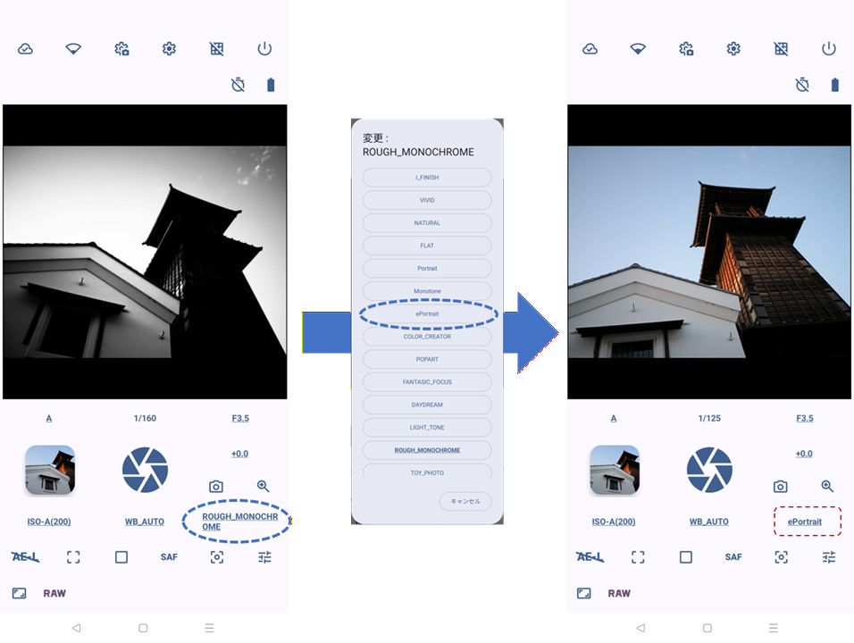

### アプリ終了

カメラの電源をOFFにし、アプリを終了する場合には、電源OFFボタンを使用します。
電源OFFボタンを押すと、アプリを終了するかどうか確認するダイアログを表示しますので、OKを押してアプリを終了させてください。
アプリを終了させたタイミングで、カメラの電源もOFFにします。

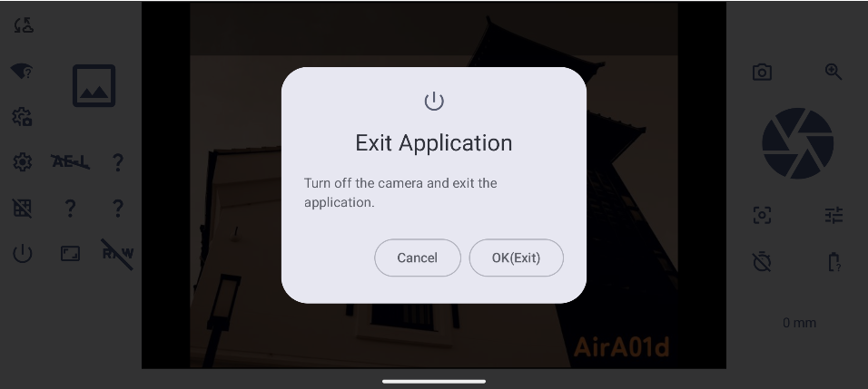

-----

## 撮影画面

### 画面イメージ

ボタンの配置は、ポートレート（縦）とランドスケープ（横）で少し変わります。

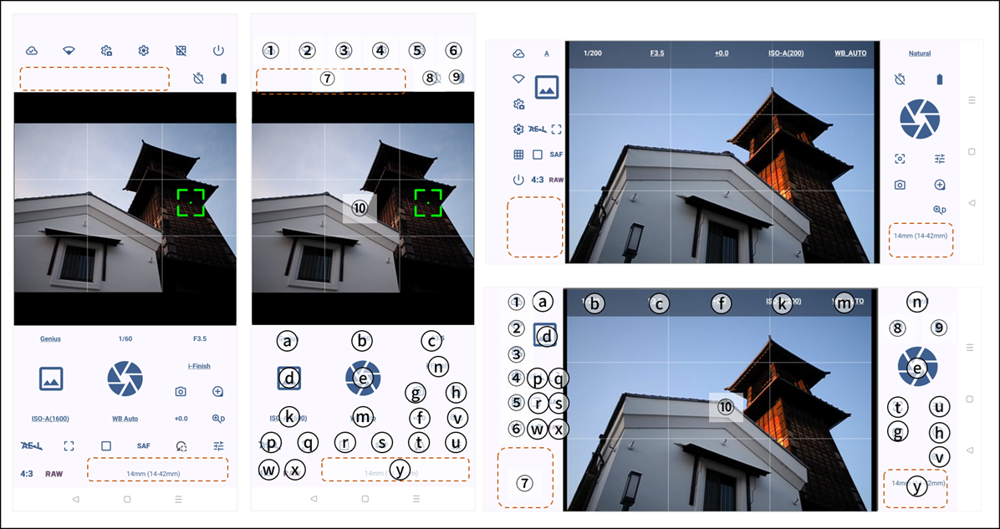

- **① : カメラ接続**
- **② : Wi-Fi設定**
- **③ : カメラプロパティ設定**
- **④ : アプリ設定**
- **⑤ : グリッド表示/非表示**
- **⑥ : 電源OFF**
- **⑦ : カメラ状態表示**
- **⑧ : セルフタイマー**
- **⑨ : カメラバッテリー状態表示**
- **⑩ : ライブビュー表示**
- **a : 撮影モード**
- **b : シャッタースピード**
- **c : 絞り値**
- **d : 撮影結果**
- **e : シャッター**
- **f : 露出補正**
- **g : 鏡像表示切替**
- **h : ライブビュー拡大**
- **k : ISO感度**
- **m : ホワイトバランス**
- **n : ピクチャーモード**
- **p : AEロック/アンロック**
- **q : 測光モード**
- **r : ドライブモード**
- **s : フォーカスモード(AF/MF)**
- **t : AFアンロック・センターフォーカス**
- **u : (現状未使用)**
- **v : デジタルズーム**
- **w : アスペクト比**
- **x : RAW撮影ON/OFF**
- **y : レンズ距離表示/電動ズーム制御**

### カメラ接続ボタン

カメラとの接続を行うボタンです。カメラとの接続状態により、アイコンが変化します。

### Wi-Fi設定ボタン

このボタンを押すと、AndroidのWi-Fi設定画面を開きます。また、カメラと接続中ライブビュー表示を行っているときは、アニメーションで画像を受信していることを示します。

### カメラプロパティ設定ボタン

後述のカメラ側が持つ設定を変更する画面（「カメラプロパティ設定」画面）を開きます。

### アプリ設定ボタン

後述の「アプリ設定」画面を開きます。

### グリッド表示/非表示ボタン

ライブビュー画面にグリッド表示を追加する、しないを変更するボタンです。

### 電源OFFボタン

カメラの電源をOFFにし、アプリを終了するボタンです。本ボタンを押すと、本当に終了してよいか確認をするダイアログを表示しますので、終了する場合には「OK」を選択してください。

### カメラ状態表示エリア

カメラの動作状態を表示するエリアです。以下の表示を行います。

- **露出異常** : 画像が暗すぎる、明るすぎるなどの警告表示を行います。
- **記録中** : シャッターボタンを押したときに、画像をmicroSDカードに記録中の場合、表示を行います。
- **撮影中** : ドライブモードが連続になっている、または、動作撮影モードの時に撮影を行っていることを示す表示を行います。

### セルフタイマー

セルフタイマーの設定を行います。ボタンを1回押すごとに、「Off」「3秒」「5秒」「10秒」の設定を切り替えます。
また、セルフタイマーカウントダウン中に、このボタンを押すと、カウントダウンをキャンセルすることができます。

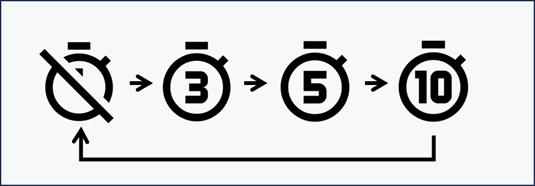

### カメラバッテリー状態表示

カメラバッテリーの状態を3段階（フル、中間、なし）で示します。

### ライブビュー表示

カメラの画像を表示します。

### 撮影モードボタン

撮影モードの設定を行います。以下の設定が可能です。

- **iAuto**
  - iAutoモード : カメラが撮影シーンを判定し自動的に適切な設定にする露出モードです
- **P**
  - プログラム(P)モード : 被写体の明るさに応じて、最適な絞り値とシャッター速度をカメラが自動的に設定する露出モードです
- **A**
  - 絞り優先(A)モード : 絞り値を設定するとカメラが適正なシャッター速度を自動的に設定する露出モードです
- **S**
  - シャッター速度優先(S)モード : シャッター速度を設定するとカメラが適正な絞り値を自動的に設定する露出モードです
- **M**
  - マニュアル(M)モード : 絞り値とシャッター速度を自分で設定する露出モードです
- **ART**
  - アートフィルターモード : おしゃれで個性的な写真が簡単に撮れる、オリンパスならではのフィルター処理を実現するモードです
- **movie**
  - 動画モード : 動画を撮影するモードです
- **Genius**
- - Genius撮影モード : カメラが被写体に最適なフレーミング、色、明るさ、エフェクト、組み合わせを自動認識し 1回の撮影で 6枚(RAW撮影がONの場合は計7枚)の写真を生成するモードです

### シャッタースピードボタン

現在のシャッタースピードを表示します。

### 絞り値ボタン

現在の絞り値を表示します。

### 撮影結果表示ボタン(現状未使用)

撮影プレビューモードがONの時、直前の撮影画像を表示します。

### シャッターボタン

ボタンを押すと、撮影を開始します。

### 露出補正ボタン

露出補正値を表示します。

### 鏡像表示切替ボタン

通常の画像と、左右反転した画像を切り替えます。セルフィー撮影等でご利用ください。

### ライブビュー拡大ボタン

ボタンを押すと、ライブビュー表示の中心部分を「5倍」→「7倍」→「10倍」→「14倍」→「1倍(拡大解除)」→「5倍」→... と、表示倍率を切り替えることができます。

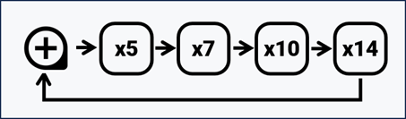

### ISO感度ボタン

現在のISO感度を表示します。

### ホワイトバランスボタン

ホワイトバランスの設定を行います。以下の設定が可能です。

- **Auto WB**
  - オートホワイトバランスで、一般的なほとんどの撮影シーン（画面内に 白に近い色が存在する撮影シーン）に最適です。
- **Daylight**
  - 晴天の日に屋外で撮るとき、夕焼けを赤く撮るとき、花火を撮るときに最適なプリセットホワイトバランス設定です。色温度は5300Kです。
- **Shade**
  - 晴天の日に屋外の日陰で撮るときに最適なプリセットホワイトバランス設定です。色温度は7500Kです。
- **Cloudy**
  - 曇天の日に屋外で撮るときに最適なプリセットホワイトバランス設定です。色温度は6000Kです。
- **Tungsten Light**
  - 電球に照らされている被写体を撮るときに最適なプリセットホワイトバランス設定です。色温度は3000Kです。
- **Fluorescent Light**
  - 蛍光灯に照らされている被写体を撮るときに最適なプリセットホワイトバランス設定です。色温度は4000Kです。
- **Underwater**
  - 水中で撮るときに最適なプリセットホワイトバランス設定です。色温度は5500Kです。
- **Custom WB**
  - カスタムホワイトバランス設定です。デフォルトの色温度は5400Kです。

### ピクチャーモードボタン

仕上がり・ピクチャーモードの設定を行います。以下の設定が可能ですが、撮影モードによっては、設定が制限される場合があります。

- **i-Enhance**
  - i-Finishで、撮影シーンに合った印象的な仕上がりになります。
- **Vivid**
  - Vivid で、色鮮やかに仕上げます。
- **Natural**
  - NATURAL で、自然な色合いに仕上げます。
- **Muted**
  - FLAT で、素材性を重視した仕上がりになります。
- **Portrait**
  - Portrait で、肌色をきれいに仕上げます。
- **Monotone**
  - モノトーンで、モノクロ調に仕上げます。
- **e-Portrait**
  - eポートレートで、肌をなめらかに整えます。
- **Color Creator**
  - カラークリエーターの色相と彩度が適用されます。
- **Pop Art**
  - アートフィルターのポップアートが適用されます。
- **Soft Focus**
  - アートフィルターのファンタジックフォーカスが適用されます。
- **Pale&Light Color**
  - アートフィルターのデイドリームが適用されます。
- **Light Tone**
  - アートフィルターのライトトーンが適用されます。
- **Grainy File**
  - アートフィルターのラフモノクロームが適用されます。
- **Pin Hole**
  - アートフィルターのトイフォトが適用されます。
- **Diorama**
  - アートフィルターのジオラマが適用されます。
- **Cross Process**
  - アートフィルターのクロスプロセスが適用されます。
- **Gentle Sepia**
  - アートフィルターのジェントルセピアが適用されます。
- **Dramatic Tone**
  - アートフィルターのドラマチックトーンが適用されます。
- **Key Line**
  - アートフィルターのリーニュ　クレールが適用されます。
- **Watercolor**
  - アートフィルターのウォーターカラーが適用されます。
- **Vintage**
  - アートフィルターのヴィンテージが適用されます。
- **Partcolor**
  - アートフィルターのパートカラーが適用されます。

### AEロック/アンロックボタン

現在の露出を固定（ロック）することができます。もう一度押すと解除します。

### 測光モードボタン

測光モードの設定を行います。以下の設定が可能です。

- **ESP**
  - デジタルESP測光 : 画面を324分割測光し、撮影シーンや顔などを考慮し最適な露出値を演算します。
- **Ctr-Weighted**
  - 中央重点平均測光 : 画面の中央部に重点を置いて、画面全域を平均測光します。
- **Spot**
  - スポット測光 : 狭い範囲（画面の約2％）の明るさを測光するときに使います。測光した箇所が適正な明るさになります。(デフォルトの)測光ポイントは画面中央です。

### ドライブモードボタン

１枚撮影か連続撮影を切り替えることができます。

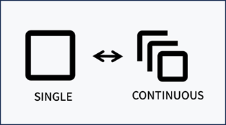

### フォーカスモード(AF/MF)ボタン

ピント合わせを自動にする(AF)か、手動にする(MF)かを選択することができます。

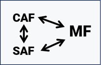

### AFアンロック・センターフォーカスボタン

オートフォーカスのフォーカスロックを解除、又は、画面の中心にピント合わせ（センターフォーカス）を行うボタンです。

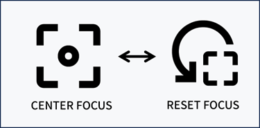

### 画像チューニングボタン(現状未使用)

現状未使用です。画像のカスタマイズができるようにしようと思います。

### デジタルズームボタン

デジタルズームを 100% (無効) ～ 300% で変更するボタンです。デジタルズームを行っているときは、アイコンが変わります。

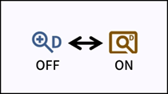

### アスペクト比ボタン

撮影イメージの縦横比（アスペクト比）が設定できます。標準は 4:3です。
次のアスペクト比が設定可能です。

- **4:3**
- **3:2**
- **16:9**
- **3:4**
- **1:1**

### RAW撮影ON/OFFボタン

RAW撮影の ON/OFF を切り替えます。

### レンズ距離表示エリア/電動ズーム制御

レンズの焦点距離を表示します。また、電動ズームが可能なレンズを装着していた時には、ズーム操作が可能です。
ズーム操作は、10段階で制御する、いわゆる「ステップズーム」となります。

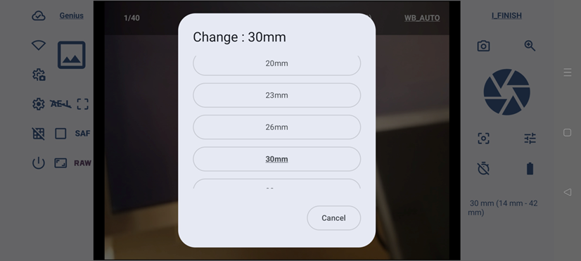

-----

## カラプロパティ設定画面

カメラプロパティ設定画面は、カメラ側が持っている設定（カメラプロパティ）を参照・変更する画面です。

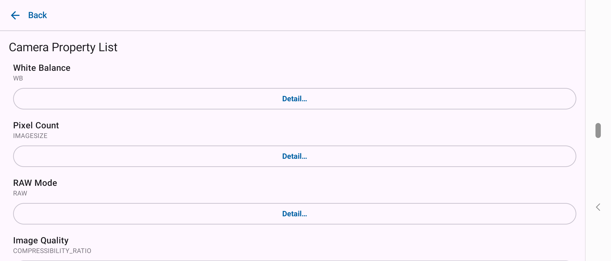

「詳細...」ボタンを押すと、変更可能な場合は、変更可能な選択肢を表示します。太字で表示されている項目は現在値です。
変更ができない場合は、現在値のみを表示します。

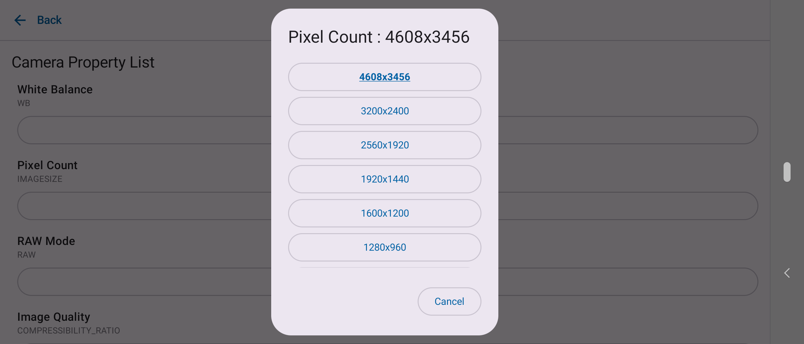

カメラプロパティは、次のカテゴリに分かれています。

- 基本設定
- フォーカス
- 画質・画像
- カメラ端末
- 撮影補助
- ホワイトバランス
- ピクチャーモード
- 仕上がり(コントラスト)
- 仕上がり(シャープネス)
- 仕上がり(彩度)
- 仕上がり(階調)
- 仕上がり(モノクロ)
- アートフィルター
- アートフィルターブラケット
- アートエフェクト

-----

## アプリ設定画面

アプリ設定画面は、アプリケーションの動作を設定する画面です。以下の操作が可能です。「戻る」をクリックすると、元の画面（撮影画面）に戻ります。

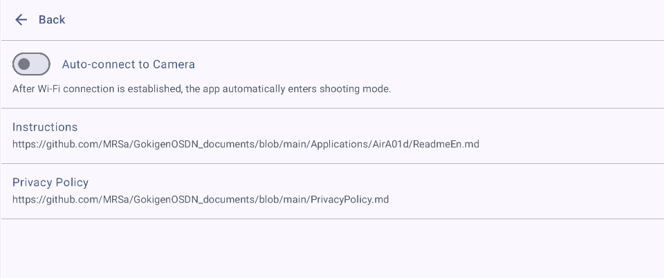

### カメラに自動接続

デフォルトはONのスイッチです。ONの場合はアプリを起動した後、Wi-Fi接続を確認できた場合に、自動的にカメラと接続し撮影状態に移行します。
OFFにした場合は、カメラとの自動接続は行いません。「カメラ接続」ボタンを押して実行してください。

### 操作説明

[本ページ](https://github.com/MRSa/GokigenOSDN_documents/blob/main/Applications/AirA01d/ReadmeJa.md)を表示します。

### プライバシーポリシー

GOKIGENプロジェクトの[プライバシーポリシー](https://github.com/MRSa/GokigenOSDN_documents/blob/main/PrivacyPolicy.md)を表示します。

-----

## その他

### 注意事項

#### 接続不安定？

ボタン操作を連続で行うと、カメラの処理が詰まってしまい、それ以降動作が不安定になる場合があるようです。カメラの動作中は操作を控えた方がよいかもしれません。

### permissionについて

AirA01d は、次のパーミッションを指定し使用しています。これらの権限について、アプリの起動時に使用許可を求めますので許可をお願いします。

- android.permission.ACCESS_NETWORK_STATE
  - カメラ(Olympus Air)と無線LAN接続をするため
- android.permission.ACCESS_WIFI_STATE
  - カメラ(Olympus Air)と無線LAN接続をするため
- andorid.permission.ACCESS_LOCAL_NETWORK
  - カメラ(Olympus Air)と無線LAN接続をするため
- android.permission.INTERNET
  - カメラ(Olympus Air)と無線LAN接続をするため
- android.permission.VIBRATE
  - ボタンの操作時に、バイブレーションでフィードバックを伝えるため

### 変更履歴

- 1.1.0 : デジタルズーム機能、カメラプロパティについての参照・設定機能を搭載
- 1.0.0 : 初版作成

### ソースコード

AirA01d のソースコードは、以下のGitリポジトリから取得可能です。

- [https://github.com/MRSa/AirA01d.git](https://github.com/MRSa/AirA01d.git)

以上
