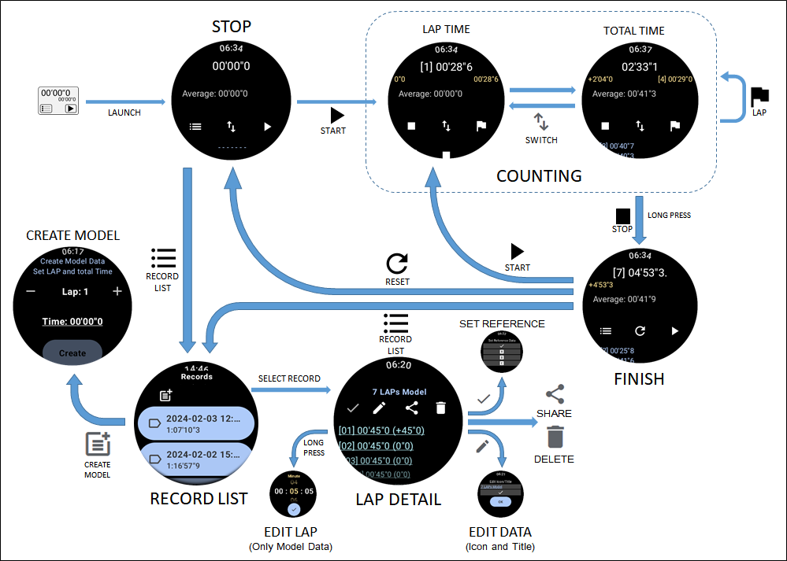
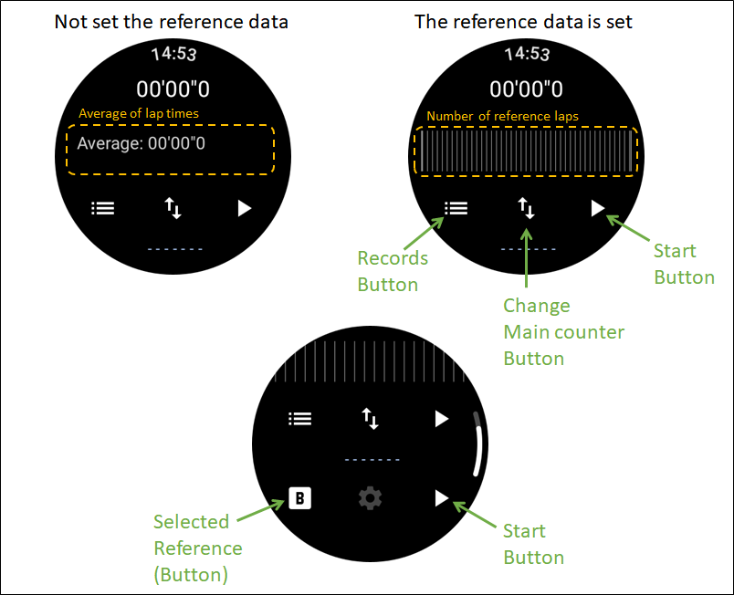
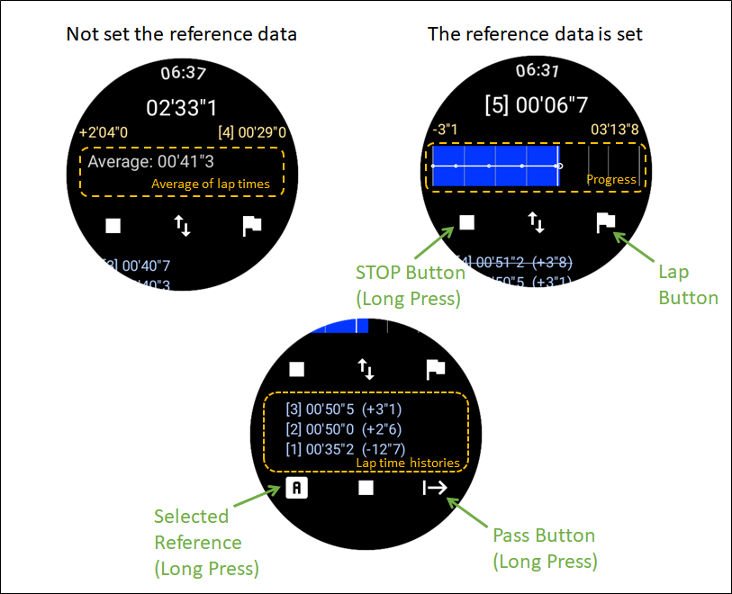
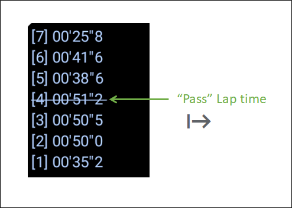
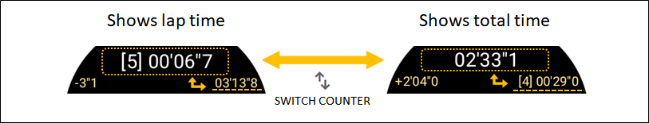
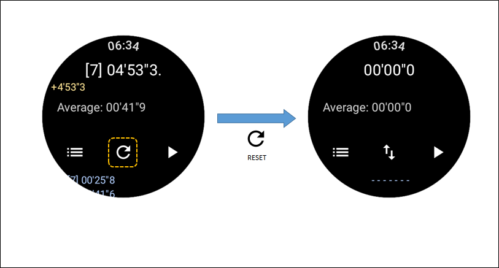
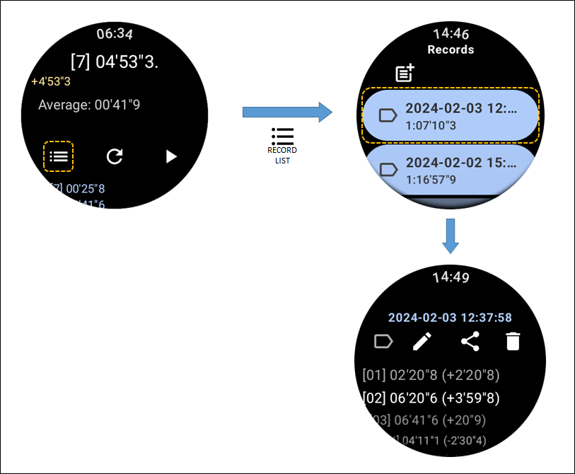
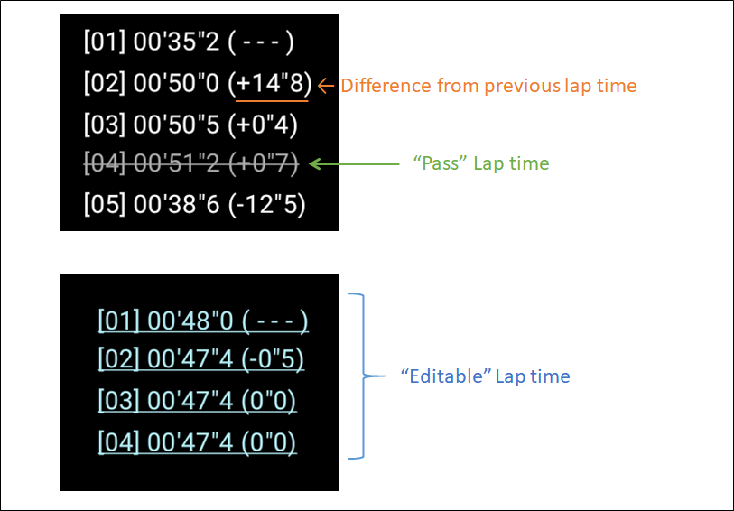
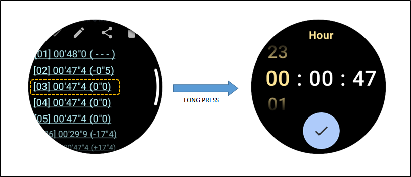

# JoggingTimer : ジョギングタイマー

## 概要

JoggingTimerは、[Wear OS](https://wearos.google.com/) で動作するストップウォッチです。主にジョギング中に使うことを想定した表示・操作・機能を搭載しています。
例えば、基準ラップタイムを設定して、計測中のラップタイムが基準ラップタイムとどれくらいずれているか表示を表示し、目標としたタイムで走ることができているかの確認ができます。

### 画面遷移

以下にJoggingTimerの画面遷移を示します。

## 機能一覧

* スタート、ストップ、ラップタイム記録
* 開始からの総時間と、ラップタイムの表示
* ラップタイム記録の履歴一覧表示、削除
* ラップタイム記録に "通過" の記録を残す
* 前ラップとの進み/遅れ時間表示
* 基準ラップタイムの設定(A, B, C の 3種類)
* ラップタイムと基準ラップタイムとの進み/遅れ時間表示
* 基準ラップタイム全体での進み/遅れの総時間表示
* 基準ラップタイム(A, B, C)の動的変更
* 平均ラップタイムの表示(基準ラップタイム未設定時)
* ラップタイムモデルの作成、途中ラップタイムの調整
* 誤操作の予防(計測終了は、停止ボタンを長押しして止める)
  * 計測終了は、停止ボタンを長押しして止める
  * スタート状態でアプリを終了させても、次回起動時にも計測を継続
  * ラップタイム記録後３秒間は再ラップタイム記録をしない
* 共有(intent.ACTION_SEND)を使用して、他アプリへ記録データを共有、他アプリからの記録データ受信

## インストール方法

Playストアからダウンロード・インストールが可能です。以下のリンクを確認してください。

* [https://play.google.com/store/apps/details?id=net.osdn.gokigen.joggingtimer](https://play.google.com/store/apps/details?id=net.osdn.gokigen.joggingtimer)

------------

## 基本操作

JoggingTimerの起動直後は、ボタンが3つある初期画面を表示します。左側は記録一覧画面への遷移ボタン、右側はスタートボタン、真ん中は計測中の表示切替ボタンです。
基準ラップタイムが設定されている場合、画面の真ん中には基準ラップタイム分の縦棒を表示します。基準ラップタイムが設定されていない場合はラップタイムの平均値を表示します。

------------

### タイム計測

スタートボタンを押すと、ストップウォッチのカウントがスタートします。
計測開始後、左側のボタンが「■」、右側のボタンが「旗」に変わります。「旗」は、（誤動作防止のため）操作後3秒後に有効になります。

「旗」を押すと、ボタンを押した時刻をラップタイムとして記録し、画面下部にラップタイム履歴を最新のものから順番に表示します。
画面右下のボタンは「通過」を示すボタンで、長押しするとラップタイムとして記録はしますが、区別できるよう取り消し線で表示します。（下図）

上下矢印のボタンを押すと、メインのカウンタがラップタイム表示とスタートしてからの総時間表示とが切り替わります。初期状態はラップタイム表示です。

「■」を **長押し** すると、計測を終了します。

")

カウンタリセットボタンを押すと、カウンタをリセットし、起動直後の画面に戻ります。

### タイム計測中の表示について

#### 全体進行状況表示 （グラフ）

#### 全体進行状況表示 （全体ラップタイム差分）

#### 平均ラップタイム表示

### 記録の確認

起動直後の初期画面で、左側のボタンを押すと、記録の一覧画面に切り替えます。その一覧をタッチすると、ラップタイムの記録を表示します。

ラップタイムは、通常の記録と、取り消し線が引かれた「通過」の記録、基準データとして作成した、編集可能な記録の３種類があります。
なお、カッコ内の数字は、前回ラップタイム（ひとつ前のラップタイム）との時間差を示しています。

編集可能な記録を**長押し**すると、ラップタイムを「時」「分」「秒」の単位で編集することができます。
ラップタイムを編集した場合、トータルの時間は変わらないように他のラップタイムについても、増減した時間分について加減算を行います。
編集時、ラップタイムをトータルの時間を超えるような値に設定した場合は、動作が保証できませんのであらかじめご承知おきください。

------------

## その他の操作

### 基準値(モデルデータ)の作成

### 基準値の設定

### 基準値の解除

### 記録の分類 （アイコンの設定）

### 記録の削除

### 記録の共有 （他アプリへ共有）

### 記録のインポート（共有の受信）

特徴的な機能

JoggingTimerの特徴的な機能を示します。

  * ラップタイムを一覧で表示するモード（一覧表示）だけでなく、グラフによるラップタイムの変化を見ることができます。（傾向表示）
  * 基準値（目標値）を設定し、記録したラップタイムとのずれを表示することができます。

基準値は、過去の計測データを選択する、あるいはモデルデータの作成によって作成したデータを設定することが可能です。

== 一覧表示 と 傾向表示、基準値の切り替え ==
ラップタイム一覧の表示とグラフィックによる傾向表示を切り替える場合は、 Sub Counter領域を長押ししてください。

基準値(A, B, C) と 一覧表示(List) / グラフィック表示(Graphic) の切り替えを行うダイアログを表示します。

[[Embed(jt-ModeSelection.png, caption=表示モードの切り替え)]]

== 基準値の設定 ==

基準値を設定しているときとしていない時では、少し表示内容が異なります。

基準値を設定していない場合は、ラップタイムの一覧を表示しますが、基準値を設定している場合は、基準値とのズレを表示します。

[[Embed(counter1.png, caption=カウンタの表示)]]

=== 基準値の設定 ===

基準値の設定は、「ラップタイム詳細表示」画面のメニューから以下のアイコンを選択して設定して下さい。
基準値は、A, B, Cの三種類設定できます。 なお、基準値 A, B, C は記録一覧表示のアイコンで区別できます。

[[Embed(jt-SetReferenceData.png, caption=基準値の設定)]]

=== 基準値の解除 ===

基準値は、以下の方法で解除することができます。

  * 他のデータを基準値に設定する
  * タイトル編集ダイアログにて、設定した基準値のデータのアイコンをほかのアイコンに設定し直す

[[Embed(edit-title.png, caption=タイトル編集ダイアログ)]]

= 記録一覧表示 =
[[Embed(record-list-1.png, caption=記録一覧表示)]]

== モデルデータの作成 ==

JoggingTimerでは、目標値を設定するために、モデルデータを作成して登録することができます。
記録一覧表示のメニューから、モデルデータの作成は可能です。

[[Embed(create-model-data-menu.png, caption=モデルデータの作成)]]

ラップ数および最終的な目標時間を設定して、「OK」を押すと、作成できます。

= ラップタイム詳細表示 =
選択したデータのラップタイムを表示します。
[[Embed(detail-list.png, caption=ラップタイム詳細表示)]]

== モデルデータ(ラップタイム)の編集 ==

モデルデータのラップタイムを詳細表示中に、長押しをするとラップタイムの編集ができます。
変更したい時間（時・分・秒）を指定して「OK」を押すと、時間を変更するとともに、他のラップタイムを調整します。全体の時間を変えることはできません。
[[Embed(jt-SetTargetLapTime.png, caption=ラップタイムの編集)]]

= タイトル/アイコン編集 =
「ラップタイム詳細表示」画面のメニューから、タイトルおよびアイコンの編集ができるダイアログ（タイトル/アイコン編集ダイアログ）を呼び出すことができます。

[[Embed(jt-EditTitle.png, caption=タイトル/アイコン編集)]]

記録データに設定するアイコンの例を示します。バージョンによって、アイコンの追加を行っていますので、これ以外にも設定可能なアイコンはいくつかあります。
[[Embed(icon-list.png, caption=アイコン一覧)]]

システムで使用するアイコンがいくつかつあります。計測していないモデルデータの初期値と基準値を設定したときのアイコンです。
アイコンの設定は変更することができますが、システムで使用するアイコンの設定はタイトル/アイコン編集ダイアログからはできません。

[[Embed(jt-SystemIcons.png, caption=特殊なアイコン)]]

= ラップタイム詳細データを他アプリへ送信 =
「ラップタイム詳細表示」画面のメニューから、他アプリにデータを送ることができます。（データは、CSV形式で送ります。）

1.1.0 から、共有を行うと、JoggingTimer自身で受信することができるようになりました。

受信したデータはモデルデータとして取り扱い、ラップタイムの編集ができるようになります。

[[Embed(jt-ShareData.png, caption=他アプリへ送る)]]

------------

## その他

### 注意事項（仕様、制約事項）

* アプリを終了して再開しても、ずっと計測していたかのように振る舞います。これは、アプリでは開始時刻とスタート状態を記憶しているからです。そのため、**本アプリで計測中に時刻の変更をした場合には、計測時間の保証ができません。** この点、ご了承ください。
* 前述のタイム記録方式をとっている関係から、アプリ機能として測定の一時停止については搭載を検討していません。ご了承ください。
* ラップタイムの編集は、モデルデータのみしか行えません。ご了承ください。

### 変更履歴

* 2.0.0 : ユーザインタフェースの全面見直し。（ただし、内部データ管理は前バージョンから変更せず） ラップ通過のマーキングを可能にする。
* 1.1.0 : 共有を受信できるようにする。
* 1.0.3 : 設定できる基準値を1種類から3種類(A, B, C)に拡張する。
* 1.0.2 : 高解像度の円形タイプのWearOS端末で見切れが発生していたのを修正する。
* 1.0.1 : 記録一覧画面およびラップタイム詳細画面で、円形タイプのWearOS端末で見切れが発生していたのを修正する。
* 1.0.0 : 初版リリース。

### permissionについて

JoggingTimer は、次のパーミッションを指定し使用しています。
* <uses-permission android:name="android.permission.WAKE_LOCK"/>
  * スリープ後にも本アプリを動作させるため
* <uses-permission android:name="android.permission.VIBRATE"/>
  * 操作したことをバイブレーションで通知するため
* <uses-permission android:name="android.permission.POST_NOTIFICATIONS"/>
  * アプリ実行中を示す（Ongoing Activityを使用する）ため

------------

## ソースコード/ライセンス

JoggingTimer はオープンソースです。以下からソースコードを参照することができます。ご利用等は、Apache 2.0の条件に沿ってお願いします。

* [https://github.com/MRSa/JoggingTimer/](https://github.com/MRSa/JoggingTimer/)

以上
