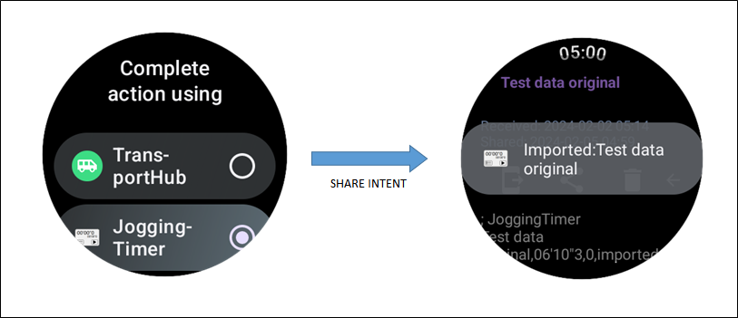

# JoggingTimer : ジョギングタイマー

## 概要

JoggingTimerは、[Wear OS](https://wearos.google.com/) で動作するストップウォッチです。主にジョギング中に使うことを想定した表示・操作となっています。
基準ラップタイムを設定して、計測中のラップタイムが基準ラップタイムとどれくらいズレがあるかを表示することができます。
今までの記録をそのまま基準ラップタイムとして設定できますので、（距離によらず）いつもの場所をいつものタイムで走れているか、を、計測、確認ができます。

また、スマートフォンとの連携は必須ではなく、[Wear OS](https://wearos.google.com/) 端末単体で完結します。
ただし、記録データは、Androidの共有機能（intent.ACTION_SEND）を使用して他のアプリと送受信することができますので、たとえば [TransportHub](https://play.google.com/store/apps/details?id=net.osdn.ja.gokigen.transporthub)を経由して、必要な記録だけをスマートフォンに保管する、という使い方が可能です。

### 画面遷移

以下にJoggingTimerの画面遷移を示します。

## 機能一覧

* スタート、ストップ、ラップタイム記録
* 開始からの総時間と、ラップタイムの表示
* ラップタイム記録の履歴一覧表示、削除
* ラップタイム記録に "通過" の記録を残す
* 前ラップとの進み/遅れ時間表示
* 基準ラップタイムの設定(A, B, C の 3種類)
* ラップタイムと基準ラップタイムとの進み/遅れ時間表示
* 基準ラップタイム全体での進み/遅れの総時間表示
* 基準ラップタイム(A, B, C)の動的変更
* 平均ラップタイムの表示(基準ラップタイム未設定時)
* ラップタイムモデルの作成、途中ラップタイムの調整
* 誤操作の予防(計測終了は、停止ボタンを長押しして止める)
  * 計測終了は、停止ボタンを長押しして止める
  * スタート状態でアプリを終了させても、次回起動時にも計測を継続
  * ラップタイム記録後３秒間は再ラップタイム記録をしない
* 共有(intent.ACTION_SEND)を使用して、他アプリへ記録データを共有、他アプリからの記録データ受信

## インストール方法

[Wear OS](https://wearos.google.com/)端末上のPlayストアから直接ダウンロード・インストールが可能です。以下のリンクを確認してください。

* [https://play.google.com/store/apps/details?id=net.osdn.gokigen.joggingtimer](https://play.google.com/store/apps/details?id=net.osdn.gokigen.joggingtimer)

------------

## 操作説明

### メイン画面

JoggingTimerの起動直後は、ボタンが3つある初期画面を表示します。左側は記録一覧画面への遷移ボタン、右側はスタートボタン、真ん中は計測中の表示切替ボタンです。
基準ラップタイムが設定されている場合、画面の真ん中には基準ラップタイム分の縦棒を表示します。基準ラップタイムが設定されていない場合はラップタイムの平均値を表示します。

------------

### タイム計測

スタートボタンを押すと、ストップウォッチのカウントがスタートします。
計測開始後、左側のボタンが「■」、右側のボタンが「旗」に変わります。「旗」は、（誤動作防止のため）操作後3秒後に有効になります。

#### ラップタイム記録・通過マーキング

「旗」を押すと、ボタンを押した時刻をラップタイムとして記録し、画面下部にラップタイム履歴を最新のものから順番に表示します。誤操作を予防するため、ラップタイムを記録してから３秒、ボタンを無効化します。
画面右下のボタンは「通過」を示すボタンで、**長押し**するとラップタイムとして記録はしますが、区別できるよう取り消し線で表示します。
本来のラップタイムを押す場所で押せていない、などの時に使用することを想定しています。

#### メインカウンタの変更

真ん中にある上下矢印のボタンを押すと、メインカウンタの表示を「ラップタイム表示」と「スタートしてからの総時間表示」の切り替えを行います。初期状態は「ラップタイム表示」です。

#### 計測終了・カウンタリセット

「■」を **長押し** すると、計測を終了します。

")

カウンタリセットボタンを押すと、カウンタをリセットし、起動直後の画面に戻ります。

#### 基準ラップタイムの変更

画面左下の基準ラップタイム表示を押すことで、「A」「B」「C」が切り替わり、基準ラップタイムを変更することができます。
タイム計測中は、**長押し**で変更ができます。

### タイム計測中の表示について

#### 平均ラップタイム表示

基準ラップタイムを設定していなかった場合、ラップタイムの平均値を表示します。

#### 全体進行状況表示 （グラフ）

基準ラップタイムを設定していた場合、全体の進行状況をグラフ表示します。
基準ラップタイムの総時間を現在の時間が超えていた場合、進捗グラフの色が変わります。

------------

### 記録の確認

起動直後の初期画面で、左側のボタンを押すと、記録の一覧画面に切り替えます。その一覧をタッチすると、ラップタイムの記録を表示します。

ラップタイムは、通常の記録と、取り消し線が引かれた「通過」の記録、基準データとして作成した、編集可能な記録の３種類があります。
なお、カッコ内の数字は、前回ラップタイム（ひとつ前のラップタイム）との時間差を示しています。

#### 記録の編集

基準ラップタイムとして作成した記録、インポートした記録は、編集可能なラップタイムとなり、編集が可能です。
編集可能な記録（ラップタイム）を**長押し**すると、ラップタイムを「時」「分」「秒」の単位で編集することができます。
ラップタイムを編集した場合、トータルの時間は変わらないように他のラップタイムについても、増減した時間分について加減算を行います。
ただし、編集時、ラップタイムをトータルの時間を超えるような値に設定した場合は、動作が保証できませんのであらかじめご承知おきください。

#### 基準ラップタイムの設定・解除

アイコンを選択して、「A」「B」「C」のどれかを選ぶことで基準ラップタイムに設定ができます。その逆に、通常のアイコンを設定することで、基準ラップタイムの解除ができます。
基準ラップタイムを設定すると、以前に設定していた基準ラップタイムは自動的に設定が解除され、アイコンが初期化されます。
以前に設定していた基準ラップタイムのアイコンは初期化されますので、アイコンの設定変更を行っていた場合は、再度アイコンの設定をお願いします。

#### タイトル/アイコンの編集

登録データは、記録一覧画面の視認性を向上させるため、タイトルとアイコンを編集することができます。

#### 記録の共有（他アプリへ記録送信）

Androidの「共有」機能を使って、他アプリに記録を送信することができます。送信データは、text/plainのCSV形式です。

JoggingTimerが共有で送信するデータの形式(text/plain)を以下に示します。データは、それぞれカンマで区切られています。
（データ形式は、いわゆるCSVですが、Share Contentで受信できる他アプリがCSV形式を扱えるアプリに限定されてしまうため、text/plain形式で共有します。）
詳細は、JoggingTimerが出力する実際の共有データを参照してください。

|**行数**|データ1|データ2|データ3|データ4|データ5|データ6|データ7| 補足|
|----|----|----|----|----|----|----|----|----|
|**1行目**|; JoggingTimer|  |  |  |  |  |  |固定値： JoggingTimerデータかどうかの識別に利用する行 |
|**2行目**|; 題名|総時間(形式： hh:mm'ss"S )|開始時間(Unix Time)|  |  |  |  | |
|**3行目**|; |  |  |  |  |  |  | 将来の拡張のための予約行|
|**4行目**|; LapCount| LapTime |TotalTime | LapTime(ms) | TotalTime(ms) | recordType | ; | データのラベル行 |
|**5行目以降**|ラップ数|ラップタイム|計測開始からの時間|ラップタイム(単位:ms)|計測開始からの時間(単位:ms)|記録種別(0:通常, 1:編集可, 2:通過)| ; | ラップタイム記録データ |

#### 記録の削除

現在表示している記録を削除することができます。削除前に、削除してもよいかの確認ダイアログを表示します。「OK」を押すと記録を削除します。

------------

### 基準ラップタイム(モデルデータ)の作成

JoggingTimerは、基準ラップタイムを設定するために、モデルデータを作成して登録することができます。
記録の一覧画面にあるアイコンを押すと、基準ラップタイムの作成画面を開きます。
「＋」ボタンと「－」ボタンを使用して、総ラップ数、時刻部分をタッチして総時間を設定して「作成」ボタンを押すと、基準ラップタイムを作成します。
総ラップ数と総時間を設定すると「作成」ボタンが有効になります。モデルデータは、総時間をラップ数で割った、平均ラップタイム時間で作成します。

### 記録のインポート（共有の受信）

JoggingTimerは、intent.ACTION_SEND のテキストデータ(text/plain)を受信することができます。受信したデータはモデルデータとして認識し、ラップタイムの編集が可能です。
（解釈可能なデータ形式は、記録の共有で送信するデータ構造に準拠します。ただし、ラップタイムとして「ラップタイム(単位:ms)」のデータを使用しています。）

------------

## その他

### 注意事項（仕様、制約事項）

* アプリを終了して再開しても、ずっと計測していたかのように振る舞います。これは、アプリでは開始時刻とスタート状態を記憶しているからです。そのため、**本アプリで計測中に時刻の変更をした場合には、計測時間の保証ができません。** この点、ご了承ください。
* 前述のタイム記録方式をとっている関係から、アプリ機能として測定の一時停止については搭載を検討していません。ご了承ください。
* ラップタイムの編集は、モデルデータのみしか行えません。ご了承ください。
* 記録データをまとめて消去する機能は提供していません。

### 変更履歴

* 2.0.0 : ユーザインタフェースの全面見直し。（ただし、内部データ管理は前バージョンから変更せず） ラップ通過のマーキングを可能にする。
* 1.1.0 : 共有を受信できるようにする。
* 1.0.3 : 設定できる基準値を1種類から3種類(A, B, C)に拡張する。
* 1.0.2 : 高解像度の円形タイプのWearOS端末で見切れが発生していたのを修正する。
* 1.0.1 : 記録一覧画面およびラップタイム詳細画面で、円形タイプのWearOS端末で見切れが発生していたのを修正する。
* 1.0.0 : 初版リリース。

### permissionについて

JoggingTimer は、次のパーミッションを指定し使用しています。

* android.permission.WAKE_LOCK
  * スリープ後にも本アプリを動作させるため
* android.permission.VIBRATE
  * 操作したことをバイブレーションで通知するため
* android.permission.POST_NOTIFICATIONS
  * アプリ実行中を示す（Ongoing Activityを使用する）ため

------------

## ソースコード/ライセンス

JoggingTimer はオープンソースです。以下からソースコードを参照することができます。ご利用等は、Apache 2.0の条件に沿ってお願いします。

* [https://github.com/MRSa/JoggingTimer/](https://github.com/MRSa/JoggingTimer/)

以上
