# Theta "Thought" ShutterS : Thetaのシャッターを脳波で制御する

-----------------------------

## 概要

Theta "Thought" ShutterS（以下、本アプリと呼びます）は、[NeuroSky](https://www.neurosky.jp/)社の簡易脳波計である[MindWave Mobile 2 EEGヘッドセット](https://store.neurosky.com/pages/mindwave)（以下、EEGと呼びます）を使用してRICOH製 THETAのシャッターを切ることができる、Android用のアプリケーションです。EEGから取得した情報（Attention）が高まったときに静止画を撮影します。
適切に「思う」と撮影できるアプリですが、思うように撮影できない、かもしれません。そのあたり悪しからずご了承ください。
本アプリは、THETAプラグイン版([ThetaThoughtShutter](https://github.com/ricohapi/theta-plugins/blob/main/plugins/jp.osdn.gokigen.thetathoughtshutter/README.ja.md))とは異なり、 Wifi経由でTHETAに接続して制御するため THETA S や SCなどのプラグイン非対応機でも撮影可能です。
なお、Thetaに接続しなくても、 [MindWave Mobile 2](https://store.neurosky.com/pages/mindwave) のセンサ情報をCSVファイルに記録する機能も持っており、簡単な脳波計測用途にもお使いいただけます。

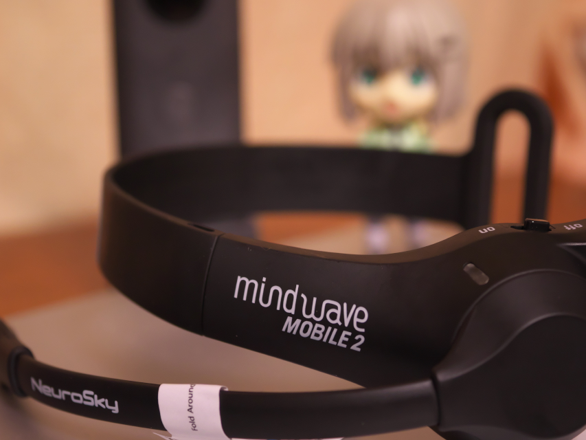

-----------------------------

## インストール

以下リンクのGoogle Play よりインストールしてください。

* [Theta Thought ShutterS(Google Play)](https://play.google.com/store/apps/details?id=jp.osdn.gokigen.thetaview)

-----------------------------

## 基本操作

起動後、初期画面を表示しますので、THETAやEEGへの接続ボタンを押してください。
THETAへの接続ができると、THETAの画像を表示します。画面をタッチして上下左右に動かすと、表示領域を変えることができます。また、ピンチイン、ピンチアウトで表示の拡大・縮小ができます。（しかし、拡大しすぎると表示が乱れてしまいます、、、ご注意ください。）
画面を長押しすると、初期表示に戻すことができますので、拡大・縮小や画像を回転させすぎた時にはお試しください。
シャッターボタンを押すと、THETAで撮影ができます。（ビデオ録画モードだと、撮影開始・終了を行います。） 撮影開始・終了のタイミングでは、振動により通知を行います。
設定ボタンを押すと、設定変更をすることができます。各種機能を使用する場合には、設定画面内の設定を変更してみてください。

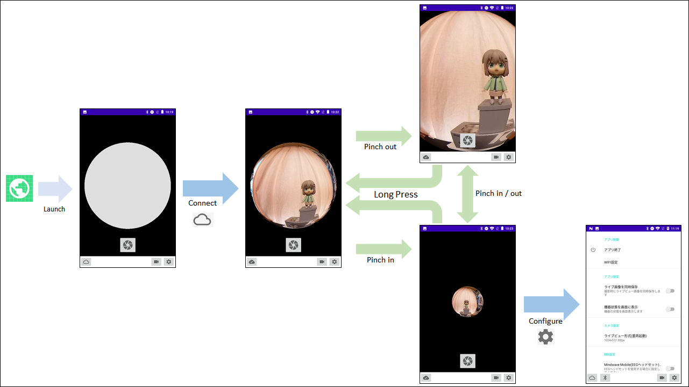

### 画面表示

以下にメイン画面を示します。画面には「THETA接続ボタン」「EEG接続ボタン」「モード切替ボタン」「設定ボタン」「シャッターボタン」があります。
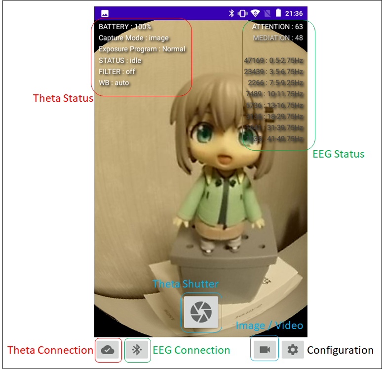

なお、起動直後の画面は非常にシンプルです。設定ボタンを押して設定画面にて、お好みの設定に変更してご利用ください。

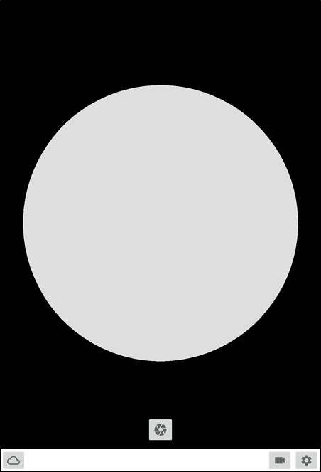

### THETA接続ボタン

画面左下に表示されているボタンです。ボタンを押すと、THETAとの接続を行います。 **接続前に、あらかじめTHETAとWIFIの接続を行っておいてください。** THETAと接続できている場合、アイコンが接続中に変化します。
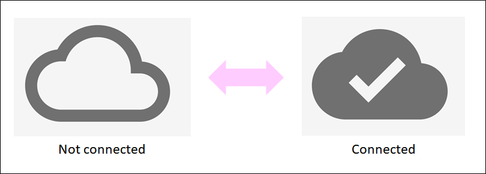

接続していない場合、しばらく経つと「接続失敗」のダイアログを表示します。この場合、WIFI設定を押して、ネットワークの設定画面を開きますのでTHETAと接続を行ってください。
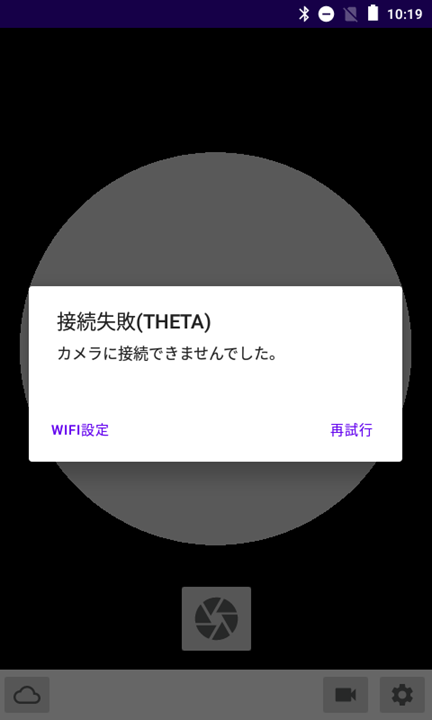

### EEG接続ボタン

**設定画面で「Mindwave Mobile(EEGヘッドセット)を使用する」にチェックを入れたときにTHETA接続ボタンの右隣に表示するボタンです。** ボタンを押して接続中、接続済に切り替えます。

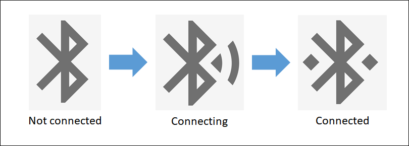

自動でペアリングをするはずですが、ペアリングが必要だと表示された場合は、**0000** でペアリングしてください。

センサの収集状態取得までには、少し時間がかかることもありますが、ご了承ください。

### モード切替ボタン

THETA接続中にこのボタンを押すと、静止画撮影モード、動画撮影モードの切り替えを行います。**切り替えを行いたいモードをアイコンで表示しています。現在の撮影モードとは異なりますのでご注意ください。**

現在の撮影モードは、「機器状態を画面に表示」にチェックを入れたとき、画面左上の 2列目「Capture Mode」が **image**の時には静止画撮影モード、**video**の時には動画撮影モードを示します。あわせてTHETA本体のランプも参照していただければと思います。

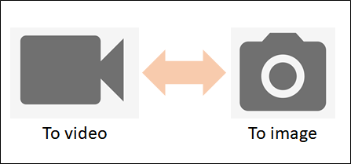

### 設定ボタン

設定ボタンを押すと、設定画面を開きます。詳細は、後述する「設定画面について」を確認ください。

### シャッターボタン

THETA接続中にこのボタンを押すと、静止画または動画の撮影を行います。撮影のコマンドを受け付けたかどうかは振動（バイブレーション）で通知し、撮影が完了したときにも画面表示と共に通知します。

動画撮影の場合、最初の一回で撮影スタート、もう一回押すと撮影完了となります。この場合も、振動で通知します。

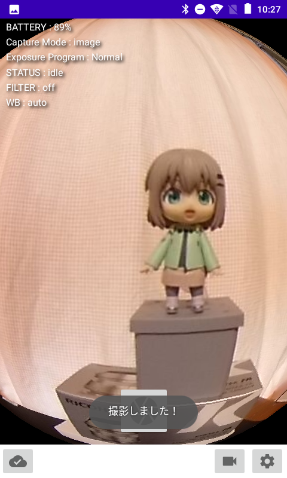

なお、EEG接続時には、ATTENTION または MEDIATIONの高まりによる撮影（数値が90以上を5秒間続くと撮影する）が行われます。

-----------------------------

## 機器状態の表示

設定画面で「機器状態を画面に表示」を設定した場合の状態表示は、左側にTHETAの状態、右側にEEGの状態を表示します。右側のように、THETA未接続のままEEGだけの状態表示をすることも可能です。

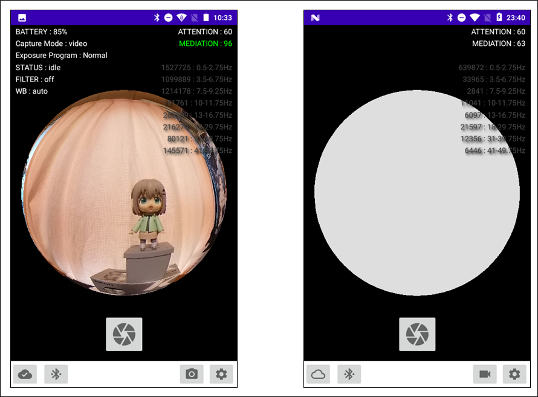

灰色の球体表示が邪魔だと思う場合には、ピンチイン操作で縮小、もしくは拡大してみてください。

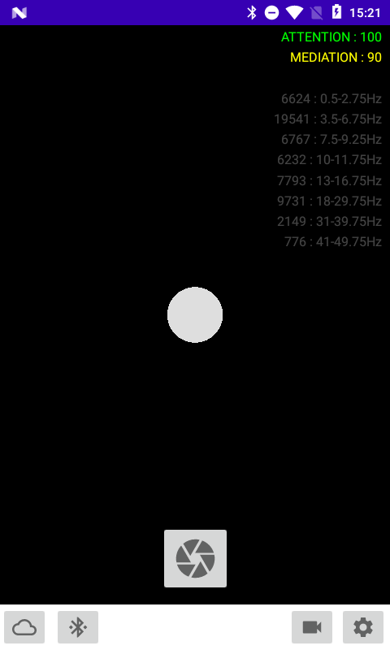

それぞれの値は以下です。

### THETAの状態

#### BATTERY

バッテリーの残量（パーセント）を表示します。

#### Capture Mode

[撮影モード](https://github.com/ricohapi/theta-api-specs/blob/main/theta-web-api-v2.1/options/capture_mode.md)を表示します。

* image: 静止画撮影モード
* video: 動画撮影モード

#### Exposure Program

[撮影プログラム](https://github.com/ricohapi/theta-api-specs/blob/main/theta-web-api-v2.1/options/exposure_program.md)を表示します。

* Manual : マニュアルモード
* Normal : 通常撮影モード
* Aperture : 絞り優先モード (Z1のみ)
* Shutter : シャッター速度優先モード
* ISO : ISO優先モード

#### STATUS

撮影状態を示します。

* idle : 撮影待ち
* shooting : 撮影中 （動画撮影中）

#### FILTER

[フィルターモード](https://github.com/ricohapi/theta-api-specs/blob/main/theta-web-api-v2.1/options/_filter.md)を表示します。

* off : フィルターOFF
* DR Comp : DR compensation
* Noise Reduction : ノイズリダクション
* hdr : HDR
* Hh hdr : Handheld HDR

#### WB

[ホワイトバランス](https://github.com/ricohapi/theta-api-specs/blob/main/theta-web-api-v2.1/options/white_balance.md)を表示します。

* auto
* daylight
* shade
* cloudy-daylight
* incandescent
* _warmWhiteFluorescent
* _dayLightFluorescent
* _dayWhiteFluorescent
* fluorescent
* _bulbFluorescent
* _colorTemperature
* _underwater

### EEGの状態

EEGヘッドセット([MindWave Mobile 2](https://store.neurosky.com/pages/mindwave))が取得したセンサ情報を画面表示しています。おおむね１秒おきに更新します。特に、[NeuroSky](http://neurosky.com/) のチップで取得できる ATTENTION, MEDIATIONの値を使用して、THETAの撮影を行います。設定画面で「機器状態を画面に表示」を設定したときに表示します。

#### ATTENTION

ATTENTIONの値を表示します。値によって表示の色を変化させます。

* 90超 : 緑
* 70超 : 黄
* 50超 : 白
* 30超 : ライトグレー
* 30未満 : ダークグレー

#### MEDIATION

MEDIATIONの値を表示します。値によって表示の色を変化させます。

* 90超 : 緑
* 70超 : 黄
* 50超 : 白
* 30超 : ライトグレー
* 30未満 : ダークグレー

#### 脳波データ

設定画面で「機器状態を画面に表示」を設定、かつ、「脳波信号も画面表示」を設定したとき、脳波データを追加で画面表示します。表示内容は以下の通りです。

##### 0.5-2.75Hz

deltaの値です。0～16777215の値をとります。詳細は[ASIC_EEG_POWER_INT](http://developer.neurosky.com/docs/doku.php?id=thinkgear_communications_protocol#asic_eeg_power_int)を参照してください。

##### 3.5-6.75Hz

thetaの値です。0～16777215の値をとります。詳細は[ASIC_EEG_POWER_INT](http://developer.neurosky.com/docs/doku.php?id=thinkgear_communications_protocol#asic_eeg_power_int)を参照してください。

##### 7.5-9.25Hz

low-alphaの値です。0～16777215の値をとります。詳細は[ASIC_EEG_POWER_INT](http://developer.neurosky.com/docs/doku.php?id=thinkgear_communications_protocol#asic_eeg_power_int)を参照してください。

##### 10-11.75Hz

high-alphaの値です。0～16777215の値をとります。詳細は[ASIC_EEG_POWER_INT](http://developer.neurosky.com/docs/doku.php?id=thinkgear_communications_protocol#asic_eeg_power_int)を参照してください。

##### 13-16.75Hz

low-betaの値です。0～16777215の値をとります。詳細は[ASIC_EEG_POWER_INT](http://developer.neurosky.com/docs/doku.php?id=thinkgear_communications_protocol#asic_eeg_power_int)を参照してください。

##### 18-29.75Hz

high-betaの値です。0～16777215の値をとります。詳細は[ASIC_EEG_POWER_INT](http://developer.neurosky.com/docs/doku.php?id=thinkgear_communications_protocol#asic_eeg_power_int)を参照してください。

##### 31-39.75Hz

low-gammaの値です。0～16777215の値をとります。詳細は[ASIC_EEG_POWER_INT](http://developer.neurosky.com/docs/doku.php?id=thinkgear_communications_protocol#asic_eeg_power_int)を参照してください。

##### 41-49.75Hz

mid-gammaの値です。0～16777215の値をとります。詳細は[ASIC_EEG_POWER_INT](http://developer.neurosky.com/docs/doku.php?id=thinkgear_communications_protocol#asic_eeg_power_int)を参照してください。

-----------------------------

## 設定画面について

設定ボタンを押すと設定画面を表示します。
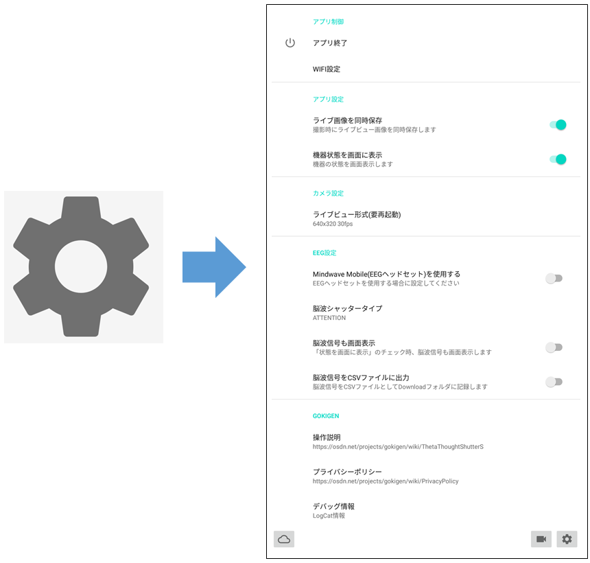

### アプリ制御

#### アプリ終了

本アプリを終了します。終了前に確認のダイアログを表示しますので「OK」を選択して終了してください。

#### WIFI設定

AndroidのWIFI設定画面を開きます。THETAにWIFI接続する場合に、ここを選択しWIFI設定画面でTHETAと接続してください。

### アプリ設定

#### ライブ画像を同時保存

THETAで画像を撮影するタイミングでライブビュー（プレビュー）画像を保存したい場合に設定してください。保存先は **DCIM/aira01a** です。

#### 機器状態を画面に表示

設定すると、画面上に接続した機器の状態を表示します。表示内容は「機器状態の表示 」を参照してください。

### カメラ設定

#### ライブビュー形式（要再起動）

ライブビューの解像度を設定できます。解像度が大きいと、画面更新の遅延リスクは高まりますが、よりきれいなライブビュー画像となります。 設定を反映させるには一度アプリケーションを終了して立ち上げなおしてください。ただし、**THETA S, SCの場合は、640x320 の設定にしてください。** それ以外を設定した場合は、適切に画面表示ができません。

* 640x320 30fps
* 640x320 8fps
* 1024x512 30fps
* 1024x512 8fps
* 1920x960 8fps

### EEG設定

#### Mindwave Mobile(EEGヘッドセット)を使用する

EEGと接続する場合に設定してください。

#### 脳波シャッタータイプ

EEGで撮影する場合に、その検出タイプを選択してください。「ATTENTION」と「MEDIATION」が選択可能です。（初期値は「ATTENTION」です。）
この値が基準値（80 or 90）を5回以上検出した場合に撮影を行います。

#### 脳波信号も画面表示

脳波信号も画面表示するときに設定してください。表示内容は「EEGの状態」を参照ください。

#### 脳波信号をCSVファイルに出力

EEGの脳波信号をCSVファイルに出力する場合に設定してください。詳細は、後述の「CSVファイルについて」を参照してください。

### GOKIGEN

#### 操作説明

[操作説明のページ（本ページ）](https://github.com/MRSa/GokigenOSDN_documents/blob/main/Applications/ThetaView/Readme.md)をブラウザで開きます。

#### プライバシーポリシー

GOKIGEN プロジェクトの[プライバシーポリシーページ](https://github.com/MRSa/GokigenOSDN_documents/blob/main/PrivacyPolicy.md)を開きます。

#### デバッグ情報

デバッグ情報(LogCat)のページを開きます。

-----------------------------

## CSVファイルについて

設定画面で「脳波信号をCSVファイルに出力」を設定した場合、EEGセンサデータをCSV形式でファイルに出力します。（ファイルの出力先は **/sdcard/Download/** 、ファイル名は、**EEG_年月日時分秒.csv** になるはず、、です。）
出力ファイルのイメージは以下のようになっています。先頭１行はデータ項目ラベル、２行目から実データとなります。
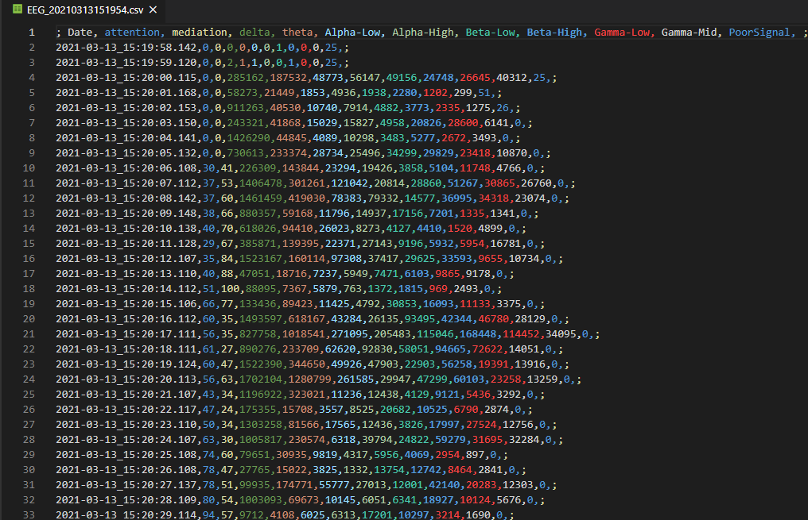

データは、１行に以下のデータをカンマに区切って格納します。内容の詳細は、[ThinkGear Data Values](http://developer.neurosky.com/docs/doku.php?id=thinkgear_communications_protocol#thinkgear_data_values) を参照してください。

* **データ受信時間**
  * データを受信した時間を出力します。出力形式は 年-月-日_時:分:秒 (秒は小数点以下3桁も表示します。) おおむね１秒ごとに出力されているはずです。
* **[ATTENTION](http://developer.neurosky.com/docs/doku.php?id=thinkgear_communications_protocol#attention_esense)**
  * ATTENTION情報を出力します。0～100の値をとります。
* **[MEDIATION](http://developer.neurosky.com/docs/doku.php?id=thinkgear_communications_protocol#meditation_esense)**
  * MEDIATION情報を出力します。0～100の値をとります。
* **delta** : 0.5 - 2.75Hz
  * 検出した脳波データです。0～16777215の値をとります。詳細は[ASIC_EEG_POWER_INT](http://developer.neurosky.com/docs/doku.php?id=thinkgear_communications_protocol#asic_eeg_power_int)を参照してください。
* **theta** : 3.5 - 6.75Hz
  * 検出した脳波データです。0～16777215の値をとります。詳細は[ASIC_EEG_POWER_INT](http://developer.neurosky.com/docs/doku.php?id=thinkgear_communications_protocol#asic_eeg_power_int)を参照してください。
* **Alpha-Low** : 7.5 - 9.25Hz
  * 検出した脳波データです。0～16777215の値をとります。詳細は[ASIC_EEG_POWER_INT](http://developer.neurosky.com/docs/doku.php?id=thinkgear_communications_protocol#asic_eeg_power_int)を参照してください。
* **Alpha-High** : 10 - 11.75Hz
  * 検出した脳波データです。0～16777215の値をとります。詳細は[ASIC_EEG_POWER_INT](http://developer.neurosky.com/docs/doku.php?id=thinkgear_communications_protocol#asic_eeg_power_int)を参照してください。
* **Beta-Low** : 13 - 16.75Hz
  * 検出した脳波データです。0～16777215の値をとります。詳細は[ASIC_EEG_POWER_INT](http://developer.neurosky.com/docs/doku.php?id=thinkgear_communications_protocol#asic_eeg_power_int)を参照してください。
* **Beta-High** : 18 - 29.75Hz
  * 検出した脳波データです。0～16777215の値をとります。詳細は[ASIC_EEG_POWER_INT](http://developer.neurosky.com/docs/doku.php?id=thinkgear_communications_protocol#asic_eeg_power_int)を参照してください。
* **Gamma-Low** : 31 - 39.75Hz
  * 検出した脳波データです。0～16777215の値をとります。詳細は[ASIC_EEG_POWER_INT](http://developer.neurosky.com/docs/doku.php?id=thinkgear_communications_protocol#asic_eeg_power_int)を参照してください。
* **Gamma-Mid** : 41 - 49.75Hz
  * 検出した脳波データです。0～16777215の値をとります。詳細は[ASIC_EEG_POWER_INT](http://developer.neurosky.com/docs/doku.php?id=thinkgear_communications_protocol#asic_eeg_power_int)を参照してください。
* **[PoorSignal](http://developer.neurosky.com/docs/doku.php?id=thinkgear_communications_protocol#poor_signal_quality)**
  * 信号の状態を示します。0～255の値をとり、数が大きいほどノイズが大きいことを示します。また、値が200の場合には、肌からセンサが離れていることを意味しています。詳細は [Poor Signal Quality](http://developer.neurosky.com/docs/doku.php?id=thinkgear_communications_protocol#poor_signal_quality) を参照してください。

-----------------------------

## その他

THETAとEEGは、Bluetooth SPPプロトコルで接続しています。

### 注意事項（仕様、制約事項

* 撮影時の設定モードなどは変更できません。ご了承ください。

### 動作確認機種

本アプリは、Theta V / Theta Sでの動作確認を行っています。

### permissionについて

本アプリは、次のパーミッションを指定し使用しています。

* android.permission.VIBRATE
  * アプリの状態を振動で伝えるため
* android.permission.ACCESS_NETWORK_STATE
  * THETAとWIFI接続を行うため
* android.permission.ACCESS_WIFI_STATE
  * THETAと通信を行うため
* android.permission.WRITE_EXTERNAL_STORAGE
  * EEGのセンサ情報を DownloadフォルダにCSV形式で出力するため
* android.permission.READ_EXTERNAL_STORAGE
  * Downloadフォルダ、DCIMフォルダにアクセスするため
* android.permission.INTERNET
  * カメラの撮影を Theta Web API 経由で行うため
* android.permission.BLUETOOTH
  * EEGヘッドセットとの通信を Bluetooth経由で行うため
* android.permission.ACCESS_COARSE_LOCATION
  * EEGヘッドセットとの通信を Bluetooth経由で行うため
* android.permission.ACCESS_FINE_LOCATION
  * EEGヘッドセットとの通信を Bluetooth経由で行うため (過去バージョン対応)
* android.permission.BLUETOOTH_ADMIN
  * EEGヘッドセットとペアリングを実施するため

### 変更履歴

* 1.0.1 : 初版リリース
* 1.0.2 : ライブビュー（プレビュー）画像を保存するときに、Googleフォトで360度画像と認識できるよう修正。
* 1.0.4 : Android 13機以降で、うまく起動できなくなっていたのを修正する

### ソースコード

本アプリはオープンソースです。以下からソースコードを参照することができます。ご利用はご自由にどうぞ。

* [https://github.com/MRSa/ThetaView](https://github.com/MRSa/ThetaView)

-----------------------------

## EEGについて

脳波について軽く触れます。脳波計は、脳から出ている電気を肌に密着させた電極で検出するセンサです。（体の中にもぐっている脳から出る信号をソナー手が聞いているようなもの、というイメージを持ちました。）
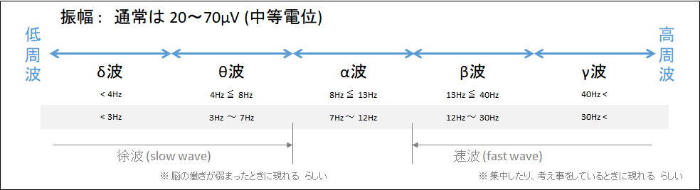

## 参考リンク

* [THETA Web API v2.1](https://github.com/ricohapi/theta-api-specs/blob/main/theta-web-api-v2.1/README.md)
* [MindWave Mobile 2 : Brainwave starter kit](https://store.neurosky.com/pages/mindwave)
  * [amazon.jp販売ページ](https://www.amazon.co.jp/dp/B07CXN8NKX/)
* [NeuroSky](http://neurosky.com/)
  * [http://neurosky.com/](http://neurosky.com/)
  * [https://www.neurosky.jp/](https://www.neurosky.jp/)
  * [ThinkGear Serial Stream Guide](http://developer.neurosky.com/docs/doku.php?id=thinkgear_communications_protocol)
  * [MindSet Communications Protocol](http://developer.neurosky.com/docs/lib/exe/fetch.php?media=mindset_communications_protocol.pdf)
  * [EEG Band Power values: Units, Amplitudes, and Meaning](http://support.neurosky.com/kb/development-2/eeg-band-power-values-units-amplitudes-and-meaning)
* [脳波](https://ja.wikipedia.org/wiki/%E8%84%B3%E6%B3%A2)
  * [デルタ波](https://ja.wikipedia.org/wiki/%E3%83%87%E3%83%AB%E3%82%BF%E6%B3%A2)
  * [シータ波](https://ja.wikipedia.org/wiki/%E3%82%B7%E3%83%BC%E3%82%BF%E6%B3%A2)
  * [アルファ波](https://ja.wikipedia.org/wiki/%E3%82%A2%E3%83%AB%E3%83%95%E3%82%A1%E6%B3%A2)
  * [ベータ波](https://ja.wikipedia.org/wiki/%E3%83%99%E3%83%BC%E3%82%BF%E6%B3%A2)
  * [脳波を楽しく読むためのミニガイド](http://www.med.kyushu-u.ac.jp/neurophy/pdf/guide.pdf)

以上
