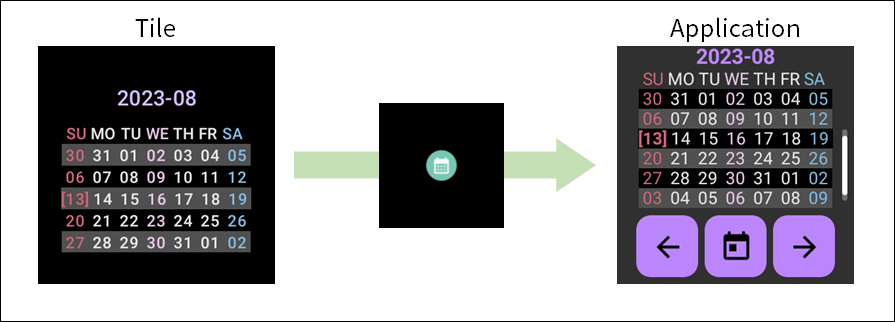
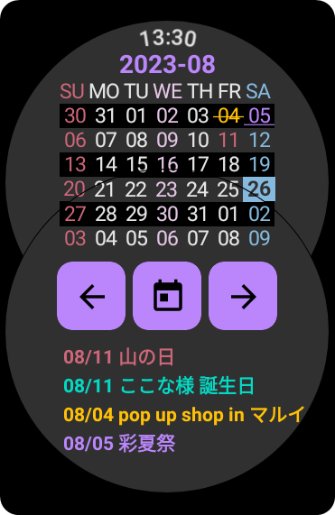
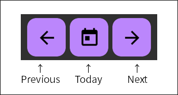
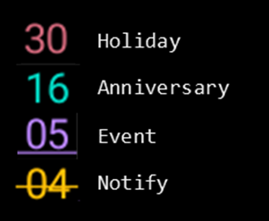

# mCalendar ： Wear OS 用の月間カレンダー

------

## 概要

mCalendarは、Wear OSのスマートウォッチで、月間カレンダーを表示するだけのアプリです。
タイルで月間表示ができます。タイルでタッチすると mCalendarを起動し、前月や翌月の月間カレンダー表示ができます。
1.1.0からは、別途作成したテキストデータを受け取り、記念日・休日としてマークする機能を搭載しました。

## 機能一覧

* タイルで月間のカレンダー表示
* アプリで月間のカレンダー表示
* 休日、記念日といった特別な日のマーク表示
  * 休日、記念日、イベントなどのマーク表示 （Intent.ACTION_SEND 経由でデータを読み込む必要があります）

## インストール

Google Play からインストールできます。スマートウォッチにインストールできます。

* [https://play.google.com/store/apps/details?id=net.osdn.ja.gokigen.wearos.calendar](https://play.google.com/store/apps/details?id=net.osdn.ja.gokigen.wearos.calendar)

------

## 説明

日曜始まりの月間カレンダーを表示するだけです。ただし、タイルでは、同じ週に翌月が始まる場合は、翌月のカレンダーを表示します。
今日は、背景色と文字色を反転させて強調表示します。

### 画面遷移

タイルでカレンダー表示部分をタッチすると、アプリが起動します。
それ以外の画面はありません。

休日や記念日等を読み込ませると、カレンダーの表示および画面下部にその名称を表示します。

### ボタン操作

アプリのボタン操作は、左から「前月表示(Previous)」「今日に移動(Today)」「翌月表示(Next)」となっています。

### 休日・記念日の表示

1.1.0 から、休日・記念日の表示ができるようになりました。４種類の表示が可能です。

------

## 休日や記念日のデータ読み込みについて

Android標準機能である「共有」を使ってテキストデータを読み込むことができます。(Intent.ACTION_SEND を使用しています。)
他のアプリケーションからテキストデータを共有操作で、送信先をmCalendarを指定してください。

この一連の操作に [TransportHub](../TransportHub/Readme.md) が利用可能です。スマートフォンなどのGoogle Keep でテキストデータを [TransportHub](../TransportHub/Readme.md) に送り、
それをスマートウォッチ群に転送、スマートウォッチ上の[TransportHub](../TransportHub/Readme.md) から mCalendarに送り込むという方法です。

### 読み込む記念日や休日データの形式

読み込むテキストデータの形式について、以下に示します。

基本は、すでに登録されているデータを「削除」し、「登録」を行います。
削除しない場合は、データの追加登録となります。

#### 入力データの識別（先頭２行）

先頭行および２行目は、本アプリで読み込むべきデータかどうかの識別を行います。取り決めたキーワードを入れてください。
３行目からは、データの削除や登録コマンドの記述をお願いします。

~~~
;  mCalendar Data Definition
;    format version 1 
~~~

#### データの削除コマンド

##### 全データを消去

~~~
DELETE ALL CONFIRM
~~~

##### HOLIDAYデータを全消去

~~~
DELETE ALL CONFIRM ONLY HOLIDAY DATA
~~~

##### ANNIVERSARYデータを全消去

~~~
DELETE ALL CONFIRM ONLY ANNIVERSARY DATA
~~~

##### NOTIFYデータを全消去

~~~
DELETE ALL CONFIRM ONLY NOITIFY DATA
~~~

##### EVENTデータを全消去

~~~
DELETE ALL CONFIRM ONLY EVENT DATA
~~~

##### yyyy年mm月より前のデータを消去

yyyy年mm月のデータは削除しません。

~~~
DELETE BEFORE yyyy-mm CONFIRM
~~~

##### yyyy年mm月より後のデータを消去

yyyy年mm月のデータは削除しません。

~~~
DELETE AFTER yyyy-mm CONFIRM
~~~

##### yyyy年mm月のデータを消去

~~~
DELETE ONLY yyyy-mm CONFIRM
~~~

##### mm月のHOLIDAYデータだけを消去

~~~
DELETE MONTH mm CONFIRM ONLY HOLIDAY DATA
~~~

##### mm月のANNIVERSARYデータだけを消去

~~~
DELETE MONTH mm CONFIRM ONLY ANNIVERSARY DATA
~~~

##### mm月のNOTIFYデータだけを消去

~~~
DELETE MONTH mm CONFIRM ONLY NOTIFY DATA
~~~

##### mm月のEVENTデータだけを消去

~~~
DELETE MONTH mm CONFIRM ONLY EVENT DATA
~~~

#### データの登録コマンド

「(データ)」については後述の『データの形式』を参照してください。

##### HOLIDAYデータの登録

~~~
IMPORT HOLIDAY DATA START
(データ)
IMPORT HOLIDAY DATA END
~~~

##### ANNIVERSARYデータの登録

~~~
IMPORT ANNIVERSARY DATA START
(データ)
IMPORT ANNIVERSARY DATA END
~~~

##### NOTIFYデータの登録

~~~
IMPORT NOTIFY DATA START
(データ)
IMPORT NOTIFY DATA END
~~~

##### EVENTデータの登録

~~~
IMPORT EVENT DATA START
(データ)
IMPORT EVENT DATA START
~~~

##### データの形式

「年/月/日,名称」または「年-月-日,名称」または「月/日,名称」または「月-日,名称」の形式で１件ずつ記載します。
どの形式でも構いません。また、混在していても大丈夫です。

~~~
yyyy-mm-dd,(title)
yyyy/mm/dd,(title)
mm/dd,(title)
mm-dd,(title)
~~~

#### 登録データのサンプル

以下に登録データのサンプルを示します。

~~~
;  mCalendar Data Definition
;    format version 1 

; 最初に登録済の全データを削除する
DELETE ALL CONFIRM

; 記念日のデータを登録する
IMPORT ANNIVERSARY DATA START 
1/16,斎藤 楓 誕生日
2/19,雪村あおい 誕生日
8/11,青羽ここな 誕生日
6/25,黒崎ほのか 誕生日
11/11,倉上ひなた 誕生日
IMPORT ANNIVERSARY DATA END

; イベントのデータを登録する
IMPORT EVENT DATA START
2023-11-18,激坂最速王決定戦
2023-11-26,つくばマラソン
IMPORT EVENT DATA END

; 通知用データを登録する
IMPORT NOTIFY DATA START
2023-08-05,彩夏祭(花火)
IMPORT NOTIFY DATA END

; 日本の祝日を登録 (https://www8.cao.go.jp/chosei/shukujitsu/syukujitsu.csv より)
IMPORT HOLIDAY DATA START  
2023/8/11,山の日
2023/9/18,敬老の日
2023/9/23,秋分の日
2023/10/9,スポーツの日
2023/11/3,文化の日
2023/11/23,勤労感謝の日
2024/1/1,元日
2024/1/8,成人の日
2024/2/11,建国記念の日
2024/2/12,休日
2024/2/23,天皇誕生日
2024/3/20,春分の日
IMPORT HOLIDAY DATA END

~~~

------

## その他

### 日本の祝日について

* [https://www8.cao.go.jp/chosei/shukujitsu/gaiyou.html](https://www8.cao.go.jp/chosei/shukujitsu/gaiyou.html)
* [https://www8.cao.go.jp/chosei/shukujitsu/syukujitsu.csv](https://www8.cao.go.jp/chosei/shukujitsu/syukujitsu.csv)

### 制約事項

### ソースコード

mCalendar は、オープンソースです。 以下からどうぞ。

* [https://github.com/MRSa/mCalendar.git](https://github.com/MRSa/mCalendar.git)

------

## 変更履歴

* 1.0.1 : 初版作成
* 1.0.2 :  Intent.ACTION_SEND経由での記念日/休日データのインポート機能を追加。

以上
