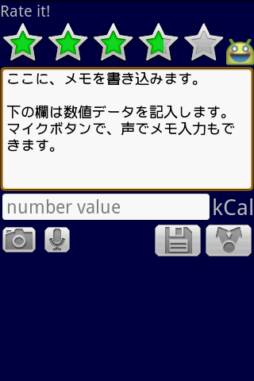
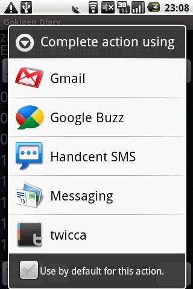
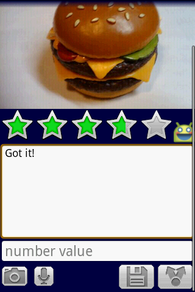
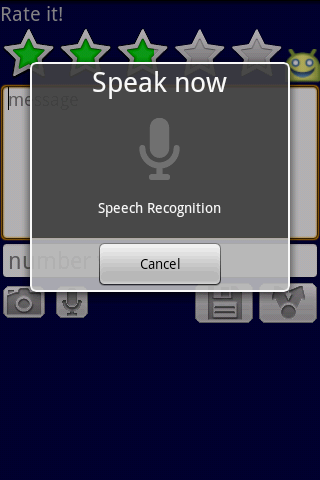
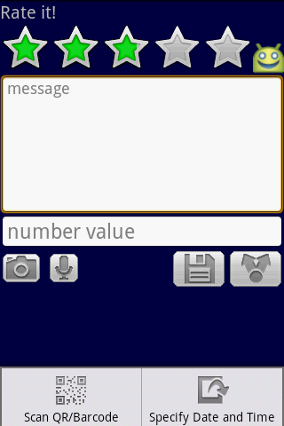
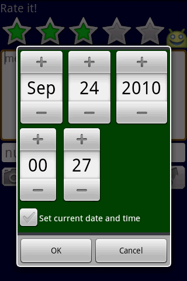
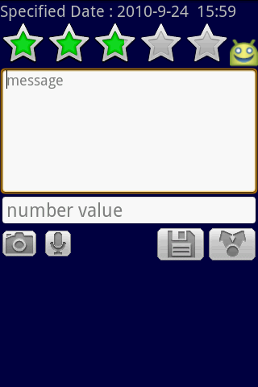
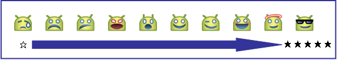

# 入力画面

**本ページは、[OSDNのDataInputScreenOfGokigenDiaryページ](https://osdn.net/projects/gokigen/wiki/DataInputScreenOfGokigenDiary) のコピーです。投稿当時の情報を移植、掲載しています。**

------

データを入力する画面です。データを入力し終わった後、右下の共有ボタン、ディスクアイコンを押すと、記入内容を保存します。

## 入力データ

ごきげんダイアリーで入力可能なデータは、次の4種類です。

- **画像**
 端末のカメラを利用して画像を撮影します。

- **ごきげんレート**
 ☆の数により、顔の表示が１０種類変わります。入力時点での気分に合わせてお選びください。

- **メッセージ**
 今の気持ちを自由に記入してください。なお、音声入力およびバーコードリーダで読み取った結果は、この欄に追記します。

- **数値データ**
 数字情報が入力可能です。入力した数字データは、メイン画面で集計を行い、合計を画面下部に表示します。

## ボタン操作

### 書き込みボタン

書き込みボタンを押すと、入力したデータをメモリカードに出力し、メイン画面に戻ります。

### 共有ボタン

共有ボタンを押すと、入力したデータをメモリカードに出力し、共有するアプリケーションを起動します。共有が終了すると、メイン画面に戻ります。

### カメラボタン

カメラボタンを押すと、画像を撮影するためにカメラアプリを起動します。画像の撮影が終了すると、入力画面に戻り、撮影画像を表示します。

### マイクボタン

マイクボタンを押すと、音声での文字入力を行います。マイクに向かってしゃべってください。
なお、**マイクボタンは、オフラインモードの時には表示しません。**

## メニュー操作

メニュー操作には、バーコード読み取りと日時指定の機能があります。

### バーコード読み取り

バーコードリーダアプリを起動し、読み込んだバーコードの内容を文字データとして入力します。
バーコードリーダは、別途インストールをお願いします。

### 日時指定

記録する日時を設定できます。記録し忘れた！ というときにデータの入力日時を設定して入力してください。

日時を設定した場合は、画面の一番上に表示されている、Rate it! の表示が変わります。
保存をすると、設定した日付のデータとして保存されます。

## その他

### 位置測定について

入力画面を開いているときには、なるべく正確な入力位置を記録に残すため、位置測定を1分おきに実行します。そのため、入力画面を開いたままにしておくと、バッテリの消費が激しくなることが予想されますので、ご注意ください。

### ごきげんレートと星の数の関係

ごきげんレートの星の数によって、アイコンは次のように表情が変わります。自分の気持ちに近いものを選択し記録してください。

このエモーションアイコンは、[Androidのリポジトリ](http://android.git.kernel.org/?p=platform/frameworks/base.git;a=tree;f=core/res/res/drawable-hdpi;h=ebc31ac3e3261edf0067d82730e3ac6a5debcc19;hb=HEAD)にあるものを利用させていただきました。

### バーコード/QRコードの読み取りについて

バーコード/ＱＲコードの読み込みには、あらかじめ ZXing Team製作の Barcode Scanner (QRコードスキャナ)のインストールを行ってください。

- http://jp.androlib.com/android.developer.zxing-team-qnx.aspx
- http://www.cyrket.com/p/android/com.google.zxing.client.android/

### 数値データの単位について

数値データの単位は、設定画面の "数値データの単位(英語 : Unit of numerical value)" で設定可能です。

### カメラ画像の制約について

AndroidのOSが持つ制約により、1.6までの端末は、カメラ画像は端末の画面サイズ程度までの大きさのものしか撮影できません。ご了承ください。
（2.2(Froyo)の場合には、大きなサイズの画像を撮影することができます。）
