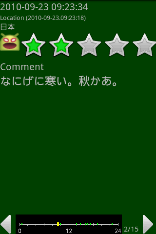
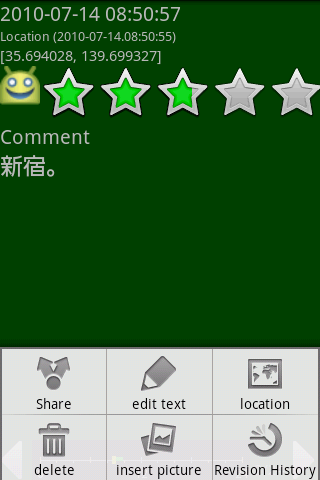
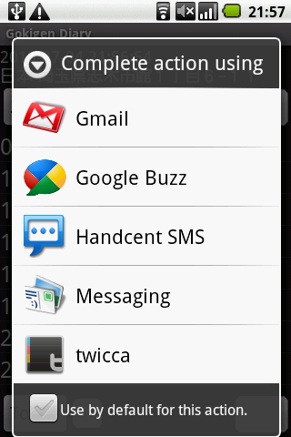
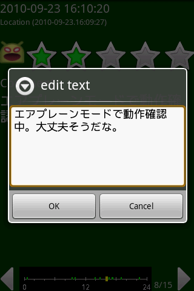
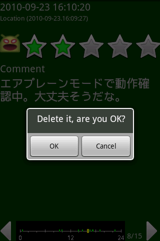
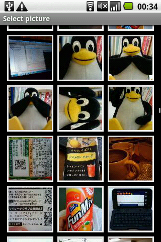
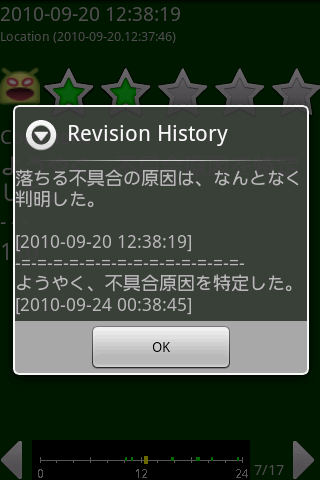

# 参照画面の操作

**本ページは、[OSDNのページ、DataViewScreenOfGokigenDiary](https://osdn.net/projects/gokigen/wiki/DataInputScreenOfGokigenDiary) のコピーです。投稿当時の情報を移植、掲載しています。**

------

参照画面は、ごきげんダイアリーで入力したデータを表示する画面です。記録した位置、時間、内容を表示します。

画面下部には、データを表示している日付の他データを表示しています。
← を押すと前データ、 → を押すと次データを表示します。

## メニュー操作

メニューボタンを押すと、いくつかの機能が実行可能です。

### 共有(en: Share)

データを共有します。共有したいアプリを選択してください。

### テキスト編集(en: edit text)

表示データのテキスト部分を修正できます。

### 位置 (en: location)

[マップ画面](MapScreenOfGokigenDiary.md)を開き、データを記入した位置を表示します。

### 削除 (en: delete)

### 画像選択 (en: insert picture)

データにギャラリーから写真を挿入します。

### 更新履歴 (en: Revision History)

今表示しているデータを更新（写真を挿入、テキストを変更）した履歴を表示します。

