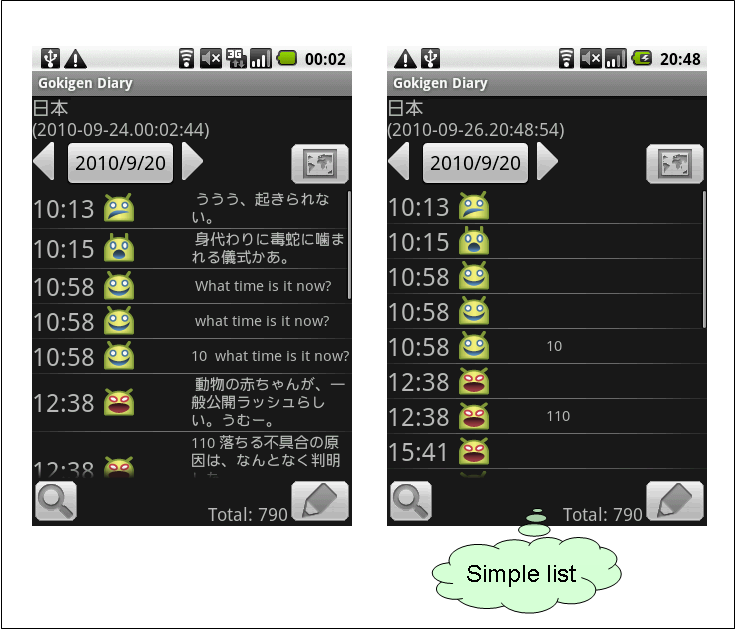

# メイン画面の操作

**本ページは、[OSDNのページ、MainScreenOfGokigenDiary](https://osdn.net/projects/gokigen/wiki/MainScreenOfGokigenDiary) のコピーです。投稿当時の情報を移植、掲載しています。**

------

メイン画面は、ごきげんダイアリーを起動したときに表示する画面です。起動直後は、起動した当日の登録済みデータを表示します。

## 画面表示の説明

### 現在位置

GPS機能を使って現在の位置を表示します。カッコで囲まれた時刻が、位置情報を認識した時刻です。オフラインモードの場合には、緯度・経度を数値で表示します。

### 入力データ一覧

入力したデータを一覧表示します。設定画面で 「シンプルな一覧画面 (en: Simple list for main)」にチェックを入れると、登録済みデータの先頭を表示しないようになります。

#### アイコンについて

画像ファイルの有無、共有を実施したかどうかは、一覧の表示でアイコンを使って表示します。アイコンの意味は、次のとおりです。

*      画像ファイルがついているデータです。
*            共有を行ったデータです。
*    画像ファイルがついており、さらに共有を行ったデータです。

### 数値データの合計

入力済みのデータに数値データが入力されていた場合、合計を表示します。

## ボタン操作

### 日付変更ボタン

日付が書いてあるボタンを押すと、一覧を表示する日付を切り替えることができます。 
カレンダーダイアログを表示しますので、データを一覧表示したい日付を選択してください。

なお、日付の右下に **.** があるものは、その日付に一覧データが存在する、あるいは過去存在したことを示します。

Todayボタンを押すと、一覧表示を今日の表示に切り替えます。

また、日付変更ボタンの左右にある、とで、前の日、次の日に一覧表示を切り替えることができます。

### 地図ボタン

を押すと、[マップ画面](MapScreenOfGokigenDiary)を開き、中心に現在位置を表示します。

### 検索ボタン

を押すと、[検索画面](SearchScreenOfGokigenDiary) を開きます。

### 書き込みボタン

を押すと、[入力画面](DataInputScreenOfGokigenDiary) を開きます。

## メニュー操作

メニューボタンを押すと、メニューが表示されます。設定項目、Today、ごきげんグラフ、情報の4種類があります。

### 設定項目

Settingsを押すと、[設定画面](PreferencesScreenOfGokigenDiary) を開きます。

### Today

Todayを押すと、一覧表示を今日の日付のものに更新します。

### ごきげんグラフ

Graphを押すと、[グラフ画面](GraphScreenOfGokigenDiary.md)を開きます。

### 情報

Aboutを押すと、タイトルクレジットと、本サイトへのリンクを表示するダイアログを開きます。
(英語表示の場合、表示するリンクは本サイトを日⇒英翻訳サイト経由で表示する短縮URLで表示します。)

## その他

### 起動時のパスワード入力チェック

設定項目で、『起動時チェック (en: Secret mode)』にチェックを入れておくと、ごきげんダイアリーの起動時にパスワードの入力を求めるようになります。（パスワードを間違えると起動できなくなります。）

このときに入力するパスワードは、設定項目の『起動パスワード (en: Password)』に設定した文字列です。
