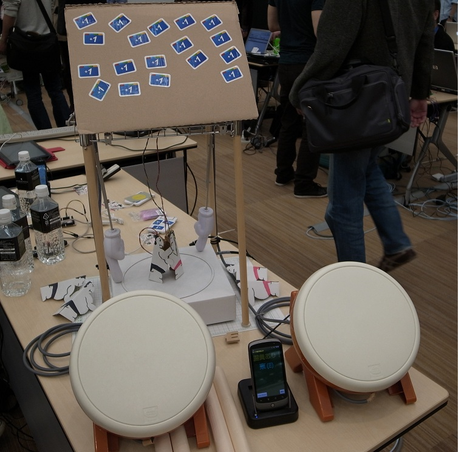

# [紙相撲マシン](https://osdn.net/projects/gokigen/wiki/PaperSumoBattleField)
紙相撲をちょっぴりと盛り上げる仕掛けを作ってみました。

--------------------------------

## 概要
([Android ADK Opencall Round II に提出した企画書](PSDF.pdf)から、実際の制作物にあわせて一部修正)

日本の伝統的な遊びに「紙相撲」というものがある。紙人形を台の上に２体を組み合わせて台の上に立たせ、どちらかの紙人形が倒れるか枠線を越えるかするまで台の両端を振動させて勝敗を競う遊びである。台の振動による紙人形の動きは、まるで相撲の取り組みをやっているかのごとく見え、勝ち負けを競っているプレイヤーだけでなく、その様子を眺めている観客も楽しむことができる。
今回、この紙相撲をより楽しく盛り上げるしくみをAndroid + ADK を利用して構築する。
具体的には、効果音や勝ち負けの判定をAndroid端末を用いて行い、また台に振動を与えるための入力を太鼓型コントローラ（a.k.a. タタコン）を使い、実際の振動には釣り下げた指の模型を上下運動させることでよりゲーム性・観覧性を高める。

--------------------------------

## デモムービー
* [紙相撲マシンの説明(20秒, wmv)](PSBF.wmv)
* [紙相撲の取り組みデモ(6秒, wmv)](PSBF-demo.wmv)
* [アーム動作初期バージョン(7秒, wmv)](PSBF-arm.wmv)

--------------------------------

## 発表資料

* 紹介記事（[Google Developer Day 2011 Japan Open Call- Android ADK](http://googledevjp.blogspot.com/2011/10/google-developer-day-2011-japan-open.html)）に書かれている、ミニシアターセッションで発表させていただいた投影資料です。
  * [PDF](PSBF-presentation.pdf)

* 2012年 2月18日に開催された、[https://sites.google.com/site/jagyokohama/ 日本アンドロイドの会 横浜支部]の[http://atnd.org/events/24759 第11回定例会]で発表させていただいた投影資料です。
  * [PDF](20120218_PSBF.pdf)
* 2012年 5月18日に開催された、[http://gadgetcafe.jp/ ガジェットカフェ]の[http://gadgetcafe.jp/event/120518.html ガジェットナイト]で、LT発表させていただいた投影資料です。
  * [PDF](20120518_PaperSumo.pdf)

--------------------------------

## ソースコード
ソースコードはOSDN本プロジェクトのCVSリポジトリに格納しています。ご自由に参照・ご利用ください。(アクセスできなかったので、GitHubに移しました。)

--------------------------------

### ADK側(スケッチ)
[PSBF.pde](https://github.com/MRSa/GokigenOSDN_documents/blob/main/PaperSumoBattleField/sources/assets/PSBF.pde "ADKスケッチ")

--------------------------------

### Android側アプリ
[ソースリポジトリ](https://github.com/MRSa/GokigenOSDN_documents/tree/main/PaperSumoBattleField/sources "Androidアプリ")

--------------------------------

## お礼
### GDD 2011 Japan
GDD 2011 Japanでは、たくさんの +1 評価をいただき本当にありがとうございました！！

### Make Tokyo Meeting 05
MTM05 (Make Tokyo Meeting 05)にも展示させていただきました！ 遊んでいただいた皆様、どうもありがとうございました！

-------------------------------------------------------------

以上

--------------------------------

* The primary web page is the 'https://osdn.net/projects/gokigen/wiki/PaperSumoBattleField'.