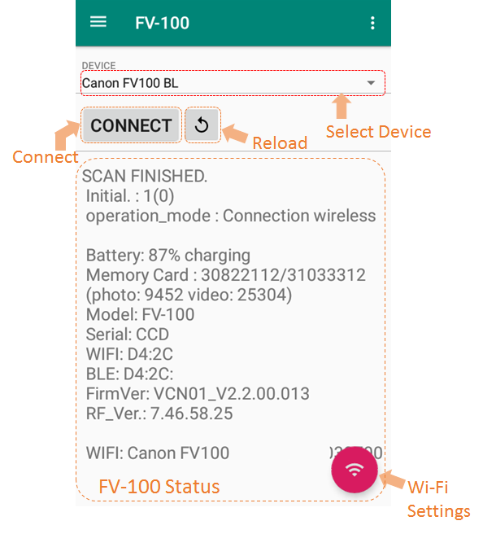
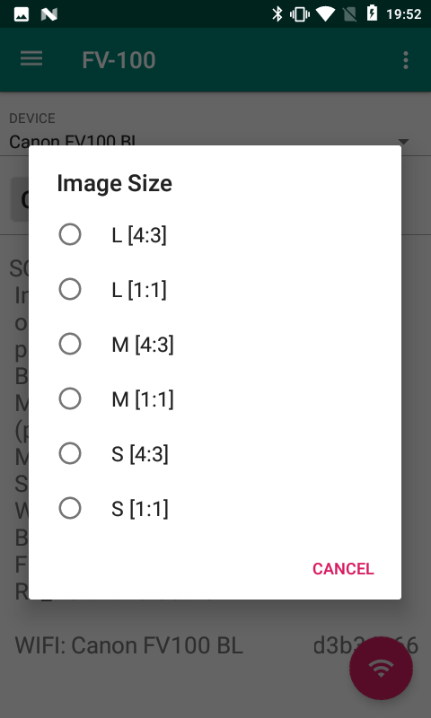
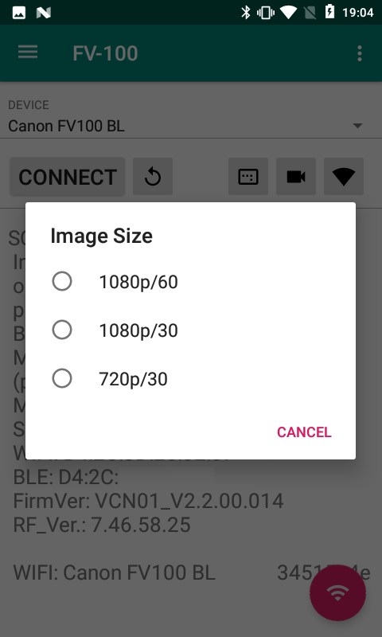

# FV-100Checker : iNSPiC RECの状態を確認するツール

**本ページは、[OSDNのFV-100Checkerページ](https://osdn.net/projects/gokigen/wiki/BLEControl) のコピーです。投稿当時の情報を移植、掲載しています。**

-------

## 概要

**FV-100 CHECKER** は [iNSPiC REC](https://faq.canon.jp/app/answers/detail/a_id/101025/)にBLE経由で接続して状態を確認するAndroidアプリケーションです。

## 機能一覧

* [FV-100(iNSPiC REC)](https://faq.canon.jp/app/answers/detail/a_id/101025/)の状態を表示する
  * バッテリ残量
  * メモリカード残量
  * WIFIネットワーク情報 (SSID と キー)
  * ファームウェアバージョン 等
* [FV-100(iNSPiC REC)](https://faq.canon.jp/app/answers/detail/a_id/101025/)の設定を変更する
  * 撮影画像サイズ
  * 撮影動画サイズ

## サポートするデジタルカメラ

以下に挙げるような、WIFIをサポートするデジタルカメラに対応します。ただし、全機種で動作を確認したわけではありませんので対応していない場合があると思います。ごめんなさい。

* [FV-100(iNSPiC REC)](https://faq.canon.jp/app/answers/detail/a_id/101025/)

## インストール

Google Play よりインストールしてください。

* https://play.google.com/store/apps/details?id=net.osdn.gokigen.blecontrol.lib.blecontrol

## 画面説明



* **Select Device**
  * 接続するデバイスを選択します。リストからお使いの iNSPiC REC を選択してください。

* **Connect ボタン**
  * ボタンを押すと、BLEデバイスを検索してFV-100に接続し、情報を取得します。

* **Reload ボタン**
  * ボタンを押すと、FV-100からの情報を再取得します。

* **FV-100 Status**
  * iNSPiC RECから取得した情報を表示します。

* **Wi-Fi Settings ボタン**
  * ボタンを押すと、AndroidのWi-Fi設定画面に移動します。 iNSPiC RECは、毎回ネットワークのキーが変わるようですので、WiFiキーを 表示されたFV-100 Statusからcopy&pasteして接続することができます。

* **画像サイズ変更ボタン**
  * ボタンを押すと、画像サイズの選択肢を表示するダイアログを表示します。変更したいサイズを選択してください。



* **動画サイズ変更ボタン**
  * ボタンを押すと、動画サイズの選択肢を表示するダイアログを表示します。変更したいサイズを選択してください。



## その他

### トラブルシュート

Connectボタンを何度も押しても情報が表示されない場合は、一度アプリを終了させて再度起動してみてください。

### 注意事項（仕様、制約事項）

本アプリを使用する前に、iNSPiC RECとペアリングを済ませておいてください。

### 動作確認機種

* FV-100 (iNSPiC REC)

### 変更履歴

* 1.0.0 : 初版投稿。
* 1.1.1 : 画像サイズ、動画サイズを変更できるようにした。

### permissionについて

次のパーミッションを設定し使用しています。（今後の拡張を検討、およびBLEを使用するため、少し多めのパーミッション設定になっています。ご了承ください。）

```comment
 * <uses-permission android:name="android.permission.ACCESS_COARSE_LOCATION" />
   * BLUETOOTH(BLE)を使用するために設定しています。
 * <uses-permission android:name="android.permission.ACCESS_MEDIA_LOCATION"/>
   * BLUETOOTH(BLE)を使用するために設定しています。
 * <uses-permission android:name="android.permission.ACCESS_FINE_LOCATION" />
   * BLUETOOTH(BLE)を使用するために設定しています。
 * <uses-permission android:name="android.permission.BLUETOOTH" />
   * BLUETOOTH(BLE)を使用するために設定しています。
 * <uses-permission android:name="android.permission.BLUETOOTH_ADMIN" />
   * BLUETOOTH(BLE)を使用するために設定しています。
 * <uses-permission android:name="android.permission.ACCESS_NETWORK_STATE"/>
   * 設定していますが、まだ使用していません。
 * <uses-permission android:name="android.permission.ACCESS_WIFI_STATE"/>
   * 設定していますが、まだ使用していません。
 * <uses-permission android:name="android.permission.CHANGE_WIFI_STATE"/>
   * 設定していますが、まだ使用していません。
 * <uses-permission android:name="android.permission.INTERNET"/>
   * 設定していますが、まだ使用していません。
 * <uses-permission android:name="android.permission.WRITE_EXTERNAL_STORAGE"/>
   * 設定していますが、まだ使用していません。
 * <uses-permission android:name="android.permission.READ_EXTERNAL_STORAGE"/>
   * 設定していますが、まだ使用していません。
 * <uses-permission android:name="android.permission.VIBRATE" />
   * 設定していますが、まだ使用していません。
 * <uses-permission android:name="android.permission.ACCESS_NETWORK_STATE"/>
   * 設定していますが、まだ使用していません。
 * <uses-permission android:name="android.permission.ACCESS_WIFI_STATE"/>
   * 設定していますが、まだ使用していません。
 * <uses-permission android:name="android.permission.INTERNET"/>
   * 設定していますが、まだ使用していません。
 * <uses-permission android:name="android.permission.WRITE_EXTERNAL_STORAGE"/>
   * 設定していますが、まだ使用していません。
 * <uses-permission android:name="android.permission.VIBRATE" />
   * 設定していますが、まだ使用していません。
```

### ソースコード

* https://github.com/MRSa/BLEControl

以上
