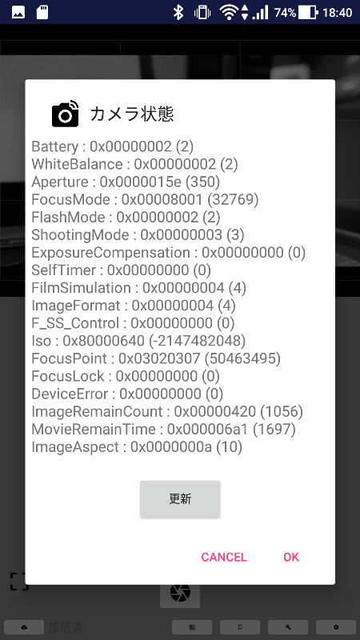

# Fujifilm製 Xシリーズカメラとの通信について

## 概要

Fujifilm Xシリーズカメラ用、[A01d]のコマンド送信ダイアログで使用可能なコマンド・プロパティ設定、カメラ状態の調査結果をまとめる場所です。

## コマンド・プロパティ設定

[A01d]では、次のダイアログに情報を入れて、指示を行います。

## Command(Single)

|**ID**|**Name**|**Len**|**内容**|**Body**|
|----|----|----|----|----|
|0x100e|SHUTTER|0|シャッター|-|
|0x9026|FOCUS POINT|4|フォーカス(ロック)| 0x XL YL XP YP → 0x03020504 (3:2  で 5,4の位置にフォーカス)|
|0x9027|FOCUS UNLOCK|0|フォーカスロック解除|-|
|0x902c|SHUTTER SPEED|4|シャッタースピード変更|-|
|0x902d|APERTURE|4|絞り値変更|0 : １つ絞り込む,  1: 1つあける|
|0x902e|EXPREV|4|露出補正値変更|0 : ひとつ下げる, 1: ひとつ上げる|

## Property(Multi)

|**ID**|**Name**|**Len**|**内容**|**Body**|
|----|----|----|----|----|
|0x5005|White Balance|2|ホワイトバランス調整|-|
|0x5012|Self Timer|2|セルフタイマー時間|-|
|0xd001|Film Simulation|4|フィルムシミュレーション|-|
|0x0d2a|ISO|4|ISO感度|0x8000xxxx : ISO Auto (上限xxxx),  0x0000xxxx : ISOxxxx|
|0xd018|Image Format|2|画質モード|-|
|0xd241|Image Aspect|2|画像サイズ|-|
|0x500c|Flash Mode|2|フラッシュ設定|-|

## カメラ状態

[A01d]では、次のダイアログで状態を表示します。

### Battery

#### 3本バーの場合

- **0x0001** ほとんどなし
- **0x0002** 小
- **0x0003** 中
- **0x0004** 満

#### 5本バーの場合

- **0x0006** ほとんどなし
- **0x0007** １本
- **0x0008** ２本
- **0x0009** ３本
- **0x000a** ４本
- **0x000b** 満

### White Balance

- **0x0002** Auto
- **0x0004** Fine tuning
- **0x0006** incandescent
- **0x8001** fluorescent lights 1(daylight)
- **0x8002** fluorescent lights 2(warm white)
- **0x8003** fluorescent lights 3(cool white)
- **0x8006** shade
- **0x800a** underwater lighting
- **0x800b** color temperature
- **0x800c** custom

### Aperture

### Focus Mode

- **0x0001** Manual
- **0x8001** Single
- **0x8002** Continuous

### Flush Mode

- **0x0001** Auto
- **0x0002** Off
- **0x0003** Fill
- **0x0004** Redeye Auto
- **0x0005** Redeye fill
- **0x0006** External Sync.
- **0x8001** On
- **0x8002** Redeye
- **0x8003** Redeye On
- **0x8004** Redeye Sync.
- **0x8005** Redeye Rear
- **0x8006** Slow Sync.
- **0x8007** Rear Sync.
- **0x8008** Flash Commander
- **0x8009** Disable
- **0x800a** Enable

### Shooting Mode

- **0x0001** Manual
- **0x0002** Program
- **0x0003** Aperature
- **0x0004** Shutter
- **0x0005** Custom
- **0x0006** Auto

### Exposure Compensation

### Self Timer

### Film Simulation

### Image Format

### F SS Control

### ISO

### Focus Point

### Focus Lock

### Device Error

### Image Remain Count

### Movie Remain Time

### Image Aspect

## 参考サイト

以下のサイトには大変お世話になりました。お礼を申し上げます。

* https://github.com/hkr/fuji-cam-wifi-tool
