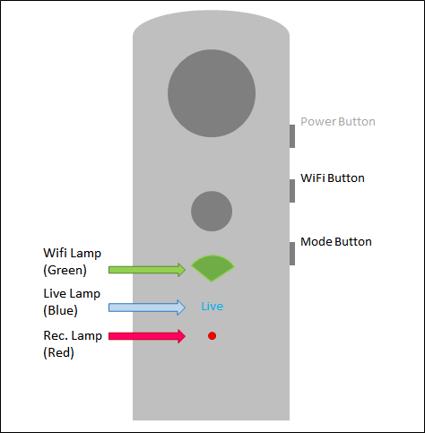
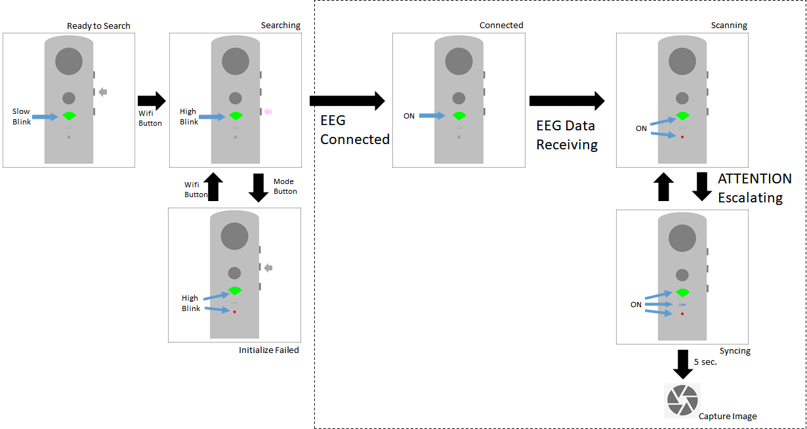

# Theta "Thought" Shutter : 脳波で撮影を行うTHETAプラグイン

**Google Translate** for this page : https://translate.google.com/translate?sl=ja&tl=en&u=https://github.com/MRSa/GokigenOSDN_documents/blob/main/Projects/Others/ThetaThoughtShutter.md

-----

## 概要

Theta "Thought" Shutter（以下、本アプリと呼びます）は、[NeuroSky](https://www.neurosky.jp/)社の簡易脳波計である[MindWave Mobile 2 EEGヘッドセット](https://store.neurosky.com/pages/mindwave)（以下、EEGと呼びます）を使用してシャッターを切る、RICOH製 THETA V/Z1用のプラグインです。
EEGから取得した情報（Attention）が高まったときに静止画を撮影します。

適切に「思う」と撮影できるアプリですが、思うように撮影できない、かもしれません。そのあたり悪しからずご了承ください。

## インストール

RICOH THETA Plug-in Store からダウンロード可能です。以下のページにあるインストールボタンを押して、THETAアプリからTHETAにインストールしてください。

* [Theta "Thought" Shutter (RICOH THETA Plug-in Store)](https://github.com/ricohapi/theta-plugins/blob/main/plugins/jp.osdn.gokigen.thetathoughtshutter/README.ja.md)

## 操作説明

### ボタンとランプ (THETA V)

THETA Z1では、OLEDに現在ステータスを文字表示するはずです。



* Wifi ランプ (緑色)
  * EEGとの接続状態を示します。EEGと接続しているときに点灯します。

* Live ランプ (青色)
  * EEGと接続している状態で、センサから ATTENTIONの情報が高まっているときに点灯します。

* Rec. ランプ (赤色)
  * EEGから脳波の情報がTHETAに届いているときに点灯します。EEGとTHETAが接続した後、しばらく経つと点灯するはずです。

### 使い方

使い方は単純です。電源をONにし、THETAとEEGを接続して、ただ念じるだけです。



1. **THETAで本アプリを起動してください。**
    * 起動直後は、Wifiランプが緑色でゆっくり点滅します。
2. **EEGを装着し、EEGの電源をONにしてください。**
    * 端子をおでこと耳たぶに密着させてください。
3. **Wifiボタンを押して、EEGを検索してください。**
    * 検索中は Wifiランプが早い点滅になります。
    * EEGと接続できると、Wifiランプが点灯状態になります。
    * 長時間待ってもWifiランプが点灯しない場合、Modeボタンを押して、再度Wifiボタンを押して検索を再開してください。
4. **少し待つと、赤ランプが点灯します。**
    * EEGからTHETAに対してデータが送られています。
5. **集中すると、Liveランプが青色に光ります。**
    * Liveランプが5秒間点灯すると、静止画を撮影します。

## その他

THETAとEEGは、Bluetooth SPPプロトコルで接続しています。

### 注意事項（仕様、制約事項）

* 現状は静止画のみしか撮影しません。
* 撮影時の設定モードなどは変更できません。ご了承ください。

#### 動作確認

本アプリは、Theta Vでの動作は確認していますが、Theta Z1の実機での動作は確認できていません。すみません。

#### permissionについて

本アプリは、次のパーミッションを指定し使用しています。

```comment
 * <uses-permission andro!id:name="android.permission.INTERNET" />
    * カメラの撮影を Theta Web API 経由で行うため
 * <uses-permission andro!id:name="android.permission.BLUETOOTH" />
    * EEGヘッドセットとの通信を Bluetooth経由で行うため
 * <uses-permission andro!id:name="android.permission.ACCESS_COARSE_LOCATION" />
    * EEGヘッドセットとの通信を Bluetooth経由で行うため
 * <uses-permission andro!id:name="android.permission.BLUETOOTH_ADMIN" />
    * EEGヘッドセットとペアリングを実施するため
```

### 変更履歴

* 10.00.0001 : 初版リリース

### ソースコード

本アプリはオープンソースです。以下からソースコードを参照することができます。ご利用はご自由にどうぞ。

* https://github.com/MRSa/ThetaThoughtShutter

### THETAプラグイン開発について

* [THETAプラグインの登録、公開までの備忘録](ThetaPlugin.md)

## 参考リンク

* [MindWave Mobile 2 : Brainwave starter kit](https://store.neurosky.com/pages/mindwave)
    * https://www.amazon.co.jp/dp/B07CXN8NKX/

* [NeuroSky](http://neurosky.com/)
    * http://neurosky.com/
    * https://www.neurosky.jp/

以上
