# prprウオッチフェース

**本ページは、[OSDNのprprウォッチフェイスページ](https://osdn.net/projects/gokigen/wiki/prpr) のコピーです。投稿当時の情報を移植、掲載しています。**

------

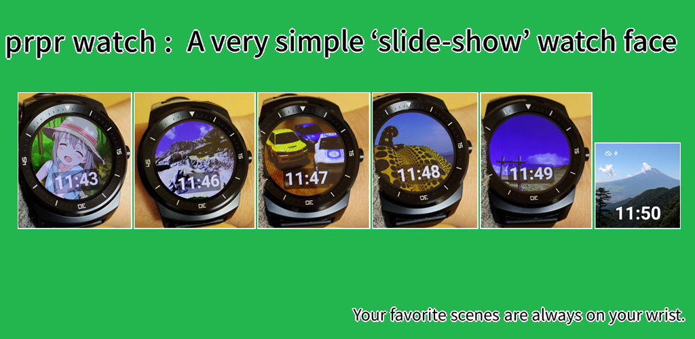

## 概要

Wear OS上で「スライドショー」を行うだけの非常にシンプルなアプリケーション（ウォッチフェイス）です。
デフォルトでは5種類の写真が入っており、それを順番に表示するだけの単純なウォッチフェイスですが、スマートフォン/タブレットからお好きな画像を転送して表示させることができます。

画像を Wear OSデバイスに転送すると、その転送した画像のみを順番に表示するだけの単純なウォッチフェイスとなります。
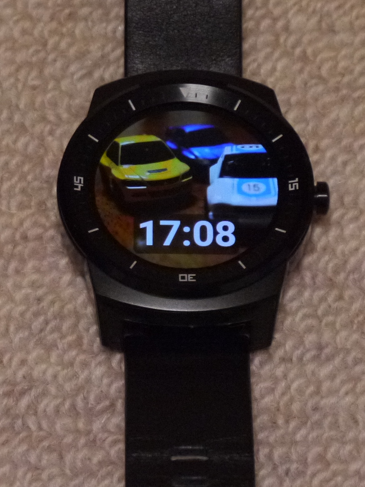

## インストール

Wear OS は、使用する場合 Android 4.3以上のスマートフォン/タブレットが必要となります。以下のGoogle Play Store (Android Market) よりインストールをお願いします。 
* https://play.google.com/store/apps/details?id=jp.sfjp.gokigen.prpr0&hl=ja

prprは、ウォッチフェイスとして作成しています。そのため、独立したアプリケーションとしてアイコンが表示されるわけではありません。
アプリケーションをインストールした後、Wear OS を立ち上げ「ウォッチフェイス」からprprを選択してください。

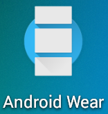
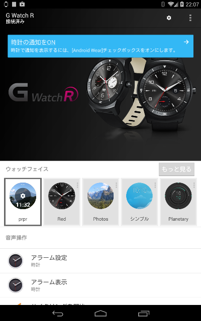

「もっと見る」ボタンを押すと、インストール済のウォッチフェイスが一覧表示されますので、その中から「prpr」を探してください。
（富士山の写真が目印です。）

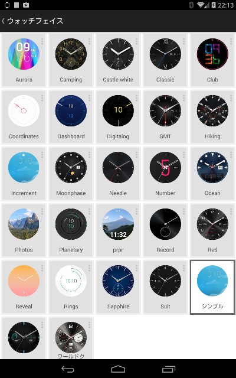

prprウォッチフェイスを選択すると、初期状態では用意している5枚の画像が順番に表示されます。

## prprの設定

prprは、スマートフォン/タブレット内にある画像を選択して Wear OS へ転送し、表示させることができます。
「prprの設定」画面から、お好きな画像を選択し、転送することができます。
prprウォッチフェイスのアイコンをタップすると、「prprの設定」画面が表示されます。
「prprの設定」画面には、『画像追加』ボタンと『全て消去』ボタンの２つがあります。

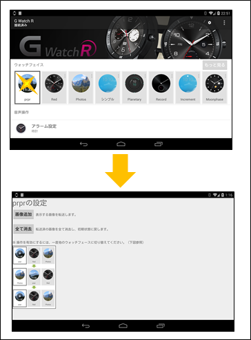

### 画像の追加

「画像追加」ボタンを押すと、転送する画像の選択画面が開きます。転送したい画像を選択してください。

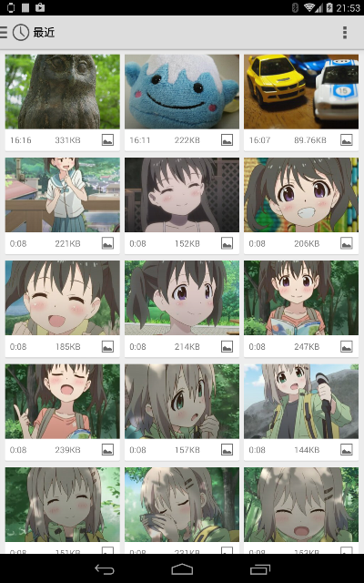

画像を選択すると、Wear OS へその画像が送られます。
画面がprprの設定画面に切り替わり、画面下部に「画像の送信を開始しました。」と表示します。

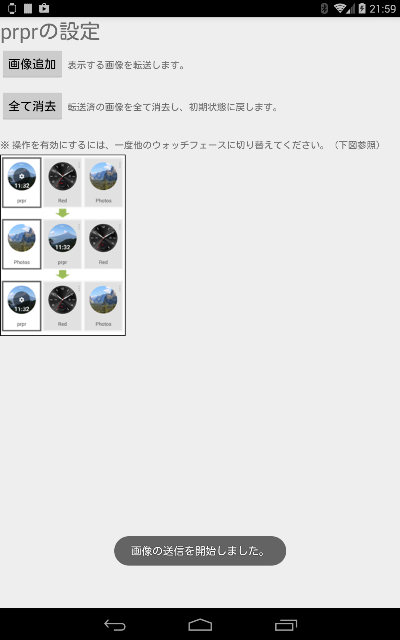

### 画像の全削除

「全て消去」ボタンを押すと、Wear OS 上にある転送した画像を全て削除するかどうか、確認するダイアログが表示されます。
なお、**この処理では、転送元の画像は消去しません。** アプリ上の書き方は誤解を招く表現となってしまっており、申し訳ありません。

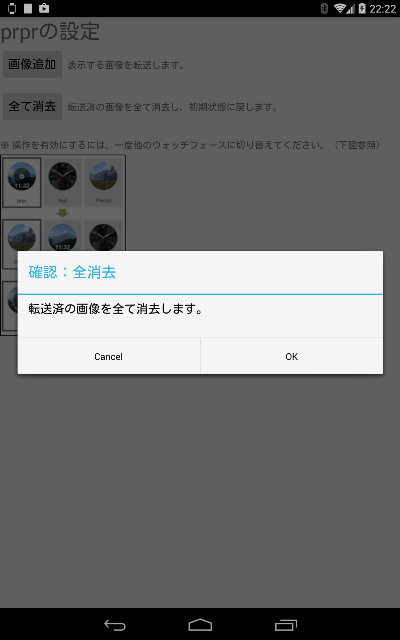

『OK』ボタンを押すと Wear OS 上の画像を全て消去し、prpr を初期状態に戻します。
画面下部に「転送済の画像の全消去を指示しました。」と表示されます。

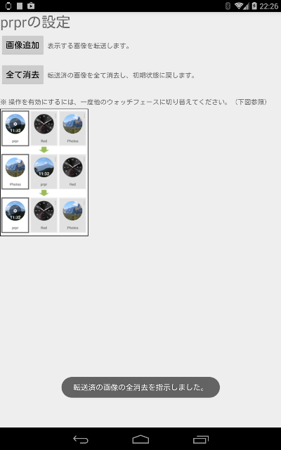

### 設定の反映

prprの設定画面で操作した内容を反映させるには、一度prprウォッチフェイスから別のウォッチフェイスに切替え、再度prprウォッチフェイスに変更することで反映されます。

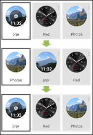

## その他

### 表示する画像についてのTips

転送する画像は、メモリ節約も兼ねてwear OSの画像サイズ（320x320）に自動的にリサイズしてから転送します。トリミングは行いません。
縦横比が変わるため、あらかじめ正方形の画像を準備しておく方が見栄えが良いと思います。

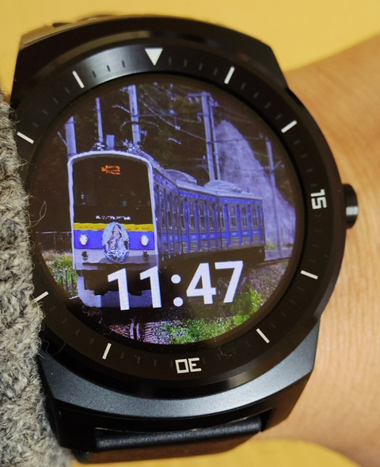

### 転送した画像の置き場所について(Wear OS)

スマートフォン/タブレットからWear OSへ転送した画像の置き場所は、Wear OS の **(外部ストレージ)/Gokigen/prpr/all** 以下に、png画像形式で、転送した時刻をファイル名にして記録しています。
prprは、ウォッチフェイス起動時に **(外部ストレージ)/Gokigen/prpr/all** 以下のファイル有無を確認し、ファイルが存在すればそこからファイルを読み出して利用し、ファイルが存在しない場合はデフォルト画像を読みだして利用することにしています。ファイルが存在する場合には、デフォルト画像の読み出しは行わないようになります。

「全て消去」ボタンで削除指示を行うと、**(外部ストレージ)/Gokigen/prpr/all** 以下のファイルを全て消去します。

### permissionについて

prpr は、次のパーミッションを指定し使用しています。

```comment
* <uses-permission android:name="com.google.android.permission.PROVIDE_BACKGROUND" />
   * ウォッチフェイスとして動作するため
* <uses-permission android:name="android.permission.WAKE_LOCK" />
   * ウォッチフェイスとして動作するため
* <uses-permission android:name="android.permission.WRITE_EXTERNAL_STORAGE" />
   * 転送画像を外部ストレージに書き込みするため
* <uses-permission android:name="android.permission.READ_EXTERNAL_STORAGE" />
   * 転送画像を読み出すため
```

### ソースコード

prprウォッチフェイスのソースコードは、以下のSVNリポジトリから取得可能です。随時（気が向いたら？）更新していきます。

* https://github.com/MRSa/gokigen/tree/master/osdn-svn/android/Prpr0/trunk

転送機能のないバージョンを用意しました。(SDK 34)

* https://github.com/MRSa/prpr1

### 初期画像について

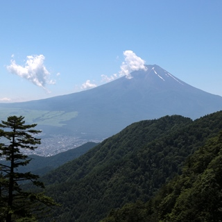
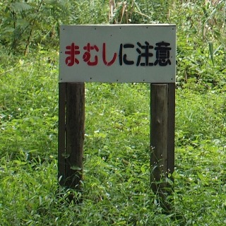
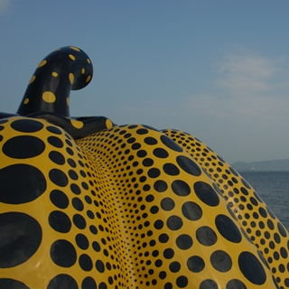
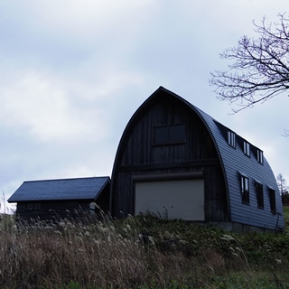
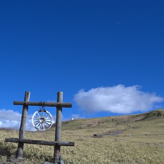
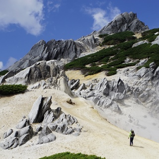
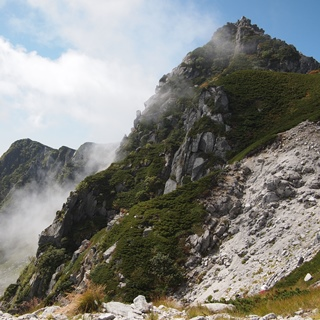
