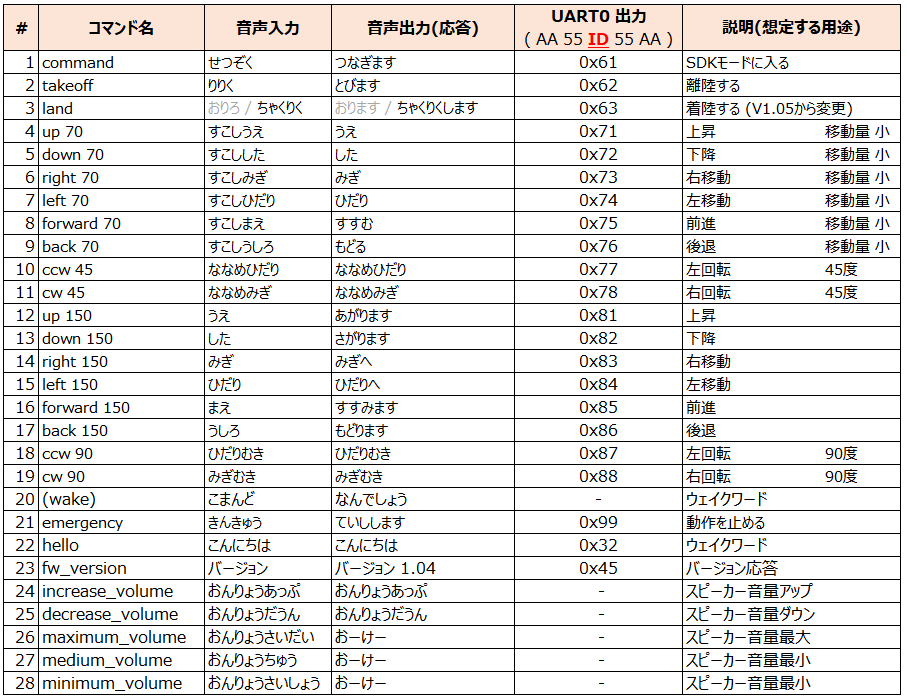
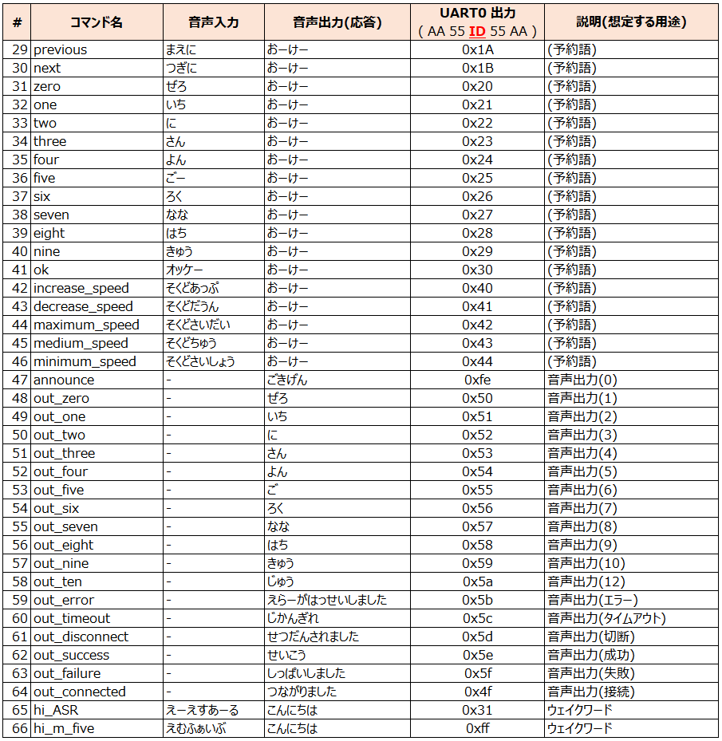
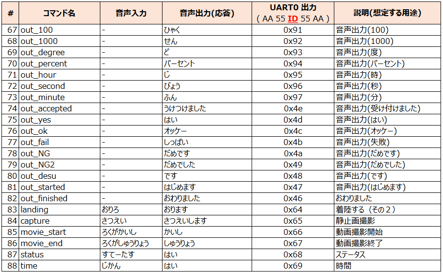
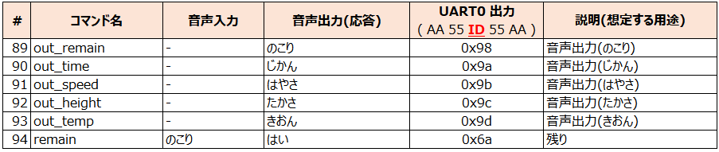
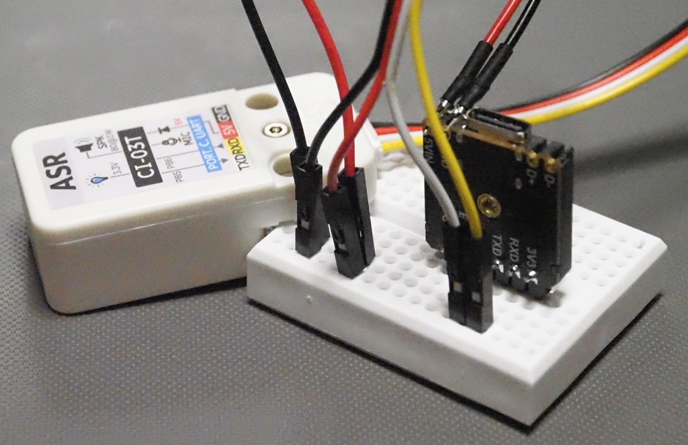

# [Unit ASR](https://docs.m5stack.com/en/unit/Unit%20ASR)のカスタムファームウェア

[M5 Unit ASR](https://docs.m5stack.com/ja/unit/Unit%20ASR)のカスタムファームウェアを置いています。　[TelloMoveM5](https://github.com/MRSa/TelloMoveM5)で使用する前提のファームウェアです。

--------

## Unit ASR Command List

Unit ASRのカスタムファームウェアでサポートするコマンドリストです。
No.21 以降は、No.20のウェイクワードの後に続けて発声する必要があります。
（No.3 は、[カスタムファームウェア 1.05](jx_ci_03t_firmware_v105.bin)から、コマンドワードを変更しました。）





[カスタムファームウェア 1.05](jx_ci_03t_firmware_v105.bin)から、以下のコマンドをサポートします。



[カスタムファームウェア 1.06](jx_ci_03t_firmware_v106.bin)から、以下のコマンドをサポートします。



--------

## Unit ASR カスタムファームウェアの生成・書き込みについて

カスタムファームウェアは、[Unit ASR カスタムファームウェアの生成とフラッシング](https://docs.m5stack.com/ja/guide/offline_voice/unit_asr/firmware)に記載されている内容に沿って作成します。

- [https://www.smartpi.cn/](https://www.smartpi.cn/)
- [Unit ASR ファームウェアフラッシングツール](https://m5stack-doc.oss-cn-shenzhen.aliyuncs.com/635/CI-03T_Serial_burning_software_V3.7.3.zip)

ファームウェアのフラッシングには、[Stamp ISP](https://docs.m5stack.com/ja/module/StampISP)を使用しました。（Groveケーブルを、 RXD, TXD, 5VIN, GND に接続します。）



フラッシングの実行は、[Unit ASR カスタムファームウェアの生成とフラッシング](https://docs.m5stack.com/ja/guide/offline_voice/unit_asr/firmware)の「3. ファームウェアのフラッシング」にある、「フラッシングツールが対応するポートを検出したら、ポートを選択してダウンロードを有効にします。 **その後、Unit ASRを接続し、** プログラムのダウンロードを開始します。」の通りで、ダウンロードのチェックを入れてから [Unit ASR](https://docs.m5stack.com/ja/unit/Unit%20ASR)を接続する必要があります。この点、ご注意ください。

## 日本語音声について

日本語音声は、「VOICEVOX:ずんだもん」を使用させていただきました。

- [VOIEVOX](https://voicevox.hiroshiba.jp/)

wav から mp3への変換は、以下コマンドで行っています。

```sh
ffmpeg -i (入力ファイル名) -vn -ac 1 -b:a 14k (出力ファイル名)
```

--------

## カスタムファームウェアの更新履歴

- [V1.06(May.04, 2025)](jx_ci_03t_firmware_v106.bin)
  - 拡張用に発声メッセージとコマンドを少し追加する。

- [V1.05(May.03, 2025)](jx_ci_03t_firmware_v105.bin)
  - 前後移動の応答メッセージを修正、受付コマンド・応答メッセージを少し追加する。

- [V1.04(Apr.29, 2025)](jx_ci_03t_firmware_v104.bin)
  - スピーカー音量調整で、最大・最小・中の３種類を設定できるようにする。

- [V1.03(Apr.28, 2025)](jx_ci_03t_firmware_v103.bin)
  - 初版。Tello制御を目指した音声認識の設定を実施。
