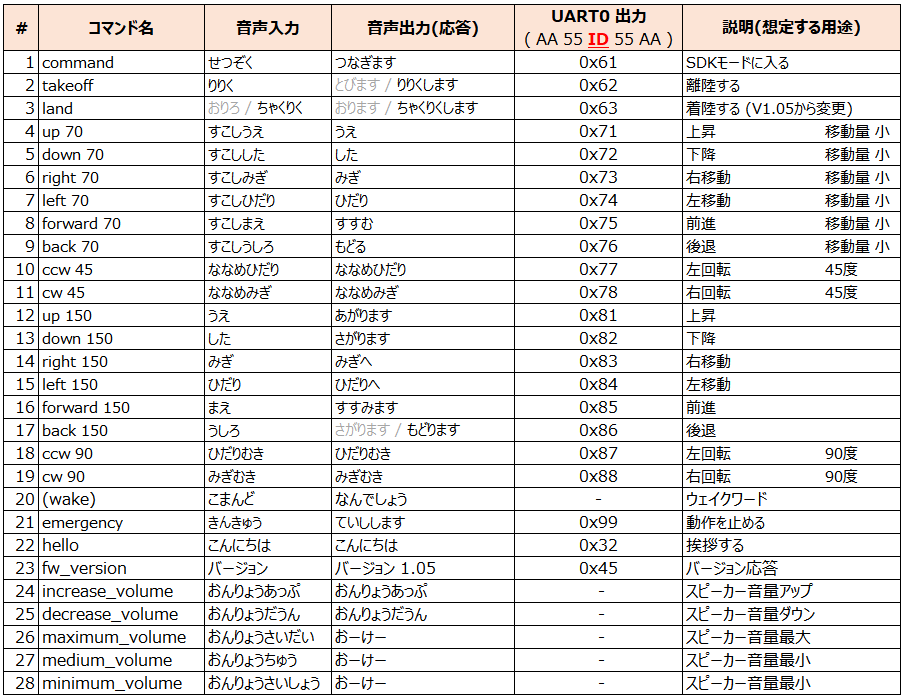

# [Unit ASR](https://docs.m5stack.com/en/unit/Unit%20ASR)

[M5 Unit ASR](https://docs.m5stack.com/ja/unit/Unit%20ASR)のファームウェアを置いています。

## ASR Command List

## ファームウェア生成サイト

- [https://www.smartpi.cn/](https://www.smartpi.cn/)

## 日本語音声について

日本語音声は、「VOICEVOX:ずんだもん」を使用させていただきました。

- [VOIEVOX](https://voicevox.hiroshiba.jp/)

## 履歴

- [V1.03(Apr.28, 2025)](jx_ci_03t_firmware_v103.bin)
  - 初版。Tello制御を目指した音声認識の設定を実施。

